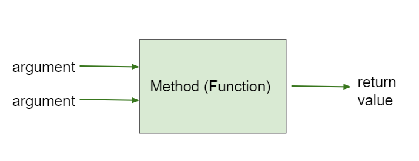
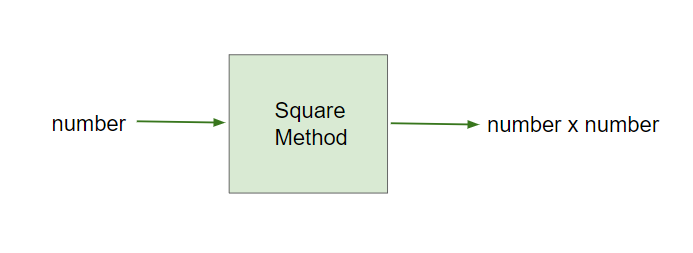

.. include:: ../common.rst

|Time45|

Calling Class Methods
=====================================

Most of the methods we have used so far are **static methods**, which are also called **class methods**. These methods are associated with the class and include the keyword static in the method header. The main method is always static, which also means that there is only one copy of the method. 

Here is a template for a static method. In the **method header**, the keyword **static** is used before the **return type**. Up until now, we have used the keyword **void** as the return type for methods that do not return a value. We will now look at methods that calculate and return a value of a specific type.

.. code-block:: java

    // static method header
    public static return-type method-name(parameters) 
    {
        // method body
    }

Non-void Methods
------------------

.. index::
    single: return value
    single: void method
    single: non-void method

Most of the methods we have used so far have been **void methods**, which do not return a value. However, many methods act like mathematical functions that calculate and return a value given some arguments. These methods are called **non-void methods**. You can imagine a non-void method as a calculating machine that takes numbers as arguments and returns a calculated result or like a toaster that takes bread as an argument and changes it to return toast.

    Figure 1: Method that takes arguments and returns a value

In the next lesson, we will look at the Math library in Java, but consider a simple method that squares a number. For example, ``square(3)`` would return 9.

    Figure 2: The Square Method

Here is a simple implementation of this method which takes an int number as an argument, squares that number, and returns the result.  Notice that instead of ``static void``, the header includes ``static int`` to indicate that the method returns an integer value. There could be another **overloaded** version of this method that takes a double number and returns a double value; remember methods are overloaded when there are multiple methods with the same name but different signatures with a different number or types of parameters. 

.. code-block:: java

    public static int square(int number) 
    {
        int result = number * number;
        return result;
    }

.. |visualization| raw:: html

   <a href="https://pythontutor.com/render.html#code=public%20class%20SquareMethod%0A%7B%0A%20%20%20%20%20%20%20%20%20public%20static%20int%20square%28int%20number%29%20%0A%20%20%20%20%20%20%20%20%20%7B%0A%20%20%20%20%20%20%20%20%20%20%20%20%20%20%20int%20result%20%3D%20number%20*%20number%3B%0A%20%20%20%20%20%20%20%20%20%20%20%20%20%20%20return%20result%3B%0A%20%20%20%20%20%20%20%20%20%7D%0A%20%20%20%0A%20%20%20%20%20%20%20%20%20public%20static%20void%20main%28String%5B%5D%20args%29%0A%20%20%20%20%20%20%20%20%20%7B%0A%20%20%20%20%20%20%20%20%20%20%20%20%20%20%20int%20x%20%3D%205%3B%0A%20%20%20%20%20%20%20%20%20%20%20%20%20%20%20int%20y%20%3D%20square%28x%29%3B%0A%20%20%20%20%20%20%20%20%20%20%20%20%20%20%20System.out.println%28%22The%20square%20of%20%22%20%2B%20x%20%2B%20%22%20is%20%22%20%2B%20y%29%3B%0A%20%20%20%20%20%20%20%20%20%20%20%20%20%20%20x%20%3D%204%3B%0A%20%20%20%20%20%20%20%20%20%20%20%20%20%20%20System.out.println%28%22The%20square%20of%20%22%20%2B%20x%20%2B%20%22%20is%20%22%20%2B%20square%28x%29%29%3B%0A%20%20%20%20%20%20%20%20%20%7D%0A%7D&cumulative=false&curInstr=11&heapPrimitives=nevernest&mode=display&origin=opt-frontend.js&py=java&rawInputLstJSON=%5B%5D&textReferences=false" target="_blank">visualization</a>

The **return** statement is used to return a value from the method back to the calling code. The return value must be the same type as the return type in the method header. The return statement also ends the method execution, so any code after the return statement is not executed. Let's try this below. Click on the next button to step through the code in the |visualization| below and see the variables and the return values. 

.. codelens:: squareviz
      :language: java
      :optional:

      public class SquareMethod
      {
         public static int square(int number) 
         {
               int result = number * number;
               return result;
         }
   
         public static void main(String[] args)
         {
               int x = 5;
               int y = square(x);
               System.out.println("The square of " + x + " is " + y);
               x = 4;
               System.out.println("The square of " + x + " is " + square(x));
         }
      }

When calling the ``square`` method, the return value can be stored in a variable or used as part of an expression. In the main method above, the variable ``y`` is assigned the return value of the ``square`` method. The return value can also be used directly in the print statement without storing it in a variable, for example ``System.out.println(square(4));``.

.. code-block:: java

    // Saving the returned value of the square method in a variable
    int y = square(5);
    System.out.println(y); // prints 25
    // Printing the returned value of the square method directly
    System.out.println(square(4)); // prints 16

|CodingEx| **Coding Exercise**

.. activecode:: squareMethod
    :language: java
    :autograde: unittest
    :practice: T

    Add another call to the square method in the main method that prints out the square of 6.
    ~~~~
    public class SquareMethod
    {
         public static int square(int number) 
         {
             int result = number * number;
             return result;
         }
    
         public static void main(String[] args)
         {
             System.out.println("5 squared is " + square(5));
             // TO DO: Call the square method to prints out the square of 6

         }
    }
    ====
    import static org.junit.Assert.*;
    import org.junit.*;
    import java.io.*;
     
    public class RunestoneTests extends CodeTestHelper
    {
        @Test
        public void containsCall()
        {
            boolean passed = checkCodeContains("square(6)", "square(6)");
            assertTrue(passed);
        }
        @Test
        public void testMain() throws IOException
        {
            String output = getMethodOutput("main");
            String expect = "36"
            boolean passed =
                 getResults(expect, output, "Expected output from main");
            assertTrue(passed);
        }
    }

|Exercise| **Check your understanding**

.. |visualization2| raw:: html

   <a href="https://pythontutor.com/render.html#code=%20%20%20%20%20%20public%20class%20MethodTrace%0A%20%20%20%20%20%20%7B%0A%20%20%20%20%20%20%20%20%20%20public%20static%20int%20square%28int%20x%29%0A%20%20%20%20%20%20%20%20%20%20%7B%0A%20%20%20%20%20%20%20%20%20%20%20%20%20%20return%20%28x%20*%20x%29%3B%0A%20%20%20%20%20%20%20%20%20%20%7D%0A%0A%20%20%20%20%20%20%20%20%20%20public%20static%20int%20divide%28int%20x,%20int%20y%29%0A%20%20%20%20%20%20%20%20%20%20%7B%0A%20%20%20%20%20%20%20%20%20%20%20%20%20%20return%20%28x%20/%20y%29%3B%0A%20%20%20%20%20%20%20%20%20%20%7D%0A%0A%20%20%20%20%20%20%20%20%20%20public%20static%20void%20main%28String%5B%5D%20args%29%0A%20%20%20%20%20%20%20%20%20%20%7B%0A%20%20%20%20%20%20%20%20%20%20%20%20%20%20System.out.println%28square%283%29%20%2B%20divide%286,2%29%29%3B%20%0A%20%20%20%20%20%20%20%20%20%20%7D%0A%20%20%20%20%20%20%7D&cumulative=false&curInstr=0&heapPrimitives=nevernest&mode=display&origin=opt-frontend.js&py=java&rawInputLstJSON=%5B%5D&textReferences=false" target="_blank">visualization</a>

.. mchoice:: traceMethods1
   :random:
   :practice: T
   :answer_a: 12
   :answer_b: 9+3
   :answer_c: 93
   :answer_d: square(3)+divide(6,2)
   :answer_e: Nothing, it does not compile.
   :correct: a
   :feedback_a: Yes, the square(3) method is called first and returns 9. Then the divide(6,2) method is called and returns 3. The sum of 9 and 3 is 12.
   :feedback_b: The + here will be interpreted as addition since the methods return ints.
   :feedback_c: The + here will be interpreted as addition since the methods return ints.
   :feedback_d: The square and divide methods are called and return values that are added together.
   :feedback_e: Try the code in an active code window.

   What does the following code print out? (|visualization2|)

   .. code-block:: java

      public class MethodTrace
      {
          public static int square(int x)
          {
              return (x * x);
          }

          public static int divide(int x, int y)
          {
              return (x / y);
          }

          public static void main(String[] args)
          {
              System.out.println(square(3) + divide(6,2)); 
          }
      }
 

Common Errors with Methods
---------------------------

A common error with non-void methods is forgetting to do something with the value returned from a method. When you call a method that returns a value, you should do something with that value like assigning it to a variable or printing it out. To use the return value when calling a non-void method, it must be stored in a variable or used as part of an expression. 

Another common error is a mismatch in types or order for the arguments or return values. For example, if a method returns a double value, you cannot assign it to an int variable. 

|CodingEx| **Coding Exercise**

.. activecode:: fixMethodCalls
    :language: java
    :autograde: unittest
    :practice: T

    Fix the method calls below in the main method. Are the returned values saved in the right type of variables? Do not change the methods other than main.
    ~~~~
    public class MathMethods
    {
         public static int square(int number) 
         {
             return number * number;
         }

         public static int divide(int x, int y)
         {
             return x / y;
         }
    
         public static void main(String[] args)
         {
             // TO DO: Fix the method calls and data types below
             // result1 should be 4 squared
             // result2 should be 10 divided by 2
             double result1 = square(4.0, 2);
             double result2 = divide(2, 10); 
             System.out.println("4 squared is " + result1);
             System.out.println("10 divided by 2 is " + result2)
         }
    }
    ====
    import static org.junit.Assert.*;
    import org.junit.*;
    import java.io.*;
     
    public class RunestoneTests extends CodeTestHelper
    {
        @Test
        public void containsType()
        {
            boolean passed = checkCodeContains("int result", "correct int type for result1 and result2");
            assertTrue(passed);
        }
        @Test
        public void containsCall()
        {
            boolean passed = checkCodeContains("square(4)", "call to square with int 4");
            assertTrue(passed);
        }
        @Test
        public void containsCall2()
        {
            boolean passed = checkCodeContains("divide(10,2)", "call to divide with the correct int argument order");
            assertTrue(passed);
        }
        @Test
        public void testMain() throws IOException
        {
            String output = getMethodOutput("main");
            String expect = "4 squared is 16\n10 divided by 2 is 5";
            boolean passed =
                 getResults(expect, output, "Expected output from main");
            assertTrue(passed);
        }
    }

Methods Outside the Class
------------------------------------

In the examples above, we called the methods by using the method name. However, if we call a method from a different class, we need to include its class name. For example, if the ``square`` method is in a class called ``MathFunctions``, we would call it as ``MathFunctions.square(3)``. Class methods are typically called using the class name along with the **dot operator (.)**. When the method call occurs in the defining class, the use of the class name is optional in the call. 

In the next lesson, we will learn to use the methods in the ``Math`` class in Java and will need to call them with the class name ``Math``. There is a method to compute the square of a number in the ``Math`` library, but it is called ``pow`` instead of square, and it takes 2 arguments to return a number raised to the power of an exponent number. Here's a quick preview of two of the methods in the Math class:

- ``Math.sqrt(double number)`` : returns the square root of a given number
- ``Math.pow(double base, double exponent)`` : returns :math:`base^{exponent}`, the value of base, the first argument, raised to the power of exponent, the second argument.

Here is an example of how to use these methods:

.. code-block:: java

   double x = Math.pow(3, 2); // 3^2 is 9.0
   double y = Math.sqrt(9); // the square root of 9 is 3.0   

|Groupwork| Programming Challenge: Ladder on Tower 
--------------------------------------------------------

.. image:: Figures/ladder.png
      :width: 200px
      :align: left
      :alt: Ladder on tower

The Pythagorean theorem states that the length of the hypotenuse (the side
opposite the right angle in a right triangle) is the square root of the sum
of the squares of the lengths of the other two sides, also called the “legs” or the width and height of the triangle. (Incidentally, the Pythagorean theorem is named for
Pythagoras who was also the leader of the gang of Greek mathematicians who legend has it allegedly drowned their fellow mathematician for showing that
:math:`\sqrt{2}` is irrational.) Here's the formula for this theorem:

-  :math:`c = \sqrt{a^{2} + b^{2}}` where
:math:`a` and :math:`b` are the width and height of the triangle and :math:`c` is the
length of the hypotenuse. 

One common use for the Pythagorean theorem is to calculate the length of
ladder you will need to reach the window of your beloved, given that their
cruel parents have locked them in a tower surrounded by a moat. The ladder
will be the hypotenuse of a triangle whose legs are the height of the window
of your beloved’s room in the tower and the width of the moat since you have
to place the base of the ladder on the edge of the moat.

.. mchoice:: hypotenuse-java-mc
   :multiple_answers:
   :random:
   :practice: T

   Which of the following are correct Java expressions to compute the hypotenuse of
   a triangle with legs ``a`` and ``b`` given the Pythagorean Theorem :math:`c = \sqrt{a^{2} + b^{2}}` where
   :math:`a` and :math:`b` are the lengths of the legs and :math:`c` is the
   length of the hypotenuse?

   - ``Math.sqrt(a * a + b * b)``

     + ✅ ``a * a`` is a squared, likewise ``b * b``. Adding them with ``+``
       gives us the sum which is then passed to ``Math.sqrt``.

   - ``Math.sqrt(Math.pow(a, 2) + Math.pow(b, 2))``

     + ✅ ``Math.pow(a, 2)`` is ``a`` squared, likewise ``Math.pow(b, 2)``.
       Adding them with ``+`` gives us the sum which is then passed to
       ``Math.sqrt``.

   - ``Math.sqrt(a + b)``

     - ❌ Close, but we need to square the lengths of the legs.

   - ``a * a + b * b``

     - ❌ This is the sum of the squares of the lengths of the legs which gives
       us the square of the hypotenuse. We need a ``Math.sqrt`` to get the
       length of the hypotenuse.

.. activecode:: challenge-1-10-pythagorean
   :language: java
   :autograde: unittest
   :practice: T

   Complete the ``ladderSizeNeeded`` method below using the Pythagorean Theorem and the ``Math.sqrt`` method. Then in the main method, write a method call to test the ``ladderSizeNeeded`` method with arguments for the height of 30 and the width of 40. The method should return the length of the ladder needed to reach the window of your beloved.
   ~~~~
   public class LadderHelper
   {
       /* ladderSizeNeeded computes the hypotenuse of a right triangle
        * given the lengths of the other two sides.
        * @param height : the height of the window
        * @param width : the width of the moat
        * @return the length of the ladder needed
        */
       public static double ladderSizeNeeded(double height, double width)
       {
           double ladderSize;
           // TODO: Calculate ladderSize using the Pythagorean theorem
           // with the Math.sqrt and Math.pow (or just *) methods 
           // using the arguments height and width

           return ladderSize;
       } 

       public static void main(String[] argv)
       {
           double size;
           // TODO: Call the ladderSizeNeeded method 
           // with the height of 30 and the width of 40 and save it in size.

           System.out.println("Beloved, I need a " + size + " foot ladder!");
       }
   }
   ====
   import org.junit.Test;
   import java.io.IOException;

   public class RunestoneTests extends CodeTestHelper
   {
       private void check(double height, double width)
       {
           double expected = Math.sqrt(Math.pow(height, 2) + Math.pow(width, 2));
           double got = LadderHelper.ladderSizeNeeded(height, width);
           String label = "ladderSizeNeeded(" + height + ", " + width + ")";
           expectExact(expected, got, label);
       }

       @Test
       public void testMain() throws IOException
       {
           String expected = "Beloved, I need a 50.0 foot ladder!";
           expect(expected, getMethodOutput("main"), "Expected output from main");
       }

       @Test
       public void testShort() {
         check(3, 4);
       }
       @Test
       public void testTall() {
         check(30, 40);
       }

       @Test
       public void testRandom() {
         check(Math.random() * 100, Math.random() * 50);
       }
   }

Summary
----------

- Class methods are associated with the class (not instances of the class which we will see in later lessons). 

- Class methods include the keyword **static** in the header before the method name.

- A **non-void method** returns a value that is the same type as the **return type** in the header. 

- To use the return value when calling a non-void method, it must be stored in a variable or used as part of an expression. A void method does not have a return value and is therefore not called as part of an expression.

- Common errors with methods are mismatches in the order or type of arguments, return values, and forgetting to do something with the value returned from a method. When you call a method that returns a value, you should do something with that value like assigning it to a variable or printing it out.

- Class methods are typically called using the class name along with the dot operator. When the method call occurs in the defining class, the use of the class name is optional in the call.

AP Practice
-------------

.. mchoice:: AP1-10-static-method
    :practice: T

    Consider the following method.

    .. code-block:: java

        public static double calculatePizzaBoxes(int numOfPeople, double slicesPerBox)
        { /*implementation not shown */}

    Which of the following lines of code, if located in a method in the same class as calculatePizzaBoxes, will compile without an error?

    - int result = calculatePizzaBoxes(45, 9.0);

      - The method calculatePizzaBoxes returns a double value that cannot be saved into an int variable.

    - double result = calculatePizzaBoxes(45.0, 9.0);

      - The method calculatePizzaBoxes has an int parameter that cannot hold a double value 45.0.

    - int result = calculatePizzaBoxes(45.0, 9);

      - The method calculatePizzaBoxes has an int parameter that cannot hold a double value 45.0. Note that the int 9 can be passed into a double parameter.

    - double result = calculatePizzaBoxes(45, 9.0);

      + The method calculatePizzaBoxes has an int and a double parameter and returns a double result.

    - result = calculatePizzaBoxes(45, 9);

      - The variable result has not been declared (with an appropriate data type).
