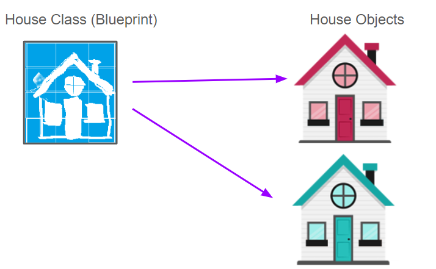
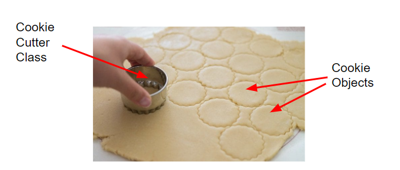
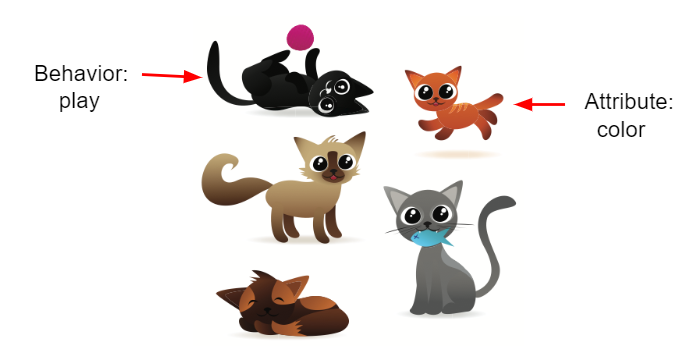
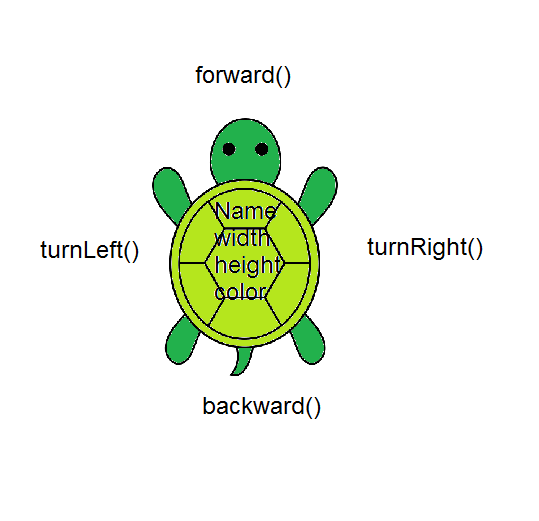
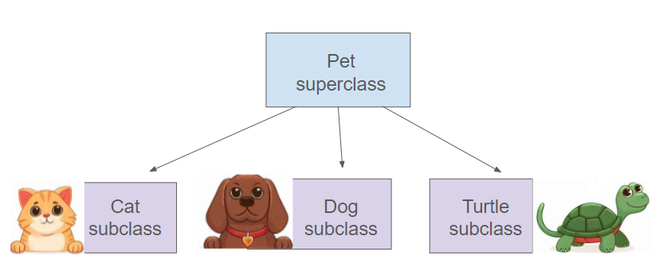
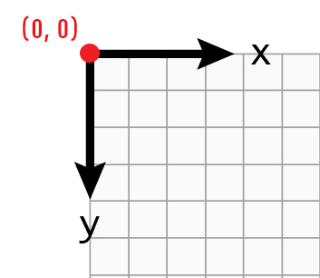

.. include:: ../common.rst

|Time45|

.. |repl link| raw:: html

   <a href="https://replit.com/@BerylHoffman/Java-Swing-Turtle#Main.java" target="_blank" style="text-decoration:underline">replit link</a>

.. |github| raw:: html

   <a href="https://github.com/bhoffman0/CSAwesome2/raw/main/_sources/Unit1-Using-Objects-and-Methods/TurtleJavaSwingCode.zip" target="_blank" style="text-decoration:underline">here</a>

Objects - Instances of Classes
===============================

.. index::
    single: object
    single: class
    single: instance
    single: attribute
    single: behavior

Java is an **object-oriented programming** language. That means that one of the
primary ways of designing and organizing a Java program is in terms of **objects**. Objects combine data and the code that operates on that data into
a single unit. To create objects, we first define a **class** which provides
a blueprint for creating the objects. In Java, all programs are built out of classes. This is why, every Java program starts with ``public class``. In this unit, you will learn the vocabulary of object-oriented programming and to create and use objects of a class written for you. In later units, you will learn to write your own classes.  

What are Classes and Objects?
------------------------------

You can think of a class as something like a blueprint of a house that is used to construct houses (objects), or like a cookie cutter that is used to create the cookies (objects). The cookie cutter (class) can
be used to create as many cookies (objects) as you want. The cookies (objects) are all the same shape and size, but they can have different colors and decorations. 

    Figure 1: Using a blueprint (class) to construct houses (objects) or a cookie cutter (class) to make cookies (objects) 

You can also think of a class as defining a new data type. In this lesson, we will use the class ``Turtle`` to make animated turtle objects. Just like you use ``int`` to
declare variables that hold numbers, you can use ``Turtle`` to declare many variables, animated turtle objects, who are **instances** of the ``Turtle`` class. 

.. code-block:: java

    // Creating 2 Turtle objects called yertle and myrtle
    Turtle yertle;
    Turtle myrtle;

.. |video1| raw:: html

   <a href="https://www.youtube.com/watch?v=64DOwDu5SVo&list=PLHqz-wcqDQIEP6p1_0wOb9l9aQ0qFijrP&ab_channel=colleenlewis" target="_blank">video</a>

Watch the following |video1| by Dr. Colleen Lewis about classes and objects:

.. youtube:: 64DOwDu5SVo
    :optional:
    :width: 650
    :height: 415
    :align: center

Attributes and Behaviors
--------------------------

A class defines the **attributes** (data) and **behaviors** (methods) that all objects of that class will have. The objects are the specific **instances** of the class that have their own values for the attributes.  **Attributes** are the data or properties that an object knows about itself, for example, a turtle object's color and size. **Behaviors** are the things that an object can do. For example, a turtle object can go forward, turn left, or turn right. The attributes and behaviors of a class are defined in the class, but each object has its own values for the attributes.

.. |video3| raw:: html

   <a href="https://www.youtube.com/watch?v=Y9vn6u3901Y&list=PLHqz-wcqDQIEP6p1_0wOb9l9aQ0qFijrP&ab_channel=colleenlewis" target="_blank">video</a>

This |video3| shows another class called ``Belt`` and how it has 3 instance variables to define its attributes. Every belt object can have different values stored in the instance variables.

.. youtube:: Y9vn6u3901Y
    :width: 650
    :height: 415
    :align: center
    :optional:

The following picture has lots of cats (objects of the type cat). They are all
different, but they share the same attributes and behaviors that make up a cat.
They are all **instances** of cat with different values for their attributes.
Name some of the attributes and behaviors of the cats below. For example, the
color (*attribute*) of the first cat is black (*attribute value*) and it is
playing (*behavior*).

    Figure 2: Pictures of cats (cat objects)

.. shortanswer:: cats

    Discuss with your class: What are some attributes of cats? What are some
    behaviors of cats? (Note that attributes are often nouns or adjectives
    describing features of cats, and behaviors are often verbs).

The following picture of a turtle shows some of the Turtle **attributes** like name, width, height, color in the body of the turtle and its **methods** like forward(), backward(), written around the turtle. 

    Figure 3: Turtle Attributes and Behaviors

|Exercise| **Check your understanding**

.. dragndrop:: vocab2_1
    :feedback: Review the summaries above.
    :match_1: a specific instance of a class with defined attributes|||object
    :match_2: defines a new data type that is like a blueprint|||class
    :match_3: define what the object knows about itself|||attributes or instance variables
    :match_4: define what an object can do|||behaviors or methods

    Drag the definition from the left and drop it on the correct concept on the right.  Click the "Check Me" button to see if you are correct.

.. mchoice:: howmanyobjects
   :practice: T
   :answer_a: 1
   :answer_b: 10
   :answer_c: 1000
   :answer_d: As many as you need
   :correct: d
   :feedback_a: There is one definition of a class, but the class can create as many objects as are needed.
   :feedback_b: There is no limit on the number of objects you can create from a class.
   :feedback_c: There is no limit on the number of objects you can create from a class.
   :feedback_d: You can create as many objects as you need from one class.

   How many objects can you create from a class in Java?

.. mchoice:: mcq_behaviors
   :practice: T
   :answer_a: attributes
   :answer_b: methods
   :answer_c: class
   :answer_d: object
   :correct: b
   :feedback_a: attributes specify the data that an object keeps track of.
   :feedback_b: Methods specify the behavior of all objects of a class.
   :feedback_c: While the class does specify the behavior of all objects created by that class, what part of a class specifies the behavior?
   :feedback_d: The object behavior is specified by the methods in the class that created the object.

   What specifies the behavior for objects of a class in Java?

.. mchoice:: mcq_data
   :practice: T
   :answer_a: attributes
   :answer_b: methods
   :answer_c: class
   :answer_d: object
   :correct: a
   :feedback_a: attributes specify the data that an object keeps track of.
   :feedback_b: Methods specify the behavior of all objects of a class.
   :feedback_c: While the class does specify the data that all objects of the class keep track of, what part of the class stores the data?
   :feedback_d: The object data is stored in the attributes of the object.  The attributes are defined in the class.

   What are the data or properties of an object called?

Turtle Class
-----------------------------

The Turtle class (that we've written for you and hidden on this page) is a blueprint for turtle objects. It defines attributes for graphical turtles like their color and position and methods to make the turtles move. Try the Java program below that creates a Turtle object called yertle using the Turtle class.

.. activecode:: TurtleTest
    :language: java
    :autograde: unittest
    :datafile: turtleClasses.jar

    Try clicking the run button below to see what the following program does.
    (If the code below does not work or is too slow in your browser, you can also see the ``Turtle`` code in action at this |repl link| (refresh page after forking and if it gets stuck) or download the files |github| to use in your own IDE.)
    ~~~~
    import java.awt.*;
    import java.util.*;

    public class TurtleTest
    {
        public static void main(String[] args)
        {
            World habitat = new World(300, 300);
            Turtle yertle = new Turtle(habitat);

            yertle.forward();
            yertle.turnLeft();
            yertle.forward();

            habitat.show(true);
        }
    }

    ====
    import static org.junit.Assert.*;

    import org.junit.*;

    import java.io.*;

    public class RunestoneTests extends CodeTestHelper
    {
        public RunestoneTests()
        {
            super("TurtleTest");
        }

        @Test
        public void test1()
        {
            boolean passed = getResults("true", "true", "main()");
            assertTrue(passed);
        }
    }

.. |video2| raw:: html

   <a href="https://www.youtube.com/watch?v=TFmmG4_KK8I&list=PLHqz-wcqDQIEP6p1_0wOb9l9aQ0qFijrP&ab_channel=colleenlewis" target="_blank">video</a>
 
The following |video2| shows how the program creates a ``World`` object called ``habitat`` and a ``Turtle`` object called ``yertle`` in memory.

.. youtube:: TFmmG4_KK8I
    :width: 650
    :height: 415
    :align: center
    :optional:

The **dot operator** (.) is used to run an object's method. You can think of the (.) as asking the object to do something (execute one of its methods).  For example, ``yertle.forward()`` asks the turtle ``yertle`` to go ``forward``. It doesn't tell ``yertle`` how much to go forward, so it goes forward 100 pixels by default. The parentheses ``()`` after a method name are there in case you need to give the method **arguments** (some data) to do its job, for example to go forward 50 pixels instead of 100 in ``yertle.forward(50);`` Try changing the code above to go forward 50 pixels instead and then run it again.

|CodingEx| **Coding Exercise**

.. activecode:: TurtleTest2
    :language: java
    :autograde: unittest
    :datafile: turtleClasses.jar

    In the code below, ``yertle`` goes forward and then turns left. Can you change the code to make ``yertle`` go ``forward`` twice and then ``turnRight``?
    ~~~~
    import java.awt.*;
    import java.util.*;

    public class TurtleTest2
    {
        public static void main(String[] args)
        {
            World habitat = new World(300, 300);
            Turtle yertle = new Turtle(habitat);

            yertle.forward();
            yertle.turnLeft();

            habitat.show(true);
        }
    }

    ====
    import static org.junit.Assert.*;

    import org.junit.*;

    import java.io.*;

    public class RunestoneTests extends CodeTestHelper
    {
        public RunestoneTests()
        {
            super("TurtleTest2");
        }

        @Test
        public void test1()
        {
            String code = getCode();
            String expect = "yertle.forward";

            int count = countOccurences(code, expect);

            boolean passed = getResults("2 time(s)", "" + count + " time(s)", "yertle.forward() twice");
            assertTrue(passed);
        }

        @Test
        public void test2()
        {
            String code = getCode();
            String expect = "yertle.turnRight()";

            int count = countOccurences(code, expect);

            boolean passed = count >= 1;
            passed = getResults("1+ time(s)", "" + count + " time(s)", "yertle.turnRight()", passed);
            assertTrue(passed);
        }
    }

A variable like ``yertle`` of a **reference** type like ``Turtle`` holds an object reference, which can be thought of as the memory address of that object. Variables that are of a primitive types like ``int`` hold just a single number value. But objects are complex and contain a collection of values called **attributes**, for example the color and the size of the turtle.

Creating Turtle Objects
------------------------

When you write a class like the ``Turtle`` class, you can create many objects of that class type. In the code below,
two turtle objects are created: ``yertle`` and ``myrtle``.  You can name your turtle and add in a line like the following in the main method to make it move:

.. code-block:: java

    // To create or declare a new object, write:
    // ClassName variableName = new ClassName(arguments);
    Turtle yourTurtleName = new Turtle(habitat);
    yourTurtlename.forward();

|CodingEx| **Coding Exercise:**

.. activecode:: TurtleTest3
    :language: java
    :autograde: unittest
    :datafile: turtleClasses.jar

    Can you add another turtle object to the code below?
    ~~~~
    import java.awt.*;
    import java.util.*;

    public class TurtleTest3
    {
        public static void main(String[] args)
        {
            World habitat = new World(300, 300);
            Turtle yertle = new Turtle(habitat);
            Turtle myrtle = new Turtle(habitat);

            yertle.forward();
            yertle.turnLeft();
            yertle.forward();

            myrtle.turnRight();
            myrtle.forward();

            habitat.show(true);
        }
    }

    ====
    import static org.junit.Assert.*;

    import org.junit.*;

    import java.io.*;

    public class RunestoneTests extends CodeTestHelper
    {
        public RunestoneTests()
        {
            super("TurtleTest3");
        }

        @Test
        public void test1()
        {
            String code = getCode();
            String expect = "new Turtle(habitat)";

            int count = countOccurences(code, expect);

            boolean passed = count >= 3;
            passed = getResults("3+ Turtles", "" + count + " Turtles", "Add a new Turtle(s)", passed);
            assertTrue(passed);
        }
    }

Class Hierarchy and Inheritance
--------------------------------

.. index::
    single: inheritance
    single: superclass
    single: subclass
    single: Object

Another important concept in object-oriented programming is **inheritance**. Although the AP CSA exam no longer covers inheritance, you should know what it means. **Inheritance** is a way to create a new class that is based on an existing class. The new class, called a **subclass**, inherits the attributes and behaviors of the existing class, called a **superclass**.  In Java, all classes are subclasses of a superclass called **Object**. 

For example, you could have a superclass called ``Pet`` with attributes like ``name`` and ``age`` and behaviors like ``eat`` and ``sleep``. You could then have subclasses like ``Dog`` and ``Cat`` and ``Turtle`` that inherit the attributes and behaviors of the ``Pet`` class. Each subclass could add attributes and behaviors specific to that type of pet. For example, a ``Dog`` subclass could have an attribute called ``breed`` and a behavior called ``bark``.

    Figure 4: Inheritance hierarchy for Pet superclass with the subclasses Dog, Cat, and Turtle

|Groupwork| Programming Challenge : Turtle House
------------------------------------------------

.. image:: Figures/houseWithWindows.png
    :width: 200px
    :align: left
    :alt: simple house

This creative challenge is fun to do collaboratively in pairs. Design a house and have the turtle draw it with different colors below (or with this |repl link|). Can you add windows and a door? Come up with your own house design as a team.

To draw a window, you will need to call ``penUp`` and ``moveTo`` to walk the turtle into position without drawing, for example:

.. code-block:: java

   t.penUp();
   t.moveTo(120,200);
   t.penDown();

It may help to act out the code pretending you are the turtle. Remember that the angles you turn depend on which direction you are facing, and the turtle begins facing up. When planning your coordinates for the house, remember that the turtle starts at the center of the screen (150,150) and the top left corner is (0,0). 

.. note::

   The Turtle world does not use the Cartesian coordinate system with (0,0) in
   in the middle the screen. Instead, (0,0) is at the top left corner of the
   screen and x increases to the right and y increases towards the bottom of the
   screen. Most computer graphics systems use this coordinate system which is a carry
   over from before computers could display graphics and had to approximate the graphics with text print outs. 

        
    Figure 5: The coordinate (0,0) is at the top left of the Turtle world.

Here is a class diagram that shows some of the attributes and methods in the class ``Turtle``.

.. figure:: Figures/turtleUMLClassDiagram.png
    :width: 400px
    :align: center
    :alt: Turtle class diagram
    :figclass: align-center

    Figure 6: Turtle Class Diagram

.. |repl link| raw:: html

   <a href="https://replit.com/@BerylHoffman/Java-Swing-Turtle#Main.java" target="_blank">replit.com link</a>

.. activecode:: challenge-TurtleHouse
    :language: java
    :autograde: unittest
    :datafile: turtleClasses.jar

    Draw a Turtle House! Make sure you use forward, turn, penUp, penDown, moveTo methods as well as different colors. Have fun!
    ~~~~
    import java.awt.*;
    import java.util.*;

    public class TurtleHouse
    {
        public static void main(String[] args)
        {
            World world = new World(300, 300);
            Turtle t = new Turtle(habitat);
            // Use t to draw a house 

            // keep this line at the end of your code to show the drawing
            world.show(true);
        }
    }

    ====
    import static org.junit.Assert.*;

    import org.junit.*;

    import java.io.*;

    public class RunestoneTests extends CodeTestHelper
    {
        public RunestoneTests()
        {
            super("TurtleHouse");
        }

        @Test
        public void test2()
        {
            String code = getCode();
            int num = countOccurences(code, "moveTo(");

            boolean passed = num >= 1;
            passed = getResults("1 or more", "" + num, "Calls moveTo(...)", passed);
            assertTrue(passed);
        }

        @Test
        public void test3()
        {
            String code = getCode();
            int num = countOccurences(code, ".penUp()");

            boolean passed = num >= 1;
            passed = getResults("1 or more", "" + num, "Calls penUp()", passed);
            assertTrue(passed);
        }

        @Test
        public void test4()
        {
            String code = getCode();
            int num = countOccurences(code, ".penDown(");

            boolean passed = num >= 1;
            passed = getResults("1 or more", "" + num, "Calls penDown()", passed);
            assertTrue(passed);
        }

        @Test
        public void test5()
        {
            String code = getCode();
            int numTurns = countOccurences(code, ".turn");

            boolean passed = numTurns >= 6;
            passed = getResults("6 or more", "" + numTurns, "turns", passed);
            assertTrue(passed);
        }

        @Test
        public void test6()
        {
            String code = getCode();
            int numForward = countOccurences(code, ".forward(");

            boolean passed = numForward >= 6;
            passed = getResults("6 or more", "" + numForward, "Calls to forward()", passed);
            assertTrue(passed);
        }
    }

Summary
-------------------

- A **class** defines a new data type (a classification). It is the formal implementation, or blueprint, of the *attributes* and *behaviors* of the objects of that class.

- An **object** is a specific **instance** of a class with defined attributes. Objects are declared as variables of a class type.

- A variable of a reference type holds an object reference, which can be thought of as the memory address of that object.

- An **attribute** or **instance variable** is data the object knows about itself. For example a turtle object knows the direction it is facing or its color.

- A **behavior** or **method** is something that an object can do.  For example a turtle object can go forward 100 pixels.

- A **class hierarchy** can be developed by putting common attributes and behaviors of related classes into a single class called a **superclass**. Classes that **extend** a superclass, called **subclasses**, can draw upon the existing attributes and behaviors of the superclass without replacing these in the code. This creates an **inheritance** relationship from the subclasses to the superclass. Designing and implementing inheritance relationships are outside the scope of the AP Computer Science A course and exam.

- All classes in Java are subclasses of the **Object** class.

AP Practice
------------

Try these AP practice questions that will help to prepare you for the AP Classroom progress checks.

.. mchoice:: AP-attributes
   :practice: T
   :answer_a: An attribute of the name object is String.
   :answer_b: An attribute of the pet object is name.
   :answer_c: An instance of the pet class is Dog.
   :answer_d: An attribute of the Dog instance is pet.
   :answer_e: An instance of the Dog object is pet.
   :correct: b
   :feedback_a: name is an attribute of the pet object or Dog class.
   :feedback_b: name is an attribute of the pet object or Dog class.
   :feedback_c: An instance of the Dog class is pet.
   :feedback_d: An attribute of the Dog class is name.
   :feedback_e: An instance of the Dog class is pet.

   A student has created a ``Dog`` class. The class contains variables to represent the following.
    - A String variable called ``breed`` to represent the breed of the dog
    - An int variable called ``age`` to represent the age of the dog
    - A String variable called ``name`` to represent the name of the dog

    The object ``pet`` is declared as type Dog.
    Which of the following descriptions is accurate?

.. mchoice:: AP-objects
   :practice: T
   :answer_a: boolean is an attribute of the myParty object.
   :answer_b: myParty is an attribute of the Party class.
   :answer_c: myParty is an instance of the Party class.
   :answer_d: myParty is an attribute of the Party instance.
   :answer_e: numOfPeople is an instance of the Party object.
   :correct: c
   :feedback_a: boolean is the type of an attribute, but not an attribute.
   :feedback_b: myParty is an instance of the Party class.
   :feedback_c: myParty is an object that is an instance of the Party class.
   :feedback_d: An attribute of the Party class is numOfPeople.
   :feedback_e: An attribute of the Party class is numOfPeople.

    A student has created a ``Party`` class. The class contains variables to represent the following.
    - An int variable called ``numOfPeople`` to represent the number of people at the party.
    - A boolean variable called ``discoLightsOn`` to represent whether the disco ball is on.
    - A boolean variable called ``partyStarted`` to represent whether the party has started.

    The object ``myParty`` is declared as type Party. Which of the following descriptions is accurate?

