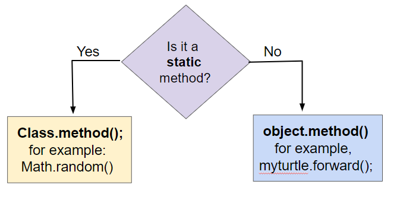
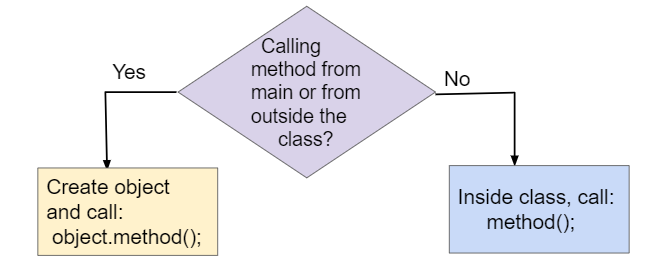
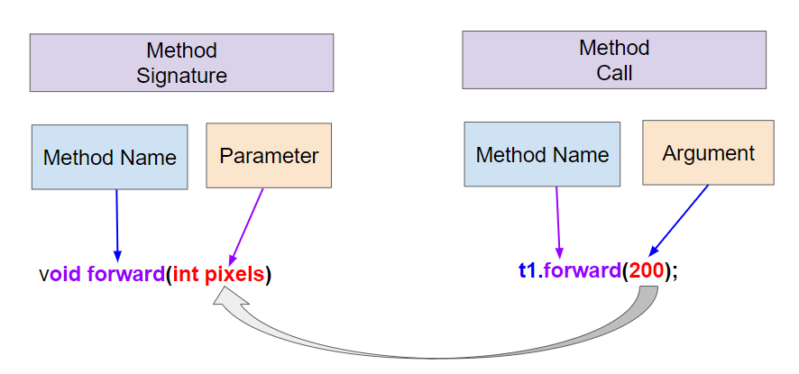
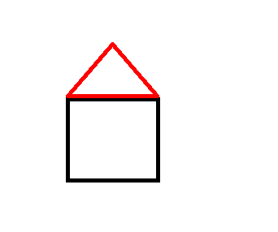

.. include:: ../common.rst

.. qnum::
   :prefix: 1-14-
   :start: 1

|Time90|

Calling Instance Methods
=========================

.. index::
    single: instance methods
    single: object methods
    single: method
    single: parameter
    single: argument

In object-oriented programming, **methods** define the behavior and actions that an object can perform. For example, ``Turtle`` objects can go forward or turn left using method calls like ``yertle.forward()`` and  ``yertle.turnRight()`` to change its position. These methods are sometimes called **instance methods** or **object methods** because they are called using an instance or object of the class, in this case a specific ``Turtle`` object like ``yertle``.

Class Methods vs. Instance Methods
------------------------------------

In lessons 1.9 and 1.10, we learned how to call **class methods** (also called **static methods**).  Class methods are called using the class name followed by the dot (.) operator and the method name,  example, ``Math.sqrt(25);`` calls the ``sqrt`` method in the ``Math`` class to find the square root of 25. Class methods use the keyword ``static`` in their method signature. They do not access or change the attributes of an object. 

In this lesson, we will learn more about **instance methods** which are always called using an object of the class. They are not static methods. They access and change the attributes of the object they are called on, for example ``yertle.forward()`` changes the ``Turtle`` object yertle's position.  

The following flowchart shows the difference between calling class (static) methods and instance methods. Static methods are called using the class name, for example, ``Math.sqrt(25);``. Instance methods are called using an object of the class, for example, ``yertle.forward();``. Traditionally, class names are capitalized, and object variables are lowercase.

    Figure 1: Calling static vs. instance methods

Method Signatures
----------------------------

The **method signature** defines the method's name and the number and types of parameters it takes. In a class definition or in documentation of a library, instance methods are usually defined after the instance variables (attributes) and constructors in a class. For example, see the ``Student`` class below. Notice that the methods do not use the keyword ``static``. They are instance methods that are called using an object of the class and can access and change the object's attributes.

.. figure:: Figures/StudentClass.png
    :width: 500px
    :align: center
    :alt: A Student class showing instance variables, constructors, and methods
    :figclass: align-center

    Figure 2: A Student class showing instance variables, constructors, and methods

|Exercise| Check Your Understanding

.. clickablearea:: student_methods
    :question: Click on the method headers (signatures) in the following class. Do not click on the constructors.
    :iscode:
    :feedback: Methods follow the constructors. The method header is the first line of a method.

    :click-incorrect:public class Student {:endclick:

        :click-incorrect:private String name;:endclick:
        :click-incorrect:private String email;:endclick:

        :click-incorrect:public Student(String initName, String intEmail) :endclick:
        :click-incorrect:{:endclick:
            :click-incorrect:name = initName;:endclick:
            :click-incorrect:email = initEmail;:endclick:
         :click-incorrect:}:endclick:

         :click-correct:public String getName() :endclick:
         :click-incorrect:{:endclick:
            :click-incorrect:return name;:endclick:
         :click-incorrect:}:endclick:

         :click-correct:public void print() :endclick:
         :click-incorrect:{:endclick:
            :click-incorrect:System.out.println(name + ":" + email);:endclick:
         :click-incorrect:}:endclick:
    :click-incorrect:}:endclick:

Method Calls
-------------

To use an object's method, you must use the object name and the dot (.) operator followed by the method name, for example, ``yertle.forward();`` calls ``yertle``'s ``forward`` method to move a turtle object forward 100 pixels. Object methods work with the **attributes** of the object, such as the direction the turtle is heading or its position.

Methods inside the same class can call each other using just ``methodName()``, but to call instance methods in another class or from a main method, you must first create an object of that class and then call its methods using ``object.methodName()``.

    Figure 3: Calling instance methods from main() or from other methods inside the same class.

.. note::

    ``method();`` is used to call a method within the same class, but ``object.method();`` is necessary if you are calling the method from the main method or from a different class.

Before you call a method from ``main`` or from outside of the current class, you must make sure that you have created and initialized an object. However, if you just declare an object reference without setting it to refer to a new object, the value will be ``null``, meaning that it doesn't reference an object. If you call a method on a variable whose value is ``null``, you will get a **NullPointerException** error, where a **pointer** is another name for a reference.

.. activecode:: nullPointerTest
    :language: java
    :autograde: unittest
    :datafile: turtleClasses.jar

    Run the code below to see a NullPointerException. Fix the code by using ``new Turtle(habitat)`` to create a new Turtle object before calling its methods.
    ~~~~
    import java.awt.*;
    import java.util.*;

    public class NullPointerTest
    {
        public static void main(String[] args)
        {
            World habitat = new World(300, 300);
            Turtle yertle = null;

            // yertle is null!
            yertle.forward();
            
            habitat.show(true);
        }
    }

    ====
    import static org.junit.Assert.*;

    import org.junit.*;

    import java.io.*;

    public class RunestoneTests extends CodeTestHelper
    {
        @Test
        public void test1()
        {
            String code = "new Turtle(habitat)";
            boolean passed = checkCodeContains(code);
            assertTrue(passed);
        }
    }

The following flowchart can be used to compare three different ways of calling methods. Class (static) methods are called using the class name. Instance methods are called using an object of the class. If you are calling the instance method from the main method or from another class, you must first create an object of that class and then call its methods using ``object.methodName()``. If you are calling the method from within the same class, you can just call the method using ``methodName()`` which will refer to the current object.

.. figure:: Figures/FlowChartCallingMethods.png
    :width: 550px
    :align: center
    :alt: Comparing method calls to static and instance methods
    :figclass: align-center

    Figure 4: Comparing Method Calls to Static and Instance Methods

Methods Calls with Arguments
--------------------------------

In the last lessons, we used simple **methods** like ``forward`` and ``turnRight`` to make the turtle draw lines. You may have noticed that ``forward()`` and ``backward()`` always move the same number of pixels (100 pixels), and ``turnRight()`` and ``turnLeft()`` always turn at right angles (90 degrees). This is a little limiting. What if we wanted to draw a triangle or the letter A? These require smaller angles to draw diagonal lines and different length lines. Luckily, there are more complex methods in the ``Turtle`` class that let you specify the number of pixels to move forward or the number of degrees to turn. These values that you can give to methods to help them do their job are called **arguments** or **parameters**. For example, we can give the argument 200 in ``forward(200)`` to make the turtle go forward 200 pixels instead of the default of 100 or the argument 30 in ``turn(30)`` to make the turtle turn 30 degrees instead of 90 degrees.

.. note::

    ``object.method(arguments);`` is used to call an object's method and give it some argument values that it will need to do its job.

When you create your own method, the variables you define for it are called **parameters**. When you call the method to do its job, you give or pass in **arguments** to it that are then saved in the parameter variables. So, in the definition of the ``forward`` method, it has a parameter variable called ``pixels``, and in the call to ``forward(200)``, the argument is the value 200 which will get saved in the parameter variable pixels. You will learn to write your own methods in Unit 3. In this unit, you will learn to call methods that are already written for you.

    Figure 5: Method signatures with parameters and method calls arguments

|Exercise| **Check your understanding**

.. dragndrop:: methodVocab
    :feedback: Review the vocabulary above.
    :match_1: an object's behaviors or functions that can be used or called to do its job|||methods
    :match_2: the values or data passed to an object's method|||arguments
    :match_3: the variables in a method's definition that hold the arguments|||parameters
    :match_4: asking to run the method|||method call

    Drag the definition from the left and drop it on the correct word on the right.  Click the "Check Me" button to see if you are correct.

Here is the Turtle class diagram again that shows some of the variables and methods inherited from the SimpleTurtle class in the class Turtle that are written for you.

.. figure:: Figures/turtleUMLClassDiagram.png
    :width: 400px
    :align: center
    :alt: Turtle class diagram
    :figclass: align-center

    Figure 6: Turtle Class Diagram

Methods are said to be **overloaded** when there
are multiple methods with the same name but a
different **method signature**, where it requires a different number or type of parameters. For example, we have two different forward methods, ``forward()`` with no arguments and ``forward(100)`` which has an argument that tells it how much to move forward. The arguments given to the method need to correspond to the order and types of the parameters in the method signature.

.. |Color| raw:: html

   <a href= "https://docs.oracle.com/javase/7/docs/api/java/awt/Color.html" target="_blank">Color</a>

.. |javadoc (documentation) file| raw:: html

   <a href="https://www2.cs.uic.edu/~i101/doc/SimpleTurtle.html" target="_blank">javadoc (documentation) file</a>

|CodingEx| **Coding Exercise**

.. activecode:: TurtleTestMethods1
    :language: java
    :autograde: unittest
    :datafile: turtleClasses.jar

    1. Can you make yertle draw a square and change the pen color for each side of the square? Try something like: yertle.setColor(Color.red); This uses the |Color| class in Java which has some colors predefined like red, yellow, blue, magenta, cyan. You can also use more specific methods like setPenColor, setBodyColor, and setShellColor.
    2. Can you draw a triangle? The turnRight() method always does 90 degree turns, but you'll need external angles of 120 degree for an equilateral triangle. Use the turn method which has a parameter for the angle of the turn in degrees. For example, turn(90) is the same as turnRight(). Try drawing a triangle with different colors.
    ~~~~
    import java.awt.*;
    import java.util.*;

    public class TurtleTestMethods1
    {
        public static void main(String[] args)
        {
            World world = new World(300, 300);
            Turtle yertle = new Turtle(world);

            yertle.forward(100);
            yertle.turnLeft();
            yertle.forward(75);

            world.show(true);
        }
    }

    ====
    import static org.junit.Assert.*;

    import org.junit.*;

    import java.io.*;

    public class RunestoneTests extends CodeTestHelper
    {
        public RunestoneTests()
        {
            super("TurtleTestMethods1");
        }

        @Test
        public void test1()
        {
            boolean passed = codeChanged(
                "import java.awt.*;\n" +
                "import java.util.*;\n" +
                "\n" +
                "public class TurtleTestMethods1\n" +
                "{\n" +
                "    public static void main(String[] args)\n" +
                "    {\n" +
                "        World world = new World(300, 300);\n" +
                "        Turtle yertle = new Turtle(world);\n" +
                "\n" +
                "        yertle.forward(100);\n" +
                "        yertle.turnLeft();\n" +
                "        yertle.forward(75);\n" +
                "\n" +
                "        world.show(true);\n" +
                "    }\n" +
                "}\n"
            );
            assertTrue(passed);
        }

        @Test
        public void test2()
        {
            String code = getCode();
            int numColors = countOccurences(code, "Color(");

            boolean passed = numColors >= 3;
            passed = getResults("3 or more", "" + numColors, "Changes color at least 3 times", passed);
            assertTrue(passed);
        }

        @Test
        public void test3()
        {
            String code = getCode();
            int numTurns = countOccurences(code, ".turn");

            boolean passed = numTurns >= 3;
            passed = getResults("3 or more", "" + numTurns, "Turns at least 3 times", passed);
            assertTrue(passed);
        }

        @Test
        public void test4()
        {
            String code = getCode();
            int numTurns = countOccurences(code, ".turn(");

            boolean passed = numTurns >= 1;
            passed = getResults("1 or more", "" + numTurns, "Calls to turn(...)", passed);
            assertTrue(passed);
        }

        @Test
        public void test5()
        {
            String code = getCode();
            int numForward = countOccurences(code, ".forward(");

            boolean passed = numForward >= 4;
            passed = getResults("4 or more", "" + numForward, "Calls to forward()", passed);
            assertTrue(passed);
        }
    }

|CodingEx| **Coding Exercise**

Try the following mixed up code to draw a simple house made of a square and a triangle roof.

.. parsonsprob:: DrawAHouse
   :numbered: left
   :practice: T
   :adaptive:
   :noindent:

   The following code uses a turtle to draw a simple house, but the lines are mixed up.  Drag the code blocks to the right and put them in the correct order to first draw a square for the house and then a red triangle for the roof.  Click on the "Check Me" button to check your solution.  You can type this code in the Active Code window above to see it in action.
   -----
   public class TurtleDrawHouse
   {
   =====
      public static void main(String[] args)
      {
      =====
         World world = new World(300,300);
         =====
         Turtle builder = new Turtle(world);
         =====
         // Draw a square
         builder.turnRight();
         builder.forward(100);
         builder.turnRight();
         builder.forward(100);
         builder.turnRight();
         builder.forward(100);
         builder.turnRight();
         builder.forward(100);
         =====
         builder.setColor(Color.red);
         =====
         // Draw a triangle
         builder.turn(30);
         builder.forward(100);
         builder.turn(120);
         builder.forward(100);
         builder.turn(120);
         builder.forward(100);
         =====
         world.show(true);
         =====
      }
      =====
   }

Methods that Return Values
---------------------------

All the methods on ``Turtle`` that we’ve discussed so far are **void methods** with ``void``
return type. This means they don't return anything.  Because a
``void`` method doesn’t return any value, the only point of calling one is
because it does something that can be observed by the user or by other code—it
changes the state of the object or maybe causes something to happen like drawing
a line on the screen. Or both. These things they do are sometimes called
“effects”.

In contrast, methods with a return type of anything `other` than ``void`` are
called **non-void** methods. These methods **return** a value that the code
calling the method can use. And because methods are called on an object, these
methods can be used to return values that tell us things about an object’s
internal state. In well-designed programs, non-void methods typically don’t have effects; they just compute and return a value. To put it another way, void methods `do things`
while non-void methods `produce values`.

A simple kind of method that returns a value is what is formally called an
**accessor** because it accesses a value in an object. In the real world
everyone calls them **getters**. A getter is a method that takes no arguments
and has a non-\ ``void`` return type. In Java they are almost always named
something that starts with ``get``, and they usually just return the value of one
of the object’s instance variables. For example, the ``Turtle`` class has
several getters, ``getWidth`` and ``getHeight`` which return the width and the
height of a ``Turtle`` object and ``getXPos`` and ``getYPos`` which return the x
and y values of the ``Turtle``\ ’s position.

Note that when you use a getter, you need to do something with the value it
returns. You might assign it to a variable, use it in an expression, or print it
out. If you don’t, you’re just getting a value and doing nothing with it—you
might as well not have bothered to call the getter in the first place.

Here are some examples of using getters on the ``Turtle`` object ``yertle``.

.. code-block:: java

    Turtle yertle = new Turtle(world);
    int width = yertle.getWidth();
    int height = yertle.getHeight();
    System.out.println("Yertle's width is: " + width);
    System.out.println("Yertle's height is: " + height);
    System.out.println("Yertle's x position is: " + yertle.getXPos() );
    System.out.println("Yertle's y position is: " + yertle.getYPos() );

.. note::

    A common error is forgetting to do something with the value returned from a method. When you call a method that returns a value, you should do something with that value like assigning it to a variable or printing it out.

|CodingEx| **Coding Exercise:**

.. activecode:: TurtleTestGetSet
    :language: java
    :autograde: unittest
    :datafile: turtleClasses.jar

    Try the code below that prints out the turtle's current position using ``getXPos()`` and ``getYPos()``. Can you make it go to position (0,0) or as close to it as possible?
    ~~~~
    import java.awt.*;
    import java.util.*;

    public class TurtleTestGetSet
    {
        public static void main(String[] args)
        {
            World world = new World(300, 300);
            Turtle yertle = new Turtle(world);
            System.out.println(
                    "Yertle is starting at: "
                            + yertle.getXPos()
                            + ", "
                            + yertle.getYPos());
            yertle.forward(100);
            yertle.turn(90);
            yertle.forward(50);
            System.out.println(
                    "Yertle has ended up at: "
                            + yertle.getXPos()
                            + ", "
                            + yertle.getYPos());
            world.show(true);
        }
    }

    ====
    import static org.junit.Assert.*;

    import org.junit.*;

    import java.io.*;

    public class RunestoneTests extends CodeTestHelper
    {
        public RunestoneTests()
        {
            super("TurtleTestGetSet");
        }

        @Test
        public void test1()
        {
            String orig =
                    "import java.awt.*;\n"
                        + "import java.util.*;\n\n"
                        + "public class TurtleTestGetSet\n"
                        + "{\n"
                        + "public static void main(String[] args)\n"
                        + "{\n"
                        + "World world = new World(300,300);\n"
                        + "Turtle yertle = new Turtle(world);\n"
                        + "System.out.println(\"Yertle is starting at: \" + yertle.getXPos() + \", \" +"
                        + " yertle.getYPos());\n"
                        + "yertle.forward(100);\n"
                        + "yertle.turn(90);\n"
                        + "yertle.forward(50);\n"
                        + "System.out.println(\"Yertle has ended up at: \" + yertle.getXPos() + \", \" +"
                        + " yertle.getYPos());\n"
                        + "world.show(true);\n"
                        + "}\n"
                        + "}\n";
            boolean passed = codeChanged(orig);
            assertTrue(passed);
        }
    }

|CodingEx| **Coding Exercise:**

.. activecode:: TurtleArea
    :language: java
    :autograde: unittest
    :datafile: turtleClasses.jar

    Fix the errors in the code below so that it prints out the area of the space
    that the turtle occupies by multiplying its width and height. Remember that
    you have to do something with the values that the get methods return.
    ~~~~
    import java.awt.*;
    import java.lang.Math;
    import java.util.*;

    public class TurtleArea
    {
        public static void main(String[] args)
        {
            World world = new World(300,300);
            Turtle yertle = new Turtle(world);

            int area;
            yertle.getWidth() * getHeight;
            System.out.println("Yertle's area is: ");
        }
    }
    ====
    import static org.junit.Assert.*;

    import org.junit.*;

    import java.io.*;

    public class RunestoneTests extends CodeTestHelper
    {
        public RunestoneTests()
        {
            super("TurtleArea");
        }

        @Test
        public void test1()
        {
            String actual = getMethodOutput("main");
            String expected = "Yertle's area is: 270";
            boolean passed = getResults(expected, actual, "Prints correct answer");
            assertTrue(passed);
        }

        @Test
        public void test2()
        {
            String code = getCode();
            String target = ".getHeight()";

            int num = countOccurences(code, target);

            boolean passed = num >= 1;

            getResults("1+", "" + num, "Calls to " + target, passed);
            assertTrue(passed);
        }

        @Test
        public void test3()
        {
            String code = getCode();
            String target = ".getWidth()";

            int num = countOccurences(code, target);

            boolean passed = num >= 1;

            getResults("1+", "" + num, "Calls to " + target, passed);
            assertTrue(passed);
        }
    }

We will save a deeper discussion of actually writing getters and other methods
until Unit 3, but for the AP progress checks for this unit, you should be able to
trace through method calls like the ones below. Notice that the **return
statement** in a method returns the value, and it must match declared return type
of the method. The calling method must then do something useful with that value.

|Exercise| **Check your understanding**

.. |visualization1| raw:: html

   <a href="https://pythontutor.com/visualize.html#code=public%20class%20Circle%0A%7B%0A%20%20%20%20private%20double%20radius%3B%0A%0A%20%20%20%20public%20Circle%28double%20r%29%0A%20%20%20%20%7B%0A%20%20%20%20%20%20%20%20radius%20%3D%20r%3B%0A%20%20%20%20%7D%0A%0A%20%20%20%20public%20double%20getArea%28%29%0A%20%20%20%20%7B%0A%20%20%20%20%20%20%20%20return%203.14159%20*%20radius%20*%20radius%3B%0A%20%20%20%20%7D%0A%0A%20%20%20%20public%20static%20void%20main%28String%5B%5D%20args%29%20%7B%0A%20%20%20%20%20%20%20%20Circle%20c%20%3D%20new%20Circle%2810%29%3B%0A%20%20%20%20%20%20%20%20System.out.println%28c.getArea%28%29%29%3B%0A%20%20%20%20%7D%0A%7D&cumulative=false&heapPrimitives=nevernest&mode=edit&origin=opt-frontend.js&py=java&rawInputLstJSON=%5B%5D&textReferences=false" target="_blank" style="text-decoration:underline">visualization</a>

.. |visualization2| raw:: html

   <a href="https://pythontutor.com/render.html#code=public%20class%20Rectangle%0A%7B%0A%20%20%20%20private%20int%20width%3B%0A%20%20%20%20private%20int%20height%3B%0A%0A%20%20%20%20public%20Rectangle%28int%20w,%20int%20h%29%0A%20%20%20%20%7B%0A%20%20%20%20%20%20%20%20width%20%3D%20w%3B%0A%20%20%20%20%20%20%20%20height%20%3D%20h%3B%0A%20%20%20%20%7D%0A%0A%20%20%20%20public%20void%20resize%28%29%0A%20%20%20%20%7B%0A%20%20%20%20%20%20%20%20width%20%2B%3D%205%3B%0A%20%20%20%20%7D%0A%0A%20%20%20%20public%20int%20getArea%28%29%0A%20%20%20%20%7B%0A%20%20%20%20%20%20%20%20return%20width%20*%20height%3B%0A%20%20%20%20%7D%0A%0A%20%20%20%20public%20static%20void%20main%28String%5B%5D%20args%29%0A%20%20%20%20%7B%0A%20%20%20%20%20%20%20%20Rectangle%20r%20%3D%20new%20Rectangle%2810,%2015%29%3B%0A%20%20%20%20%20%20%20%20r.resize%28%29%3B%0A%20%20%20%20%20%20%20%20System.out.println%28r.getArea%28%29%29%3B%0A%20%20%20%20%7D%0A%7D&cumulative=false&curInstr=20&heapPrimitives=nevernest&mode=display&origin=opt-frontend.js&py=java&rawInputLstJSON=%5B%5D&textReferences=false" target="_blank" style="text-decoration:underline">visualization</a>

.. |visualization3| raw:: html

   <a href="http://www.pythontutor.com/visualize.html#code=public%20class%20MethodTrace%20%0A%20%20%20%20%20%20%7B%0A%20%20%20%20%20%20%20%20public%20int%20square%28int%20x%29%0A%20%20%20%20%20%20%20%20%7B%0A%20%20%20%20%20%20%20%20%20%20%20%20return%20x*x%3B%0A%20%20%20%20%20%20%20%20%7D%0A%20%20%20%20%20%20%20%20public%20int%20divide%28int%20x,%20int%20y%29%0A%20%20%20%20%20%20%20%20%7B%0A%20%20%20%20%20%20%20%20%20%20%20%20%20%20return%20x/y%3B%0A%20%20%20%20%20%20%20%20%7D%0A%20%20%20%20%20%20%20%20public%20static%20void%20main%28String%5B%5D%20args%29%20%7B%0A%20%20%20%20%20%20%20%20%20%20%20%20MethodTrace%20traceObj%20%3D%20new%20MethodTrace%28%29%3B%0A%20%20%20%20%20%20%20%20%20%20%20%20System.out.println%28%20traceObj.square%282%29%20%2B%20traceObj.divide%286,2%29%20%29%3B%0A%20%20%20%20%20%20%20%20%7D%0A%20%20%20%20%20%20%20%7D&cumulative=false&curInstr=16&heapPrimitives=nevernest&mode=display&origin=opt-frontend.js&py=java&rawInputLstJSON=%5B%5D&textReferences=false" target="_blank" style="text-decoration:underline">visualization</a>

.. mchoice:: traceCircleArea
   :practice: T
   :answer_a: 0
   :answer_b: 314.159
   :answer_c: c.getArea()
   :answer_d: The code will not compile.
   :answer_e: 100.0
   :correct: b
   :feedback_a: First, call the constructor, then call getArea().
   :feedback_b: Correct! getArea() returns 3.14159 * radius * radius, where radius is set to 10 by the constructor.
   :feedback_c: c.getArea() is a method call, not a value.
   :feedback_d: The code does compile.
   :feedback_e: Don't forget to multiply by 3.14159.

   Consider the following class definition.

   .. code-block:: java

        public class Circle
        {
            private double radius;

            public Circle(double r)
            {
                radius = r;
            }

            public double getArea()
            {
                return 3.14159 * radius * radius;
            }
        }

   Assume that the following code segment appears in a main method.

   .. code-block:: java

        Circle c = new Circle(10);
        System.out.println(c.getArea());

   What is printed as a result of executing the code segment? (If you get stuck, try this |visualization1| to see this code in action.)

.. mchoice:: traceRectangleArea
   :practice: T
   :answer_a: 150
   :answer_b: 150.0
   :answer_c: 225
   :answer_d: 255.0
   :answer_e: 0
   :correct: c
   :feedback_a: Note that the method resize() is called before getArea().
   :feedback_b: Note that the method resize() is called before getArea().
   :feedback_c: Correct! resize() increases the width by 5, so the area is 15 * 15 = 225.
   :feedback_d: Note that getArea() returns an int
   :feedback_e: Note that the constructor initializes width and height.

   Consider the following class definition.

   .. code-block:: java

        public class Rectangle
        {
            private int width;
            private int height;

            public Rectangle(int w, int h)
            {
                width = w;
                height = h;
            }

            public void resize(int amt)
            {
                width += amt;
            }

            public int getArea()
            {
                return width * height;
            }
        }

   Assume that the following code segment appears in a main method.

   .. code-block:: java

        Rectangle r = new Rectangle(10, 15);
        r.resize(5);
        System.out.println(r.getArea());

   What is printed as a result of executing the code segment? (If you get stuck, try this |visualization2| to see this code in action.)

.. mchoice:: traceReturnMethods
   :practice: T
   :answer_a: 5
   :answer_b: 7
   :answer_c: 4 3
   :answer_d: 2 3
   :answer_e: Does not compile.
   :correct: b
   :feedback_a: Make sure you call both methods and compute the square of 2 and then add the results.
   :feedback_b: Yes, square(2) returns 4 which is added to divide(6,2) which returns 3. The total of 4 + 3 is 7.
   :feedback_c: Make sure you add the results before printing it out.
   :feedback_d: Make sure you square(2) and add the results before printing it out.
   :feedback_e: Try the code in an active code window.

   What does the following code print out? (If you get stuck, try this |visualization3| to see this code in action.)

   .. code-block:: java

      public class MethodTrace
      {
          public int square(int x)
          {
              return x * x;
          }

          public int divide(int x, int y)
          {
              return x / y;
          }

          public static void main(String[] args)
          {
              MethodTrace traceObj = new MethodTrace();
              System.out.println(traceObj.square(2) + traceObj.divide(6, 2));
          }
      }

The ``Turtle`` class has a method called
``getDistance(x,y)`` which will return the turtle's distance from a point (x,y). Can you find yertle's distance from the point (0,0)? In the exercise below, add another turtle and make both turtles move. Then find the distance between them. You must use the ``getXPos`` and ``getYPos`` methods as well as the
``getDistance`` method.

|CodingEx| **Coding Exercise:**

.. activecode:: TurtleDistance
    :language: java
    :autograde: unittest
    :datafile: turtleClasses.jar

    Use the ``getXPos``, ``getYPos``, and ``getDistance(x,y)`` methods to find yertle's distance from the point (0,0). Add another turtle, move both turtles to different positions, and find the distance between the two turtles.
    ~~~~
    import java.awt.*;
    import java.util.*;

    public class TurtleTestDistance
    {
        public static void main(String[] args)
        {
            World world = new World(300, 300);
            Turtle yertle = new Turtle(world);

            // Can you find yertle's distance from the point (0,0)?

            // Can you find the distance between 2 turtles?

            world.show(true);
        }
    }

    ====
    import static org.junit.Assert.*;

    import org.junit.*;

    import java.io.*;

    public class RunestoneTests extends CodeTestHelper
    {
        public RunestoneTests()
        {
            super("TurtleTestDistance");
        }

        @Test
        public void test2()
        {
            String code = getCode();
            int num = countOccurences(code, ".getXPos()");

            boolean passed = num > 0;
            getResults(">=1", "" + num, "Calls to getXPos()", passed);
            assertTrue(passed);
        }

        @Test
        public void test3()
        {
            String code = getCode();
            int num = countOccurences(code, ".getYPos()");

            boolean passed = num > 0;
            getResults(">=1", "" + num, "Calls to getYPos()", passed);
            assertTrue(passed);
        }

        @Test
        public void test4()
        {
            String code = getCode();
            int num = countOccurences(code, ".getDistance(");

            boolean passed = num >= 2;
            getResults(">=2", "" + num, "Calls to getDistance(...)", passed);
            assertTrue(passed);
        }

        @Test
        public void test1()
        {
            String code = getCode();
            int num = countOccurences(code, ".getDistance(0,0)");

            boolean passed = num >= 1;
            getResults(">=1", "" + num, "Calls getDistance(0,0)", passed);
            assertTrue(passed);
        }
    }

|Groupwork| Coding Challenge : Turtle House
------------------------------------------------

.. image:: Figures/houseWithWindows.png
    :width: 200px
    :align: left
    :alt: simple house

This creative challenge is fun to do collaboratively in pairs. Design a house and have the turtle draw it with different colors below. Can you add windows and a door? Come up with your own house design as a team.

To draw a window, you will need to call ``penUp`` and ``moveTo`` to walk the turtle into position without drawing, for example:

.. code-block:: java

   t.penUp();
   t.moveTo(120,200);
   t.penDown();

It may help to act out the code pretending you are the turtle. Remember that the angles you turn depend on which direction you are facing, and the turtle begins facing up. When planning your coordinates for the house, remember that the turtle starts at the center of the screen (150,150) and the top left corner is (0,0). 

.. activecode:: challenge-TurtleHouse
    :language: java
    :autograde: unittest
    :datafile: turtleClasses.jar

    Draw a Turtle House! Make sure you use forward, turn, penUp, penDown, moveTo methods as well as different colors. Have fun!
    ~~~~
    import java.awt.*;
    import java.util.*;

    public class TurtleHouse
    {
        public static void main(String[] args)
        {
            World world = new World(300, 300);
            Turtle t = new Turtle(habitat);
            // Use t to draw a house 

            // keep this line at the end of your code to show the drawing
            world.show(true);
        }
    }

    ====
    import static org.junit.Assert.*;

    import org.junit.*;

    import java.io.*;

    public class RunestoneTests extends CodeTestHelper
    {
        public RunestoneTests()
        {
            super("TurtleHouse");
        }

        @Test
        public void test2()
        {
            String code = getCode();
            int num = countOccurences(code, "moveTo(");

            boolean passed = num >= 1;
            passed = getResults("1 or more", "" + num, "Calls moveTo(...)", passed);
            assertTrue(passed);
        }

        @Test
        public void test3()
        {
            String code = getCode();
            int num = countOccurences(code, ".penUp()");

            boolean passed = num >= 1;
            passed = getResults("1 or more", "" + num, "Calls penUp()", passed);
            assertTrue(passed);
        }

        @Test
        public void test4()
        {
            String code = getCode();
            int num = countOccurences(code, ".penDown(");

            boolean passed = num >= 1;
            passed = getResults("1 or more", "" + num, "Calls penDown()", passed);
            assertTrue(passed);
        }

        @Test
        public void test5()
        {
            String code = getCode();
            int numTurns = countOccurences(code, ".turn");

            boolean passed = numTurns >= 6;
            passed = getResults("6 or more", "" + numTurns, "turns", passed);
            assertTrue(passed);
        }

        @Test
        public void test6()
        {
            String code = getCode();
            int numForward = countOccurences(code, ".forward(");

            boolean passed = numForward >= 6;
            passed = getResults("6 or more", "" + numForward, "Calls to forward()", passed);
            assertTrue(passed);
        }
    }

Summary
-------------------

- **Instance methods** define the behavior and actions that an object can perform. 

- (AP 1.14.A.1) **Instance methods** are called on objects of the class. 

- (AP 1.14.A.1) The dot operator is used along with the object name to **call** instance methods, for example **object.method();**

- (AP 1.14.A.2) A method call on a ``null`` reference will result in a ``NullPointerException``.

- Some methods take **arguments** that are placed inside the parentheses **object.method(arguments)**.

- A **method signature** is the method name followed by the parameter list which gives the type and name for each parameter. Note that methods do not have to take any parameters, but you still need the parentheses after the method name.

- The method call arguments must match the method signature in number, order, and type.

- A **method**  call interrupts the sequential execution of statements, causing the program to first execute the statements in the method or constructor before continuing. Once the last statement in the method or constructor has executed or a ``return`` statement is executed, the flow of control is returned to the point immediately following the method or constructor call.

- **Non-void methods** are methods that return values. You should do something with the return value, such as assigning it to a variable, using it in an expression, or printing it.

AP Practice
------------

.. mchoice:: AP-Party-Methods
    :practice: T

    Consider the following class definition.

    .. code-block:: java

        public class Party
        {
            private int numInvited;
            private boolean partyCancelled;

            public Party()
            {
                numInvited = 1;
                partyCancelled = false;
            }

            public void inviteFriend()
            {
                numInvited++;
            }

            public void cancelParty()
            {
                partyCancelled = true;
            }
        }

    Assume that a Party object called myParty has been properly declared and initialized in a class other than Party.  Which of the following statements are valid?

    - myParty.cancelParty();

      + Correct!

    - myParty.inviteFriend(2);

      - The method inviteFriend() does not have any parameters.

    - myParty.endParty();

      - There is no endParty() method in the class Party.

    - myParty.numInvited();

      - There is no numInvited() method in the class Party. It is an instance variable.

    - System.out.println( myParty.cancelParty() );

      - This would cause an error because the void method cancelParty() does not return a String that could be printed.

.. mchoice:: AP-Cat-trace
    :practice: T

    Consider the following class definition.

    .. code-block:: java

        public class Cat
        {
            public void meow()
            {
                System.out.print("Meow ");
            }

            public void purr()
            {
                System.out.print("purr");
            }

            public void welcomeHome()
            {
                purr();
                meow();
            }
            /* Constructors not shown */
        }

    Which of the following code segments, if located in a method in a class other than Cat, will cause the message "Meow purr" to be printed?

    - .. code-block:: java

        Cat a = new Cat();
        Cat.meow();
        Cat.purr();

      - You must use the object a, not the class name Cat, to call these methods.

    - .. code-block:: java

        Cat a = new Cat();
        a.welcomeHome();

      - This would print "purrMeow "

    - .. code-block:: java

        Cat a = new Cat();
        a.meow();
        a.purr();

      + Correct!

    - .. code-block:: java

         Cat a = new Cat().welcomeHome();

      - This would cause a syntax error.

    - .. code-block:: java

         Cat a = new Cat();
         a.meow();

      - This would just print "Meow ".

.. mchoice:: AP-Liquid-return
    :practice: T

    Consider the following class definition.

    .. code-block:: java

        public class Liquid
        {
            private double boilingPoint;
            private double freezingPoint;
            private double currentTemp;

            public Liquid()
            {
                currentTemp = 50;
            }

            public void lowerTemp()
            {
                currentTemp -= 10;
            }

            public double getTemp()
            {
                return currentTemp;
            }
        }

    Assume that the following code segment appears in a class other than Liquid.

    .. code-block:: java

        Liquid water = new Liquid();
        water.lowerTemp();
        System.out.println(water.getTemp());

    What is printed as a result of executing the code segment? (If you get stuck, try this |visualizationLiquid| to see this code in action.)

    - \-10

      - The Liquid() constructor sets the currentTemp instance variable to 50 and the lowerTemp() method subtracts 10 from it.

    - 50

      - The Liquid() constructor sets the currentTemp instance variable to 50 and the lowerTemp() method subtracts 10 from it.

    - water.getTemp()

      - The System.out.println will print the value returned from water.getTemp().

    - The code will not compile.

      - This code should compile.

    - 40.0

      + Correct, the Liquid() constructor sets the currentTemp instance variable to 50, and the lowerTemp() method subtracts 10 from it, and getTemp() returns the currentTemp value as a double.

.. |visualizationLiquid| raw:: html

   <a href="https://pythontutor.com/render.html#code=public%20class%20Liquid%20%7B%0A%20%20%0A%20%20%20%20private%20double%20boilingPoint%3B%0A%20%20%20%20private%20double%20freezingPoint%3B%0A%20%20%20%20private%20double%20currentTemp%3B%0A%0A%20%20%20%20public%20Liquid%28%29%0A%20%20%20%20%7B%0A%20%20%20%20%20%20%20%20currentTemp%20%3D%2050%3B%0A%20%20%20%20%7D%0A%0A%20%20%20%20public%20void%20lowerTemp%28%29%0A%20%20%20%20%7B%0A%20%20%20%20%20%20%20%20currentTemp%20-%3D%2010%3B%0A%20%20%20%20%7D%0A%0A%20%20%20%20public%20double%20getTemp%28%29%0A%20%20%20%20%7B%0A%20%20%20%20%20%20%20%20return%20currentTemp%3B%0A%20%20%20%20%7D%0A%20%20%20%20%0A%20%20%20%20public%20static%20void%20main%28String%5B%5D%20args%29%20%7B%0A%20%20%20%20%20%20%20%20%20%20Liquid%20water%20%3D%20new%20Liquid%28%29%3B%0A%20%20%20%20%20%20%20%20%20%20water.lowerTemp%28%29%3B%0A%20%20%20%20%20%20%20%20%20%20System.out.println%28water.getTemp%28%29%29%3B%0A%20%20%20%20%7D%0A%7D&cumulative=false&curInstr=18&heapPrimitives=nevernest&mode=display&origin=opt-frontend.js&py=java&rawInputLstJSON=%5B%5D&textReferences=false" target="_blank">visualization</a>

.. mchoice:: AP-Pizza-trace-args
    :practice: T

    Consider the following methods, which appear in the same class.

    .. code-block:: java

        public void splitPizza(int numOfPeople)
        {
            int slicesPerPerson = 8/numOfPeople;
            /* INSERT CODE HERE */
        }

        public void printSlices(int slices)
        {
            System.out.println("Each person gets " + slices + " slices each");
        }

    Which of the following lines would go into ``/* INSERT CODE HERE */`` in the method splitPizza in order to call the ``printSlices`` method to print the number of slices per person correctly?

    - printSlices(slicesPerPerson);

      + Correct! If you had 4 people, slicesPerPerson would be 8/4=2 and printSlices would print out "Each person gets 2 slices each".

    - printSlices(numOfPeople);

      - If you had 4 people, this would print out that they get 4 slices each of an 8 slice pizza.

    - printSlices(8);

      - This would always print out 8 slices each.

    - splitPizza(8);

      - This would not call the printSlices method.

    - splitPizza(slicesPerPerson);

      - This would not call the printSlices method.

   