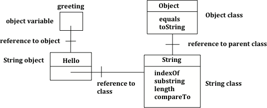
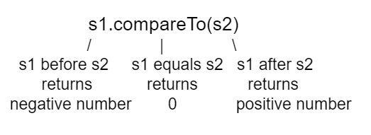

.. include:: ../common.rst

.. qnum::
   :prefix: 1-15-
   :start: 1

|Time90|

Strings
========

.. index::
   single: String
   single: object reference
   single: reference
   pair: String; definition

**Strings** in Java are objects of the ``String`` class. Strings represent sequences of characters and are used to store text like names, addresses, or messages.  The ``String`` class is part of the ``java.lang package`` which is available by default in all Java programs.

.. note::

   Class names in Java, like ``String``, begin with a capital letter.  All primitive types: ``int``, ``double``, and ``boolean``, begin with a lowercase letter.  This is one easy way to tell the difference between primitive types and class types.

String references
--------------------

.. activecode:: lcsb1
   :language: java
   :autograde: unittest

   Run the following code.  What does it print?
   ~~~~
   public class Test1
   {
       public static void main(String[] args)
       {
           String greeting = null;
           System.out.println(greeting);
       }
   }
   ====
   import static org.junit.Assert.*;

   import org.junit.*;

   import java.io.*;

   public class RunestoneTests extends CodeTestHelper
   {
       @Test
       public void testMain() throws IOException
       {
           String output = getMethodOutput("main");
           String expect = "null";
           boolean passed = getResults(expect, output, "Expected output from main", true);
           assertTrue(passed);
       }
   }

The code above declares an object variable named ``greeting`` and sets the value of greeting to the Java keyword ``null`` to show that it doesn't refer to any object yet.  So ``System.out.println(greeting);`` will print ``null``.

Object variables **refer** to objects in memory.  A reference is a way to find the actual object, like adding a contact to your phone lets you reach someone without knowing exactly where they are.  The value of greeting is null since the string object has not been created yet.

    Figure 1: Initial value for an object reference

.. index::
   pair: String; creation

In Java there are two ways to create an object of the ``String`` class.  You can use the ``new`` keyword followed by a space and then the class constructor and then in parentheses you can include values used to initialize the fields of the object.  This is the standard way to create a new object of a class in Java.

.. code-block:: java

   String greeting = new String("Hello");

.. index::
    single: String literal
    pair: String; literal

In Java you can also use just a **string literal**, which is a set of characters enclosed in double quotes (``"``), to create a ``String`` object.

.. code-block:: java

   String greeting = "Hello";

In both cases an object of the ``String`` class will be created in memory and the value of the variable greeting will be set to an object reference, a way to find that object.

|CodingEx| **Coding Exercise:**

.. activecode:: lcsbnew
   :language: java
   :autograde: unittest

   The code below creates two greeting strings: one using a string literal and the other using new and the String constructor. Change the code to add 2 new strings called firstName and lastName, one using a string literal and the other using new, and print them out with the greetings.
   ~~~~
   public class StringTest
   {
       public static void main(String[] args)
       {
           String greeting1 = "Hello!";
           String greeting2 = new String("Welcome!");
           System.out.println(greeting1);
           System.out.println(greeting2);
       }
   }

    ====
    import static org.junit.Assert.*;

    import org.junit.*;

    import java.io.*;

    public class RunestoneTests extends CodeTestHelper
    {
        @Test
        public void testChangedCode()
        {
            String origCode =
                    "public class StringTest {      public static void main(String[] args)      {"
                            + " String greeting1 = \"Hello!\";        String greeting2 = new"
                            + " String(\"Welcome!\"); System.out.println(greeting1);"
                            + " System.out.println(greeting2); }    }";
            boolean changed = codeChanged(origCode);
            assertTrue(changed);
        }
    }

.. activecode:: lcsb2
   :language: java
   :autograde: unittest

   Now that greeting refers to an actual object we can ask the object what class created it. Try the following.  What does it print?
   ~~~~
   public class Test2
   {
       public static void main(String[] args)
       {
           String greeting = "Hello";
           Class currClass = greeting.getClass();
           System.out.println(currClass);
           Class parentClass = currClass.getSuperclass();
           System.out.println(parentClass);
       }
   }

   ====
   import static org.junit.Assert.*;

   import org.junit.*;

   import java.io.*;

   public class RunestoneTests extends CodeTestHelper
   {
       @Test
       public void testMain() throws IOException
       {
           String output = getMethodOutput("main");
           String expect = "class java.lang.String\nclass java.lang.Object";
           boolean passed = getResults(expect, output, "Expected output from main", true);
           assertTrue(passed);
       }
   }

.. index::
   single: parent class
   single: superclass
   single: inheritance
   single: package
   single: java.lang
   pair: package; java.lang

The code above will first print class ``java.lang.String`` since ``greeting`` was created by the ``String`` class.  The full name for the ``String`` class is ``java.lang.String``.  The ``java.lang`` part is the **package** name.  Every class in the Java language is in a package and the standard classes like ``String`` are in the ``java.lang`` package.  Every object in Java knows the class that created it.  Also, every class knows its **parent** class.  Yes, a class can have a parent class, just as people have parents.  But, in Java a class can only have one parent.  A class can ``inherit`` object fields and methods from a parent class, just like you might inherit musical ability from a parent.  The last print statement will print ``class java.lang.Object`` because the parent class (**superclass**) of the String class is the Object class.  All classes in Java inherit from the Object class at some point in their ancestry.

    Figure 2: Object variable of type String with a reference to a String object which has a reference to the String class which has a reference to the Object class.

String Operators - Concatenation
---------------------------------

.. index::
   pair: String; append

``String``\ s can be added to each other to create a new string using the ``+``
or ``+=`` operator . This is also called **concatenation**. You
can also add any other kind of value to a ``String`` with ``+`` or ``+=`` and
the other value will be converted to a ``String`` automatically. 

A String object is **immutable**, meaning once a String object is created, its attributes cannot be changed. So when we add two ``String``\ s (or a ``String`` and another
value converted to a ``String``) we get a new ``String`` without making any
change to the values being added together just like when we add the ints `1 + 2` the
original `1` and `2` aren't changed. When we use ``+=`` we are making a new
``String`` by adding something to the current value of a variable and then
assigning that new value back into the variable, again just like with numbers.

.. activecode:: lcso1
   :language: java
   :autograde: unittest
   :practice: T

   Try the following code. Add another variable for a lastname that is "Hernandez". Use += or + to add the lastname variable after name to the result. Use += or + to add 2 more exclamation points (!) to the end of the happy birthday greeting in result.
   ~~~~
   public class Test1
   {
       public static void main(String[] args)
       {
           String start = "Happy Birthday";
           String name = "Jose";
           String result = start + " " + name; // add together strings
           result += "!"; // add on to the same string
           System.out.println(result);
       }
   }

   ====
   import static org.junit.Assert.*;

   import org.junit.*;

   import java.io.*;

   public class RunestoneTests extends CodeTestHelper
   {
       @Test
       public void testMain() throws IOException
       {
           String output = getMethodOutput("main");
           String expect = "Happy Birthday Jose Hernandez!!!";
           boolean passed = getResults(expect, output, "Expected output from main");
           assertTrue(passed);
       }
   }

.. note::
   Note that spaces are not added between strings automatically.  If you want a space between two strings then add one using + " " +. If you forget to add spaces, you will get smushed output like "HiJose" instead of "Hi Jose".  And remember that variables are never put inside the quotes ("") since this would print the variable name out letter by letter instead of its value.

|Exercise| **Check Your Understanding**

.. mchoice:: qse_1
   :practice: T
   :answer_a: xyz
   :answer_b: xyxyz
   :answer_c: xy xy z
   :answer_d: xy z
   :answer_e: z
   :correct: b
   :feedback_a: s1 will equal "xy" plus another "xy" then z at the end.
   :feedback_b: s1 contains the original value, plus itself, plus "z"
   :feedback_c: No spaces are added during concatenation.
   :feedback_d: No spaces are added during concatenation, and an additional "xy" should be included at the beginning.
   :feedback_e: s1 was set to "xy" initially, so the final answer will be "xyxyz"

   Given the following code segment, what is in the string referenced by s1?

   .. code-block:: java

     String s1 = "xy";
     String s2 = s1;
     s1 = s1 + s2 + "z";

.. index::
   single: toString
   pair: Object; toString

You can even add other items to a ``String`` using the ``+`` operator. Primitive
values like ``int`` and ``boolean`` will be converted to a ``String`` automatically when concatenated with a ``String``.  Any other objects concatenated with a ``String`` will be converted to ``String`` using their
``toString`` method. All objects inherit a
``toString`` method from the ``Object`` class that returns a ``String`` representation of the object and many classes **override** it to produce a useful human-readable value. Method overriding occurs when a public method in a subclass has the same method signature as a public method in the superclass, but the behavior of the method is specific to the subclass (overriding toString is no longer covered on the AP CSA exam). 

|CodingEx| **Coding Exercise:**

.. activecode:: lcso2
   :language: java
   :autograde: unittest

   What do you think the following will print? Guess before you hit run. If you want the addition to take place before the numbers are turned into a string what should you do? Try to modify the code  so that it adds 4 + 3 before appending the value to the string. Hint: you used this to do addition before multiplication in arithmetic expressions.
   ~~~~
   public class Test2
   {
       public static void main(String[] args)
       {
           String message = "12" + 4 + 3;
           System.out.println(message);
       }
   }

   ====
   import static org.junit.Assert.*;

   import org.junit.*;

   import java.io.*;

   public class RunestoneTests extends CodeTestHelper
   {
       @Test
       public void testMain() throws IOException
       {
           String output = getMethodOutput("main");
           String expect = "127";
           boolean passed = getResults(expect, output, "Expected output from main");
           assertTrue(passed);
       }

       @Test
       public void testParen() throws IOException
       {
           String code = removeSpaces(getCodeWithoutComments());
           String expect = "(4+3)";
           boolean passed = code.contains(expect);

           passed = getResults("" + true, "" + passed, "Checking code for added parentheses");
           assertTrue(passed);
       }
   }

.. note::
   If you are appending a number to a string it will be converted to a string first before being appended.

Since the same operators are processed from left to right this will print ``1243``.  First 4 will be turned into a string and appended to 12 and then 3 will be turned into a string and appended to 124.  If you want to do addition instead, try using parentheses!

.. |AP CSA Reference Sheet| raw:: html

   <a href="https://apstudents.collegeboard.org/ap/pdf/ap-computer-science-a-java-quick-reference_0.pdf" target="_blank">AP CSA Java Quick Reference Sheet</a>

String Index and Length
------------------------

.. index::
    pair: String; length
    pair: String; substring
    pair: String; indexOf
    pair: String; compareTo
    pair: String; equals
    pair: String; methods

A string holds characters in a sequence.  Each character is at a position or **index** which starts with 0 as shown below.  An **index** is a number associated with a position in a string.  The length of a string is the number of characters in it including any spaces or special characters.  The string below has a length of 14.

.. figure:: Figures/stringIndicies.png
    :width: 500px
    :align: center
    :alt: a string with the position (index) shown above each character
    :figclass: align-center

    Figure 3: A string with the position (index) shown above each character

.. note::

   The first character in a string is at index 0 and the last characters is at **length** -1. Attempting to access indices outside this range will result in an **IndexOutOfBoundsException**.

String Methods
---------------

The ``String`` class includes many methods to process strings. For the AP CSA exam, you only need to know how to use the following String methods. Their descriptions are included in the |AP CSA Reference Sheet| that you get during the exam so you don't have to memorize these.

    -  **int length()** method returns the number of characters in the string, including spaces and special characters like punctuation.

    -  **String substring(int from, int to)** method returns a new string with the characters in the current string starting with the character at the ``from`` index and ending at the character *before* the ``to`` index (if the ``to`` index is specified, and if not specified it will contain the rest of the string).

    -  **int indexOf(String str)** method searches for the string ``str`` in the current string and returns the index of the beginning of ``str`` in the current string or -1 if it isn't found.

    -  **int compareTo(String other)** returns a negative value if the current string is less than the ``other`` string alphabetically, 0 if they have the same characters in the same order, and a positive value if the current string is greater than the ``other`` string alphabetically.

    -  **boolean equals(String other)** returns true when the characters in the current string are the same as the ones in the ``other`` string.  This method is inherited from the Object class, but is **overridden** which means that the String class has its own version of that method.

String Methods: length, substring, indexOf
-------------------------------------------

Run the code below to see the output from the String methods ``length``, ``substring``, and ``indexOf``. The length method returns the number of characters in the string, not the last index which is length -1. The ``str.substring(from,to)`` method returns the substring from the ``from`` index up to (but not including) the ``to`` index. The method ``str.indexOf(substring)`` searches for the substring in str and returns the index of where it finds substring in str or -1 if it is not there.

.. activecode:: lcsm1
   :language: java
   :autograde: unittest

   This code shows the output from String methods length, substring, and indexOf. How many letters does substring(0,3) return? What does indexOf return when its argument is not found?
   ~~~~
   public class Test1
   {
       public static void main(String[] args)
       {
           String message1 = "This is a test";
           String message2 = "Hello Class";

           System.out.println(message1.length());
           System.out.println(message2.length());

           System.out.println(message1.substring(0, 3));
           System.out.println(message1.substring(2, 3));
           System.out.println(message1.substring(5));

           System.out.println(
                   message1.indexOf("is")); // This will match the is in "This"!
           System.out.println(message1.indexOf("Hello"));
           System.out.println(message2.indexOf("Hello"));

           // lowercase and uppercase are not on the AP exam, but still useful
           System.out.println(message2.toLowerCase());
           System.out.println(message2.toUpperCase());
       }
   }

   ====
   import static org.junit.Assert.*;

   import org.junit.*;

   import java.io.*;

   public class RunestoneTests extends CodeTestHelper
   {
       @Test
       public void testMain() throws IOException
       {
           String output = getMethodOutput("main").trim();
           boolean passed = getResults(output, output, "Expected output from main", true);
           assertTrue(passed);
       }
   }

.. note::

   Remember that substring(from,to) does not include the character at the ``to`` index! To return a single character at index i, use ``str.substring(i, i + 1)``. 

|CodingEx| **Coding Exercise**

.. activecode:: substring-preconditions
    :language: java
    :autograde: unittest

    The following code breaks the preconditions of the substring method and throws an IndexOutOfBoundsException. Can you fix the code by changing the arguments for the substring method to print out the substring "o"? 
    ~~~~
    public class SubstringPreconditions
    {
        public static void main(String[] args)
        {
            String str = "hello";
            System.out.println(str.substring(-1, 10));
        }
    }

    ====
    import static org.junit.Assert.*;

    import org.junit.*;

    import java.io.*;

    public class RunestoneTests extends CodeTestHelper
    {
        public RunestoneTests()
        {
            super("SubstringPreconditions");
        }

        @Test
        public void testMain() throws IOException
        {
            String output = getMethodOutput("main");
            String expect = "o";
            boolean passed = getResults(expect, output, "Expected output from main");
            assertTrue(passed);
        }
    }

    
|Exercise| **Check your understanding**

.. mchoice:: qsb_3
   :practice: T
   :answer_a: 2
   :answer_b: 1
   :answer_c: 4
   :answer_d: -1
   :correct: b
   :feedback_a: The first character is at index 0 in a string.
   :feedback_b: The method indexOf returns the first position of the passed str in the current string starting from the left (from 0).
   :feedback_c: Does indexOf start from the left or right?
   :feedback_d: Does the string contain a b?

   What is the value of pos after the following code executes?

   .. code-block:: java

     String s1 = "abccba";
     int pos = s1.indexOf("b");

.. mchoice:: qsb_3b
   :practice: T
   :answer_a: 2
   :answer_b: 3
   :answer_c: 4
   :answer_d: -1
   :correct: c
   :feedback_a: Length returns the number of characters in the string, not the number of characters in the name of the string.
   :feedback_b: The position of the last character is 3, but the length is 4.
   :feedback_c: Length returns the number of characters in the string.
   :feedback_d: Length is never negative.

   What is the value of len after the following code executes?

   .. code-block:: java

     String s1 = "baby";
     int len = s1.length();

.. mchoice:: qsb_3c
   :practice: T
   :answer_a: baby
   :answer_b: b
   :answer_c: ba
   :answer_d: bab
   :correct: d
   :feedback_a: This would be true if substring returned all the characters from the first index to the last inclusive, but it does not include the character at the last index.
   :feedback_b: This would be true if it was s1.substring(0,1)
   :feedback_c: This would be true if it was s1.substring(0,2)
   :feedback_d: Substring returns all the characters from the starting index to the last index -1.

   What is the value of s2 after the following code executes?

   .. code-block:: java

     String s1 = "baby";
     String s2 = s1.substring(0,3);

.. mchoice:: qsb_4b
   :practice: T
   :answer_a: by
   :answer_b: aby
   :answer_c: a
   :answer_d: b
   :answer_e: ba
   :correct: a
   :feedback_a: The method substring(index) will return all characters starting the index to the end of the string.
   :feedback_b: This would be true if it was substring(1);
   :feedback_c: This would be true if it was substring(1,2);
   :feedback_d: This would be true if it was substring(2,3);
   :feedback_e: This would be ture if it was substring(0,2);

   What is the value of s2 after the following code executes?

   .. code-block:: java

     String s1 = "baby";
     String s2 = s1.substring(2);

CompareTo and Equals
-----------------------

We can compare primitive types like int and double using operators like ``==`` and ``<`` or ``>``, which you will learn about in the next unit. However, with reference types like String, you must use the methods ``equals`` and ``compareTo``, not ``==`` or ``<`` or ``>``.

The method ``compareTo`` compares two strings character by character. If they are equal, it returns 0. If the first string is alphabetically ordered before the second string (which is the argument of ``compareTo``), it returns a negative number. And if the first string is alphabetically ordered after the second string, it returns a positive number. (The actual number that it returns does not matter, but it is the distance in the first letter that is different, e.g. A is 7 letters away from H.)

    Figure 4: compareTo returns a negative or positive value or 0 based on alphabetical order

The ``equals`` method compares the two strings character by character and returns ``true`` or ``false``. Both ``compareTo`` and ``equals`` are case-sensitive. There are case-insensitive versions of these methods, ``compareToIgnoreCase`` and ``equalsIgnoreCase``, which are not on the AP exam.

Run the example below to see the output from ``compareTo`` and ``equals``. Since ``"Hello!"`` would be alphabetically ordered after ``"And"``, ``compareTo`` returns a positive number. Since ``"Hello!"`` would be alphabetically ordered before ``"Zoo"``, ``compareTo`` returns a negative number.  Notice that ``equals`` is case-sensitive.

.. activecode:: lcsm2
   :language: java
   :autograde: unittest

   Run the code to see how the String methods equals and compareTo work. Is equals case-sensitive? When does compareTo return a negative number?
   ~~~~
   public class Test2
   {
       public static void main(String[] args)
       {
           String message = "Hello!";

           System.out.println(message.compareTo("Hello!"));
           System.out.println(message.compareTo("And"));
           System.out.println(message.compareTo("Zoo"));

           System.out.println(message.equals("Hello!"));
           System.out.println(message.equals("hello!"));
       }
   }

   ====
   import static org.junit.Assert.*;

   import org.junit.*;

   import java.io.*;

   public class RunestoneTests extends CodeTestHelper
   {
       @Test
       public void testMain() throws IOException
       {
           String output = getMethodOutput("main");
           String expect = "0\n7\n-18\ntrue\nfalse";
           boolean passed = getResults(expect, output, "Expected output from main", true);
           assertTrue(passed);
       }
   }

.. |String class| raw:: html

   <a href="http://docs.oracle.com/javase/7/docs/api/java/lang/String.html" target="_blank">String class</a>

There are lots of other methods in the String class.  You can look through the Java documentation for the |String class| online.   You don't have to know all of these for the exam, but you can use them if you want to on the exam.

|Exercise| **Check your understanding**

.. dragndrop:: ch4_str1
    :feedback: Review the vocabulary.
    :match_1: the position of a character in a string|||index
    :match_2: a new string that is a part of another string with 0 to all characters copied from the original string|||substring
    :match_3: doesn't change|||immutable
    :match_4: the number of characters in a string|||length

    Drag the definition from the left and drop it on the correct concept on the right.  Click the "Check Me" button to see if you are correct

.. dragndrop:: ch4_str2
    :feedback: Review the vocabulary.
    :match_1: Returns true if the characters in two strings are the same|||equals
    :match_2: Returns the position of one string in another or -1|||indexOf
    :match_3: Returns a number to indicate if one string is less than, equal to, or greater than another|||compareTo
    :match_4: Returns a string representing the object that is passed to this method|||toString

    Drag the definition from the left and drop it on the correct method on the right.  Click the "Check Me" button to see if you are correct.

.. mchoice:: qsb_8-new
   :practice: T
   :answer_a: positive (> 0)
   :answer_b: 0
   :answer_c: negative (< 0)
   :correct: a
   :feedback_a: H is after B in the alphabet so s1 is greater than s2.
   :feedback_b: The method compareTo will only return 0 if the strings have the same characters in the same order.
   :feedback_c: This would be true if it was s2.compareTo(s1)

   What is the value of answer after the following code executes?

   .. code-block:: java

     String s1 = "Hi";
     String s2 = "Bye";
     int answer = s1.compareTo(s2);

Common Mistakes with Strings
-------------------------------

The following code shows some common mistakes with strings.

.. activecode:: stringMistakes
   :language: java
   :practice: T
   :autograde: unittest

   This code contains some common mistakes with strings. Fix the code to use the string methods correctly.
   ~~~~
   public class StringMistakes
   {
       public static void main(String[] args)
       {
           String str1 = "Hello!";

           // Print out the first letter?
           System.out.println(
                   "The first letter in " + str1 + ":" + str1.substring(1, 1));

           // Print out the last character?
           System.out.println(
                   "The last char. in " + str1 + ":" + str1.substring(8));

           // Print str1 in lower case? Will str1 change?
           str1.toLowerCase();
           System.out.println("In lowercase: " + str1);
       }
   }

   ====
   import static org.junit.Assert.*;

   import org.junit.*;

   import java.io.*;

   public class RunestoneTests extends CodeTestHelper
   {
       @Test
       public void testMain() throws IOException
       {
           String output = getMethodOutput("main").trim();
           String expect =
                   "The first letter in Hello!:H\nThe last char. in Hello!:!\nIn lowercase: hello!";
           boolean passed = output.contains(expect);

           getResults(expect, output, "Expected output from main", passed);
           assertTrue(passed);
       }
   }

Here is a list of common mistakes made with Strings.

  -  Thinking that substrings include the character at the last index when they don't.

  -  Thinking that strings can change when they can't.  They are immutable.

  - Trying to access part of a string that is not between index 0 and length -1. This will throw an IndexOutOfBoundsException.

  -  Trying to call a method like ``indexOf`` on a string reference that is null.  You will get a null pointer exception.

  -  Using ``==`` to test if two strings are equal.  This is actually a test to see if they refer to the same object.  Usually you only want to know if they have the same characters in the same order.  In that case you should use ``equals`` or ``compareTo`` instead.
  -  Treating upper and lower case characters the same in Java.  If ``s1 = "Hi"`` and ``s2 = "hi"`` then ``s1.equals(s2)`` is false.

|Groupwork| Coding Challenge : Pig Latin
----------------------------------------------

|pig| Can you speak Pig Latin? In Pig Latin, you take the first letter and put it at the end of the word and add the letters "ay" to the end. For example, "pig" becomes "igpay".

Create a program that takes a word and transforms it to Pig Latin using String methods. You may need the word's length, a substring that does not include the first letter, and a substring that is just the first letter (you can get the ith letter of a string using substring(i,i+1) so for example the letter at index 3 would be substring(3,4)).

Your teacher may ask you to create this program in a Java IDE that can use input to read in the word, for example in `JuiceMind IDE <https://play.juicemind.com/csawesome2/challenge-PigLatin>`_ using the Scanner class.

.. activecode:: challenge-PigLatin
   :language: java
   :practice: T
   :autograde: unittest
   :stdin: pig

   Write code in the pigLatin method below to use the substring method to transform a word given as its argument into Pig Latin where the first letter is put at the end and "ay" is added. The word pig is igpay in Pig Latin. Change the input below to try it on other words.
   ~~~~
   import java.util.Scanner;

   public class PigLatin
   {
      public static String pigLatin(String word)
      {
          // Change this to use word.substring to construct 
          // the pig latin version of word
          String pigLatin = word;

          return pigLatin;
      } 

      public static void main(String[] args)
      {
          // Do not change main! 
          // Write your code in the pigLatin method above.
          Scanner scan = new Scanner(System.in);
          String word = scan.nextLine();
          System.out.println(word + " in Pig Latin is " + pigLatin(word) );
          scan.close();
      }
   }
   ====
   import static org.junit.Assert.*;

   import org.junit.*;

   import java.io.*;

   public class RunestoneTests extends CodeTestHelper
   {   
       @Test
       public void testMethod() throws IOException
       {
           Object[] args = {"java"};
           String output = getMethodOutput("pigLatin", args);
           String expect = "avajay";
           boolean passed = getResults(expect, output, 
				"pigLatin(\"java\") should return \"avajay\"");
           assertTrue(passed);
       }
       @Test
       public void testMethod2() throws IOException
       {
           Object[] args = {"pig"};
           String output = getMethodOutput("pigLatin", args);
           String expect = "igpay";
           boolean passed = getResults(expect, output, 
				"pigLatin(\"pig\") should return \"igpay\"");
           assertTrue(passed);
       }
       @Test
       public void testContainsSubstring()
       {
           String target = "word.substring(";
           int count = countOccurences(getCode(), target);
           boolean passed = count >= 2;
           passed =
                   getResults(
                           "2 substring calls",
                           count + " substring call(s)",
                           "Code contains calls to substring method",
                           passed);
           assertTrue(passed);
       }
   }

Summary
-------------------

- (AP 1.15.A.1) A ``String`` object represents a sequence of characters and can be created by using a string literal.

- (AP 1.15.A.2) The ``String`` class is part of the ``java.lang`` package. Classes in the ``java.lang`` package are available by default.

- String objects can be created by using string literals (String s = "hi";) or by calling the String class constructor (String t = new String("bye");).

- (AP 1.15.A.3) A String object is **immutable**, meaning once a String object is created, its attributes cannot be changed. Methods called on a String object do not change the content of the String object.

- (AP 1.15.A.4) Two String objects can be concatenated together or combined using the + or += operator, resulting in a new String object. 

- (AP 1.15.A.4) A primitive value can be concatenated with a String object. This causes the implicit conversion of the primitive value to a String object.

- (AP 1.15.A.5) A String object can be concatenated with any object, which implicitly calls the object’s ``toString`` method (a behavior which is guaranteed to exist by the inheritance relationship every class has with the Object class). An object’s ``toString`` method returns a string value representing the object. Subclasses of Object often **override** the toString method with class-specific implementation. Method overriding occurs when a public method in a subclass has the same method signature as a public method in the superclass, but the behavior of the method is specific to the subclass. Overriding the ``toString`` method of a class is outside the scope of the AP CSA exam.

- **index** - A number that represents the position of a character in a string.  The first character in a string is at index 0.
- **length** - The number of characters in a string.
- **substring** - A new string that contains a copy of part of the original string.

- (AP 1.15.B.1) A String object has index values from 0 to one less than the length of the string. Attempting to access indices outside this range will result in an ``IndexOutOfBoundsException``.

- (AP 1.15.B.2) The following String methods and constructors, including what they do and when they are used, are part of the |AP CSA Reference Sheet| that you can use during the exam:

  - **String(String str)** : Constructs a new String object that represents the same sequence of characters as str.

  - **int length()** : returns the number of characters in a String object.

  - **String substring(int from, int to)** : returns the substring beginning at index from  and ending at index (to -1).

  - **String substring(int from)** : returns substring(from, length()).

  - **int indexOf(String str)** : searches for str in the current string and returns the index of the first occurrence of str; returns -1 if not found.

  - **boolean equals(String other)** : returns true if this (the calling object) is equal to other; returns false otherwise. Using the equals method to compare one String object with an object of a type other than String is outside the scope of the AP CSA exam.

  - **int compareTo(String other)** : returns a value < 0 if this is less than other; returns zero if this is equal to other; returns a value > 0 if this is greater than other. Strings are ordered based upon the alphabet.

- ``str.substring(index, index + 1)`` returns a single character at index in string ``str``.

AP Practice
-------------

.. mchoice:: AP-substring
   :practice: T
   :answer_a: hi th
   :answer_b: hi the
   :answer_c: hi ther
   :answer_d: hi there
   :correct: a
   :feedback_a: The substring method returns the string starting at the first index and not including the last index.  The method indexOf returns the index of the first place the string occurs.
   :feedback_b: This would be correct if substring returned all characters between the first index and last index, but does it?
   :feedback_c: This would be correct if indexOf returned the last position the string str was found in the current string, does it?
   :feedback_d: This would be correct if indexOf returned the last position the string str was found in the current string and if substring included all characters between the start and end index.  Check both of these.

   What is the value of s2 after the following code executes?

   .. code-block:: java

     String s1 = new String("hi there");
     int pos = s1.indexOf("e");
     String s2 = s1.substring(0,pos);

.. mchoice:: AP-immutable
   :practice: T
   :answer_a: Hi
   :answer_b: hi
   :answer_c: H
   :answer_d: h
   :correct: a
   :feedback_a: Strings are immutable, meaning they don't change.  Any method that changes a string returns a new string.  So s1 never changes.
   :feedback_b: This would be true if the question was what is the value of s2 and it was substring(0,2) not (0,1)
   :feedback_c: This would be true if the question was what is the value of s2, not s1.
   :feedback_d: This would be true if the question was what is the value of s3, not s1.

   What is the value of s1 after the following code executes?

   .. code-block:: java

     String s1 = "Hi";
     String s2 = s1.substring(0,1);
     String s3 = s2.toLowerCase();

.. note::

   Strings are **immutable** which means that they can't change. Anything that you do to modify a string (like creating a substring or appending strings) returns a new string. The original string is not changed.  

String Methods Game
---------------------------

.. |game| raw:: html

   <a href="https://csa-games.netlify.app/" target="_blank">game</a>

Try the game below written by AP CSA teacher Chandan Sarkar. Click on **Strings** and then on the letters that would be the result of the string method calls. We encourage you to work in pairs and see how high a score you can get.

.. raw:: html

    <iframe height="700px" width="100%" style="margin-left:10%;max-width:80%" src="https://csa-games.netlify.app/"></iframe>
    

Review/Practice for Unit 1 Part 3 on Using Objects
----------------------------------------------------

|Time90|

This lesson ends the section on Unit 1 part 3 on Using Objects. 
You can now do the following review and practice lessons at the end of the unit
and College Board Progress Check for Unit 1 Part 3 in the AP Classroom.  

.. raw:: html

   <ul>
    <li><a href="unit1b-summary.html" target="_blank">Unit 1b Summary</a></li>
    <li><a href="unit1b-practice-mixed-code.html" target="_blank">Unit 1b Practice Mixed Code</a></li>
    <li><a href="unit1b-practice-mixed-code-toggle.html" target="_blank">Unit 1b Practice Mixed Code Toggle</a></li>
    <li><a href="unit1b-practice-coding.html" target="_blank">Unit 1b Practice Coding</a></li>
    <li><a href="Exercises-objects.html" target="_blank">Exercises on Objects</a></li>
    <li><a href="practice-test-objects.html" target="_blank">Practice Test on Objects</a></li>
    <li><a href="JavaSwingGUIs.html" target="_blank">Optional Java Swing GUIs</a></li>
    <li><a href="frq-practice.html" target="_blank">Unit 1 FRQ Practice</a></li>
   </ul> 
