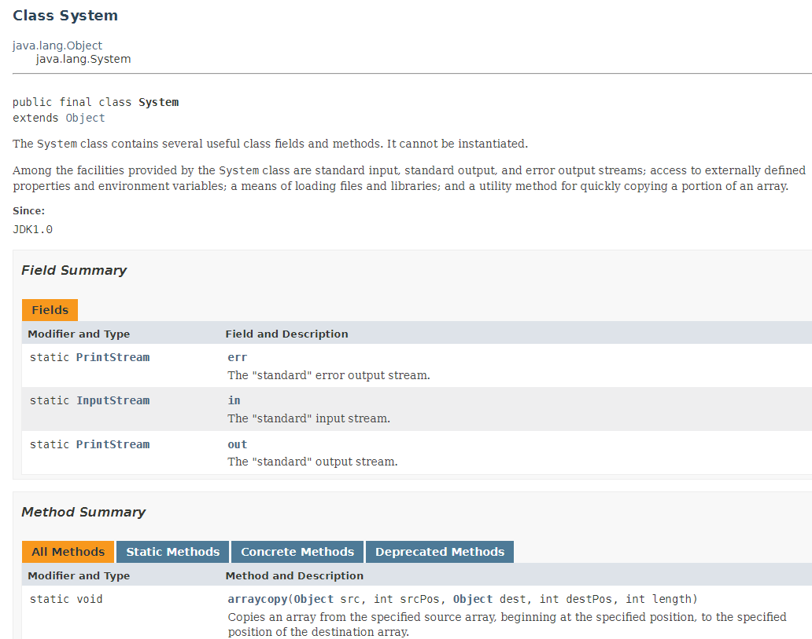

.. include:: ../common.rst

|Time45|

APIs and Libraries
=====================================

We have been using the ``System.out.println()`` method to print to the screen. This method is part of the Java **API (Application Programming Interface)**. A **method** is a block of code that performs a specific task. APIs are connected to **libraries** which are collections of classes written by other programmers that provide a set of methods that can be used to perform specific tasks. An API specification tells the programmer how to use those classes in a library. 

APIs and libraries are essential to programming because they allow you to use code that has already been written by others. This saves you time and allows you to focus on the specific task you are trying to accomplish.

Classes in the APIs and libraries are grouped into packages. A **package** is a collection of related classes and interfaces (which are similar to classes) that can be **imported** into a program to be used. A package is like a folder in a library's file directory and is used to avoid name conflicts. Later on, we will learn to ``import`` other Java packages to use in our code, but there is a package that is already built into Java called ``java.lang``. 

The ``java.lang`` package contains built-in classes and interfaces that are fundamental to the Java programming language, such as the ``String`` class and the ``System`` class. Take a look at the documentation for the ``java.lang`` package at https://docs.oracle.com/javase/8/docs/api/java/lang/package-summary.html. Can you find the ``System`` class in the documentation?

**Documentation** found in API specifications and libraries is essential to understanding the attributes and behaviors of a class defined by the API. Let's take a look at the ``System`` class documentation at https://docs.oracle.com/javase/8/docs/api/java/lang/System.html.

The ``System`` class is part of the ``java.lang`` package in the Java API, and it has a number of methods that allow you to interact with your computer's operating system.
**Classes** are the building blocks of Java and object-oriented programming. A class defines a specific reference type. Existing classes and class libraries can be utilized to create objects. Let's look again at the documentation for the ``System`` class below. It is divided into Fields and Methods. 

**Attributes** (or **fields**) refer to the data related to the class and are stored in variables. **Behaviors** refer to what instances of the class can do (or what can be done with it) and are defined by methods. We will learn more about these in the next lessons.

The ``System`` class has three fields/attributes: ``in``, ``out``, and ``err``. The ``out`` attribute is the output stream we use in ``System.out.println()`` and an instance of the ``PrintStream`` class, documented at https://docs.oracle.com/javase/8/docs/api/java/io/PrintStream.html. The ``PrintStream`` class has the method ``println()`` that we use to print to the screen. How many ``println()`` methods are there in the PrintStream class?  One for each type that it can print!

How can you tell attributes and methods apart when you look at library documentation? One easy way is that methods will always have parentheses after them, for example ``println()``, where you can put in the information (the arguments) that it needs to do its job. Attributes are variables and will not have parentheses after them. In later lessons, you will learn more about arguments and return values of methods, and you will learn to write your own classes and methods.

|Groupwork| Challenge  
------------------------

Work in pairs (or independently if instructed by your teacher) to answer the following questions about APIs and libraries referring to https://docs.oracle.com/javase/8/docs/api/java/lang/System.html and https://docs.oracle.com/javase/8/docs/api/java/io/PrintStream.html. Make sure that you can identify the attributes and behaviors of a class found in the libraries contained in an API.

|Exercise| **Check Your Understanding**

.. dragndrop:: API_vocab_match
    :feedback: Review the summaries above.
    :match_1: A collection of classes written by other programmers|||library
    :match_2: A collection of related classes and interfaces that can be imported into your code|||package
    :match_3: A specification that tells the programmer how to use classes in a library|||API
    :match_4: The building blocks of Java and object-oriented programming that create a reference type|||class
    :match_5: A block of code that performs a specific task|||method
    :match_6: Data related to the class stored in variables|||attribute

    Drag the definition from the left and drop it on the correct concept on the right. Click the "Check Me" button to see if you are correct.

.. mchoice:: built_in_package
    :answer_a: java.util
    :answer_b: java.io
    :answer_c: java.lang
    :answer_d: java.net
    :correct: c
    :feedback_a: Incorrect. java.util is not built into Java.
    :feedback_b: Incorrect. java.io is not built into Java.
    :feedback_c: Correct! java.lang is built into Java.
    :feedback_d: Incorrect. java.net is not built into Java.

    Which package is already built into Java and does not need to be imported?

.. mchoice:: system_class
    :answer_a: String
    :answer_b: System
    :answer_c: PrintStream
    :answer_d: Scanner
    :correct: b
    :feedback_a: Incorrect. The String class does not have methods to interact with the operating system.
    :feedback_b: Correct! The System class has methods to interact with the operating system.
    :feedback_c: Incorrect. The PrintStream class does not have methods to interact with the operating system.
    :feedback_d: Incorrect. The Scanner class does not have methods to interact with the operating system.

    Which class in the java.lang package has methods to interact with the computer's operating system?

.. mchoice:: example_method
    :answer_a: System
    :answer_b: String
    :answer_c: java.lang
    :answer_d: println()
    :correct: d
    :feedback_a: Incorrect. System is not a method.
    :feedback_b: Incorrect. String is not a method.
    :feedback_c: Incorrect. java.lang is not a method.
    :feedback_d: Correct! println() is an example of a method.

    Which of the following is an example of a method in Java?

.. mchoice:: system_attributes
    :answer_a: in
    :answer_b: input
    :answer_c: print
    :answer_d: println
    :correct: a
    :feedback_d: Incorrect. println is a method, not an attribute.
    :feedback_b: Incorrect. input is not an attribute in the System class.
    :feedback_a: Correct! The System class has three fields: in, out, and err.
    :feedback_c: Incorrect. print is not an attribute in the System class.

    Which of the following is an attribute in the ``System`` class?

.. mchoice:: purpose_apis
    :answer_a: To write new code from scratch
    :answer_b: To use code written by others
    :answer_c: To create programming languages
    :answer_d: To compile code
    :correct: b
    :feedback_a: Incorrect. APIs and libraries allow you to use code written by others.
    :feedback_b: Correct! APIs and libraries are used to use code written by others.
    :feedback_c: Incorrect. APIs and libraries are not for creating programming languages.
    :feedback_d: Incorrect. APIs and libraries are not for compiling code.

    What is the purpose of APIs and libraries in programming?

.. mchoice:: attributes_class
    :answer_a: Methods that perform tasks
    :answer_b: Data related to the class stored in variables
    :answer_c: Interfaces related to the class
    :answer_d: Packages that contain the class
    :correct: b
    :feedback_a: Incorrect. Attributes (or fields) are not methods.
    :feedback_b: Correct! Attributes (or fields) are data related to the class stored in variables.
    :feedback_c: Incorrect. Attributes (or fields) are not interfaces.
    :feedback_d: Incorrect. Attributes (or fields) are not packages.

    What are attributes (or fields) in a class?

.. mchoice:: identify_attribute_method_1
    :answer_a: length()
    :answer_b: append()
    :answer_c: print()
    :answer_d: in
    :correct: d
    :feedback_a: Incorrect. length() is a method.
    :feedback_b: Incorrect. append() is a method.
    :feedback_c: Incorrect. print() is a method.
    :feedback_d: Correct! 'in' is an attribute.

    Which of the following is an attribute?

.. mchoice:: identify_method
    :answer_a: length
    :answer_b: print[]
    :answer_c: length()
    :answer_d: prints
    :correct: c
    :feedback_a: Incorrect. 'length' without parentheses is not a method.
    :feedback_b: Incorrect. [] is not used with methods.
    :feedback_c: Correct! length() is a method defined in the String class.
    :feedback_d: Incorrect. prints is not a method, although it is similar to print() which is a method.

    Which of the following is a method?

.. mchoice:: println_method_class
    :answer_a: System
    :answer_b: PrintStream
    :answer_c: String
    :answer_d: Scanner
    :correct: b
    :feedback_a: Incorrect. The System class contains the 'out' attribute, but the println() method is not directly in the System class.
    :feedback_b: Correct! The println() method is in the PrintStream class.
    :feedback_c: Incorrect. The println() method is not in the String class.
    :feedback_d: Incorrect. The println() method is not in the Scanner class.

    Which class is the ``println`` method in?

.. fillintheblank:: count-println
    
    How many ``println`` methods are there in the ``PrintStream`` class documented at https://docs.oracle.com/javase/8/docs/api/java/io/PrintStream.html?

    -   :10: Correct.  One for each type
        :.*: Only count the println methods, not print or printf

.. fillintheblank:: count-attributes
    
    How many attributes are there in the ``System`` class documented at https://docs.oracle.com/javase/8/docs/api/java/lang/System.html?

    -   :3: Correct: in, out, and err are the attributes or fields.
        :.*: Count what is under Fields which is another name for attributes.

Summary
-----------

- **Libraries** are collections of classes written by other programmers. 

- An **Application Programming Interface (API)** specification informs the programmer how to use classes in a library. 

- Documentation found in API specifications and libraries is essential to understanding the attributes and behaviors of a class defined by the API. 

- Classes in the APIs and libraries are grouped into **packages** that can be imported into a program. 

- A **class** defines a specific reference type and is the building block of object-oriented programming. Existing classes and class libraries can be utilized to create objects.

- **Attributes** refer to the data related to the class and are stored in variables. 

- **Behaviors** refer to what instances of the class can do (or what can be done with it) and are defined by methods.
