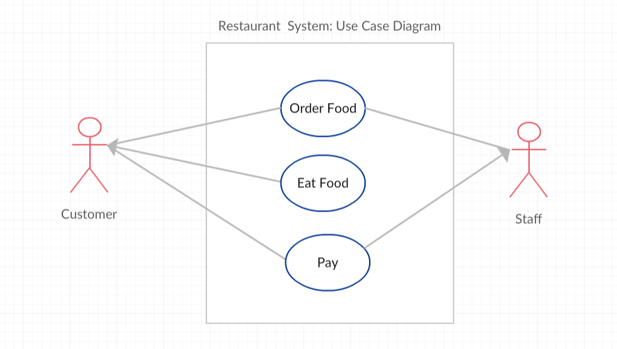

.. include:: ../common.rst

|Time45|

Documentation with Comments and Preconditions
==============================================

Comments
---------

Adding comments to your code helps to make it more readable and maintainable. In the commercial world, software development is usually a team effort where many programmers will use your code and maintain it for years. Commenting is essential in this kind of environment and a good habit to develop. Comments will also help you to remember what you were doing when you look back to your code a month or a year from now. Comments are written for both the original programmer and other programmers to understand the code and its functionality, but are ignored by the compiler and are not executed when the program is run. 

There are 3 types of comments in Java:

1. ``//`` Single line comment
2. ``/*`` Multiline block of comments ``*/``
3. ``/**`` Java documentation comments ``*/``

.. |Java JDK| raw:: html

   <a href="https://www.oracle.com/technetwork/java/javase/downloads/index.html" target="_blank">Java JDK</a>

.. |javadoc| raw:: html

   <a href="https://www.tutorialspoint.com/java/java_documentation.htm" target="_blank">javadoc</a>

.. |String class| raw:: html

   <a href="http://docs.oracle.com/javase/7/docs/api/java/lang/String.html" target="_blank">String class</a>

The special characters ``//`` are used to mark the rest of the line as a comment in many programming languages.  If the comment is going to be multiple lines, we use ``/*`` to start the comment and ``*/`` to end the comment.

There is also a special version of the multi-line comment, ``/**``  ``*/``, called the documentation comment. Java has a cool tool called |javadoc| that comes with the |Java JDK| that will pull out all of these comments to make documentation of a class as a web page.  This tool generates the official Java documentation too, for example for the |String class|. Although you do not have to use this in the AP exam, it's a good idea to use the documentation comment in front of classes, methods, and instance variables in case you want to use this tool later on to save your code as a library.

|Exercise| **Check your understanding**

.. dragndrop:: comments
    :feedback: Review the section above.
    :match_1: single-line comment|||//
    :match_2: multi-line comment|||/* */
    :match_3: Java documentation comment|||/** */

    Drag the definition from the left and drop it on the correct symbols on the right.  Click the "Check Me" button to see if you are correct.

The compiler will skip over comments, and they don't affect how your program runs. They are for you, your teacher, and other programmers working with you.  Here are some examples of good commenting:

.. code-block:: java

    /**
    * MyClass.java
    * @author My Name
    * @since Date
    * This class keeps track of the max score.
    */
    public class MyClass()
    {
       private int max = 10; // this keeps track of the max score
       /* The print() method prints out the max */
       public print() 
       {  
          System.out.println(max); 
       }
    }

Note that most IDEs will tend to show comments formatted in italics -- to make them easier to spot.

Notice that there are some special tags that you can use in Java documentation. These are not required but many programmers use them. Here are some common tags:

- @author  Author of the program
- @since   Date released
- @version Version of program
- @param   Parameter of a method
- @return  Return value for a method

Preconditions and Postconditions
----------------------------------

Many methods in API libraries have **preconditions** and the **postconditions** described in their comments. A **precondition** is a condition that must be true for your method code to work, for example the assumption that the parameters, the data that you give the method to do its job, have values within limits and are not null. The methods could check for these preconditions, but they do not have to. The precondition is what the method expects in order to do its job properly.

A **postcondition** is a condition that is true after running the method. It is what the method promises to do. Postconditions describe the outcome of running the method, for example what is being returned from the method or the changes to the state. These assumptions are very useful to other programmers who want to use that method and get the correct results.

One precondition that we talked about is that divisors cannot be zero in expressions because that will cause the code to have a runtime error or exception. Many math functions have preconditions about their operands. For example, computing the square root of a negative number is undefined, so the ``Math.sqrt(num)`` Java method which we will learn later will throw an exception (a runtime error) if num is negative. These are described as special cases in the API documentation, for example in https://docs.oracle.com/javase%2F8%2Fdocs%2Fapi%2F%2F/java/lang/Math.html#sqrt-double-. Try this out below.

|CodingEx| **Coding Exercise**

.. activecode:: math-preconditions
   :language: java
   :autograde: unittest

   The following code uses the square root method in Java which has a precondition that the number that you give it is not negative.  When you click on run, the compiler will not catch the error, but there will be a run-time error or exception.  Can you fix the value of num so that it does not throw an exception?  What is the precondition for the Math.sqrt method?
   ~~~~
   public class SqRoot
   {
      public static void main(String[] args)
      {
            double num = -4;
            System.out.println(Math.sqrt(num));
      }
   }
   ====
   import static org.junit.Assert.*;

   import org.junit.*;

   import java.io.*;

   public class RunestoneTests extends CodeTestHelper
   {
       @Test
       public void testMain() throws IOException
       {
           String target = "SqRoot";
           boolean passed = checkCodeContains("SqRoot", target);
           assertTrue(passed);
       }
   }

Here is an example of preconditions, postconditions, and @param in the Turtle code that we use for animating turtle drawings. The Turtle ``forward`` method's precondition is that the amount of ``pixels`` forward should be between 0 and the width and height of the world. If it receives value out of this range, it sets ``pixels`` to the closest legal values that it can so that the turtle appears just at the edge of the world. 

.. code-block:: java

       /**
         * Method to move the turtle forward the given number of pixels
         * @param pixels the number of pixels to walk forward in the heading direction
         * Preconditions: parameters pixel is between 0 and 
         *    the width and height of the world.
         * Postconditions: the turtle is moved forward by pixels amount 
         *   but stays within the width and height of the world. 
         */
        public void forward(int pixels)
        {
          /* code to move the turtle forward */
        }

.. |github| raw:: html

   <a href="https://github.com/bhoffman0/csawesome2/tree/main/_sources/Unit1-Using-Objects-and-Methods/TurtleJavaSwingCode.zip" target="_blank" style="text-decoration:underline">here</a>

.. |repl link| raw:: html

   <a href="https://replit.com/@BerylHoffman/Java-Swing-Turtle" target="_blank" style="text-decoration:underline">replit.com link</a>

|CodingEx| **Coding Exercise**

Try to break the preconditions of the ``Turtle forward`` method below. Try to make the turtle go completely off screen by changing the number of pixels given to the forward method. What happens if you put in negative numbers? 
(If the code below does not work for you, you can copy the code into  this |repl link| (refresh page after forking and if it gets stuck) or download the files |github| to use in your own IDE.)

.. activecode:: turtle-preconditions
    :language: java
    :autograde: unittest
    :datafile: turtleClasses.jar

    Try to break the preconditions of the Turtle forward method below. Can you make it go completely off screen by changing the number of pixels given to the forward method in line 13? What happens if you put in negative numbers?
    ~~~~
    import java.awt.*;
    import java.util.*;

    public class TurtlePreconditions
    {
        public static void main(String[] args)
        {
            World habitat = new World(300, 300);
            Turtle yertle = new Turtle(world);

            // Change 100 pixels below to a larger number
            //   to try to go off screen to break preconditions
            yertle.forward(100);
      
            // code to turn and come back down 
            yertle.turnLeft();
            yertle.forward();
            yertle.turnLeft();
            yertle.forward();

            habitat.show(true);
        }
    }

    ====
    import static org.junit.Assert.*;

    import org.junit.*;

    import java.io.*;

    public class RunestoneTests extends CodeTestHelper
    {
        public RunestoneTests()
        {
            super("TurtlePreconditions");
        }

        @Test
        public void test1()
        {
            String code = getCode();
            boolean passed = !(code.contains("forward(100)"));
            passed = getResults("true", "" + passed, "Change forward(100) to try to break preconditions", passed);
            assertTrue(passed);
        }
    }

Software Validity and Use-Case Diagrams
----------------------------------------

Preconditions and postconditions are covered on the AP CSA exam. Software validity, testing, and use-case diagrams which are discussed in this subsection are not covered on the AP CSA exam, but they are described here because they use preconditions and postconditions and are used by professional programmers.

Determining the preconditions and postconditions help us to test our code and determine the **validity** of our software.  Software validity tests whether the software does what it is supposed to do before it is released. This is sometimes very important. For example, if the code is part of a satellite going to outerspace or is going to be used in an emergency condition, we want to test it thoroughly and make sure it works and is valid before it is put into use.

Good software testers actually try to break the code! They try all kinds of input to see what the software will do because you never know what users will try or what conditions there will be. So, always think what the preconditions of your code are and see what happens when you break them, and then see if you can protect or warn against that.

Preconditions and postconditions can also help us to design better software systems. Software designers often first draw a high-level **Use-Case Diagram** of a system that shows the different ways that a user might interact with a system before they build it. Here is a simple Use-Case Diagram of a restaurant system. It shows 2 actors in the system: the customer and the staff at the restaurant, and 3 use-cases in circles. A **Use-case** is a particular user interaction or situation in the system or software, and they often become methods in the program.

    Figure 1: Use-Case Diagram of a Restaurant System

After drawing a Use-Case Diagram, designers write down the preconditions and the postconditions for each Use-Case. Often the successful post-condition for one use-case becomes the preconditions for the next use-case. For example, for the "Order Food" and "Eat Food" Use Cases:

- Preconditions for "Order Food": Customer enters restaurant. Staff is ready to take the order.
- Postconditions for "Order Food": Customer orders the food. Staff takes the order.
- Preconditions for "Eat Food": Customer has already ordered food. Staff has delivered food.
- Postcondition for "Eat Food": Customer eats the food.

|Exercise| **Check your understanding**

.. shortanswer:: payconditions

   What are the preconditions and postconditions of the use-case "Pay for food"? Remember that these are often related to the other use-case conditions "order food" and "eat food".

Agile Software Development
----------------------------

There are many different models for software development. The **waterfall model**, developed in the 1970s, is a step by step model where each phase is finished before the next phase begins. This model has recently been criticized because it is not very adaptable. The more recent **Agile** development model involves iterative, incremental development where  teams works in short 2-3 week **sprints** to completely develop, test, and release a component of the project to the customer for feedback. It is very adaptable as project requirements change because of early testing, immediate customer feedback and collaboration.

.. figure:: Figures/waterfallVsAgile.png
    :width: 500px
    :align: center
    :figclass: align-center

    Figure 2: Waterfall vs Agile Models

One very popular type of agile development is called **Scrum**. The following short |video| describes software development  with Scrum.

.. |video| raw:: html

   <a href="https://www.youtube.com/watch?v=TRcReyRYIMg" target="_blank">video</a>

.. youtube:: TRcReyRYIMg
    :height: 400
    :width: 600
    :align: left

|Groupwork| Group Exercise

.. |pogil game| raw:: html

   <a href="https://www.agilesparks.com/blog/wake-up-in-the-morning-game/" target="_blank">Wake Up In the Morning Game</a>

Try the |pogil game| in groups to practice the iterative and incremental agile development process.

|Groupwork| Programming Challenge: Preconditions in Algorithms
---------------------------------------------------------------

.. |Creately.com| raw:: html

   <a href="https://creately.com" target="_blank">Creately.com</a>

Working in pairs or groups, come up with 4 steps that a user must do to purchase a product, for example a book on Java, in an online store, and list the preconditions and postconditions for each step. You could pretend to buy something online to come up with the steps. (You could use an online drawing tool like |Creately.com| (choose Use-Case Diagrams) to draw a Use-Case diagram for the Online Store System, but it is not required). Don't forget to list  the preconditions and postconditions for each step.  You can type in your answer below.

.. shortanswer:: challenge-1-8-use-case-preconditions

     Write down 4 steps that a user must do to purchase a product, for example a book on Java, in an online store, and list the preconditions and postconditions for each step.

Summary
-------

- Comments are written for both the original programmer and other programmers to understand the code and its functionality, but are ignored by the compiler and are not executed when the program is run. 

- Three types of comments in Java include ``/* */``, which generates a block of comments, ``//``, which generates a comment on one line, and ``/** */``, which are Javadoc comments and are used to create API documentation.

- A precondition is a condition that must be true just prior to the execution of a section of program code in order for the method to behave as expected. There is no expectation that the method will check to ensure preconditions are satisfied.

- A postcondition is a condition that must always be true after the execution of a section of program code. Postconditions describe the outcome of the execution in terms of what is being returned  or the current value of the attributes of an object.

AP Practice
---------------

.. mchoice:: AP-preconditions
    :practice: T
    :answer_a: /* Precondition: score <= 0 */
    :answer_b: /* Precondition: score >= 0 */
    :answer_c: /* Precondition: extraCredit >= 0 */
    :answer_d: /* Precondition: extraCredit <= 0 */
    :answer_e: /* Precondition: computeScore >= 0 */
    :correct: b,c
    :feedback_a: No, score should not be negative. Preconditions do not usually enforce negative values.
    :feedback_b: Correct. It is reasonable that the score should be a positive value.
    :feedback_c: Correct. It is reasonable that the extraCredit should be a positive value.
    :feedback_d: No, extraCredit should not be negative. Preconditions do not usually enforce negative values.
    :feedback_e: computeScore is a method, not a variable. Preconditions are usually for variables.

    Consider the following method.

    .. code-block:: java

            /** method to add extra-credit to the score **/
            public double computeScore(double score, double extraCredit)
            {
                double totalScore = score + extraCredit;
                return totalScore;
            }

     Which of the following preconditions are reasonable for the computeScore method?

