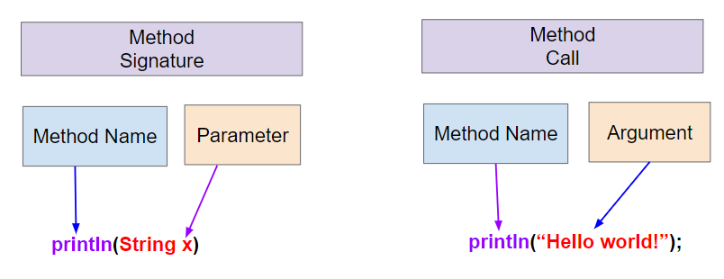

.. include:: ../common.rst

.. qnum::
   :prefix: 1-9-
   :start: 1

|Time45|

Method Signatures
=====================================

Methods and Procedural Abstraction
-----------------------------------

.. index::
    single: method
    single: procedural abstraction

Up until now, all of our code has been in the main method, but complex programs are made up of many methods. When faced with a large problem, we can break it down into smaller subproblems and solve each subproblem separately. Each of these subproblems can be a method. 

A **method** is a named block of code that performs a task when it is called. (A **block** of code is any section of code that is enclosed in curly braces like ``{ }``.) These named blocks of code go by many names in different programming languages: functions, procedures, subroutines, etc. In Java they are called methods, as in a method of doing something. In this unit, you will learn how to use methods written by other programmers. In latter units, you will learn how to write your own methods.

**Procedural abstraction** allows a programmer to use a method and not worry about the details of how it exactly works (i.e. abstracting away the details). For example, we don't need to know how a car exactly works in order to drive. We know that if we hit the brakes, the car will stop; we can still use the brakes even if we don't really know how they exactly work. Similarly, we can use a method that someone else wrote without knowing exactly how it works. We just need to know the method's name to call it and what it needs to do its job.

Method Calls
--------------

.. index::
    single: method call
    single: flow of control
    single: tracing

We divide up a program into multiple methods in order to organize the code to reduce its complexity and to avoid repetition of code. For example, the song "Old MacDonald Had a Farm" has a lot of repetition. Instead of writing the same code over and over in order to print the song, we can write methods that contain the repeated code and run them when needed. Click on all the repeated code in the song below and then we will learn how it can be replaced with methods. 

|Exercise| Check Your Understanding

.. clickablearea:: repeatedcode-old-mcdonald
    :question: Click on all the lines that are completely identical and repeated.
    :iscode:
    :feedback: Look for lines that are completely identical.

    :click-incorrect:public static void main(String args[]) {:endclick:
        :click-correct:System.out.println("Old MacDonald had a farm.");:endclick:
        :click-correct:System.out.println("E-I-E-I-O");:endclick:
        :click-incorrect:System.out.println("And on this farm, they had a cow.");:endclick:
        :click-correct:System.out.println("E-I-E-I-O");:endclick:
        :click-incorrect:System.out.println("With a moo moo here and a moo moo there");:endclick:
        :click-incorrect:System.out.println("Here a moo, there a moo, everywhere a moo moo");:endclick:
        :click-correct:System.out.println("Old MacDonald had a farm");:endclick:
        :click-correct:System.out.println("E-I-E-I-O");:endclick:
    :click-incorrect:}:endclick:

Did you find some repeated lines? You may have noticed that the first two lines are repeated. When you see repeated code, that is a signal for you to make a new method!

A **method call** is when the code "calls out" the method's name in order to run the code in the method. The method call always includes the method name and parentheses ``()`` and sometimes some data inside the parentheses if the method needs that to do its job. For example, when we write ``System.out.println("Hello World");``, we are calling the ``println()`` method to print out "Hello World".

.. code-block:: java

    // Method call
    methodName();

.. |visualization| raw:: html

   <a href="https://pythontutor.com/render.html#code=public%20class%20OldMacDonaldSong%0A%7B%0A%20%20%20%20public%20static%20void%20intro%28%29%0A%20%20%20%20%7B%0A%20%20%20%20%20%20%20%20System.out.println%28%22Old%20MacDonald%20had%20a%20farm%22%29%3B%0A%20%20%20%20%20%20%20%20chorus%28%29%3B%0A%20%20%20%20%7D%0A%0A%20%20%20%20public%20static%20void%20chorus%28%29%0A%20%20%20%20%7B%0A%20%20%20%20%20%20%20%20System.out.println%28%22E-I-E-I-O%22%29%3B%0A%20%20%20%20%7D%0A%0A%20%20%20%20public%20static%20void%20main%28String%5B%5D%20args%29%0A%20%20%20%20%7B%0A%20%20%20%20%20%20%20%20intro%28%29%3B%0A%20%20%20%20%20%20%20%20System.out.print%28%22And%20on%20that%20farm%20they%20had%20a%20cow.%22%29%3B%0A%20%20%20%20%20%20%20%20chorus%28%29%3B%0A%20%20%20%20%20%20%20%20System.out.print%28%22With%20a%20moo%20moo%20here%20and%20a%20moo%20moo%20there%22%29%3B%0A%20%20%20%20%20%20%20%20System.out.print%28%22Here%20a%20moo,%20there%20a%20moo,%20everywhere%20moo%20moo%22%29%3B%0A%20%20%20%20%20%20%20%20intro%28%29%3B%0A%20%20%20%20%7D%0A%7D&cumulative=false&curInstr=0&heapPrimitives=nevernest&mode=display&origin=opt-frontend.js&py=java&rawInputLstJSON=%5B%5D&textReferences=false" target="_blank" style="text-decoration:underline">visualization</a>

The Java |visualization| below shows how a song can be divided up into methods. Click on the next button below the code to step through the code and watch the red arrow jump to the method that is being run. Execution in Java always begins in the ``main`` method in the current class. Then, the **flow of control** skips from method to method as they are called. Notice that when a method ends, it returns to the line right after the method call. The ``main()`` method below calls the ``intro()`` method which calls the ``chorus()`` method. When you call the chorus() method, it skips to the chorus code, executes and prints out the chorus "E-I-E-I-O", and then returns back to the method that called it. Just like variable names, method names should be descriptive of what the method does. The methods can be in any order, but usually programmers put the main method at the end after all the methods that it uses are defined.

.. codelens:: songvizOldMcdonald
    :language: java
    :optional:

    public class OldMacDonaldSong
    {
      public static void intro()
      {
        System.out.println("Old MacDonald had a farm");
        chorus();
      }

      public static void chorus()
      {
        System.out.println("E-I-E-I-O");
      }

      public static void main(String[] args)
      {
        intro();
        System.out.println("And on that farm they had a cow.");
        chorus();
        System.out.println("With a moo moo here and a moo moo there");
        System.out.println("Here a moo, there a moo, everywhere a moo moo");
        intro();
      }
    }

.. note::
    
    A method call interrupts the sequential execution of statements, causing the program to first execute the statements in the method before continuing. Once the last statement in the method has been executed or a return statement is executed, the flow of control is returned to the point immediately following where the method was called.

Try writing your own method calls below to add another verse to the song.

.. activecode:: song-add-calls
    :language: java
    :practice: T
    :autograde: unittest

    Scroll down to the main method below and add lines of code to the main method for the second verse of the Old MacDonald Song by calling the intro() and chorus() methods and printing out lines about a duck or another animal.
    ~~~~
    public class OldMacDonaldSong
    {
        public static void intro()
        {
            System.out.println("Old MacDonald had a farm");
            chorus();
        }

        public static void chorus()
        {
            System.out.println("E-I-E-I-O");
        }

        public static void main(String[] args)
        {
            intro();
            System.out.println("And on that farm they had a cow.");
            chorus();
            System.out.println("With a moo moo here and a moo moo there");
            System.out.println("Here a moo, there a moo, everywhere a moo moo");
        
            // TODO:
            // 1. Call the method intro()

            // 2. Print out the line "And on that farm..." 
            //    with a duck or another animal

            // 3. Call the method chorus
            
            // 4. Print out the lines with the appropriate animal sounds
            
            // 5. Call the method intro again

        }
    }
    ====
    import static org.junit.Assert.*;
    import org.junit.*;
    import java.io.*;
    public class RunestoneTests extends CodeTestHelper
    {
        @Test
        public void test1()
        {
            String code = getCode();
            int num = countOccurences(code, "intro();");

            boolean passed = num >= 3;

            passed = getResults("3 or more", "" + num, "Calls to intro()", passed);
            assertTrue(passed);
        }
        @Test
        public void test2()
        {
            String code = getCode();
            int num = countOccurences(code, "chorus();");

            boolean passed = num >= 3;

            passed = getResults("3 or more", "" + num, "Calls to chorus()", passed);
            assertTrue(passed);
        }
    }

|Exercise| **Check your understanding**

.. mchoice:: songMethodsTrace
   :practice: T
   :answer_a: I like to eat eat eat.
   :answer_b: I like to eat eat eat fruit.
   :answer_c: I like to apples and bananas eat.
   :answer_d: I like to eat eat eat apples and bananas!
   :answer_e: Nothing, it does not compile.
   :correct: d
   :feedback_a: Try tracing through the print method and see what happens when it calls the other methods.
   :feedback_b: There is a fruit() method but it does not print out the word fruit.
   :feedback_c: The order things are printed out depends on the order in which they are called from the print method.
   :feedback_d: Yes, the print method calls the eat method 3 times and then the fruit method to print this.
   :feedback_e: Try the code in an active code window to see that it does work.

   What does the following code print out?

   .. code-block:: java

    public class Song
    {
        public static void print()
        {
            System.out.print("I like to ");
            eat();
            eat();
            eat();
            fruit();
        }

        public static void fruit()
        {
            System.out.println("apples and bananas!");
        }

        public static void eat()
        {
            System.out.print("eat ");
        }

        public static void main(String[] args)
        {
            print();
        }
    }

.. |visualization2| raw:: html

   <a href="https://pythontutor.com/render.html#code=public%20class%20Song%20%7B%0A%20%20%0A%20%20%20%20%20%20%20%20public%20static%20void%20print%28%29%20%7B%0A%20%20%20%20%20%20%20%20%20%20%20%20System.out.print%28%22I%20like%20to%20%22%29%3B%0A%20%20%20%20%20%20%20%20%20%20%20%20eat%28%29%3B%0A%20%20%20%20%20%20%20%20%20%20%20%20eat%28%29%3B%0A%20%20%20%20%20%20%20%20%20%20%20%20eat%28%29%3B%0A%20%20%20%20%20%20%20%20%20%20%20%20fruit%28%29%3B%0A%20%20%20%20%20%20%20%20%7D%0A%20%20%20%20%20%20%20%20public%20static%20void%20fruit%28%29%0A%20%20%20%20%20%20%20%20%7B%0A%20%20%20%20%20%20%20%20%20%20%20%20System.out.println%28%22apples%20and%20bananas!%22%29%3B%0A%20%20%20%20%20%20%20%20%7D%0A%20%20%20%20%20%20%20%20%0A%20%20%20%20%20%20%20%20public%20static%20void%20eat%28%29%20%7B%0A%20%20%20%20%20%20%20%20%20%20%20System.out.print%28%22eat%20%22%29%3B%0A%20%20%20%20%20%20%20%20%7D%0A%20%20%20%20%20%20%20%20public%20static%20void%20main%28String%5B%5D%20args%29%20%7B%0A%20%20%20%20%20%20%20%20%20%20%20print%28%29%3B%0A%20%20%20%20%20%20%20%20%7D%0A%20%20%20%20%7D&cumulative=false&curInstr=15&heapPrimitives=nevernest&mode=display&origin=opt-frontend.js&py=java&rawInputLstJSON=%5B%5D&textReferences=false" target="_blank" style="text-decoration:underline">visualization</a>

Try this |visualization2| to see this code in action. Figuring out what the code does is called **tracing** through the code. You can do this by hand or use a tool like the one above to help you see what happens when the code runs.

Methods Signature, Parameters, Arguments
------------------------------------------

.. index::
    single: method signature
    single: parameter
    single: argument
    single: return type
    single: parameter list

When using methods in a library or API, we can look up the **method signature** (or **method header**) in its documentation.  A **method header** is the first line of a method that includes the method name, the return type, and the parameter list of parameters and their data types. The **return type** is the type of value that the method returns; in this lesson, we'll just look at **void** return types which means the method doesn't return anything. The **method signature** is the method header without the return type, just the method name and its parameter list.  The **parameter list** is a list of variables and their data types that are passed to the method when it is called. The parameter list is enclosed in parentheses and separated by commas; it can be empty with no parameters although the parentheses must be present. 

For example, the ``PrintStream`` class documented in https://docs.oracle.com/javase/8/docs/api/java/io/PrintStream.html contains the following method signatures for ``println`` that we use in ``System.out.println()``: 

- ``void println()`` which has an empty parameter list with no parameters 
- ``void println(String x)`` which will print out a ``String`` value
- ``void println(int x)`` which will print out an ``int`` value

We can call these methods with the appropriate arguments to print out the value we want. The **argument** is the actual value that is passed to the method when it is called.  Here are the method calls that correspond to the method signatures above:

- ``System.out.println();`` // prints a newline
- ``System.out.println("Hello World");`` // prints a String
- ``System.out.println(42);`` // prints an int

Compare the method signature of ``println(String x)`` with the method call ``println("Hello World");`` below. The method signature contains the method name and the parameter type and variable. The method call contains only the method name and the argument value. The argument must be compatible with the data type of the parameter in the method signature and is saved in the parameter variable when the method is called. Many people use the terms parameter and argument interchangeably.

    Figure 1: Method Signature and Method Call

Let's take another look at the Old MacDonald Song and see if we can replace more repeated code with methods with parameters. Each verse of the song is similar except it is about a different animal and the sound it makes. Click on the words that are different in the lines that are repeated to discover what parameters we need to add to the methods.

.. clickablearea:: different-code-old-mcdonald
    :question: Click on the words that are different in the lines that are repeated.
    :iscode:
    :feedback: Look for lines that are similar except for a single word and click on that word.

    :click-incorrect:public static void main(String args[]) {:endclick:
        :click-incorrect:System.out.println("Old MacDonald had a farm.");:endclick:
        :click-incorrect:System.out.println("E-I-E-I-O");:endclick:
        :click-incorrect:System.out.println("And on this farm, they had a :endclick::click-correct:cow:endclick::click-incorrect:.");:endclick:
        :click-incorrect:System.out.println("E-I-E-I-O");:endclick:
        :click-incorrect:System.out.println("With a :endclick::click-correct:moo moo :endclick::click-incorrect:here and a :endclick::click-correct:moo moo :endclick::click-incorrect:there");:endclick:
        :click-incorrect:System.out.println("Here a :endclick::click-correct:moo:endclick::click-incorrect:, there a :endclick::click-correct:moo:endclick::click-incorrect:, everywhere a :endclick::click-correct:moo moo:endclick::click-incorrect:");:endclick:
        :click-incorrect:System.out.println("Old MacDonald had a farm");:endclick:
        :click-incorrect:System.out.println("E-I-E-I-O");:endclick:
        :click-incorrect:System.out.println("And on this farm, they had a :endclick::click-correct:duck:endclick::click-incorrect:.");:endclick:
        :click-incorrect:System.out.println("E-I-E-I-O");:endclick:
        :click-incorrect:System.out.println("With a :endclick::click-correct:quack quack :endclick::click-incorrect:here and a :endclick::click-correct:quack quack :endclick::click-incorrect:there");:endclick:
        :click-incorrect:System.out.println("Here a :endclick::click-correct:quack:endclick::click-incorrect:, there a :endclick::click-correct:quack:endclick::click-incorrect:, everywhere a :endclick::click-correct:quack quack:endclick::click-incorrect:");:endclick:
        :click-incorrect:System.out.println("Old MacDonald had a farm");:endclick:
        :click-incorrect:System.out.println("E-I-E-I-O");:endclick:
    :click-incorrect:}:endclick:

Did you notice that there are lines that are identical except for the animal name and the sound that they make? 

We can make methods even more powerful and more abstract by giving them parameters for data that they need to do their job. A **parameter** (sometimes called a **formal parameter**) is a variable declared in the header of a method or constructor and can be used inside the body of the method. This allows values or arguments to be passed and used by a method. An **argument** (sometimes called an **actual parameter**) is a value that is passed into a method when the method is called and is saved in the parameter variable. 

We can make a method called ``verse`` that takes the animal and its sound to print out any verse! The parameter variables ``animal`` and ``sound`` will hold different values when the method is called.

.. code-block:: java

    /* This method prints out a verse for any given animal and sound. 
       @param animal - the name of the animal
       @param sound - the sound the animal makes
    */
    public static void verse(String animal, String sound)
    {
        System.out.println("And on this farm, they had a " + animal);
        chorus();
        System.out.println("With a " + sound + " " + sound 
                       + " here and a " + sound + " " + sound + " there");
        System.out.println("Here a " + sound 
                       + ", there a " + sound 
                       + ", everywhere a " + sound + " " + sound);
    }

And the main method can now just consist of calls to the intro() and verse() methods. Main methods often look like an outline for the program, calling methods to do the work.

.. code-block:: java

    public static void main(String[] args)
    {
        intro();
        verse("cow", "moo");
        intro();
        verse("duck", "quack");
        intro();
    }

.. |visualizer2| raw:: html

   <a href="https://pythontutor.com/render.html#code=%20%20%20%20public%20class%20OldMacDonaldSong%0A%20%20%20%20%7B%0A%20%20%20%20%20%20public%20static%20void%20intro%28%29%0A%20%20%20%20%20%20%7B%0A%20%20%20%20%20%20%20%20System.out.println%28%22Old%20MacDonald%20had%20a%20farm%22%29%3B%0A%20%20%20%20%20%20%20%20chorus%28%29%3B%0A%20%20%20%20%20%20%7D%0A%0A%20%20%20%20%20%20public%20static%20void%20chorus%28%29%0A%20%20%20%20%20%20%7B%0A%20%20%20%20%20%20%20%20System.out.println%28%22E-I-E-I-O%22%29%3B%0A%20%20%20%20%20%20%7D%0A%20%20%20%20%20%20%0A%20%20%20%20%20%20public%20static%20void%20verse%28String%20animal,%20String%20sound%29%0A%20%20%20%20%20%20%7B%0A%20%20%20%20%20%20%20%20System.out.println%28%22And%20on%20this%20farm,%20they%20had%20a%20%22%20%2B%20animal%29%3B%0A%20%20%20%20%20%20%20%20chorus%28%29%3B%0A%20%20%20%20%20%20%20%20System.out.println%28%22With%20a%20%22%20%2B%20sound%20%2B%20%22%20%22%20%2B%20sound%20%0A%20%20%20%20%20%20%20%20%20%20%20%20%20%20%20%20%20%20%20%20%20%20%20%2B%20%22%20here%20and%20a%20%22%20%2B%20sound%20%2B%20%22%20%22%20%2B%20sound%20%2B%20%22%20there%22%29%3B%0A%20%20%20%20%20%20%20%20System.out.println%28%22Here%20a%20%22%20%2B%20sound%20%0A%20%20%20%20%20%20%20%20%20%20%20%20%20%20%20%20%20%20%20%20%20%20%20%2B%20%22,%20there%20a%20%22%20%2B%20sound%20%0A%20%20%20%20%20%20%20%20%20%20%20%20%20%20%20%20%20%20%20%20%20%20%20%2B%20%22,%20everywhere%20a%20%22%20%2B%20sound%20%2B%20%22%20%22%20%2B%20sound%29%3B%0A%20%20%20%20%20%20%7D%0A%0A%20%20%20%20%20%20public%20static%20void%20main%28String%5B%5D%20args%29%0A%20%20%20%20%20%20%7B%0A%20%20%20%20%20%20%20%20intro%28%29%3B%0A%20%20%20%20%20%20%20%20verse%28%22cow%22,%20%22moo%22%29%3B%0A%20%20%20%20%20%20%20%20intro%28%29%3B%0A%20%20%20%20%20%20%20%20verse%28%22duck%22,%20%22quack%22%29%3B%0A%20%20%20%20%20%20%20%20intro%28%29%3B%0A%20%20%20%20%20%20%7D%0A%20%20%20%20%7D&cumulative=false&curInstr=34&heapPrimitives=nevernest&mode=display&origin=opt-frontend.js&py=java&rawInputLstJSON=%5B%5D&textReferences=false" target="_blank"  style="text-decoration:underline">Java visualizer</a>

Click on the next button below to step through this new version of the code in the |visualizer2| and watch how the argument are saved in the parameter variables with each call to the ``verse`` method.

.. codelens:: songvizOldMcdonald2
    :language: java
    :optional:

    public class OldMacDonaldSong
    {
      public static void intro()
      {
        System.out.println("Old MacDonald had a farm");
        chorus();
      }

      public static void chorus()
      {
        System.out.println("E-I-E-I-O");
      }
      
      public static void verse(String animal, String sound)
      {
        System.out.println("And on this farm, they had a " + animal);
        chorus();
        System.out.println("With a " + sound + " " + sound 
                       + " here and a " + sound + " " + sound + " there");
        System.out.println("Here a " + sound 
                       + ", there a " + sound 
                       + ", everywhere a " + sound + " " + sound);
      }

      public static void main(String[] args)
      {
        intro();
        verse("cow", "moo");
        intro();
        verse("duck", "quack");
        intro();
      }
    }

Let's try adding another verse to the song with a goose that honks.

|CodingEx| **Coding Exercise**

.. activecode:: OldMacDonaldSong2
  :language: java
  :autograde: unittest
  :practice: T

  Run the following code to see the song Old MacDonald using the verse and chorus methods.  You can also see this code run in the visualizer by clicking on the Show Code Lens button below. Scroll down to the main method, and add another verse with the animal goose and the sound honk by calling the verse method with the appropriate arguments. Then call intro again. Repeat with another animal and sound of your choice.
  ~~~~
  public class OldMacDonaldSong
  {
      public static void intro()
      {
          System.out.println("Old MacDonald had a farm");
          chorus();
      }

      public static void chorus()
      {
          System.out.println("E-I-E-I-O");
      }

      public static void verse(String animal, String sound)
      {
          System.out.println("And on this farm, they had a " + animal);
          chorus();
          System.out.println("With a " + sound + " " + sound 
                       + " here and a " + sound + " " + sound + " there");
          System.out.println("Here a " + sound 
                       + ", there a " + sound 
                       + ", everywhere a " + sound + " " + sound);
      }

      public static void main(String[] args)
      {
          intro();
          verse("cow","moo");
          intro();
          verse("duck","quack");
          intro();
          // TODO:
          // Call verse again with goose and honk
          //   and then call intro again

          // Call verse again with another animal and sound 
          //  and then call intro again
        

       }
  }
  ====
  import static org.junit.Assert.*;

  import org.junit.*;

  import java.io.*;

  public class RunestoneTests extends CodeTestHelper
  {
      @Test
      public void testThree()
      {
          boolean passed = checkCodeContains("verse with goose and honk", "verse(\"goose\", \"honk\");");
          assertTrue(passed);
      }
      @Test
      public void test1()
      {
          String code = getCode();
          int num = countOccurences(code, "intro();");

          boolean passed = num >= 5;

          passed = getResults("5 or more", "" + num, "Calls to intro", passed);
          assertTrue(passed);
      }
  }

When a method is called, the right method definition is found by checking the **method signature** or **header** at the top of the method definition to match the method name, the number of arguments, the data types for the arguments and the return type. A method signature for a method with parameters consists of the method name and the ordered list of parameter types. A method signature for a method without parameters consists of the method name and an empty parameter list.

Here's what that looks like with the two method calls above. The arguments like "cow" and "moo" are saved into the parameter variables ``animal`` and ``sound`` with each method call.

.. figure:: Figures/args2paramsFarm.png
    :width: 500px
    :align: center
    :alt: Arguments to Parameters
    :figclass: align-center

    Figure 2: Matching Arguments to Parameters
  

The method headers contain data types of the parameters because they are variable declarations that reserve memory for the parameter variables.  However, the method calls never contain the parameter types, only the values that are passed to the method. The argument values can be variables, literals, or expressions that evaluate to the correct data type.

.. code-block:: java

    // Method headers contain data types for the parameters
    public static void verse(String animal, String sound)
    {   /* Implementation not shown */
    }

    // Method calls contain only values for the parameters
    verse("cow", "moo");
    

Java uses **call by value** when it passes arguments to methods. This means that a copy of the value in the argument is saved in the parameter variable. Call by value initializes the parameters with copies of the arguments. If the parameter variable changes its value inside the method, the original value outside the method is not changed.

Overloading
-------------

.. index::
    single: overloading

Methods are said to be **overloaded** when there are multiple methods with the same name but different signatures with a different number or types of parameters. For example, the ``println()`` method in the ``PrintStream`` class documented in https://docs.oracle.com/javase/8/docs/api/java/io/PrintStream.html
is overloaded with different parameter types. The method ``println()`` with no parameters prints a newline, the method ``println(String x)`` prints the given string followed by a newline, the method ``println(int x)`` prints the given int number followed by a newline, etc. The compiler determines which method to call based on the number and types of arguments passed to the method.

|Groupwork| Programming Challenge: Song with Parameters
--------------------------------------------------------- 

.. |The Ants Go Marching| raw:: html

   <a href="https://youtu.be/QPwEZ8Vv2YQ" target="_blank">The Ants Go Marching</a>

Here's another song, |The Ants Go Marching|, that is very similar in its repetitive structure. The verses below have a lot of repeated words and phrases. Click on the words or phrases that are different in each verse. These will be the arguments that you will pass to the methods in your song code.

.. clickablearea:: clickDifferentAntSong
    :question: Click on the phrases that are different in each verse.
    :iscode:
    :feedback: Look for words that are different in verse 1, 2, and 3.

    :click-incorrect:The ants go marching :endclick::click-correct:one by one:endclick::click-incorrect:, hurrah, hurrah:endclick:
    :click-incorrect:The ants go marching :endclick::click-correct:one by one:endclick::click-incorrect:, hurrah, hurrah:endclick:
    :click-incorrect:The ants go marching :endclick::click-correct:one by one:endclick:
    :click-incorrect:The little one stops to :endclick::click-correct:suck a thumb:endclick:
    :click-incorrect:And they all go marching down to the ground:endclick:
    :click-incorrect:To get out of the rain, BOOM! BOOM! BOOM! BOOM!:endclick:

    :click-incorrect:The ants go marching :endclick::click-correct:two by two:endclick::click-incorrect:, hurrah, hurrah:endclick:
    :click-incorrect:The ants go marching :endclick::click-correct:two by two:endclick::click-incorrect:, hurrah, hurrah:endclick:
    :click-incorrect:The ants go marching :endclick::click-correct:two by two:endclick:
    :click-incorrect:The little one stops to :endclick::click-correct:tie a shoe:endclick:
    :click-incorrect:And they all go marching down to the ground:endclick:
    :click-incorrect:To get out of the rain, BOOM! BOOM! BOOM! BOOM!:endclick:

    :click-incorrect:The ants go marching :endclick::click-correct:three by three:endclick::click-incorrect:, hurrah, hurrah:endclick:
    :click-incorrect:The ants go marching :endclick::click-correct:three by three:endclick::click-incorrect:, hurrah, hurrah:endclick:
    :click-incorrect:The ants go marching :endclick::click-correct:three by three:endclick:
    :click-incorrect:The little one stops to :endclick::click-correct:climb a tree:endclick:
    :click-incorrect:And they all go marching down to the ground:endclick:
    :click-incorrect:To get out of the rain, BOOM! BOOM! BOOM! BOOM!:endclick:

.. activecode:: challenge-1-9-song
  :language: java
  :autograde: unittest
  :practice: T

  Write code in the main method that calls the verse method to print out all three verses for the Ants Go Marching song above.
  ~~~~
  public class AntsSong
  {
      public static void chorus(String num)
      {
          System.out.println("The ants go marching " + num
                           + " by " + num + " hurrah, hurrah");
          System.out.println("The ants go marching " + num
                           + " by " + num + " hurrah, hurrah");
      }

      public static void verse(String num, String action)
      {
          System.out.println("The ants go marching " + num + " by " + num);
          System.out.println("The little one stops to " + action);
          System.out.println("And they all go marching down to the ground");
          System.out.println("To get out of the rain, BOOM! BOOM! BOOM! BOOM!\n");
      }

      public static void main(String args[])
      {
          // Call the chorus and verse methods 
          // with the correct arguments 
          // to print out all three verses above.

      }
  }
  ====
  import static org.junit.Assert.*;
  import org.junit.*;
  import java.io.*;

  public class RunestoneTests extends CodeTestHelper
  {
      @Test
      public void checkCodeContains1()
      {
          String code = getCode();
          int actual = countOccurences(code, "chorus(");
          String expected = "3";

          boolean passed = actual >= 3;
          getResults(
                  expected,
                  "" + actual,
                  "Checking that code contains 3 calls to  chorus",
                  passed);
          assertTrue(passed);
      }
      @Test
      public void checkCodeContains2()
      {
          String code = getCode();
          int actual = countOccurences(code, "verse(");
          String expected = "3";

          boolean passed = actual >= 3;
          getResults(
                  expected,
                  "" + actual,
                  "Checking that code contains three calls to verse method",
                  passed);
          assertTrue(passed);
      }
      @Test
       public void testMain() throws IOException
       {
           String output = getMethodOutput("main");
      
           String expect =
              "The ants go marching one by one, hurrah, hurrah\n"
                      + "The ants go marching one by one, hurrah, hurrah\n"
                      + "The ants go marching one by one\n"
                      + "The little one stops to suck a thumb\n"
                      + "And they all go marching down to the ground\n"
                      + "To get out of the rain, BOOM! BOOM! BOOM! BOOM!\n"
                      + "\n"
                      + "The ants go marching two by two, hurrah, hurrah\n"
                      + "The ants go marching two by two, hurrah, hurrah\n"
                      + "The ants go marching two by two\n"
                      + "The little one stops to tie a shoe\n"
                      + "And they all go marching down to the ground\n"
                      + "To get out of the rain, BOOM! BOOM! BOOM! BOOM!\n"
                      + "\n"
                      + "The ants go marching three by three, hurrah, hurrah\n"
                      + "The ants go marching three by three, hurrah, hurrah\n"
                      + "The ants go marching three by three\n"
                      + "The little one stops to climb a tree\n"
                      + "And they all go marching down to the ground\n"
                      + "To get out of the rain, BOOM! BOOM! BOOM! BOOM!";

                 boolean passed =
                 getResults(expect, output, "Expected output from main");
                 assertTrue(passed);
           }
      
  }

Summary
---------

.. dragndrop:: vocab1_9
    :feedback: Review the summary below.
    :match_1: named block of code to perform a task|||method
    :match_2: where execution starts|||main method
    :match_3: method name, return type, and parameter list|||method signature
    :match_4: a variable declared in the header of a method|||parameter
    :match_5: value passed into a method when it is called|||argument

    Drag the definition from the left and drop it on the correct concept on the right.  Click the "Check Me" button to see if you are correct.

- (AP 1.9.A.1) A **method** is a named block of code that only runs when it is called. A block of code is any section of code that is enclosed in braces.

- (AP 1.9.A.1) **Procedural abstraction** allows a programmer to use a method by knowing what the method does even if they do not know how the method was written.

- (AP 1.9.B.5) A method call interrupts the sequential execution of statements, causing the program to first execute the statements in the method before continuing. Once the last statement in the method has been executed or a return statement is executed, the flow of control is returned to the point immediately following where the method was called.

- (AP 1.9.A.2) A **parameter** is a variable declared in the header of a method or constructor and can be used inside the body of the method. This allows values or arguments to be passed and used by a method or constructor. 

- (AP 1.9.A.2) A **method signature** for a method with parameters consists of the method name and the ordered list of parameter types. A method signature for a method without parameters consists of the method name and an empty parameter list.

- (AP 1.9.B.3) An **argument** is a value that is passed into a method when the method is called. The arguments passed to a method must be compatible in number and order with the types identified in the parameter list of the method signature. When calling methods, arguments are passed using call by value. 

- (AP 1.9.B.3) **Call by value** initializes the parameters with copies of the arguments.

- (AP 1.9.B.4) Methods are said to be **overloaded** when there are multiple methods with the same name but different signatures.

AP Practice
------------

.. mchoice:: AP-trace-method-calls
    :practice: T

    Consider the following class definition.

    .. code-block:: java

        public class Cat
        {
            public static void sound1()
            {
                System.out.print("meow ");
            }

            public static void sound2()
            {
                System.out.print("purr ");
            }

            public static void hello()
            {
                sound2();
                sound1();
            }
        }

    Which of the following code segments, if located in a method inside the Cat class, will cause the message "purr meow purr" to be printed?

    - .. code-block:: java

        hello();

      - This would print "purr meow "

    - .. code-block:: java

        hello();
        sound2();

      + Correct!

    - .. code-block:: java

        sound1()
        sound2();
        sound1();

      - This would print out "meow purr meow" instead of "purr meow purr".

    - .. code-block:: java

         purr();
         meow();
         purr()

      - This would cause a syntax error since those are not the names of the methods.
