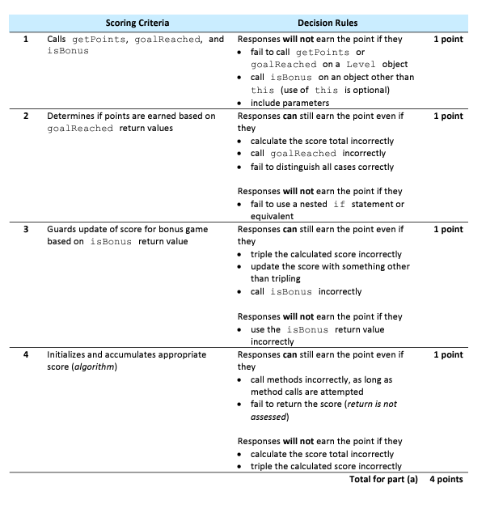

Unit 3 Free Response Question (FRQ) Game Practice
====================================================

.. index::
    single: free response questions
    single: FRQ

The AP CSA exam has 4 free response questions (FRQs) where you have to write Java code in 1.5 hours. The first FRQ is about Methods and Control Structures using expressions, methods, loops, and if statements. In the last unit, we tried a simplified FRQ 1 part a about the points earned in a video game with 3 levels using the class ``Level``. You will now try the complete 2022 FRQ 1 part a from https://apcentral.collegeboard.org/media/pdf/ap22-frq-computer-science-a.pdf.

FRQ 1 Part A Description (2022) 
---------------------------------

This question involves simulation of the play and scoring of a single-player video game. In the game, a player attempts to complete three levels. A level in the game is represented by the ``Level`` class.

.. code-block:: java

    public class Level
    {
        /** Returns true if the player reached the goal on this level and returns false otherwise */
        public boolean goalReached()
        { /* implementation not shown */ } 

        /** Returns the number of points (a positive integer) recorded for this level */
        public int getPoints()
        { /* implementation not shown */ }
        
        // There may be instance variables, constructors, and methods that are not shown.
    }

Play of the game is represented by the ``Game`` class. You will write a method of the Game class.

.. code-block:: java

    public class Game
    {
        private Level levelOne;
        private Level levelTwo;
        private Level levelThree;

        /** Postcondition: All instance variables have been initialized. */
        public Game()
        { /* implementation not shown */ }
        
        /** Returns true if this game is a bonus game and returns false otherwise */
        public boolean isBonus()
        { /* implementation not shown */ }
        
        /** Simulates the play of this Game (consisting of three levels) and updates all relevant
        * game data
        */
        public void play()
        { /* implementation not shown */ }
        
        /** Returns the score earned in the most recently played game, as described in part (a) */
        public int getScore()
        { /* to be implemented in part (a) */ }
        
        /** Simulates the play of num games and returns the highest score earned, as
        * described in part (b)
        * Precondition: num > 0
        */
        public int playManyTimes(int num)
        { /* to be implemented in part (b) */ }

        // There may be instance variables, constructors, and methods that are not shown.
    } 

In part a, you will write the ``getScore`` method, which returns the score for the most recently played game. Each game consists of three levels. The score for the game is computed using the following helper methods.

- The ``isBonus`` method of the Game class returns true if this is a bonus game and returns false otherwise.

- The ``goalReached`` method of the Level class returns true if the goal has been reached on a particular level and returns false otherwise.

- The ``getPoints`` method of the Level class returns the number of points recorded on a particular level. Whether or not recorded points are earned (included in the game score) depends on the rules of the game, which follow.

The ``score`` for the game is computed according to the following rules.

- Level one points are earned only if the level one goal is reached. 

- Level two points are earned only if both the level one and level two goals are reached. 

- Level three points are earned only if the goals of all three levels are reached.

- The score for the game is the sum of the points earned for levels one, two, and three.

- If the game is a bonus game, the score for the game is tripled.

Warm up Exercises
-------------------

FRQs often have a lot of dense text. It is a good idea to highlight important keywords and the methods and variables that you will need. 

1. The first step is to determine what they are asking you to write. 
2. The second step is to determine which methods given in the problem description you need to use in your solution. 

Let's practice this below.

.. mchoice:: frq_which_method
   :answer_a: getPoints()
   :answer_b: goalReached()
   :answer_c: play()
   :answer_d: getScore()
   :correct: c
   :random:
   :feedback_a: The ``getPoints()`` method is given to you to get the points for a level.
   :feedback_b: The ``goalReached()`` method is given to you to check if the goal is reached for a level.
   :feedback_c: The ``play()`` method is given to you to simulate the play of the game.
   :feedback_d: The ``getScore()`` method is the one you will write for part a.

   Which method are you asked to write for part a?

.. clickablearea:: frqifs
        :question: Select the phrases below which will probably correspond to an if clause of a conditional statement. 
        :iscode:
        :feedback: Look for the word if

        :click-incorrect:The score for the game is computed:endclick: according to the following rules.
    
        - Level one points are earned only :click-correct:if the level one goal is reached.:endclick:
        - Level two points are earned only :click-correct:if both the level one and level two goals are reached.:endclick: 
        - Level three points are earned only :click-correct:if the goals of all three levels are reached.:endclick:
        - The score for the game is :click-incorrect:the sum of the points earned for levels one, two, and three.:endclick:
        - :click-correct:If the game is a bonus game:endclick: , the score for the game is tripled.

.. mchoice:: frq_which_methods_used
   :answer_a: getPoints()
   :answer_b: goalReached()
   :answer_c: isBonus()
   :answer_d: getScore()
   :correct: a,b,c
   :feedback_a: The getPoints() method is given to you to get the points for a level.
   :feedback_b: The goalReached() method is given to you to check if the goal is reached for a level.
   :feedback_c: The isBonus() method is given to you to check if the game is a bonus game.
   :feedback_d: The getScore() method is the one you will write for part a. 

   What are some methods given to you that you will need to use for part a?

There are two classes given to you in this FRQ. Which method belongs to each class?

.. dragndrop:: frq_method_class_match
    :feedback: Review the FRQ description above.
    :match_1: getPoints()|||Level
    :match_2: isBonus()|||Game

    Drag the method from the left and drop it on the correct class that it belongs to on the right.  Click the "Check Me" button to see if you are correct.

Notice that the ``Game`` class has 3 instance variables to represent each level, ``levelOne``, ``levelTwo``, and ``levelThree`` which are object of class type ``Level``. You will need to use these variables to get their points and check if the goal is reached for each level. 

.. mchoice:: frq_call_method
   :answer_a: goalReached()
   :answer_b: levelOne.goalReached()
   :answer_c: Level.goalReached()
   :answer_d: goalReached(levelOne)
   :random:
   :correct: b
   :feedback_a: The goalReached() method is a non-static method of the Level class. You need to call it with an object of the class.
   :feedback_b: Correct, this calls the levelOne object's goalReached() method.
   :feedback_c: The goalReached() method is a non-static method of the ``Level`` class. You need to call it with an object of the class, not the class name.
   :feedback_d: The goalReached() method does not take an argument.

   How would you call the ``goalReached()`` method of the ``levelOne`` object?

Let's simplify the problem by first writing the code to add the points for ``levelOne`` to a variable called ``score``.

.. mchoice:: frq_expression
   :answer_a: score += levelOnePoints
   :answer_b: score += levelOne.getPoints() 
   :answer_c: score = levelOne.getPoints() 
   :answer_d: score = levelOne.points
   :random:
   :correct: b
   :feedback_a: The goalReached() method is a non-static method of the Level class. You need to call it with an object of the class.
   :feedback_b: Correct, this calls the levelOne object's goalReached() method.
   :feedback_c: The goalReached()`` method is a non-static method of the Level class. You need to call it with an object of the class, not the class name.
   :feedback_d: The goalReached() method does not take an argument.

   Which expression would add the points for ``levelOne`` into a variable called ``score``?

Solve the Problem
-------------------

Let's write the code for the ``getScore()`` method. The method should use the ``goalReached()`` and ``getPoints()`` methods of the ``Level`` class to calculate the score for the game. It will need to check if the goal is reached for each level using the ``levelOne``, ``levelTwo``, and ``levelThree`` objects and add the points for each level to the score.  If the game is a bonus game, which can be checked with the ``isBonus()`` method (no object needed since it is in the same class), the score will be tripled. At the end of the method, a ``return`` statement will return the score to the main method to be printed out.

.. activecode:: frq-getScore
    :language: java
    :autograde: unittest

    Write the code for the ``getScore()`` method of the ``Game`` class. The method should use the ``goalReached()`` and ``getPoints()`` methods of the ``levelOne``, ``levelTwo`` and ``levelThree`` objects to calculate the score for the game. If it is a ``isBonus()`` game, the score should be tripled.
    ~~~~
    public class Game
    {	
        /* the Level objects */
        private Level levelOne;
        private Level levelTwo;
        private Level levelThree;
        private boolean bonus;

        /* Complete the getScore() method below */
        public int getScore()
        {
            int score = 0;
            // Write your code here

            return score;
        }
        

        public Game( int p1, boolean g1, int p2, boolean g2, int p3, boolean g3, boolean b )
        {
            levelOne = new Level( p1, g1 );
            levelTwo = new Level( p2, g2 );
            levelThree = new Level( p3, g3 );
            bonus = b;
        }
        
        public boolean isBonus()
        {
            return bonus;
        }
        
        public static void main(String[] args) 
        {   
            // These are the AP test cases given in the problem description
            Game g1 = new Game(200,true,100,true,500,true,true);
            // This should print out 2400  
            System.out.println( g1.getScore() );   

            Game g2 = new Game(200,true,100,true,500,false,false);
            // This should print out 300  
            System.out.println( g2.getScore() );

            Game g3 = new Game(200,true,100,false,500,true,true);
            // This should print out 600  
            System.out.println( g3.getScore() );    

            Game g4 = new Game(200,false,100,true,500,true,false);
            // This should print out 0  
            System.out.println( g4.getScore() );     

        }

    }
    class Level
    {
        private int points;
        private boolean goal;

        /** Constructor for the Level class */
        public Level(int p, boolean g)
        {
            points = p;
            goal = g;
        }

        /** Returns true if the player reached the goal on this level and returns false otherwise */
        public boolean goalReached()
        { return goal; } 

        /** Returns the number of points recorded for this level */
        public int getPoints()
        { return points; }
    }
    ====
    import static org.junit.Assert.*;
    import org.junit.*;
    import java.io.*;
    
    public class RunestoneTests extends CodeTestHelper
    {
       public RunestoneTests()
       {
           super("Game");
            // This sets default values for when objects are instantiated
           Object[] values = new Object[] {100, true, 100, true, 100, false, true};
           setDefaultValues(values);
       }
       @Test
       public void testMain() throws IOException
       {
           String output = getMethodOutput("main");
           String expect = "2400\n300\n600\n0\n";

           boolean passed = getResults(expect, output, "Output from main");
           assertTrue(passed);
       }
       @Test
       public void checkCodeContains1()
       {
           boolean passed = checkCodeContains(
            "call to levelThree.getPoints()", "levelThree.getPoints()");
           assertTrue(passed);
       }
        @Test
       public void checkCodeContains2()
       {
           boolean passed = checkCodeContains(
            "call to levelThree.goalReached()", "levelThree.goalReached()");
           assertTrue(passed);
       }
        @Test
       public void testCall() throws IOException
       {
           int output = Integer.parseInt(
             getMethodOutput("getScore"));
           int expect = 600;

           boolean passed = getResults(expect, output, "Checking another call to getScore()");
           assertTrue(passed);
       }
       }

AP Scoring Rubric
--------------------

Here is the AP rubric for this problem. Did your code meet the requirements for all 4 points? Notice that even a partial solution would get some of the points. It is not all or nothing. In class, your teacher may have you grade each others' code.

    Figure 1: AP Rubric 