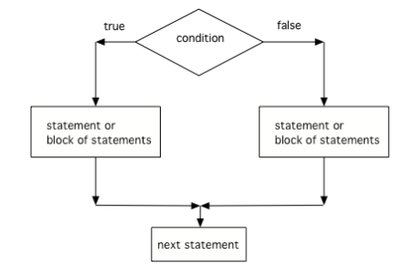

.. include:: ../common.rst

.. qnum::
   :prefix: 2-3-
   :start: 1

|Time90|

if Statements
=================

.. index::
   single: selection
   single: if
   single: else

**If statements** are found in all programming languages as a way to choose between different paths in an algorithm. An if statement is a type of **selection** statement that changes the sequential execution. It affects the flow of control by executing different segments of code based on the value of a **Boolean expression**.

If you took an AP CSP course or used a block programming language like Scratch, you've probably seen if blocks or statements before.  Here's a comparison of ifs in App Inventor blocks, AP CSP block code and pseudocode, and Java ifs.

.. figure:: Figures/BlocksIfComparison.png
    :width: 100%
    :align: center
    :figclass: align-center

    Figure 1: Comparison of App Inventor if block, AP CSP ifs, and Java if statements

One-way selection
------------------

A one-way selection (if statement) is used when there is a segment of code (called the **body** of the if statement) to execute under a certain condition. In this case, the body is executed only when the Boolean expression is true. If the Boolean expression is false, the body of the if statement is skipped and the program continues with the next statement after the if statement.

.. figure:: Figures/Condition.png
    :width: 200px
    :align: center
    :figclass: align-center

    Figure 2: The order that statements execute in a conditional

The open curly brace ``{`` and a close curly brace ``}`` are used to group a block of statements together as the body of the if statement.  It is recommended to always put in the curly braces even if you have just one statement under the if statement. The questions you will see on the AP exam will use curly braces.

.. code-block:: java

    // A single if statement
    if (boolean expression)
        Do statement;
    // Or a single if with {}
    if (boolean expression)
    {
       Do statement;
    }
    // A block if statement: { } required
    if (boolean expression)
    {
       Do Statement1;
       Do Statement2;
       ...
       Do StatementN;
    }

.. note::

    Note that there is no semicolon (;) at the end of the boolean expression in an if statement even if it is the end of that line. The semicolon goes at the end of the whole if statement, often on the next line. Or { } are used to mark the beginning and end of the block of code under the if condition.

Imagine that your cell phone wanted to remind you to take an umbrella if it was currently raining in your area when it detected that you were leaving the house.  This type of thing is going to become more common in the future and it is an area of research called Human Computer Interaction (HCI) or Ubiquitous Computing (computers are everywhere).

.. activecode:: if-raining
   :language: java
   :autograde: unittest

   The variable ``isRaining`` is a boolean variable that is either true or false. If it is true then the message ``Take an umbrella!`` will be printed and then execution will continue with the next statement which will print ``Drive carefully``. Run the code below to see this.
   ~~~~
   public class Test1
   {
       public static void main(String[] args)
       {
           boolean isRaining = true;
           if (isRaining)
           {
               System.out.println("Take an umbrella!");
           }
           System.out.println("Drive carefully");
       }
   }

   ====
   import static org.junit.Assert.*;

   import org.junit.*;

   import java.io.*;

   public class RunestoneTests extends CodeTestHelper
   {
       @Test
       public void testMain() throws IOException
       {
           String output = getMethodOutput("main");
           String expect = "Take an umbrella! \nDrive carefully";
           boolean passed = getResults(expect, output, "Expected output from main");
           assertTrue(passed);
       }
   }

|Exercise| **Check your understanding**

.. fillintheblank:: iffalseOutput

   Try changing the code above to ``boolean isRaining = false;``.  What will it print?

   -    :^Drive carefully$: Correct.  If the boolean is false, it will skip executing the print statement after the if.
        :.*: Try it and see

Relational Operators in If Statements
---------------------------------------

Most if statements have a boolean condition that uses relational operators like ==, !=, <, >, <=, >=, as we saw in the last lesson.

|CodingEx| **Coding Exercise**

.. activecode:: if-relational
   :language: java
   :autograde: unittest
   :practice: T

   Run the following active code a couple times until you see all the possible outputs. It prints out whether a random number is positive or equal to 0. Add another if statement that tests if it is a negative number.
   ~~~~
   public class TestNumbers
   {
       public static void main(String[] args)
       {
           // Get a random number from -10 up to 10.
           int number = (int) (Math.random() * 21) - 10;
           System.out.println("The number is " + number);

           // is it positive?
           if (number > 0)
           {
               System.out.println(number + " is positive!");
           }
           // is it 0?
           if (number == 0)
           {
               System.out.println(number + " is zero!");
           }
           // is it negative?
           // Add another if statement

       }
   }

   ====
   import static org.junit.Assert.*;

   import org.junit.Test;

   import java.io.*;
   import java.util.regex.MatchResult;
   import java.util.regex.Pattern;

   public class RunestoneTests extends CodeTestHelper
   {

       @Test
       public void testPositive()
       {
           String output = "";
           int num = -999, count = 0;

           while (num <= 0 && count < 50)
           {
               output = getMethodOutput("main");
               num = getNumber(output);
               count++;

               if (num == 9999999)
               {
                   getResults(
                           "The number is ##\n## is positive!",
                           output,
                           "Did you forget to print the number?",
                           false);
                   assertTrue(false);
                   return;
               }
           }

           String expect = "The number is " + num + "\n" + num + " is positive!";

           boolean passed = output.contains("positive");
           getResults(expect, output, "Testing positive numbers", passed);
           assertTrue(passed);
       }

       @Test
       public void testZero()
       {
           String output = "";
           int num = -999, count = 0;

           while (num != 0 && count < 50)
           {
               output = getMethodOutput("main");
               num = getNumber(output);
               count++;

               if (num == 9999999)
               {
                   getResults(
                           "The number is ##\n## is zero!",
                           output,
                           "Did you forget to print the number?",
                           false);
                   assertTrue(false);
                   return;
               }
           }

           String expect = "The number is " + num + "\n" + num + " is zero!";

           boolean passed = output.contains("zero");
           getResults(expect, output, "Testing zero", passed);
           assertTrue(passed);
       }

       @Test
       public void testNegative()
       {
           String output = "";
           int num = 999, count = 0;

           while (num >= 0 && count < 50)
           {
               output = getMethodOutput("main");
               num = getNumber(output);
               count++;

               if (num == 9999999)
               {
                   getResults(
                           "The number is ##\n## is negative!",
                           output,
                           "Did you forget to print the number?",
                           false);
                   assertTrue(false);
                   return;
               }
           }

           String expect = "The number is " + num + "\n" + num + " is negative!";

           boolean passed = output.contains("negative");
           getResults(expect, output, "Testing negative numbers", passed);
           assertTrue(passed);
       }

       private int getNumber(String output)
       {
           String regex = "[0-9]+";

           String[] matches =
                   Pattern.compile(regex)
                           .matcher(output)
                           .results()
                           .map(MatchResult::group)
                           .toArray(String[]::new);

           int num = 9999999;

           if (matches.length > 0)
           {
               num = Integer.parseInt(matches[0]);
           }

           if (output.contains("-"))
           {
               num *= -1;
           }

           return num;
       }
   }

.. note::

    A common mistake in if statements is using = instead of == in the condition by mistake. You should always **use ==**, not =, in the condition of an if statement to test a variable. One equal sign (=) assigns a value to a variable, and two equal signs (==) test if a variable has a certain value.

|Exercise| **Check your understanding**

.. mchoice:: mcq-if-trace
   :practice: T
   :answer_a: 3
   :answer_b: 6
   :answer_c: 0
   :answer_d: 4
   :answer_e: The code will not compile
   :correct: c
   :feedback_a: x is changed by the if statements.
   :feedback_b: What happens when x is greater than 2 and then greater than 4? Do both if statements.
   :feedback_c: If x is greater than 2, it's always doubled, and then that result is always greater than 4, so it's set to 0 in the second if statement.
   :feedback_d: x is changed by the if statements.
   :feedback_e: This code will compile.

   Consider the following code segment. What is printed as a result of executing the code segment?

   .. code-block:: java

     int x = 3;
     if (x > 2)
     {
        x = x * 2;
     }
     if (x > 4)
     {
        x = 0;
     }
     System.out.print(x);

Two-way selection
------------------

What if you want to pick between two possibilities?  If you are trying to decide between a couple of things to do, you might flip a coin and do one thing if it lands as heads and another if it is tails.  In programming, you can use the **if** keyword followed by a statement or block of statements and then the **else** keyword also followed by a statement or block of statements.

.. code-block:: java

    // A block if/else statement
    if (boolean expression)
    {
       statement1;
       statement2;
    }
    else
    {
       do other statement;
       and another one;
    }

.. code-block:: java

    // A single if/else statement
    if (boolean expression)
        Do statement;
    else
        Do other statement;

A two-way selection (if-else statement) is used when there are two segments of code—one to be executed when the Boolean expression is true and another segment for when the Boolean expression is false. In this case, the body of the if is executed when the Boolean expression is true, and the body of the else is executed when the Boolean expression is false.

The following flowchart demonstrates that if the condition (the boolean expression) is true, one block of statements is executed, but if the condition is false, a different block of statements inside the else clause is executed.

    Figure 3: The order that statements execute in a if/else statement

.. activecode:: ifHeads
   :language: java
   :autograde: unittest

   Try the following code. If ``isHeads`` is true it will print ``Let's go to the game`` and then ``after conditional``.
   ~~~~
   public class Test2
   {
       public static void main(String[] args)
       {
           boolean isHeads = true;
           if (isHeads)
           {
               System.out.println("Let's go to the game");
           }
           else
           {
               System.out.println("Let's watch a movie");
           }
           System.out.println("after conditional");
       }
   }

   ====
   import static org.junit.Assert.*;

   import org.junit.*;

   import java.io.*;

   public class RunestoneTests extends CodeTestHelper
   {
       @Test
       public void testMain() throws IOException
       {
           String output = getMethodOutput("main");
           String expect = "Let's go to the game\nafter conditional";

           boolean passed = getResults(expect, output, "Expected output from main", true);
           assertTrue(passed);
       }
   }

|Exercise| **Check your understanding**

.. fillintheblank:: falseElse

   Try changing the code above to ``boolean isHeads = false;``.  What line will be printed before the ``after conditional``?

   -    :^Let's watch a movie$: Correct.  If the boolean value is false, the statement following the else will execute
        :.*: Try it and see

If/else statements can also be used with relational operators and numbers like below. If your code has an if/else statement, you need to test it with 2 test-cases to make sure that both parts of the code work.

|CodingEx| **Coding Exercise**

.. activecode:: licenseifelse
   :language: java
   :autograde: unittest
   :practice: T

   Run the following code to see what it prints out when the variable age is set to the value 16. Change the variable age's value to 15 and then run it again to see the result of the print statement in the else part.
   Can you change the if-statement to indicate that you can get a license at age 15 instead of 16? Use 2 test cases for the value of age to test your code to see the results of both print statements.
   ~~~~
   public class DriversLicenseTest
   {
       public static void main(String[] args)
       {
           int age = 16;
           if (age >= 16)
           {
               System.out.println("You can get a driver's license in most states!");
           }
           else
           {
               System.out.println(
                       "Sorry, you need to be older to get a driver's license.");
           }
       }
   }

   ====
   import static org.junit.Assert.*;

   import org.junit.*;

   import java.io.*;

   public class RunestoneTests extends CodeTestHelper
   {
       @Test
       public void testCodeContains() throws IOException
       {
           String target = "age >= 15";
           boolean passed = checkCodeContains("check age >= 15", target);
           assertTrue(passed);
       }
   }

.. parsonsprob:: ifelseevenOdd
   :numbered: left
   :practice: T
   :adaptive:
   :noindent:

   The following program should print out "x is even" if the remainder of x divided by 2 is 0 and "x is odd" otherwise, but the code is mixed up.   Drag the blocks from the left and place them in the correct order on the right.  Click on Check Me to see if you are right.
   -----
   public class EvenOrOdd
   {
   =====
       public static void main(String[] args)
       {
       =====
           int x = 92;
           =====
           if (x % 2 == 0)
           =====
           {
               System.out.println("x is even");
           }
           =====
           else
           =====
           {
               System.out.println("x is odd");
           }
           =====
       }
       =====
   }

|CodingEx| **Coding Exercise**

.. activecode:: scoreifelse
   :language: java
   :autograde: unittest
   :practice: T

   Try the following code. Add an else statement to the if statement that prints out "Good job!" if the score is greater than 9. Change the value of score to test it. Can you change the boolean test to only print out "Good job" if the score is greater than 20?
   ~~~~
   public class ScoreTest
   {
       public static void main(String[] args)
       {
           int score = 8;
           if (score <= 9)
           {
               System.out.println("Try for a higher score!");
           }
       }
   }

   ====
   import static org.junit.Assert.*;

   import org.junit.*;

   import java.io.*;

   public class RunestoneTests extends CodeTestHelper
   {
       @Test
       public void testChangedCode()
       {
           String origCode =
                   "public class ScoreTest   {      public static void main(String[] args)      {     "
                       + "   int score = 8;        if (score <= 9)         {           "
                       + " System.out.println(\"Try for a higher score!\");        }      }} ";

           boolean changed = codeChanged(origCode);
           assertTrue(changed);
       }

       @Test
       public void testCodeContainsElse()
       {
           boolean ifCheck2 = checkCodeContains("else", "else");
           assertTrue(ifCheck2);
       }

       @Test
       public void testCodeContains20()
       {
           String target1 = removeSpaces("score <= 20");
           String target2 = removeSpaces("score > 20");

           String code = removeSpaces(getCode());

           boolean passed = code.contains(target1) || code.contains(target2);
           getResults("true", "" + passed, "Checking for score <= 20 or score > 20", passed);
           assertTrue(passed);
       }

       @Test
       public void testCodeChange1() throws Exception
       {
           String className = "Test1";

           String program = getCode();
           program = program.replace("ScoreTest", className).replace("public class", "class");
           program = program.replaceAll("= *[0-9]+;", "= 25;");

           String output = getMethodOutputChangedCode(program, className, "main");

           String expected = "Good job!";
           boolean passed = output.contains(expected);
           getResults(expected, output, "Checking output if score is 25", passed);
           assertTrue(passed);
       }

       @Test
       public void testCodeChange2() throws Exception
       {
           String className2 = "Test2";

           String program2 = getCode();
           program2 = program2.replace("ScoreTest", className2).replace("public class", "class");
           program2 = program2.replaceAll("= *[0-9]+;", "= 5;");

           String output2 = getMethodOutputChangedCode(program2, className2, "main");

           String expected2 = "Try for a higher score!";
           boolean passed2 = output2.contains(expected2);
           getResults(expected2, output2, "Checking output if score is 5", passed2);
           assertTrue(passed2);
       }
   }

Common Errors with If Statements
---------------------------------

Here are some rules to follow with if statements to avoid some common errors:

   - Always use curly braces (``{`` and ``}``) to enclose the block of statements under the if condition. Java doesn't care if you indent the code—it goes by the ``{ }``.

   - Don't put in a semicolon ``;`` after the first line of the if statement, ``if (test);``. The ``if`` statement is a multiline block of code that starts with the ``if`` condition and then ``{`` the body of the if statement ``}``.

   - Always use ``==``, not ``=``, in the condition of an if statement to test a variable. One ``=`` assigns, two ``==`` tests!

   - The ``else`` statement matches with the closest ``if`` statement. If you want to match an ``else`` with a different ``if`` statement, you need to use curly braces to group the ``if`` and ``else`` together.

|CodingEx| **Coding Exercise**

.. activecode:: if-missing-curlies
   :language: java
   :autograde: unittest
   :practice: T

   The code below doesn't work as expected.  Fix it to only print ``Wear a coat`` and ``Wear gloves`` when isCold is true.
   ~~~~
   public class Test1
   {
       public static void main(String[] args)
       {
           boolean isCold = false;
           if (isCold = true);
               System.out.println("Wear a coat");
               System.out.println("Wear gloves");
       }
   }

   ====
   import static org.junit.Assert.*;

   import org.junit.*;

   import java.io.*;

   public class RunestoneTests extends CodeTestHelper
   {
       @Test
       public void testMain() throws IOException
       {
           String output = getMethodOutput("main");
           String expect = "";
           boolean passed = getResults(expect, output, "Expected output from main if isCold is false");
           assertTrue(passed);
       }

       @Test
       public void testCountCurlies()
       {
           String code = getCode();
           int num = countOccurences(code, "{");
           boolean passed = num >= 3;

           getResults("3", "" + num, "Number of {", passed);
           assertTrue(passed);
       }
   }

|Groupwork| Coding Challenge: Magic 8 Ball
-------------------------------------------------

.. |simulator| raw:: html

   <a href="https://magic-8ball.com/" target="_blank">simulator</a>

.. |mathlesson| raw:: html

   <a href="../Unit1-Using-Objects-and-Methods/topic-1-11-Math.html" target="_blank">Math lesson</a>

Have you ever seen a Magic 8 ball? You ask it a yes-no question and then shake it to get a random response like ``Signs point to yes!``, ``Very doubtful``, etc. If you've never seen a Magic 8 ball, check out this |simulator|. In the exercise below, come up with 8 responses to yes-no questions. Write a program below that chooses a random number from 1 to 8 and then uses if statements to test the number and print out the associated random response from 1-8. If you need help with random numbers, see the |mathlesson| and remember the formula ``(int) (Math.random() * max) + min``.

.. activecode:: challenge-Magic8ball
   :language: java
   :autograde: unittest
   :practice: T

   Complete the ``printRandomResponse()`` method to print out 1 of 8 random responses and the ``lucky()`` method to toss a coin and print out "Lucky!" or "No Luck!" based on the result. Run the code multiple times to see the responses.
   ~~~~
   public class Magic8Ball
   {
       public static void printRandomResponse()
       {
           // 1. Get a random number from 1 to 8

           // 2. Use if statements to test the random number
           //    and print out 1 of 8 random responses

        }
        
        public static void lucky()
        {
            // 3. Use Math.random() to toss a coin to choose between 2 choices
            // 4. Use an if/else statement to test the random number
            //    and print out "Lucky!" or else "No Luck!"
      
        }
        
        public static void main(String[] args)
        {
            String question = "Will it rain tomorrow?";
            System.out.println(question);
            printRandomResponse();
            lucky();
        }
    }
   ====
   import static org.junit.Assert.*;

   import org.junit.*;

   import java.io.*;
   import java.util.ArrayList;

   public class RunestoneTests extends CodeTestHelper
   {
       public RunestoneTests()
       {
           super("Magic8Ball");
       }

       @Test
       public void test1()
       {
           String output = getMethodOutput("main");

           boolean passed = output.length() > 0;

           passed =
                   getResults(
                           "Output length > 0",
                           "Output length of " + output.length(),
                           "Prints a statement",
                           passed);
           assertTrue(passed);
       }

       @Test
       public void test2()
       {
           String[] output = new String[200];

           for (int i = 0; i < output.length; i++)
           {
               output[i] = getMethodOutput("main");
           }

           ArrayList<String> lines = new ArrayList<String>();

           for (int i = 0; i < output.length; i++)
           {
               if (!lines.contains(output[i]))
               {
                   lines.add(output[i]);
               }
           }

           int responses = lines.size();
           boolean passed = lines.size() >= 8;

           passed = getResults("8", "" + responses, "Unique responses", passed);
           assertTrue(passed);
       }

       @Test
       public void test3()
       {
           String code = getCodeWithoutComments();

           int numIfs = countOccurences(code, "if");

           boolean passed = numIfs >= 8;

           passed = getResults("8 or more", "" + numIfs, "Code has at least 8 if statements", passed);
           assertTrue(passed);
       }
       @Test
       public void testElse()
       {
           String target = "else";
           boolean passed = checkCodeContains("else statement in lucky() method", target);
           assertTrue(passed);
       }
   }

.. |JuiceMind| raw:: html

    <a href="https://play.juicemind.com/csawesome2/challenge-Magic8ball" target="_blank" style="text-decoration:underline">JuiceMind</a>

.. |replit| raw:: html

    <a href="https://replit.com/@BerylHoffman/Magic8BallTemplate#Main.java" target="_blank" style="text-decoration:underline">replit</a>

You can make this code more interactive by using the ``Scanner`` class to have the user ask a question first; you can try your code with input in |JuiceMind| or |replit| or a local IDE.

Summary
-------

- (AP 2.3.A.1) Selection statements change the sequential execution of statements.

- (AP 2.3.A.2) An **if statement** is a type of selection statement that affects the flow of control by executing different segments of code based on the value of a Boolean expression.

- (AP 2.3.A.3) A one-way selection (if statement) is used when there is a segment of code to execute under a certain condition. In this case, the body is executed only when the Boolean expression is true.

- **if statements** test a boolean expression and if it is true, go on to execute the body which is the following statement or block of statements surrounded by curly braces  (``{}``) like below.

.. code-block:: java

    // A single if statement
    if (boolean expression)
        Do statement;
    // A block if statement
    if (boolean expression)
    {
       Do Statement1;
       Do Statement2;
       ...
       Do StatementN;
    }

- Relational operators (==, !=, <, >, <=, >=) are used in boolean expressions to compare values and arithmetic expressions.

- If statements can be followed by an associated **else** part to form a 2-way branch:

.. code-block:: java

    if (boolean expression)
    {
        Do statement;
    }
    else
    {
        Do other statement;
    }

- (AP 2.3.A.4) A two-way selection (if-else statement) is used when there are two segments of code—one to be executed when the Boolean expression is true and another segment for when the Boolean expression is false. In this case, the body of the if is executed when the Boolean expression is true, and the body of the else is executed when the Boolean expression is false.

AP Practice
------------

.. mchoice:: AP2-3-1
    :practice: T

    Consider the following code segment.

    .. code-block:: java

        int speed = 35;
        boolean rain = false;

        if (rain)
        {
           speed -= 10;
        }

        if (rain == false)
        {
          speed += 5;
        }

        if (speed > 35)
        {
           speed = speed - 2;
        }

        System.out.println(speed);

    What is printed as a result of executing the code segment?

    - 28

      - Some of the if statement conditions are false so they will not run.

    - 35

      - Take a look at the changes to speed in the if statements.

    - 38

      + Correct! The first if statement condition is false, and the second and third if conditions are true.

    - 25

      - The first if statement would only run if rain is true.

    - 33

      - The second if statement would run since rain is false.

.. mchoice:: AP2-3-2
    :practice: T

    Consider the following code segment.

    .. code-block:: java

        int x = 5;

        if (x < 5)
        {
           x = 3 * x;
        }

        if (x % 2 == 1)
        {
           x = x / 2;
        }

        System.out.print(2*x + 1);

    What is printed as a result of executing the code segment?

    - 3

      - Take a look at the second if statement again!

    - 11

      - Take a look at the second if statement again!

    - 31

      - The first if statement condition is false.

    - 15

      - The first if statement condition is false.

    - 5

      + Correct! The first if statement is not true. The second one is true since 5 is odd, and x becomes 2. And 2*2 + 1 = 5 is printed out.

.. mchoice:: AP2-3-if-else
    :practice: T

    Consider the following code segment where a range of "High", "Middle", or "Low" is being determined
    where x is an int and a "High" is 80 and above, a "Middle" is between 50 - 79, and "Low" is below 50.

    .. code-block:: java

        if (x >= 80)
        {
           System.out.println("High");
        }

        if (x >= 50)
        {
          System.out.println("Middle");
        }
        else
        {
           System.out.println("Low");
        }

    Which of the following initializations for *x* will demonstrate that the code segment will not work as intended?

    - 80

      + This would print out both "High" and "Middle", showing that there is an error in the code. As you will see in the next lesson, one way to fix the code is to add another else in front of the second if.

    - 60

      - This would correctly print out "Middle".

    - 50

      - This would correctly print out "Middle".

    - 30

      - This would print out "Low" which is correct according to this problem description.

    - -10

      - This would print out "Low" which is correct according to this problem description.

