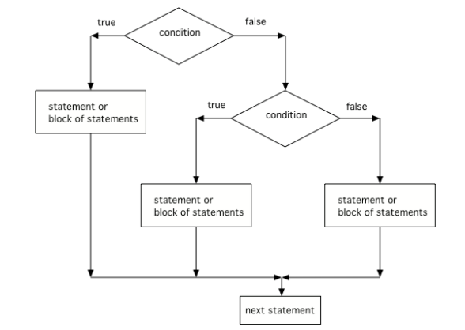

.. include:: ../common.rst

.. qnum::
   :prefix: 2-4-
   :start: 1

|Time45|

Nested if Statements
===================================

.. index::
   single: Nested if statements
   single: Multiway selection
   single: else if

If statements can be nested inside other if statements. Nested if statements consist of if, if-else, or if-else-if statements within if, if-else, or if-else-if statements. The Boolean expression of the inner nested if statement is evaluated only if the Boolean expression of the outer if statement evaluates to true.

.. code-block:: java

    if (boolean expression)
    {   // This nested if is executed if outer if is true
        if (boolean expression)
        {
            statement;
        }
    }

Multiway selection (else if)
-----------------------------

A single if/else statement allows us to select between 2 branches of code. With nested if/else statements, we can pick between 3 or more branches of code. A multi-way selection (if-else-if) is used when there are a series of expressions with different segments of code for each condition. Multi-way selection is performed such that no more than one segment of code is executed based on the first expression that evaluates to true. If no expression evaluates to true and there is a trailing else statement, then the body of the else is executed.

Just add **else if** for each possibility after the first **if**, and **else** before the last possibility like below.

.. code-block:: java

    // 3 way choice with else if
    if (boolean expression)
    {
       statement1;
    }
    else if (boolean expression)
    {
       statement2;
    }
    else
    {
       statement3;
    }

|CodingEx| **Coding Exercise**

.. activecode:: TryElseIf
   :language: java
   :autograde: unittest

   Run the code below and try changing the value of x to get each of the three possible lines in the conditional to print.
   ~~~~
   public class TryElseIf
   {
       public static void main(String[] args)
       {
           int x = 2;
           if (x < 0)
           {
               System.out.println("x is negative");
           }
           else if (x == 0)
           {
               System.out.println("x is 0");
           }
           else
           {
               System.out.println("x is positive");
           }
           System.out.println("after conditional");
       }
   }

   ====
    import static org.junit.Assert.*;
    import org.junit.*;
    import java.io.*;
    import java.util.regex.Pattern;
    import java.util.regex.Matcher;

    public class RunestoneTests extends CodeTestHelper {
        public RunestoneTests() {
            super("TryElseIf"); // for Book
        }

        @Test
        public void test01() {
            String code = getCode();
            String actual = "";
            int num = 2;

            Pattern pattern = Pattern.compile("x\\s*=\\s*(-?\\d+)");
            Matcher matcher = pattern.matcher(code);
            if (matcher.find()) {
                actual = matcher.group();
            }

            boolean passed = !stringMatch(code, "x = 2;");

            getResults("x = ?;", actual, "Checking that x has been changed.", passed);
            assertTrue(passed);
        }

        @Test
        public void test02() {
            String code = getCode();
            String actual = "";
            int num = 2;

            Pattern pattern = Pattern.compile("x\\s*=\\s*(-?\\d+)");
            Matcher matcher = pattern.matcher(code);
            if (matcher.find()) {
                actual = matcher.group();
                //num = Integer.parseInt(matcher.group(1));
            }

            boolean passed = actual.contains("-") || actual.contains("0");

            getResults("x <= 0", actual, "Checking that x is zero or negative", passed);
            assertTrue(passed);
        }

        @Test
        public void test03() {
            String output = getMethodOutput("main").split("\n")[0];
            String expect = "x is negative";

            String code = getCode();
            String actual = "";
            int num = 2;

            Pattern pattern = Pattern.compile("x\\s*=\\s*(-?\\d+)");
            Matcher matcher = pattern.matcher(code);
            if (matcher.find()) {
                actual = matcher.group();
                num = Integer.parseInt(matcher.group(1));
            }

            if (num == 0) expect = "x is zero";

            boolean passed = getResults(expect, output, "Checking for correct output");
            assertTrue(passed);
        }

        private boolean stringMatch(String str1, String str2) {
            str1 = str1.replaceAll("\\s", "");
            str2 = str2.replaceAll("\\s", "");

            return str1.contains(str2);
        }
    }

Here is a flowchart for a conditional with 3 options like in the code above.

    Figure 1: The order that statements execute in a conditional with 3 options: if, else if, and else

.. note::

    Another way to handle 3 or more conditional cases is to use the ``switch`` and ``break`` keywords, but these will not be on the exam.  For a tutorial on using switch see https://docs.oracle.com/javase/tutorial/java/nutsandbolts/switch.html.

|Exercise| **Check your understanding**

.. mchoice:: trace-nested-if
   :practice: T
   :answer_a: x is negative
   :answer_b: x is zero
   :answer_c: x is positive
   :correct: a
   :feedback_a: When x is equal to -5 the condition of x < 0 is true.
   :feedback_b: This will only print if x has been set to 0.  Has it?
   :feedback_c: This will only print if x is greater than zero.  Is it?

   What does the following code print when x has been set to -5?

   .. code-block:: java

     if (x < 0)
     {
        System.out.println("x is negative");
     }
     else if (x == 0)
     {
        System.out.println("x is zero");
     }
     else
     {
        System.out.println("x is positive");
     }

.. mchoice:: trace-nested-ifs2
   :practice: T
   :answer_a: x is negative
   :answer_b: x is zero
   :answer_c: x is positive
   :correct: c
   :feedback_a: This will only print if x has been set to a number less than zero. Has it?
   :feedback_b: This will only print if x has been set to 0.  Has it?
   :feedback_c: The first condition is false and x is not equal to zero so the else will execute.

   What does the following code print when x has been set to 2000?

   .. code-block:: java

     if (x < 0)
     {
        System.out.println("x is negative");
     }
     else if (x == 0)
     {
        System.out.println("x is zero");
     }
     else
     {
        System.out.println("x is positive");
     }

.. mchoice:: trace-nested-ifs3
   :practice: T
   :answer_a: first quartile
   :answer_b: second quartile
   :answer_c: third quartile
   :answer_d: fourth quartile
   :correct: d
   :feedback_a: This will only print if x is less than 0.25.
   :feedback_b: This will only print if x is greater than or equal to 0.25 and less than 0.5.
   :feedback_c: The first only print if x is greater than or equal to 0.5 and less than 0.75.
   :feedback_d: This will print whenever x is greater than or equal to 0.75.

   What does the following code print when x has been set to .8?

   .. code-block:: java

     if (x < .25)
     {
         System.out.println("first quartile");
     }
     else if (x < .5)
     {
         System.out.println("second quartile");
     }
     else if (x < .75)
     {
         System.out.println("third quartile");
     }
     else
     {
         System.out.println("fourth quartile");
     }

|CodingEx| **Coding Exercise**

.. activecode:: ifElseIfDebug
   :language: java
   :autograde: unittest
   :practice: T
   :stdin: 93

   The else-if connection is necessary if you want to hook up conditionals together. In the following code, there are 4 separate if statements instead of the if-else-if pattern. Will this code print out the correct grade? First, trace through the code to see why it prints out the incorrect grade. Use the Code Lens button. Then, fix the code by adding in 3 else's to connect the if statements and see if it works.
   ~~~~
    import java.util.Scanner;

    public class IfDebug
    {
       public static void main(String[] args)
       {
           Scanner scan = new Scanner(System.in);
           int score = scan.nextInt();
           String grade = "";

           if (score >= 90)
           {
               grade = "A";
           }
           if (score >= 80)
           {
               grade = "B";
           }
           if (score >= 70)
           {
               grade = "C";
           }
           if (score >= 60)
           {
               grade = "D";
           }
           else
           {
               grade = "F";
           }

           System.out.println(grade);
       }
   }

   ====
    import static org.junit.Assert.*;
    import org.junit.*;
    import java.io.*;

    public class RunestoneTests extends CodeTestHelper
    {

        public RunestoneTests()
        {
            super("IfDebug"); // for Book
        }

        private static String input1 = "93"; 

        @Test
        public void test01()
        {
            //String input = input1.replaceAll(" ", "\n");
            String x = "95";
            String result = "A";
            String output = getMethodOutputWithInput("main", x);

            boolean passed = output.contains(result);

            passed =
            getResults(
                result,
                output,
                "Result for score = " + x,
                passed);
            assertTrue(passed);
        }

        @Test
        public void test02()
        {
            //String input = input1.replaceAll(" ", "\n");
            String x = "85";
            String result = "B";
            String output = getMethodOutputWithInput("main", x);

            boolean passed = output.contains(result);

            passed =
            getResults(
                result,
                output,
                "Result for score = " + x,
                passed);
            assertTrue(passed);
        }

        @Test
        public void test03()
        {
            String x = "75";
            String result = "C";
            String output = getMethodOutputWithInput("main", x);

            boolean passed = output.contains(result);

            passed =
            getResults(
                result,
                output,
                "Result for score = " + x,
                passed);
            assertTrue(passed);
        }

        @Test
        public void test04()
        {
            String x = "65";
            String result = "D";
            String output = getMethodOutputWithInput("main", x);

            boolean passed = output.contains(result);

            passed =
            getResults(
                result,
                output,
                "Result for score = " + x,
                passed);
            assertTrue(passed);
        }

        @Test
        public void test05()
        {
            String x = "55";
            String result = "F";
            String output = getMethodOutputWithInput("main", x);

            boolean passed = output.contains(result);

            passed =
            getResults(
                result,
                output,
                "Result for score = " + x,
                passed);
            assertTrue(passed);
        }
    }

.. activecode::  ifelseifBattery
  :language: java
  :autograde: unittest
  :practice: T
  :stdin: 75

  Finish the following code so that it prints "Plug in your phone!" if the battery is below 50, "Unplug your phone!" if it is above 100, and "All okay!" otherwise. Change the battery value to test all 3 conditions.
  ~~~~
  import java.util.Scanner;

  public class BatteryTest
  {
      public static void main(String[] args)
      {
          Scanner scan = new Scanner(System.in);
          int battery = scan.nextInt();

          System.out.println("All okay!");
      }
  }

  ====
import static org.junit.Assert.*;
import org.junit.*;
import java.io.*;

public class RunestoneTests extends CodeTestHelper
{

    public RunestoneTests()
    {
        super("BatteryTest", input1); // for Repl.it
        //super("BatteryTest"); // for Book
    }

    private static String input1 = "93"; 

    @Test
    public void test01()
    {
        String x = "95";
        String result = "All okay!";
        String output = getMethodOutputWithInput("main", x);

        boolean passed = output.contains(result);

        passed =
        getResults(
            result,
            output,
            "Result for battery = " + x,
            passed);
        assertTrue(passed);
    }

    @Test
    public void test02()
    {
        String x = "100";
        String result = "Unplug your phone!";
        String output = getMethodOutputWithInput("main", x);

        boolean passed = output.contains(result);

        passed =
        getResults(
            result,
            output,
            "Result for battery = " + x,
            passed);
        assertTrue(passed);
    }

    @Test
    public void test03()
    {
        String x = "45";
        String result = "Plug in your phone!";
        String output = getMethodOutputWithInput("main", x);

        boolean passed = output.contains(result);

        passed =
        getResults(
            result,
            output,
            "Result for battery = " + x,
            passed);
        assertTrue(passed);
    }    
}

Dangling Else Statements
----------------------------

Sometimes with nested ifs we find a **dangling else** that could potentially belong to either if statement.
The rule is that the else clause will always be a part of the closest unmatched if statement in the same block of code, regardless of indentation.

.. code-block:: java

    // Nested if with dangling else
    if (boolean expression)
       if (boolean expression)
          Do statement;
       else  // belongs to closest if
          Do other statement;

|CodingEx| **Coding Exercise**

.. activecode:: danglingelse
   :language: java
   :autograde: unittest
   :practice: T
   :stdin: true false

   Try the following code with a dangling else. Notice that the indentation does not matter to the compiler (but you should make it your habit to use good indentation just as a best practice). How could you get the else to belong to the first if statement?
   ~~~~
    import java.util.Scanner;

    public class DanglingElseTest
    {
        public static void main(String[] args)
        {
           Scanner in = new Scanner(System.in);
            
           boolean sunny = in.nextBoolean();
           boolean hot = in.nextBoolean();

           if (sunny)
               if (hot) 
                  System.out.println("Head for the beach!");
             else // Which if is else attached to??
               System.out.println("Bring your umbrella!");
       }
   }

   ====
    import static org.junit.Assert.*;
    import org.junit.*;
    import java.io.*;

    public class RunestoneTests extends CodeTestHelper
    {

        public RunestoneTests()
        {
            super("DanglingElseTest", input1); // for Repl.it
            //super("DanglingElseTest"); // for Book
        }

        private static String input1 = "true false"; 

        @Test
        public void test01()
        {
            String x = "true false";
            String result = "";
            String output = getMethodOutputWithInput("main", x);

            boolean passed = output.equals(result);

            passed =
            getResults(
                result,
                output,
                "Result for input = " + x,
                passed);
            assertTrue(passed);
        } 

        @Test
            public void test02()
            {
                String x = "true true";
                String result = "Head for the beach!";
                String output = getMethodOutputWithInput("main", x);

                boolean passed = output.equals(result);

                passed =
                getResults(
                    result,
                    output,
                    "Result for input = " + x,
                    passed);
                assertTrue(passed);
            }  

        @Test
            public void test03()
            {
                String x = "false false";
                String result = "Bring your umbrella!";
                String output = getMethodOutputWithInput("main", x);

                boolean passed = output.equals(result);

                passed =
                getResults(
                    result,
                    output,
                    "Result for input = " + x,
                    passed);
                assertTrue(passed);
            }  

        @Test
            public void test04()
            {
                String x = "false true";
                String result = "Bring your umbrella!";
                String output = getMethodOutputWithInput("main", x);

                boolean passed = output.equals(result);

                passed =
                getResults(
                    result,
                    output,
                    "Result for input = " + x,
                    passed);
                assertTrue(passed);
            }  
    }

You can use curly braces (``{}``) to enclose a nested if and have the else clause belong to the top level if clause like below:

.. code-block:: java

    // Nested if with dangling else
    if (boolean expression)
    {
       if (boolean expression)
          Do this statement;
    }
    else  // belongs to first if
      Do that statement;

In fact many experienced Java programmers `always` use curly braces, even when
they are not technically required to avoid this kind of confusion.

|Groupwork| Coding Challenge : Adventure
---------------------------------------------

.. image:: Figures/adventure.jpg
    :width: 200
    :align: left
    :alt: Adventure map

.. |Colossal Cave Adventure| raw:: html

   <a href="https://en.wikipedia.org/wiki/Colossal_Cave_Adventure" target="_blank" style="text-decoration:underline">Colossal Cave Adventure</a>

.. |playing Adventure| raw:: html

   <a href="http://www.web-adventures.org/cgi-bin/webfrotz?s=Adventure" target="_blank" style="text-decoration:underline">playing Adventure</a>

.. |walkthrough| raw:: html

   <a href="https://adventuregamers.com/walkthrough/full/colossal-cave" target="_blank" style="text-decoration:underline">walkthrough</a>

.. |JuiceMind| raw:: html

   <a href="https://play.juicemind.com/csawesome2/Adventure" target="_blank" style="text-decoration:underline">JuiceMind</a>

.. |replit| raw:: html

   <a href="https://replit.com/@BerylHoffman/Adventure#Main.java" target="_blank" style="text-decoration:underline">replit</a>

One of the first games coded for early computers in the 1970s was called |Colossal Cave Adventure|. It was a text-based interactive fiction game where you had to make your way through an elaborate cave. The program only understood one word or phrase commands like north, south, enter, take, etc. You can try |playing adventure| recreated online following some of the commands in this |walkthrough|. Part of the challenge is finding the commands that the code will understand.

In a game like Adventure, else if statements can be used to respond to commands from the user like n, s, e, w. Try the program below (or in an interactive input IDE like |JuiceMind| or |replit|). This current adventure game asks the user whether they want to move n, s, e, or w, but right now only the north direction is coded. It leads to a new method called ``forest()``. 

In the main method, add in **else if** statements to go in the directions of "s" for south, "e" for east, "w" for west, and an else statement that says "You can't go in that direction". Be creative and come up with different locations in each direction. Have each direction call a static method that you will write. The ``forest()`` and ``sea()`` methods are shown as examples for two of the diretions. You will need to change the input below the code to s or e or w and then run to test these branches. How many test-cases are needed to test all branches of your code? You can also connect locations to one another by calling their methods. If you have time, you can expand this game further with more nested if/else statements and come up with a different adventure location. 

.. activecode:: challenge-ElseIf-Adventure
  :language: java
  :autograde: unittest
  :stdin: n e

  This is a text adventure game that lets the user move in 4 different directions. Right now, it only lets the user move north. Add in **else if** statements to go in the directions of "s" for south, "e" for east, "w" for west, and an else statement that says "You can't go in that direction". Be creative and come up with different locations in static methods below main for each direction. There are 5 TODO steps below.
  ~~~~
  import java.util.Scanner;

  public class Adventure 
  {
      private static Scanner scan = new Scanner(System.in);
      
      public static void main(String[] args) 
      {
          // TODO #1: Change the adventure text below. Be creative!
          System.out.println("You are on an island surrounded by water.");
          System.out.println("There is a path to the forest to the north, "
                           + "the sea to the south, ? to the east, and ? to the west."); 
          System.out.println("Which way do you want to go (n,e,s,w)?");
          String command = scan.next(); // use nextLine() in your own IDE
          if (command.equals("n"))
          {
              System.out.println("You go north.");
              forest();
          }
          // TODO #2: Add else-ifs for command equals s, e, or w,
          //  calling a method you will write below for each location.
          // Add an else error message "You can't go in that direction!" 
          

              
        
          System.out.println("End of adventure!");   
          scan.close();
     }    

    // TODO #3 Complete this method 
    // north from main goes to the forest
    public static void forest()
    {
        System.out.println("You enter a dark forest and see ?");
        System.out.println("Do you want to walk e or w?");

        // Add more if/else-if statements for the next action
        //  and call your other methods to move to other locations
        String command = scan.next(); // use nextLine() in your own IDE
        if (command.equals("e"))
        {
            System.out.println("You move east and reach the sea");
            sea();
        }
    }

    // TODO #4: Complete this method. 
    // south from main or east from forest goes to the sea  
    public static void sea()
    {
        // Print a description
        // Ask for input
        // Add more if/else-if statements for the next action
        // Move to different locations

    }
    // TODO #5: Add at least 2 more static methods for 2 more locations 
  
  }
  ====
  import static org.junit.Assert.*;

  import org.junit.*;

  import java.io.*;

  public class RunestoneTests extends CodeTestHelper
  {
    public RunestoneTests()
    {
        super("Adventure");
    }

    @Test
    public void testIf()
    {
        String code = getCode();
        int num = countOccurences(code, "if");
        boolean passed = num >= 5;

        getResults("5", "" + num, "Number of if statements", passed);
        assertTrue(passed);
    }

    @Test
    public void testElseIf()
    {
        String code = getCode();
        int elseif = countOccurences(code, "else if");
        boolean passed = elseif >= 3;

        getResults("" + 3, "" + elseif, "Number of else if statements", passed);
        assertTrue(passed);
    }

    @Test
    public void testElse()
    {
        String code = getCode();
        int num = countOccurences(code, "else") - countOccurences(code, "else if");
        boolean passed = num >= 1;

        getResults("1", "" + num, "Ending else statement", passed);
        assertTrue(passed);
    }
     @Test
      public void testMoreMethods()
      {
          String code = getCode();
          int num = countOccurences(code, "public static");
          boolean passed = num >= 5;

          getResults("5", "" + num, "Number of public static methods", passed);
          assertTrue(passed);
      }
  }

Summary
--------

- (AP 2.4.A.1) Nested if statements consist of if, if-else, or if-else-if statements within if, if-else, or if-else-if statements.
- (AP 2.4.A.2) The Boolean expression of the inner nested if statement is evaluated only if the Boolean expression of the outer if statement evaluates to true.
- (AP 2.4.A.3) A multi-way selection (if-else-if) is used when there are a series of expressions with different segments of code for each condition. Multi-way selection is performed such that no more than one segment of code is executed based on the first expression that evaluates to true. If no expression evaluates to true and there is a trailing else statement, then the body of the else is executed.

.. code-block:: java

    // 3 way choice with else if
    if (boolean expression)
    {
       statement1;
    }
    else if (boolean expression)
    {
       statement2;
    }
    else
    {
        statement3;
    }

AP Practice
------------

.. mchoice:: AP-nested-if-else
    :practice: T

    Assume an int variable x has been properly declared and initialized.
    Which of the following code segments will print out "High" if *x* is 66 and above,
    "Medium" is *x* is between 33-65, and "Low" if *x* is below 33.

    .. code-block:: java

       I.   if (x > 66)
            {
              System.out.println("High");
            }
            else if (x > 33)
            {
              System.out.println("Medium");
            }
            else {
              System.out.println("Low");
            }

       II.  if (x < 33)
            {
              System.out.println("Low");
            }
            else if (x < 66)
            {
              System.out.println("Medium");
            }
            else {
              System.out.println("High");
            }

       III. if (x >= 66)
            {
              System.out.println("High");
            }
            if (x >= 33)
            {
              System.out.println("Medium");
            }
            if (x < 33)
            {
              System.out.println("Low");
            }

    - I only

      - If x = 66, it should print out "High".

    - II only

      + Correct!

    - III only

      - If x is 66, the code in III. will print out more than one thing.

    - I and II only

      - If x = 66, it should print out "High".

    - II and III only

      - If x is 66, the code in III. will print out more than one thing.

