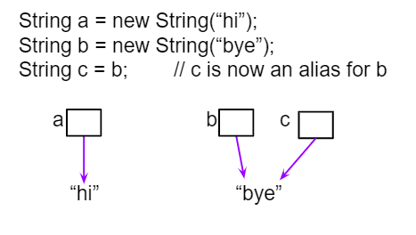
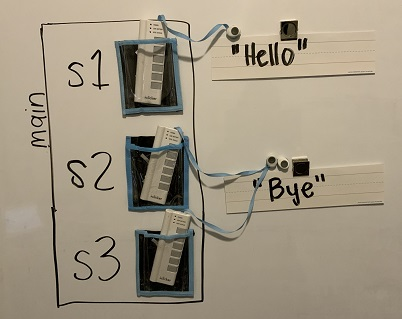
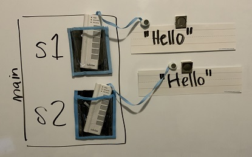

.. include:: ../common.rst

.. qnum::
   :prefix: 2-6-
   :start: 1

|Time90|

Comparing Boolean Expressions (De Morgan's Laws)
=================================================

.. index::
   single: De Morgan's Laws
   single: negation
   single: truth table

What if you heard a rumor about a senior at your high school? And then you heard that the rumor wasn't true - it wasn't a senior at your high school. Which part of "a senior at your high school" wasn't true? Maybe they weren't a senior? Or maybe they didn't go to your high school? You could write this as a logic statement like below using negation (``!``) and the **and** (``&&``) operator since both parts have to be true for the whole statement to be true. (Thank you to Kevin Saxton from Kent School, CT for this example.)

.. code-block:: java

        !(a && b)

        a = "senior"
        b = "at our high school"

        // This means it is not true that (a) it is a senior
        // and (b) someone at our high school.

In this lesson, you will learn about De Morgan's Laws which simplify statements like this. We know that !(a senior at our high school) could mean !(a senior) or !(at our high school). Let's learn more about De Morgan's Laws.

De Morgan's Laws
----------------

De Morgan's Laws were developed by Augustus De Morgan in the 1800s.  They show how to simplify the negation of a complex boolean expression, which is when there are multiple expressions joined by an **and** (``&&``) or **or** (``||``), such as ``(x < 3) && (y > 2)``. When you negate one of these complex expressions, you can simplify it by flipping the operators and end up with an equivalent expression. De Morgan's Laws state the following equivalencies. Here's an easy way to remember De Morgan's Laws: **move the NOT inside, AND becomes OR** and **move the NOT inside, OR becomes AND**.

.. figure:: Figures/demorgan.png
    :width: 400px
    :align: center
    :figclass: align-center

    Figure 1: De Morgan's Laws to simplify complex expressions

In Java, De Morgan's Laws are written with the following operators:

    -  ``!(a && b)`` is equivalent to ``!a || !b``

    -  ``!(a || b)`` is equivalent to ``!a && !b``

Going back to our example above, !(a senior && at our high school) is equivalent to !(a senior) or !(at our high school) using De Morgan's Laws:

.. code-block:: java

        !(a && b) is equivalent to !a || !b

        a = "senior"
        b = "at our high school"

You can also simplify negated boolean expressions that have relational operators like ``<``, ``>``, ``==``. You can move the negation inside the parentheses by flipping the relational operator to its opposite sign. For example, not (c equals d) is the same as saying c does not equal d.  An easy way to remember this is **To move the NOT, flip the sign**. Notice that ``==`` becomes ``!=``, but ``<`` becomes ``>=``,  ``>`` becomes ``<=``, ``<=`` becomes ``>``, and ``>=`` becomes ``<`` where the sign is flipped and an equal sign may also be added or removed.

  - ``!(c == d)`` is equivalent to ``c != d``
  - ``!(c != d)`` is equivalent to ``c == d``
  - ``!(c < d)`` is equivalent to ``c >= d``
  - ``!(c > d)`` is equivalent to ``c <= d``
  - ``!(c <= d)`` is equivalent to ``c > d``
  - ``!(c >= d)`` is equivalent to ``c < d``

Truth Tables
------------

Although you do not have to memorize De Morgan's Laws for the CSA Exam, you should be able to show that two boolean expressions are equivalent. One way to do this is by using truth tables. For example, we can show that ``!(a && b)`` is equivalent to ``!a || !b`` by constructing the truth table below and seeing that they give identical results for the 2 expressions (the last 2 columns in the table below are identical!).

+-------+-------+-----------+----------+
| a     | b     | !(a && b) | !a || !b |
+=======+=======+===========+==========+
| true  | true  | false     | false    |
+-------+-------+-----------+----------+
| false | true  | true      | true     |
+-------+-------+-----------+----------+
| true  | false | true      | true     |
+-------+-------+-----------+----------+
| false | false | true      | true     |
+-------+-------+-----------+----------+

Simplifying Boolean Expressions
----------------------------------

Often, you can simplify boolean expressions to create equivalent expressions. For example, applying De Morgan's Laws to ``!(x < 3 && y > 2)`` yields ``!(x < 3) || !(y > 2)`` as seen in the figure below. This can then be simplified further by flipping the relational operators to remove the not.  So, ``!(x < 3) || !(y > 2)`` is simplified to ``(x >= 3 || y <= 2)`` where the relational operators are flipped and the negation is removed. These two simplification steps are seen below.

.. figure:: Figures/demorganex.png
    :width: 400px
    :align: center
    :figclass: align-center

    Figure 2: An example boolean expression simplified

|CodingEx| **Coding Exercise**

.. activecode:: lcdmtest
   :language: java
   :autograde: unittest

   For what values of x and y will the code below print true?  Try out different values of x and y to check your answer.
   ~~~~
   public class Test1
   {
       public static void main(String[] args)
       {
           int x = 2;
           int y = 3;
           System.out.println(!(x < 3 && y > 2));
       }
   }

   ====
   import static org.junit.Assert.*;

   import org.junit.*;

   import java.io.*;

   public class RunestoneTests extends CodeTestHelper
   {
       @Test
       public void testChangedCode()
       {
           String origCode =
                   "public class Test1 {public static void main(String[] args) { int x = 2; int y = 3;"
                       + " System.out.println(!(x < 3 && y > 2)); } }";

           boolean changed = codeChanged(origCode);
           assertTrue(changed);
       }
   }

|Exercise| **Check your understanding**

.. mchoice:: compareBool1
   :practice: T
   :answer_a: first case
   :answer_b: second case
   :correct: b
   :feedback_a: This will be printed if x is greater or equal to 3 and y is less than or equal to 2.  The first part is true but the second is false.  Since the statements are joined by an and the complex expression is false.
   :feedback_b: This will be printed if x is less than 3 or y is greater than 2.  In this case the first will be false, but the second true so since the statements are joined with an or the complex expression is true.

   What is printed when the following code executes and x equals 4 and y equals 3?

   .. code-block:: java

     int x = 4, y = 3;
     if (!(x < 3 || y > 2))
     {
        System.out.println("first case");
     }
     else
     {
        System.out.println("second case");
     }

.. mchoice:: compareBool2
   :practice: T
   :answer_a: first case
   :answer_b: second case
   :correct: a
   :feedback_a: This will be printed if x is greater than or equal to 3 or y is less than or equal to 2.  In this case x is greater than 3 so the first condition is true.
   :feedback_b: This will be printed if x is less than 3 and y is greater than 2.

   What is printed when the following code executes and x equals 4 and y equals 3?

   .. code-block:: java

     int x = 4, y = 3;
     if (!(x < 3 && y > 2))
     {
        System.out.println("first case");
     }
     else
     {
        System.out.println("second case");
     }

Comparing Objects
-------------------

Comparing objects is a little different than comparing primitive typed values like numbers. Objects can be very complex and have many attribute values or instance variables inside them. For example, the ``Turtle`` objects have many instance variables like ``name``, ``width``, ``height``, ``xPos``, ``yPos``, etc. When comparing two ``Turtle`` objects, we need a specially written **equals** method to compare all of these values. In the next sections, we will take a look at ``String`` objects and the difference between comparing them with ``==`` vs. the ``equals`` method.

String Equality
---------------

.. index::
   pair: String; equality
   pair: String; equals

The **equals** method for Strings compares two strings letter by letter. ``s1.equals(s2)`` is true if ``s1`` and ``s2`` have all the same characters in the same order. With ``Strings`` and other objects, you almost always use ``equals`` instead of ``==`` to check their equality.

When the operator ``==`` or ``!=`` is used to compare object variables, it returns true when the two variables *refer to the same object*. These variables are called **object references** and **aliases** for the same object. With strings this happens when one string variable is set to another.

    Figure 3: String aliases

|CodingEx| **Coding Exercise**

.. activecode:: lcse1
   :language: java
   :autograde: unittest

   If you run the following, what will be printed?
   ~~~~
   public class Test1
   {
       public static void main(String[] args)
       {
           String s1 = new String("Hello");
           String s2 = new String("Bye");
           String s3 = s2; // s3 is now an alias for s2
           System.out.println(s3);
           System.out.println(s2 == s3);
           System.out.println(s2.equals(s3));
       }
   }

   ====
   import static org.junit.Assert.*;

   import org.junit.*;

   import java.io.*;

   public class RunestoneTests extends CodeTestHelper
   {
       @Test
       public void testMain() throws IOException
       {
           String output = getMethodOutput("main");
           String expect = "Bye\ntrue\ntrue\n";
           boolean passed = getResults(expect, output, "Expected output from main", true);
           assertTrue(passed);
       }
   }

The following `video <https://www.youtube.com/watch?v=hhYBVgmC-vw>`_ traces through the code above and shows how ``==`` and ``equals`` work with String objects in memory.

.. youtube:: hhYBVgmC-vw
    :width: 700
    :height: 400
    :align: center
    :optional:

Here's the representation of memory where s2 and s3 refer to the same String object.

    Figure 4: s2 and s3 are aliases referring to the same String object

Equality with New Strings
--------------------------

If you use the ``new`` keyword to create a string, it will always create a new string object. So, even if we create two string objects with new that contain all the same characters in the same order, they will not refer to the same object.

.. activecode:: strEquals
   :language: java
   :autograde: unittest
   :practice: T

   What will the following print? Run the code to see the difference between == and equals with new Strings that are both "Hello". Then, write the if statements described below to test the equality of s1 and s3 to see if capitalization matters.
   ~~~~
   public class Test2
   {
       public static void main(String[] args)
       {
           String s1 = new String("Hello");
           String s2 = new String("Hello");
           System.out.println(s1 == s2);
           System.out.println(s1.equals(s2));

           String s3 = new String("hello");
           // Write an if statement to test if 
           //  s1 and s2 are equal with equals
           // If they are, print "Equals"

           // Write an if/else statement to test if 
           //   s1 and s3 are equal with equals 
           // If they are, print "Equals" 
           // else print "Not Equals".
           // Note that case matters with equals unless you use equalsIgnoreCase

       }
   }
   ====
   import static org.junit.Assert.*;

   import org.junit.*;

   import java.io.*;

   public class RunestoneTests extends CodeTestHelper
   {
       @Test
       public void testMain() throws IOException
       {
           String output = getMethodOutput("main");
           String expect = "false\ntrue\nEquals\nNot Equals\n";
           boolean passed = getResults(expect, output, "Expected output from main");
           assertTrue(passed);
       }
       @Test
       public void testCodeContains1()
       {
           boolean ifStatement = checkCodeContains("if", "if");
           assertTrue(ifStatement);
       }
        @Test
       public void testCount()
       {
           String code = getCode();
           int num = countOccurences(code, ".equals");
           boolean passed = num >= 3;

           getResults("3", "" + num, "Number of equals used", passed);
           assertTrue(passed);
       }
   }

Watch the `video below <https://www.youtube.com/watch?v=xZroaSGhgxA>`_ to see how this code works in memory. Since we used the ``new`` keyword, two different ``String`` objects will be created that each have the characters ``Hello`` in them.  So ``s1 == s2`` will be false since they don't refer to the same object, but ``s1.equals(s2)`` is true since the two different objects contain the same characters in the same order.

.. youtube:: xZroaSGhgxA
    :width: 700
    :height: 400
    :align: center
    :optional:

Here is the representation of these String objects in memory.

    Figure 5: Two strings that are equal with ``equals`` but not with ``==``.

Note that you can also create ``Strings`` using string literals instead of new, like ``String s = "Hello"``. ``String`` literals behave a little differently because they are re-used if they already exist instead of creating a new object. But you should not see questions with string literals and ``==`` on the AP exam.

.. note::

    Only use ``==`` and ``!=`` with primitive types like ``int`` or to test if two strings (or objects) refer to the same object.  Use ``equals``, not ``==`` or ``!=``, with strings to test if they are equal letter by letter, and with other objects to see if all of their relevant attributes are equal.

|Exercise| **Check your understanding**

.. mchoice:: qsbeq_1
   :practice: T
   :answer_a: s1 == s2 && s1 == s3
   :answer_b: s1 == s2 && s1.equals(s3)
   :answer_c: s1 != s2 && s1.equals(s3)
   :correct: b
   :feedback_a: Do s1 and s3 refer to the same object?
   :feedback_b: Yes s2 was set to refer to the same object as s1 and s1 and s3 have the same characters.
   :feedback_c: Did you miss that s2 was set to refer to the same object as s1?

   Which of the following is true after the code executes?

   .. code-block:: java

     String s1 = new String("hi");
     String s2 = new String("bye");
     String s3 = new String("hi");
     s2 = s1;

.. mchoice:: qsbeq_2
   :practice: T
   :answer_a: s1 == s2 && s1 == s3
   :answer_b: s2.equals(s3) && s1.equals(s3)
   :answer_c: s1 != s3 && s1.equals(s3)
   :correct: c
   :feedback_a: Do s1 and s2 refer to the same object?
   :feedback_b: Does s2 have the same characters as s1 or s3?
   :feedback_c: s1 and s3 refer to different string objects but they  contain the same characters "hi" in the same order.

   Which of the following is true after the code executes?

   .. code-block:: java

     String s1 = new String("hi");
     String s2 = new String("bye");
     String s3 = new String("hi");

.. mchoice:: qsbeq_3
   :practice: T
   :answer_a: s1 == s3 && s1.equals(s3)
   :answer_b: s2.equals(s3) && s1.equals(s3)
   :answer_c: !(s1 == s2) && !(s1 == s3)
   :correct: c
   :feedback_a: Since s3 uses the new operator it will not refer to the same object as s1.
   :feedback_b: Do s2 and s3 have the same characters in the same order?
   :feedback_c: All of the variables refer to different objects.  But, s1.equals(s3) would be true since they have the same characters in the same order.

   Which of the following is true after the code executes?

   .. code-block:: java

     String s1 = new String("hi");
     String s2 = new String("bye");
     String s3 = new String("hi");

Comparing with null
--------------------

One common place to use ``==`` or ``!=`` with objects is to compare them to **null** to see if they really exist. Sometimes short-circuit evaluation is used to avoid an error if the object doesn't exist. Remember that **short-circuit evaluation** is used with ``&&`` in Java meaning that if the first part of the if condition is false, it doesn't even have to check the second condition and it knows the whole ``&&`` test is false.

|CodingEx| **Coding Exercise**

.. activecode:: nullTest
   :language: java
   :autograde: unittest

   Try the following code to see a ``NullPointerException`` (if you don't see the exception because of the autograding, you can copy it into the pencil icon scratch area to run it without the grader). Since ``s`` is ``null``, trying to access ``indexOf`` on ``s`` throws an ``NullPointerException``. Comment out the first ``if`` statement and run the program again. The second ``if`` statement avoids the error with shortcircuit evaluation. Because ``s != null`` is ``false``, the rest of the Boolean expression is not evaluated. Now, change ``s`` to set it to ``"apple"`` instead of ``null`` in the first line and run the code again to see that the ``if`` statements can print out that “apple contains an a”.
   ~~~~
   public class NullTest
   {
       public static void main(String[] args)
       {
           String s = null;
           if (s.indexOf("a") >= 0)
           {
               System.out.println(s + " contains an a");
           }
           if (s != null && s.indexOf("a") >= 0)
           {
               System.out.println(s + " contains an a");
           }
       }
   }

   ====
   import static org.junit.Assert.*;

   import org.junit.*;

   import java.io.*;

   public class RunestoneTests extends CodeTestHelper
   {
       public RunestoneTests()
       {
           super("NullTest");
       }

       @Test
       public void testMain()
       {
           String output = getMethodOutput("main");
           String expect = "apple contains an a\napple contains an a";

           boolean passed = getResults(expect, output, "Checking main() gives correct results");
       }

       @Test
       public void testChangedCode()
       {
           String origCode =
                   "public class NullTest { public static void main(String[] args) { String s = null;"
                       + " if (s.indexOf(\"a\") >= 0) {  System.out.println(s + \" contains an a\"); }"
                       + " if (s != null && s.indexOf(\"a\") >= 0) { System.out.println(s + \""
                       + " contains an a\"); } } }";

           boolean changed = codeChanged(origCode);

           assertTrue(changed);
       }

       @Test
       public void testCodeContains()
       {
           String code = getCode();
           String target1 = "String s = ";
           String target2 = "System.out.println(s + \" contains an a\");";

           boolean passed = code.contains(target1) && code.contains(target2);
           getResults("true", "" + passed, "Checking that code has not been removed", passed);
           assertTrue(passed);
       }
   }

The `following video <https://www.youtube.com/watch?v=GPdoHm1K8HA>`_ shows how the null string reference works in memory.

.. youtube:: GPdoHm1K8HA
    :width: 700
    :height: 400
    :align: center
    :optional:

|Groupwork| Coding Challenge : Truth and Tracing Tables POGIL
----------------------------------------------------------------

.. |pogil| raw:: html

   <a href="https://pogil.org/about-pogil/what-is-pogil" target="_blank" style="text-decoration:underline">POGIL</a>

.. |pogil role| raw:: html

   <a href="https://docs.google.com/document/d/1_NfNLWJxaG4qZ2Jd2x8UctDS05twn1h6p-o3XaAcRv0/edit?usp=sharing" target="_blank" style="text-decoration:underline">POGIL role</a>

.. |this worksheet| raw:: html

   <a href="https://docs.google.com/document/d/1Oa_hlzjunYMoRRiMX0A0nFjk7JiTh7EGfIVM9bQ_BIo/edit?usp=sharing" target="_blank" style="text-decoration:underline">this worksheet</a>

We encourage you to do this activity as a |POGIL| (Process Oriented Guided Inquiry Learning) group activity. POGIL groups are self-managed teams of up to 4 students where everyone has a |pogil role| and works together to solve the problems, making sure that everyone in the team participates and learns.

Explore the following problems with your group. You may use |this worksheet| to complete your truth tables. Assume that ``x`` is an integer value, for example -1, 0, or 1.

1. Complete a truth table for the boolean expression: ``!(x == 0 || x >= 1)``. Is this the set of positive or negative numbers?  Is the expression true when ``x`` is positive? Or is it true when ``x`` is negative? You can try out the values when ``x`` is 1 or -1 or 0. Note that 0 is not positive or negative. You can try running the code below to check your answer.

2. Complete a truth table for the boolean expression: ``!(x == 0) && !(x >= 1)``. Is this the set of positive or negative numbers?

3. Complete a truth table for the boolean expression: ``(x != 0) && (x < 1)``. Is this the set of positive or negative numbers?

4. Are the 3 boolean expressions equivalent? Why or why not?

5. Test your answers using the active code window below.

6. Complete the following multiple choice exercises in your POGIL groups. Show the application of DeMorgan's laws or the truth tables in each question on paper.

.. activecode:: challengeBooleanExpr
   :language: java
   :autograde: unittest

   Are these 3 boolean expressions equivalent? 1. ``!(x == 0 || x >= 1)`` , 2. ``!(x == 0) && !(x >= 1)`` , 3. ``(x != 0) && (x < 1)``
   ~~~~
   public class EquivalentExpressions
   {
       public static void main(String[] args)
       {
           int x = -1; // try with x = -1, x = 0, and x = 1
           System.out.println(!(x == 0 || x >= 1));
           // add print statements for expressions in #2 and #3
           // to see if they are equivalent when x = -1, 0, and 1.

       }
   }

   ====
   import static org.junit.Assert.*;

   import org.junit.*;

   import java.io.*;

   public class RunestoneTests extends CodeTestHelper
   {
       @Test
       public void testChangedCode()
       {
           String origCode =
                   "public class EquivalentExpressions { public static void main(String[] args) { int"
                       + " x = -1;  System.out.println(!(x == 0 || x >= 1));   } }";

           boolean changed = codeChanged(origCode);
           assertTrue(changed);
       }

       @Test
       public void testAddedCode()
       {
           boolean output2 = checkCodeContains("(x != 0) && (x < 1)");
           assertTrue(output2);
       }

       @Test
       public void testAddedCode2()
       {
           boolean output3 = checkCodeContains("!(x == 0) && !(x >= 1)");
           assertTrue(output3);
       }
   }

.. mchoice:: qcbdm1
   :practice: T
   :answer_a: (x < 2) || (y > 4)
   :answer_b: (x < 2) && (y > 4)
   :answer_c: (x <= 2) || (y >= 4)
   :answer_d: (x <= 2) && (y >= 4)
   :correct: c
   :feedback_a: The negation of x > 2 is x <= 2
   :feedback_b: Don't forget that the "and" is changed to an "or"
   :feedback_c: The x > 2 becomes x <= 2, the y < 4 becomes y >= 4 and the and changes to or
   :feedback_d: Don't forget that the "and" is changed to an "or"

   Which of the following is the same as the code below?

   .. code-block:: java

     !(x > 2 && y < 4)

.. mchoice:: qcbdm2
   :practice: T
   :answer_a: (x != 2) || (y < 4)
   :answer_b: (x != 2) && (y < 4)
   :answer_c: (x != 2) && (y <= 4)
   :answer_d: (x != 2) || (y <= 4)
   :correct: d
   :feedback_a: The negation of y > 4 is y <= 4
   :feedback_b: Don't forget that the and is changed to an or
   :feedback_c: Don't forget that the and is changed to an or
   :feedback_d: The and is changed to an or, the (x == 2) becomes (x != 2) and (y > 4) becomes (y <= 4)

   Which of the following is the same as the code below?

   .. code-block:: java

     !(x == 2 && y > 4)

.. mchoice:: qcbdm3
   :practice: T
   :answer_a: (x == 5) || (y == 7)
   :answer_b: (x == 5) && (y == 7)
   :answer_c: (x != 5) || (y != 7)
   :answer_d: (x < 5) || (x > 5) || (y > 7) || (y < 7)
   :correct: a
   :feedback_a: The negation of && is || and the negation of != is ==
   :feedback_b: The negation of && is ||
   :feedback_c: The negation of x != 5 is x == 5.  The negation of y !=  7 is y == 7.
   :feedback_d: The negation of == is != which is the same as < or >.  The negation of != is ==.

   Which of the following is the same as the code below?

   .. code-block:: java

     !(x!=5 && y!=7)

.. mchoice:: qcbdm4
   :practice: T
   :answer_a: (x > 5) && (y < 7)
   :answer_b: (x > 5) || (y < 7)
   :answer_c: (x > 5) && (y <= 7)
   :answer_d: (x > 5) || (y <= 7)
   :correct: d
   :feedback_a: The negation of && is || and the negation of y > 7 is y <= 7.
   :feedback_b: The negation of y > 7 is y <= 7.
   :feedback_c: The negation of && is ||.
   :feedback_d: The negation of (x <= 5) is (x > 5).  The negation of && is ||.  The negation of (y > 7) is (y <= 7).

   Which of the following is the same as the code below?

   .. code-block:: java

     !(x<= 5 && y > 7)

**String Equality**: What will the following code print out? Trace through the code by drawing diagrams of what is going on in memory like the figures above, and then show the values of s1, s2, s3, s4 and the output after each line of code. Remember that you can use trace tables to track the values of variables as they change throughout a program. To trace through code, write down a variable in each column in a table and keep track of its value throughout the program as you go through it line by line.

.. code-block:: java

    String s1 = null;
    String s2 = new String("hi");
    String s3 = new String("hi");
    String s4 = new String("bye");
    if (s1 == null)
    {
        s1 = s2;
    }
    if (s1 == s2)
    {
        System.out.println("s1 and s2 refer to the same object");
    }
    if (s2 == s3)
    {
        System.out.println("s2 and s3 refer to the same object");
    }
    if (s3 == s4)
    {
        System.out.println("s3 and s4 refer to the same object");
    }
    if (s1.equals(s2) && s2.equals(s3))
    {
        System.out.println("s1, s2, s3 are equal");
    }

.. shortanswer:: challengetracingStrings

   Write your tracing table here that keeps track of s1, s2, s3, s4 and the output.

Summary
--------

- (AP 2.6.A.1)	Two Boolean expressions are equivalent if they evaluate to the same value in all cases. Truth tables can be used to prove Boolean expressions are equivalent.
- (AP 2.6.A.2) De Morgan’s Laws can be applied to Boolean expressions to create equivalent ones:

  - ``!(a && b)`` is equivalent to ``!a || !b``
  - ``!(a || b)`` is equivalent to ``!a && !b``

- A negated expression with a relational operator can be simplified by flipping the relational operator to its opposite sign.

  - ``!(c == d)`` is equivalent to ``c != d``
  - ``!(c != d)`` is equivalent to ``c == d``
  - ``!(c < d)`` is equivalent to ``c >= d``
  - ``!(c > d)`` is equivalent to ``c <= d``
  - ``!(c <= d)`` is equivalent to ``c > d``
  - ``!(c >= d)`` is equivalent to ``c < d``

- (AP 2.6.B.1)	Two different variables can hold references to the same object. Object references can be compared using ``==`` and ``!=``. (Two object references are considered **aliases** when they both reference the same object.)
- (AP 2.6.B.2)	An object reference can be compared with ``null``, using ``==`` or ``!=``, to determine if the reference actually references an object.
- (AP 2.6.B.3)	Classes often define their own equals method, which can be used to specify the criteria for equivalency for two objects of the class. The equivalency of two objects is most often determined using attributes from the two objects. 

AP Practice
------------

.. mchoice:: apcsa-sample5
   :practice: T
   :answer_a: The value is always true.
   :answer_b: The value is always false.
   :answer_c: The value is true when a has the value false, and is false otherwise.
   :answer_d: The value is true when b has the value false, and is false otherwise.
   :answer_e: The value is true when either a or b has the value true, and is false otherwise.
   :correct: b
   :feedback_a: Try simplifying !(b ||a) or consider what happens if a and b are true.
   :feedback_b: Yes, a && !(b || a) = a && !b && !a. Since (a && !a) can never be true, the result will always be false.
   :feedback_c: Try the expression with a = false. Is the result true?
   :feedback_d: Try the expression with b = false with a = true and then try it with a = false. Is the result ever true?
   :feedback_e: Try the expression with a = true. Is the result true?

    Which of the following best describes the value of the Boolean expression: a && !(b || a)

.. mchoice:: AP-string-equality
    :practice: T

    Consider the following code segment.

    .. code-block:: java

        String message = new String("AP Practice");
        String note = new String("AP Practice");
        String memo = new String("memo");
        int i = 5;

        if (message.equals(note) && !message.equals("memo"))
        {
            message = note;

            if (message == note && message.length() > i)
            {
               i = 3;
               memo = message.substring(i);
            }
        }

    Which of the following expressions evaluate to ``true`` after the code segment above executes?

    - message == note && message == memo

      - Message does not refer to the same object as memo.

    - message.equals(note) && message.equals(memo)

      - Message is not the same string as in memo.

    - message == note && memo.equals("Practice")

      + Yes, both if statements in the code above execute changing message to equal note and memo to equal "Practice".

    - message != note || message == memo

      - Both of these are false.

    - message.equals(memo) || memo.equals(note)

      - Both of these are false.

Review/Practice for Selection
------------------------------

|Time90|

This lesson ends the section on selection. 
You can now do the following review and practice lessons at the end of the unit
and College Board Progress Checks in the AP Classroom.  

.. raw:: html

   <ul>
    <li><a href="selection-summary.html" target="_blank">Selection Summary</a></li>
    <li><a href="selection-practice-mixed-code.html" target="_blank">Selection Practice Mixed Code</a></li>
    <li><a href="selection-practice-mixed-code-toggle.html" target="_blank">Selection Practice Mixed Code Toggle</a></li>
    <li><a href="selection-practice-coding.html" target="_blank">Selection Practice Coding</a></li>
    <li><a href="Exercises-selection.html" target="_blank">Exercises Selection</a></li>
    <li><a href="frq-game-score.html" target="_blank">FRQ Game Score</a></li>
    <li><a href="selection-more-practice-coding.html" target="_blank">Selection More Practice Coding</a></li>
    <li><a href="group-mod-practice.html" target="_blank">Group Mod Practice</a></li>
    <li><a href="magpieindex.html" target="_blank">Magpie Lab</a></li>
    </ul>
   
 