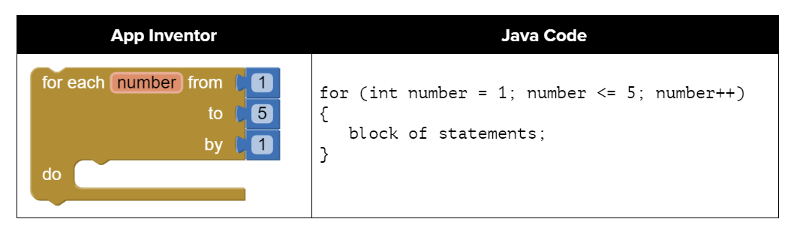
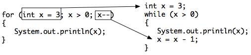

.. include:: ../common.rst

.. qnum::
   :prefix: 2-8-
   :start: 1

|Time90|

For Loops
=========

.. index::
   single: for loop
   pair: loop; for

Another type of loop (or iteration) in Java is a **for loop**. It is usually used when you know how many times you want the loop to execute, as a simple **counter-controlled loop** to do the loop body a set number of times.

If you took AP CSP with a block programming language like App Inventor, you probably used a for loop block like below that looks very similar to Java for loops. If you have used a language like Scratch or Snap!, you may remember the repeat(n) block where you type in a number of times you want the code to be repeated, just like the AP pseudocode REPEAT block. In fact, almost every programming language has a ``for`` or ``repeat`` loop.

    Figure 1: Comparing App Inventor and Java for loops

Three Parts of a For Loop
--------------------------

A for-loop combines all 3 parts of writing a loop in one line to initialize, test, and update the loop control variable.  The 3 parts are separated by semicolons (``;``).  Each of the three parts of a ``for`` loop declaration is optional (initialization; Boolean expression; update), but the semicolons are not optional.

.. code-block:: java

  for (initialize; test; update)
  {
     loop body
  }

The for-loop is almost a shortcut way to write a while loop with all three steps that you need in one line. A ``for`` loop can be rewritten into an equivalent ``while`` loop (and vice versa).

    Figure 2: Showing how a for loop maps to a while loop

Watch the following `video <https://www.youtube.com/watch?v=SEDnzXeb2hU&list=PLHqz-wcqDQIEP6p1_0wOb9l9aQ0qFijrP&index=9&ab_channel=colleenlewis>`_ which compares a while loop and for loop line by line.

.. youtube:: SEDnzXeb2hU
    :width: 700
    :height: 400
    :align: center
    :optional:

Here is a control flow diagram for a for loop. In a ``for`` loop, the initialization statement is only executed once before the first Boolean expression evaluation. The variable being initialized is referred to as a **loop control variable**. The Boolean expression is evaluated immediately after the loop control variable is initialized and then followed by each execution of the increment statement until it is false. In each iteration, the update is executed after the entire loop body is executed and before the Boolean expression is evaluated again. When the loop condition is finally false, we jump out of the loop and continue at the next statement after the body of the loop.

.. figure:: Figures/ForLoopFlow.png
    :width: 250px
    :align: center
    :figclass: align-center

    Figure 2: Control flow in a for loop

|CodingEx| **Coding Exercise**

.. activecode:: forloop
   :language: java
   :autograde: unittest
   :practice: T

   Here is a for loop that counts from 1 to 5. Can you change it to count from 2 to 10?
   ~~~~
   public class ForLoop
   {
       public static void main(String[] args)
       {
           for (int count = 1; count <= 5; count++)
           {
               System.out.println(count);
           }
       }
   }

   ====
   import static org.junit.Assert.*;

   import org.junit.*;

   import java.io.*;

   public class RunestoneTests extends CodeTestHelper
   {
       @Test
       public void testMain() throws IOException
       {
           String output = getMethodOutput("main");
           String expect = "2\n3\n4\n5\n6\n7\n8\n9\n10\n";
           boolean passed = getResults(expect, output, "Expected output from main");
           assertTrue(passed);
       }
   }

.. activecode:: forloopfromwhile
   :language: java
   :autograde: unittest
   :practice: T

   Here is a while loop that counts from 5 to 10. Run it and see what it does. Can you change it to a for-loop? Run your for-loop. Does it do the same thing?
   ~~~~
   public class ForLoopFromWhile
   {
       public static void main(String[] args)
       {
           int count = 5;
           while (count <= 10)
           {
               System.out.println(count);
               count++;
           }
       }
   }

   ====
   import static org.junit.Assert.*;

   import org.junit.Test;

   import java.io.*;

   public class RunestoneTests extends CodeTestHelper
   {
       public RunestoneTests()
       {
           super("ForLoopFromWhile");
       }

       @Test
       public void testMain() throws IOException
       {
           String output = getMethodOutput("main");
           String expect = "5\n6\n7\n8\n9\n10\n";

           boolean passed = getResults(expect, output, "Running main");
           assertTrue(passed);
       }

       @Test
       public void testWhile() throws IOException
       {
           String target = "while (*)";
           boolean passed = checkCodeNotContainsRegex("while loop", target);
           assertTrue(passed);
       }

       @Test
       public void testFor() throws IOException
       {
           String target = "for (int * = #; * ? #; *~)";
           boolean passed = checkCodeContainsRegex("for loop", target);
           assertTrue(passed);
       }
   }

.. note::

   Two common patterns in for-loops are to count from 0 up to an number (using <) or count from 1 to the number including the number (using <=). Remember that if you start at 0 use <, and if you start at 1, use <=. The two loops below using these two patterns both run 10 times. The variable i (for index) is often used as a counter in for-loops.

   .. code-block:: java

      // These loops both run 10 times
      // If you start at 0, use <
      for(int i = 0; i < 10; i++)
      {
         System.out.println(i);
      }
      // If you start at 1, use <=
      for(int i = 1; i <= 10; i++)
      {
         System.out.println(i);
      }

|Exercise| **Check your understanding**

.. mchoice:: mcq-for-1
   :practice: T
   :answer_a: 3 4 5 6 7 8
   :answer_b: 0 1 2 3 4 5 6 7 8
   :answer_c: 8 8 8 8 8
   :answer_d: 3 4 5 6 7
   :correct: d
   :feedback_a: This loop starts with i equal to 3 but ends when i is equal to 8.
   :feedback_b: What is i set to in the initialization area?
   :feedback_c: This would be true if the for loop was missing the change part <code>(int i = 3; i < 8; )</code> but it does increment i in the change part <code>(int i = 3; i < 8; i++)</code>.
   :feedback_d: The value of i is set to 3 before the loop executes and the loop stops when i is equal to 8.  So the last time through the loop i is equal to 7.

   What does the following code print?

   .. code-block:: java

     for (int i = 3; i < 8; i++)
     {
        System.out.print(i + " ");
     }

.. mchoice:: mcq-for-2
   :practice: T
   :answer_a: 3 4 5 6 7 8
   :answer_b: 0 1 2 3 4 5 6 7 8 9
   :answer_c: 1 2 3 4 5 6 7 8 9 10
   :answer_d: 1 3 5 7 9
   :correct: c
   :feedback_a: What is i set to in the initialization area?
   :feedback_b: What is i set to in the initialization area?
   :feedback_c: The value of i starts at 1 and this loop will execute until i equals 11.  The last time through the loop the value of i is 10.
   :feedback_d: This loop changes i by 1 each time in the change area.

   What does the following code print?

   .. code-block:: java

     for (int i = 1; i <= 10; i++)
     {
        System.out.print(i + " ");
     }

.. mchoice:: mcq-for-3
   :practice: T
   :answer_a: 10
   :answer_b: 6
   :answer_c: 7
   :answer_d: 9
   :correct: c
   :feedback_a: This would be true if i started at 0 and ended at 9.  Does it?
   :feedback_b: Since i starts at 3 and the last time through the loop it is 9 the loop executes 7 times (9 - 3 + 1 = 7)
   :feedback_c: How many numbers are between 3 and 9 (including 3 and 9)?
   :feedback_d: This would be true if i started at 0 and the value of i the last time through the loop it was 8.

   How many times does the following method print a ``*``?

   .. code-block:: java

     for (int i = 3; i <= 9; i++)
     {
        System.out.print("*");
     }

.. parsonsprob:: print_evens
   :numbered: left
   :practice: T
   :adaptive:

   The following method has the correct code to print out all the even values from 0 to the value of 10, but the code is mixed up.  Drag the blocks from the left into the correct order on the right and indent them correctly.  Even though Java doesn't require indention it is a good habit to get into. You will be told if any of the blocks are in the wrong order or not indented correctly when you click the "Check Me" button.
   -----
   public static void printEvens()
   {
   =====
      for (int i = 0; i <= 10; i+=2)
      {
   =====
         System.out.println(i);
   =====
      } // end for
   =====
   } // end method

Decrementing Loops
-------------------

You can also count backwards in a loop starting from the last number and decrementing down to 0 or 1. All 3 parts of the loop must change to count backwards including the test of when to stop. For example, ``for (int i=5; i > 0; i--)`` counts from 5 down to 1.

|CodingEx| **Coding Exercise**

.. activecode:: for-bottles-backwards
   :language: java
   :autograde: unittest

   What do you think will happen when you run the code below?  How would it change if you changed line 11 to initialize i's value to 3? Try the Code Lens button to visualize and trace through this code.
   ~~~~
   public class SongTest
   {

       public static void printPopSong()
       {
           String line1 = " bottles of pop on the wall";
           String line2 = " bottles of pop";
           String line3 = "Take one down and pass it around";

           // loop 5 times (5, 4, 3, 2, 1)
           for (int i = 5; i > 0; i--)
           {
               System.out.println(i + line1);
               System.out.println(i + line2);
               System.out.println(line3);
               System.out.println((i - 1) + line1);
               System.out.println();
           }
       }

       public static void main(String[] args)
       {
           SongTest.printPopSong();
       }
   }

   ====
   import static org.junit.Assert.*;

   import org.junit.Test;

   import java.io.*;

   public class RunestoneTests extends CodeTestHelper
   {
       public RunestoneTests()
       {
           super("SongTest");
       }

       @Test
       public void testMain() throws IOException
       {
           String output = getMethodOutput("main");
           String expect = "3 bottles of pop on the wall";

           String expect1 = expect.split("\n")[0];
           String output1 = output.split("\n")[0];

           boolean passed = output.contains(expect);
           passed = getResults(expect1, output1, "Print the song from 3", passed);
           assertTrue(passed);
       }

       @Test
       public void testMain2() throws IOException
       {
           String output = getMethodOutput("main");
           String expect = "5 bottles of pop on the wall";

           boolean passed = !output.contains(expect);

           String expect1 = expect.split("\n")[0];
           String output1 = output.split("\n")[0];

           passed = getResults(expect1, output1, "Do not start loop from 5", passed);
           assertTrue(passed);
       }
   }

The method **printPopSong** prints the words to a song.  It initializes the value of the variable i equal to 5 and then checks if i is greater than 0.  Since 5 is greater than 0, the body of the loop executes.  Before the condition is checked again, i is decreased by 1.  When the value in i is equal to 0 the loop stops executing.

.. activecode:: forloop-backwards
   :language: java
   :autograde: unittest
   :practice: T

   Can you make the loop count by 2s backwards? It should print out 5 3 1? Remember to change all 3 parts of the for loop.
   ~~~~
   public class ForLoop
   {
       public static void main(String[] args)
       {
           for (int count = 1; count <= 5; count++)
           {
               System.out.println(count);
           }
       }
   }

   ====
   import static org.junit.Assert.*;

   import org.junit.*;

   import java.io.*;

   public class RunestoneTests extends CodeTestHelper
   {
       @Test
       public void testMain() throws IOException
       {
           String output = getMethodOutput("main");
           String expect = "5\n3\n1";
           boolean passed = getResults(expect, output, "Expected output from main");
           assertTrue(passed);
       }
   }

|Groupwork| Coding Challenge : Turtles Drawing Shapes
----------------------------------------------------------

Let's use a ``for`` loop to have a Turtle draw different shapes. We encourage you to work in pairs.

The following code has 4 methods to draw shapes using a Turtle t passed in as an argument. 

1. Complete the ``drawSquare`` method to use a ``for`` loop to have the Turtle t draw a square.

2. Complete the ``drawTriangle`` method to use a ``for`` loop to draw an equilateral triangle. How many times should the loop run? It ran 4 times for a square, so how many for a triangle? What angle should you use for the turns? One way to figure this out is to notice that to complete a shape, all the exterior angles should add up to 360 degrees. So, for a square 4x90 = 360. What angle times 3 will give you 360?

3. Complete the ``drawPentagon`` method to use a ``for`` loop to draw a pentagon (which has 5 sides and looks like a stop sign). What external angle should you use for the turns? Remember they have to add up to 360 degrees after 5 turns.

4. Complete the ``drawPolygon`` method to use a ``for`` loop to draw any polygong with ``n`` sides of length ``pixels`` given as arguments. Use ``n`` in your loop for the number of sides (or the number of iterations). Use ``pixels`` for the amount to move forward. Calculate the angle to turn by using a formula that uses n and 360, so that n turns add up to 360 degrees. 

5. In the main method, call the ``drawPolygon`` method to draw a hexagon (6 sides). This method can draw a variety of shapes by just changing the value of the argument n. The power of abstraction! Try drawing other shapes with it. Note that if the turtle runs into walls, it stays there and will mess up the shape, so you may have to move the turtle or go forward smaller amounts.

.. activecode:: challenge-TurtleLoopShapes
    :language: java
    :autograde: unittest
    :datafile: turtleClasses.jar

    Complete the methods below with for-loops to draw a square, triangle, pentagon, and then any polygon using a variable n that holds the number of sides. Call 1 more call to the method drawShapes in main. Note that the angles in the turns have to add up to 360. 
    ~~~~
    import java.awt.*;
    import java.util.*;

    public class TurtleDrawShapes
    {

        public static void drawSquare(Turtle t)
        {
            t.setColor(Color.blue);
            // 1. Complete the following for loop to draw a square with 4 sides
            for(int i = 0;                )                      
            {
                t.forward(100);
                t.turn(90);
            }
        }
        
        public static void drawTriangle(Turtle t)
        {
            t.setColor(Color.green);
            // 2. Use a for loop to draw a triangle
            // External angles of 3 sides add up to 360. 
           

        }
        
        public static void drawPentagon(Turtle t)
        {
            t.setColor(Color.red);
            // 3. Use a for loop to draw a pentagon 
            // External angles of 5 sides add up to 360.
           

        }

        public static void drawShape(Turtle t, int n, int pixels)
        {
            t.setColor(Color.black);
            // 4. Use a for loop to draw a polygon with n sides.
            // Use the argument pixels to move forward.
            // Use 360 and n to determine the angle to turn.
           

        }

        public static void main(String[] args)
        {
            World world = new World(400, 400);
            Turtle yertle = new Turtle(world);
            yertle.penUp(); 
            //move a little to the left
            yertle.moveTo(100, 200);
            yertle.penDown();

            // Draw a square
            drawSquare(yertle);
            // Draw a triangle
            drawTriangle(yertle);
            // Draw a pentagon
            drawPentagon(yertle);

            // Draw shapes of any number of sides and pixels
            drawShape(yertle, 4, 50);
            
            // 5. Call drawShapes to draw a hexagon (6 sides) of length 40
        

            world.show(true);
        }
    }
    ====
    import static org.junit.Assert.*;

    import org.junit.*;

    import java.io.*;

    public class RunestoneTests extends CodeTestHelper
    {
        public RunestoneTests()
        {
            super("TurtleDrawShapes");
        }

        @Test
        public void test1()
        {
            String code = getCode();
            String target = "for (int * = #; * ? *; *~)";

            int num = countOccurencesRegex(code, target);

            boolean passed = num == 4;

            getResults("4", "" + num, "Each method should have a for loop", passed);
            assertTrue(passed);
        }

        @Test
        public void test2()
        {
            boolean passed = checkCodeContains("4", "drawSquare for loop should count up to 4");
            assertTrue(passed);
        }

        @Test
        public void test3()
        {
            boolean passed = checkCodeContains("3", "drawTriangle for loop should count up to 3");
            assertTrue(passed);  
        }

        @Test
        public void test4()
        {
            boolean passed = checkCodeContains("5", "drawPentagon for loop should count up to 5");
            assertTrue(passed);
        }

        @Test
        public void test5()
        {
            String code = getCode();
            String test = "360/n";

            int count = countOccurences(code.replaceAll(" ", ""), test);
            boolean passed = count == 1;

            passed = getResults("true", "" + passed, "Calculates angle correctly using n and 360 and a math operator", passed);
            assertTrue(passed);
        }
        @Test
        public void test6()
        {
            boolean passed = checkCodeContains("drawShape(yertle, 6, 40);", "call drawShape to draw a hexagon (6 sides) of length 40");
            assertTrue(passed);
        }
    }

Summary
-------

- (AP 2.8.A.1) A ``for`` loop is a type of iterative statement. There are three parts in a for loop header: the initialization (of the loop control variable or counter), the Boolean expression (testing the loop variable), and the update (to change the loop variable).
- (AP 2.8.A.2) In a ``for`` loop, the initialization statement is only executed once before the first Boolean expression evaluation. The variable being initialized is referred to as a **loop control variable**. 
- (AP 2.8.A.2) The ``for`` loop  Boolean expression is evaluated immediately after the loop control variable is initialized and then followed by each execution of the increment (or update) statement until it is false. 
- (AP 2.8.A.2) In each iteration of the ``for`` loop, the update is executed after the entire loop body is executed and before the Boolean expression is evaluated again.
- (AP 2.8.A.3) A ``for`` loop can be rewritten into an equivalent ``while`` loop (and vice versa).

AP Practice
------------

.. mchoice:: AP-for-loop-1
    :practice: T

    Consider the following code segment.

    .. code-block:: java

        int count = 0, sum = 0;
        while (count <= 6)
        {
            count++;
            if (count % 2 == 0)
            {
                sum += count;
            }
        }
        System.out.println(sum);

    Which of the following code segments will produce the same output as the code segment above?

    .. code-block:: java

        I.  int sum = 0;
            for(int count = 0; count <= 6; count++)
            {
                count++;
                if (count % 2 == 0)
                {
                     sum += count;
                }
            }
            System.out.println(sum);

        II. int sum = 0;
            for(int i = 0; i <= 6; i += 2)
            {
               sum += i;
            }
            System.out.println(sum);

        III. int sum = 0;
             for(int j = 7; j > 1; j--)
             {
                if (j % 2 == 0)
                {
                     sum += j;
                }
             }
             System.out.println(sum);

    - I and II only

      - Note that I has an extra count++ at the beginning of the loop body that should be deleted.

    - II and III only

      + Correct! In the II, the loop counter increments by 2's making sure it visits only even numbers and III generates the same sum but backwards.

    - I and III only

      - Note that I has an extra count++ at the beginning of the loop body that should be deleted.

    - III only

      - This is partially correct.

    - I, II, and III

      - Note that I has an extra count++ at the beginning of the loop body that should be deleted.

.. mchoice:: AP-for-loop-2
    :practice: T

    Consider the following code segment.

    .. code-block:: java

        int result = 1;
        for(int i = 3; i < 6; i += 2)
        {
          result *= i;
        }
        System.out.println(result);

    Which of the following best explains how changing the for loop header to ``for (int i = 4; i <= 6; i += 2)`` affects the output of the code segment?

    - The output of the code segment will be unchanged.

      - One will multiply odd numbers and the other even numbers.

    - The output will be the same, but the new loop will iterate more times.

      - One will multiply odd numbers and the other even numbers.

    - The output will be different, but both versions of the loop will iterate two times.

      + Correct! One will multiply 3*5 and the other 4*6.

    - The output will be different, and the new loop will iterate more times.

      - The output is different but they both would iterate 2 times.

    - This will cause an error.

      - It will not cause an error.
