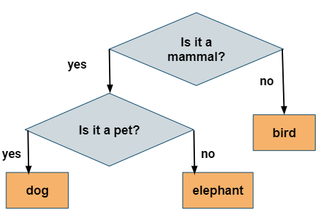

.. include:: ../common.rst

|Time90|

Unused Input Challenges
=========================

20 Questions and Guessing Game

|Groupwork| Programming Challenge : 20 Questions
------------------------------------------------

.. |Akinator| raw:: html

   <a href="https://en.akinator.com/" style="text-decoration:underline" target="_blank">Akinator</a>

Have you ever played 20 Questions? 20 Questions is a game where one person thinks of an object and the other players ask up to 20 questions to guess what it is.

There is great online version called |Akinator| that guesses whether you are thinking of a real or fictional character by asking you questions. Akinator is a simple Artificial Intelligence algorithm that uses a decision tree of yes or no questions to pinpoint the answer.
Although Akinator needs a very large decision tree, we can create a  guessing game for animals using a much smaller number of if-statements.

The Animal Guessing program that we will make uses the following decision tree:

    Figure 2: Animal Guessing Game Decision Tree

.. |JuiceMind| raw:: html

    <a href="https://play.juicemind.com/dashboard/teams/Mk2wWMTqPkekcxTDWqRn/item/f99c4277-4ac8-4daf-b7b7-fb3b81cf380a#fdf19797-2354-4be2-9ccc-8c68ac4203ad" target="_blank" style="text-decoration:underline">JuiceMind</a>

.. |replit| raw:: html

    <a href="https://replit.com/@BerylHoffman/GuessAnimal#Main.java" target="_blank" style="text-decoration:underline">replit</a>

1. Try the Animal Guessing game below. In Runestone, you need to provide the input below the code before you run it. It is set to answer the questions with y and y. Run the code to see the result. Change the input below the coding window to y n and n to guess the other animals. It can only guess 3 animals. Let's add more! To see this program in an interactive input IDE, try it in |JuiceMind| or |replit| or your local IDE (where you should change the lines with ``scan.next()`` to ``scan.nextLine()``).

2. In the very last else clause, the program knows that it is not a mammal and it guesses a bird. Let's add to that part. Instead of saying "I guess a bird! Click on run to play again.", change it to ask a question that distinguishes between birds and reptiles (for example does it fly?). Then, get their response and use an if/else statement to guess "bird" or "turtle" (or another reptile). For example, here's how we decided to choose between a dog or an elephant. We asked the question "Is it a pet?", got the response, and then with an if statement on the y/n answer we determined dog or elephant. You would use similar code to distinguish between a bird and a turtle. Run your code and test both possibilities!

.. code-block:: java

   System.out.println("Is it a pet (y/n)?");
   answer = scan.next(); // or nextLine() in your own IDE
   if (answer.equals("y"))
   {
       System.out.println("I guess a dog! Click on run to play again.");
   }
   else
   {
       System.out.println("I guess an elephant! Click on run to play again.");
   }

3. Did you notice that when it asked "Is it a pet?" and you said "y", it immediately guessed "dog"? What if you were thinking of a cat? Try to come up with a question that distinguishes dogs from cats and put in code in the correct place (in place of the code that prints out "I guess a dog") to ask the question, get the answer, and use an if/else to guess cat or dog. Run your code and test both possibilities by adding more input.

4. How many animals can your game now guess? How many test-cases are needed to test all branches of your code?

5. If your class has time, your teacher may ask you to expand this game or to create a similar game to guess something else like singers or athletes. Spend some time planning your questions on paper and drawing out the decision tree before coding it.

.. activecode:: challenge-IfElse-20Questionss
  :language: java
  :autograde: unittest
  :stdin: y y y

  The code below is a simple 20 questions game that guesses an animal. In Runestone, you need to provide the input below the code before you run it. It is set to answer the questions with y and y. Run the code to see the result. Change the input to guess the other animals. It can only guess 3 animals. Let's add more! Add a question and if/else statement on line 20 to distinguish a cat and a dog and on line 31 to distinguish a turtle and a bird. Add more input below the code to test your new questions.
  ~~~~
  import java.util.Scanner;

  public class GuessAnimal 
  {
    public static void main(String[] args) 
    {
        System.out.println("\n\nLet's play 20 questions. Choose an animal and I will try to guess it!");
        Scanner scan = new Scanner(System.in);
    
        System.out.println("Is it a mammal (y/n)?");
        String answer = scan.next(); // in other IDEs, use nextLine()
        if (answer.equals("y")) 
        {
            System.out.println("Is it a pet (y/n)?");
            answer = scan.next();
            if (answer.equals("y")) 
            {
                // Uncomment the question and answer code below.
                // Add in your question to distinguish a cat vs. a dog 
                // System.out.println("change this question");
                // answer = scan.next();
                // Add another if/else to guess a cat vs. a dog 

                System.out.println("I guess a dog! Click on run to play again.");
            }
            else 
            { 
                System.out.println("I guess an elephant! Click on run to play again.");   
            }
        }      
        else { // not a mammal
            // Uncomment the question and answer code below.
            // Add in your question to distinguish a turtle vs. a bird 
            // System.out.println("change this question");
            // answer = scan.next();
            // Add another if/else to guess a turtle vs. a bird 

            System.out.println("I guess a bird! Click on run to play again.");
        }      
    

    }
  }

  ====
  import static org.junit.Assert.*;

  import org.junit.*;

  import java.io.*;

  public class RunestoneTests extends CodeTestHelper
  {
      private static int goal = 5;

      private static String input1 = "y y y y y y y y y y y y y y y y y y y y y y y y y y";
      private static String input2 = "n n n n n n n n n n n n n n n n n n n n n n n n n n";
      private String output1, output2;

      @Test
      public void test1()
      {
          //String input = input1.replaceAll(" ", "\n");
          String input = input1;
          String output = getMethodOutputWithInput("main", input);
          output1 = output;

          String[] lines = output.split("\n");

          boolean passed = lines.length >= goal;

          passed =
                  getResults(
                          goal + "+ lines",
                          "" + lines.length + " lines",
                          "Outputs at least " + goal + " lines",
                          passed);
          assertTrue(passed);
      }

      @Test
      public void test2()
      {
          //String input = input2.replaceAll(" ", "\n");
          String input = input2;
          String output = getMethodOutputWithInput("main", input);
          output2 = output;

          if (output1 == null)
          {
              //input = input1.replaceAll(" ", "\n");
                input = input1;
              output1 = getMethodOutputWithInput("main", input);
          }

          boolean passed = !output1.equals(output2);

          passed =
                  getResults(
                          "true",
                          "" + passed,
                          "Outputs different results for different inputs",
                          passed);
          assertTrue(passed);
      }

      @Test
      public void test3()
      {
          String code = getCode();
          int num = countOccurences(code, "if");
          boolean passed = num >= 4;

          getResults("4+", "" + num, "Number of if statements", passed);
          assertTrue(passed);
      }

      @Test
      public void test4()
      {
          String code = getCode();
          int numIfs = countOccurences(code, "if");
          int numElse = countOccurences(code, "else");
          boolean passed = numIfs == numElse;

          getResults(numIfs + " & " + numIfs, numIfs + " & " + numElse, "Ifs & Elses Match", passed);
          assertTrue(passed);
      }

      @Test
      public void test5()
      {
          String code = getCode();
          int num = countOccurences(code, "scan.next");
          boolean passed = num >= 4;

          getResults("4+", "" + num, "Number of scan.next", passed);
          assertTrue(passed);
      }
  }

|Groupwork| Coding Challenge : Guessing Game
-------------------------------------------------

We encourage you to work in pairs on this guessing game. In the guessing game, the computer picks a random number from 0-100 and you have to guess it. After each guess, the computer will give you clues like "Too high" or "Too low". Here's the pseudocode for the guessing game. **Pseudocode** is an English description or plan of what your code will do step by step. What's the loop variable for this program? Can you identify the 3 steps of writing this loop with respect to the loop variable?

1. Choose a random number from 0-100
2. Get the first guess
3. Loop while the guess does not equal the random number,

   - If the guess is less than the random number, print out "Too low!"
   - If the guess is greater than the random number, print out "Too high!"
   - Get a new guess (save it into the same variable)

4. Print out something like "You got it!"

As an extension to this project, you can add a counter variable to count how many guesses the user took and print it out when they guess correctly.

When you finish and run your program, what is a good guessing strategy for guessing a number between 0 and 100? What was your first guess? One great strategy is to always split the guessing space into two and eliminating half, so guessing 50 for the first guess. This is called a **divide and conquer** or **binary search** algorithm. If your guess is between 0-100, you should be able to guess the number within 7 guesses. Another extension to this challenge is to test whether the user got it in 7 guesses or less and provide feedback on how well they did.

.. |Scanner class| raw:: html

   <a href="https://www.w3schools.com/java/java_user_input.asp" target="_blank">Scanner class</a>

.. |JuiceMindGuess| raw:: html

   <a href="https://play.juicemind.com/dashboard/teams/Mk2wWMTqPkekcxTDWqRn/item/fce2f5ea-b4fe-4acd-9190-f24c22891a27#bb8a2ea3-cfb8-401f-9f58-62605edf4106" target="_blank" style="text-decoration:underline">JuiceMind</a>

.. |replitGuess| raw:: html

   <a href="https://replit.com/@BerylHoffman/Guessing-Game#Main.java" target="_blank">replit</a>

For this project, you can use the |Scanner class| for input and |JuiceMindGuess| or |replitGuess| or another IDE of your choice.

.. activecode:: challenge4-1-loop-GuessingGame-autograde
  :language: java
  :autograde: unittest

  Complete the code for the guessing game below. If you did this code in |JuiceMindGuess| or |replitGuess| or your own IDE, you can paste in your code to see if it passes the autograder tests. Note that this code will only run with the autograder's input and will not ask the user for input.
  ~~~~
  import java.util.Scanner;

  public class Main 
  {
    public static void main(String[] args) 
    {
        Scanner scan = new Scanner(System.in);
        // Choose a random number from 0-100 
        

        // Ask the user to guess a number from 0 to 100 
        // Get the first guess using scan.nextInt();
    

        // Loop while the guess does not equal the random number,

        // If the guess is less than the random number, print out "Too low!"
    
        // If the guess is greater than the random number, print out "Too high!"
    
        // Get a new guess (save it into the same variable)
    

        // Print out something like "You got it!"

    }
  }
  ====
  import static org.junit.Assert.*;

  import org.junit.*;

  import java.io.*;

  public class RunestoneTests extends CodeTestHelper
  {
      public RunestoneTests()
      {
          super("Main", input1.replaceAll(" ", "\n")); // For Book
          // super("GuessingGame", input1.replaceAll(" ", "\n")); // For replit.com
      }

      private static int goal = 1;
      private static String input1 =
              "100 99 98 97 96 95 94 93 92 91 90 89 88 87 86 85 84 83 82 81 80 79 78 77 76 75 74 73"
                  + " 72 71 70 69 68 67 66 65 64 63 62 61 60 59 58 57 56 55 54 53 52 51 50 49 48 47"
                  + " 46 45 44 43 42 41 40 39 38 37 36 35 34 33 32 31 30 29 28 27 26 25 24 23 22 21"
                  + " 20 19 18 17 16 15 14 13 12 11 10 9 8 7 6 5 4 3 2 1 0";
      private static String input2 =
              "0 1 2 3 4 5 6 7 8 9 10 11 12 13 14 15 16 17 18 19 20 21 22 23 24 25 26 27 28 29 30 31"
                  + " 32 33 34 35 36 37 38 39 40 41 42 43 44 45 46 47 48 49 50 51 52 53 54 55 56 57"
                  + " 58 59 60 61 62 63 64 65 66 67 68 69 70 71 72 73 74 75 76 77 78 79 80 81 82 83"
                  + " 84 85 86 87 88 89 90 91 92 93 94 95 96 97 98 99 100";
      private String output1, output2;

      @Test
      public void test1()
      {
          String input = input1.replaceAll(" ", "\n");
          String output = getMethodOutputWithInput("main", input);
          output1 = output;

          String[] lines = output.split("\n");

          boolean passed = lines.length >= goal;

          passed =
                  getResults(
                          ">" + goal + " lines",
                          "" + lines.length + " lines",
                          "Outputs at least " + goal + " lines",
                          passed);
          assertTrue(passed);
      }

      @Test
      public void test2()
      {
          String input = input2.replaceAll(" ", "\n");
          String output = getMethodOutputWithInput("main", input);
          output2 = output;

          if (output1 == null)
          {
              input = input1.replaceAll(" ", "\n");
              output1 = getMethodOutputWithInput("main", input);
          }

          boolean passed = !output1.equals(output2);

          passed =
                  getResults(
                          "true",
                          "" + passed,
                          "Outputs different results for different inputs",
                          passed);
          assertTrue(passed);
      }

      @Test
      public void test3()
      {
          String code = getCode();
          int num = countOccurences(code, "if");
          boolean passed = num >= 1;

          getResults(">=1", "" + num, "Number of if statements", passed);
          assertTrue(passed);
      }

      @Test
      public void test4()
      {
          // boolean passed = checkCodeContainsRegex("while loop", "while(*)");
          boolean passed = checkCodeContains("while loop", "while");
          assertTrue(passed);
      }

      @Test
      public void test5()
      {
          String input = input1.replaceAll(" ", "\n");
          int[] values = new int[10];

          for (int i = 0; i < values.length; i++)
          {
              String output = getMethodOutputWithInput("main", input);
              values[i] = output.split("\n").length;
          }

          boolean passed = false;
          for (int i = 0; i < values.length - 1; i++)
          {
              if (values[i] != values[i + 1]) passed = true;
          }

          passed = getResults("true", "" + passed, "Guesses random numbers", passed);
          assertTrue(passed);
      }
  }
