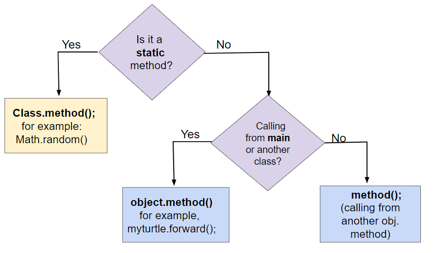
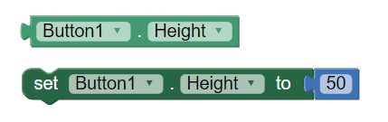

.. include:: ../common.rst

.. qnum::
   :prefix: 3-5-
   :start: 1

|Time90|

Methods: How to Write Them
============================

.. index::
    single: method
    single: return
    single: parameter
    single: argument
    single: abstraction
    pair: method; parameter
    pair: method; argument
    pair: method; return
    single: void method
    single: non-void method
    single: accessor method
    single: getter
    single: mutator method
    single: setter

In object-oriented programming, the three main parts of a class are:

- the **instance variables** which hold attributes or values associated with each object, 
- the **constructors** whose job is to initialize the instance variables, 
- and the **methods** which contain the code for the behaviors of an object and which can use the instance variables defined in the class.

In Unit 1, we used ``Turtle`` objects and called methods like ``forward`` which changed the ``x`` and ``y`` coordinates (instance variables) of the turtle. We also defined static methods that did not work with objects.  In this unit, we will learn how to write our own methods in our own classes.

Defining and Calling Methods
------------------------------

A **method** is a block of code that performs a specific task. Methods are defined inside a class and can access the instance variables of the class.  For example, the print() method below prints the instance variables of the Person class. Methods are usually public. 

.. code-block:: java

    public class Person
    {
        // instance variables
        private String name;
        private String email;

        // Method definition: uses instance variables name and email
        public void print()
        {
            System.out.println("Name: " + name);
            System.out.println("Email: " + email);
        }

        public static void main(String[] args)
        {
            Person p = new Person();
            p.print();  // Method call
        }
    }

There are three steps to creating and calling a method:

1. **Object of the Class**: Declare an object of your class in the main method or from outside the class.

    .. code-block:: java

       // Step 1: declare an object in main or from outside the class
       Classname objectName = new Classname();

2. **Method Call**: whenever you want to use the method, call objectName.methodName();

    .. code-block:: java

       // Step 2: call the object's method
       objectName.methodName(); //Step 2

3. **Method Definition**:  write the method's **header** and **body** code like below:

    .. code-block:: java

        // Step 3: Define the method in the class
        // method header
        public void methodName()
        {
              // method body for the code
        }

The following flowchart can be used to compare three different ways of calling methods. Class (static) methods are called using the class name. Instance methods which are discussing in this lesson are called using an object of the class. If you are calling the instance method from the main method or from another class, you must first create an object of that class and then call its methods using ``object.methodName()``. If you are calling the method from within the same class, you can just call the method using ``methodName()`` which will refer to the current object.



    Figure 1: Comparing Method Calls to Static and Instance Methods

void Methods
---------------

A **void method** is a method that does not return a value. It is used when you want to perform an action but do not need to return a value. The method header for a void method looks like this:

.. code-block:: java

    public void methodName()
    {
        // method body
    }

The ``print`` method above is a void method. It does not return a value, but it does print out the name and email of the person. In the sections below, we will learn about setter methods that are also void methods.

Non-void Methods
------------------

A **non-void method** is a method that returns a single value. Its body must have a **return** statement, usually at the end, that returns a variable's value or an expression. Its header includes the **return type** (the type of the value in the return statement) in place of the keyword ``void``. The method header for a non-void method looks like this:

.. code-block:: java

    public returnType methodName()
    {
        // method body
        return value;
    }

In Unit 1, we used static non-void methods like `` Math.random()`` which returned a random number. We also used non-void methods that belonged to Turtle objects like ``getXPos()`` and ``getYPos()`` that returned the x and y coordinates of the turtle. The most common non-void methods in Java are methods that start with ``get`` and return the value of an instance variable. We will learn about these in the next section.

In non-void methods, a return expression compatible with the return type is evaluated, and the value is returned. This is referred to as **return by value**.
The ``return`` keyword is used to return the flow of control to the point where the method or constructor was called. Any code that is sequentially after a return statement will never be executed, so usually non-void methods end with a return statement. Executing a return statement inside a selection or iteration statement will halt the statement and exit the method or constructor.

.. note::

    Some common errors when writing and using non-void methods are:

    - Forgetting a return type like ``int`` before the method name.

    - Forgetting to use the ``return`` keyword to return a value at the end of
      the method.

    - Returning too soon from a method. If you have a return statement in a
      selection or iteration statement, the method will exit at that point and not execute the rest of the code.  

    - Forgetting to do something with the value returned from a method, like
      assigning it to a variable or printing it out.


Accessors / Getters
----------------------

Since the instance variables in a class are usually marked as ``private`` to the
class, if you want code outside the class to be able to access the value of an
instance variable, you need to write what is formally called an **accessor
methods** but which everyone actually just calls a **getter**. A getter is a
``public`` method that takes no arguments and returns the value of the
``private`` instance variable. 

If you used a language like App Inventor in an AP CSP class, you may have used
setter and getter blocks. In App Inventor, you cannot make your own classes, but
you can declare UI objects like Button1, Button2 from the Button class and use
their get/set methods for any property like below. (We'll talk about setters in
Java in the next section.)



    Figure 2: App Inventor Set and Get blocks for object Button1

You don't need to write a getter for every instance variable in a class but if
you want code outside the class to be able to get the value of one of your
instance variables, you'll need to write a getter that looks like the following.

.. code-block:: java

  class ExampleTemplate
  {

      // Instance variable declaration
      private typeOfVar varName;

      // Accessor (getter) method template
      public typeOfVar getVarName()
      {
          return varName;
      }
  }

Notice that the getter’s return type is the same as the type of the instance
variable and all the body of the getter does is return the value of the variable
using a ``return`` statement. (We'll talk more about the ``return`` statement in
section 5.6 but for now just notice that it is followed by an expression whose
value must be the same type as the return type in the method's header. In a
getter that will definitely be true as long as the type of the instance variable
and the return type of the getter are the same.)

Here's an example of an accessor method called ``getName`` for the ``Student``
class which also demonstrates how to call ``getName`` using a ``Student``
object:

.. code-block:: java

   class Student
   {

     //Instance variable name
     private String name;

     /** getName() example
      *  @return name */
     public String getName()
     {
        return name;
     }

     public static void main(String[] args)
     {
        // To call a get method, use objectName.getVarName()
        Student s = new Student();
        System.out.println("Name: " + s.getName() );
     }

Note, that getters only return the *value* of the variable. 


.. |Java visualizer1| raw:: html

   <a href="http://www.pythontutor.com/visualize.html#code=public%20class%20TesterClass%20%0A%20%20%7B%0A%20%20%20%20%20//%20main%20method%20for%20testing%0A%20%20%20%20%20public%20static%20void%20main%28String%5B%5D%20args%29%0A%20%20%20%20%20%7B%0A%20%20%20%20%20%20%20%20Student%20s1%20%3D%20new%20Student%28%22Skyler%22,%20%22skyler%40sky.com%22,%20123456%29%3B%0A%20%20%20%20%20%20%20%20System.out.println%28%22Name%3A%22%20%2B%20%20s1.getName%28%29%20%29%3B%0A%20%20%20%20%20%20%20%20System.out.println%28%22Email%3A%22%20%2B%20%20s1.getEmail%28%29%20%29%3B%0A%20%20%20%20%20%20%20%20System.out.println%28%22ID%3A%20%22%20%2B%20s1.getId%28%29%20%29%3B%0A%20%20%20%20%20%7D%0A%20%20%20%7D%0A%20%20%0A%20%20class%20Student%20%0A%20%20%7B%0A%20%20%20%20%20private%20String%20name%3B%0A%20%20%20%20%20private%20String%20email%3B%0A%20%20%20%20%20private%20int%20id%3B%0A%20%20%20%20%20%0A%20%20%20%20%20public%20Student%28String%20initName,%20String%20initEmail,%20int%20initId%29%0A%20%20%20%20%20%7B%0A%20%20%20%20%20%20%20%20name%20%3D%20initName%3B%0A%20%20%20%20%20%20%20%20email%20%3D%20initEmail%3B%0A%20%20%20%20%20%20%20%20id%20%3D%20initId%3B%0A%20%20%20%20%20%7D%0A%20%20%20%20%20%0A%20%20%20%20%20//%20accessor%20methods%20-%20getters%20%0A%20%20%20%20%20/**%20getName%28%29%20%20%40return%20name%20*/%0A%20%20%20%20%20public%20String%20getName%28%29%20%0A%20%20%20%20%20%7B%20%0A%20%20%20%20%20%20%20%20return%20name%3B%0A%20%20%20%20%20%7D%0A%20%20%20%20%20/**%20getEmail%28%29%20%20%40return%20email%20*/%0A%20%20%20%20%20public%20String%20getEmail%28%29%20%0A%20%20%20%20%20%7B%20%0A%20%20%20%20%20%20%20%20return%20email%3B%0A%20%20%20%20%20%7D%0A%20%20%20%20%20/**%20getName%28%29%20%20%40return%20id%20*/%0A%20%20%20%20%20public%20int%20getId%28%29%20%0A%20%20%20%20%20%7B%20%0A%20%20%20%20%20%20%20%20return%20id%3B%0A%20%20%20%20%20%7D%0A%20%20%7D&cumulative=false&curInstr=26&heapPrimitives=nevernest&mode=display&origin=opt-frontend.js&py=java&rawInputLstJSON=%5B%5D&textReferences=false" target="_blank"  style="text-decoration:underline">Java visualizer</a>

Try the following code. Note that this active code window has 2 classes! The main method is in a separate **Tester** or **Driver** class. It does not have access to the private instance variables in the other Student class. Note that when you use multiple classes in an IDE, you usually put them in separate files, and you give the files the same name as the public class in them. In active code and IDEs, you can put 2 classes in 1 file, as demonstrated here, but only 1 of them can be public and have a main method in it. You can also view the fixed code in the |Java visualizer1|.

|CodingEx| **Coding Exercise**


.. activecode:: StudentObjExample
  :language: java
  :autograde: unittest
  :practice: T

  Try the following code. Note that it has a bug! It tries to access the private instance variable email from outside the class Student.  Change the main method in Tester class so that it uses the appropriate public accessor method (get method) to access the email value instead.
  ~~~~
  public class TesterClass
  {
      // main method for testing
      public static void main(String[] args)
      {
          Student s1 = new Student("Skyler", "skyler@sky.com", 123456);
          System.out.println("Name:" + s1.getName());
          // Fix the bug here!
          System.out.println("Email:" + s1.email);
          System.out.println("ID: " + s1.getId());
      }
  }

  /** Class Student keeps track of name, email, and id of a Student. */
  class Student
  {
      private String name;
      private String email;
      private int id;

      public Student(String initName, String initEmail, int initId)
      {
          name = initName;
          email = initEmail;
          id = initId;
      }

      // accessor methods - getters
      /** getName() @return name */
      public String getName()
      {
          return name;
      }

      /** getEmail() @return email */
      public String getEmail()
      {
          return email;
      }

      /** getName() @return id */
      public int getId()
      {
          return id;
      }
  }

  ====
  import static org.junit.Assert.*;

  import org.junit.*;

  import java.io.*;

  public class RunestoneTests extends CodeTestHelper
  {
      @Test
      public void testMain() throws IOException
      {
          String output = getMethodOutput("main");
          String expect = "Name:Skyler\nEmail:skyler@sky.com\nID: 123456";
          boolean passed = getResults(expect, output, "Checking for expected output");
          assertTrue(passed);
      }

      @Test
      public void testMethodCall() throws IOException
      {
          String target = "s1.getEmail()";
          boolean passed = checkCodeContains("call to accessor method for email", target);
          assertTrue(passed);
      }
  }

``toString``
------------

While not strictly speaking a getter, another important method that returns a
value is the ``toString`` method. This method is called automatically by Java in
a number of situations when it needs to convert an object to a ``String``. Most
notably the methods ``System.out.print`` and ``System.out.println`` use it to
convert a object argument into a ``String`` to be printed and when objects are
added to ``String``\ s with ``+`` and ``+=`` their ``String`` representation
comes from calling their ``toString`` method.

Here is the ``Student`` class again, but this time with a ``toString`` method.
Note that when we call ``System.out.println(s1)`` it will automatically call the
``toString`` method to get a ``String`` representation of the ``Student``
object. The ``toString`` method will return a ``String`` that is then printed out.
Watch how the control moves to the ``toString`` method and then comes back to ``main``
in the Java visualizer by using the Show CodeLens button.

.. activecode:: StudentToString
  :language: java
  :autograde: unittest

  See the toString() method in action.
  ~~~~
  public class TesterClass
  {
      // main method for testing
      public static void main(String[] args)
      {
          Student s1 = new Student("Skyler", "skyler@sky.com", 123456);
          System.out.println(s1);
      }
  }

  class Student
  {
      private String name;
      private String email;
      private int id;

      public Student(String initName, String initEmail, int initId)
      {
          name = initName;
          email = initEmail;
          id = initId;
      }

      // toString() method
      public String toString()
      {
          return id + ": " + name + ", " + email;
      }
  }

  ====
  import static org.junit.Assert.*;

  import org.junit.*;

  import java.io.*;

  public class RunestoneTests extends CodeTestHelper
  {
      @Test
      public void testMain() throws IOException
      {
          String output = getMethodOutput("main");
          String expect = "123456: Skyler, skyler@sky.com";
          boolean passed = getResults(expect, output, "Checking for expected output", true);
          assertTrue(passed);
      }
  }

Mutators / Setters
----------------------

In complement to the accessor/getter methods, if we want to allow code outside the class to `change` the
value of an instance variable we have to provide what is formally called a
**mutator method** but which everyone actually calls a **setter**. A setter is a
void method with a name that starts with ``set`` and that takes a single
argument of the same type as the instance variable to be set. The effect of a
setter, as you would probably expect, is to assign the provided value to the
instance variable.

Just as you shouldn't reflexively write a getter for every instance variable,
you should think even harder about whether you want to write a setter. Not all
instance variables are meant to be manipulated directly by code outside the
class.

For example, consider the ``Turtle`` class. It provides getters ``getXPos`` and
``getYPos`` but it does not provide corresponding setters. There are, however,
methods that change a ``Turtle``\ ’s position like ``forward`` and ``moveTo``.
But they do more than just changing the values of instance variables; they also
take care of drawing lines on the screen if the pen is down. By not providing
setters for those instance variables, the authors of the ``Turtle`` class can
assume the a ``Turtle``\ ’s position won’t change other than by going through
one of the approved movement methods. In general, you shouldn’t write a setter
until you find a real reason to do so.


Here are some examples of how to write a setter for an instance variable:

.. code-block:: java

     class ExampleTemplate
     {
         // Instance variable declaration
         private typeOfVar varName;

         // Setter method template
         public void setVarName(typeOfVar newValue)
         {
             varName = newValue;
         }
     }

Here's an example of the ``Student`` class with a setter for the ``name`` variable:

.. code-block:: java

  class Student
  {
      // Instance variable name
      private String name;

      /**
       * setName sets name to newName
       *
       * @param newName
       */
      public void setName(String newName)
      {
          name = newName;
      }

      public static void main(String[] args)
      {
          // To call a set method, use objectName.setVar(newValue)
          Student s = new Student();
          s.setName("Ayanna");
      }
  }

Notice the difference between setters and getters in the following figure.
Getters return an instance variable's value and have the same return type as
this variable and no parameters. Setters have a void return type and take a new
value as a parameter to change the value of the instance variable.

.. figure:: Figures/get-set-comparison.png
    :width: 600px
    :align: center
    :figclass: align-center

    Figure 3: Comparison of setters and getters


|CodingEx| **Coding Exercise**

Try the ``Student`` class below which has had some setters added. Notice that
there is no ``setId`` method even though there is a ``getId``. This is
presumably because in the system this class is part of, while it makes sense for
a student to change their name or email, their id should never change.

You will need to fix one error. The ``main`` method is in a separate class
``TesterClass`` and does not have access to the ``private`` instance variables
in the ```Student`` class. Change the ``main`` method so that it uses a
``public`` setter to change the value instead.

.. activecode:: StudentObjExample2
   :language: java
   :autograde: unittest

   Fix the main method to include a call to the appropriate set method.
   ~~~~
   public class TesterClass
   {
       // main method for testing
       public static void main(String[] args)
       {
           Student s1 = new Student("Skyler", "skyler@sky.com", 123456);
           System.out.println(s1);
           s1.setName("Skyler 2");
           // Main doesn't have access to email, use set method!
           s1.email = "skyler2@gmail.com";
           System.out.println(s1);
       }
   }

   class Student
   {
       private String name;
       private String email;
       private int id;

       public Student(String initName, String initEmail, int initId)
       {
           name = initName;
           email = initEmail;
           id = initId;
       }

       // Setters

       public void setName(String newName)
       {
           name = newName;
       }

       public void setEmail(String newEmail)
       {
           email = newEmail;
       }

       // Getters

       public String getName()
       {
           return name;
       }

       public String getEmail()
       {
           return email;
       }

       public int getId()
       {
           return id;
       }

       public String toString()
       {
           return id + ": " + name + ", " + email;
       }
   }

   ====
   import static org.junit.Assert.*;

   import org.junit.*;

   import java.io.*;

   // activeCode StudentObjExample2
   public class RunestoneTests extends CodeTestHelper
   {
       public RunestoneTests()
       {
           super("TesterClass");
       }

       @Test
       public void test1()
       {
           String target = "s1.setEmail(\"skyler2@gmail.com\");";
           boolean passed = checkCodeContains("call to setEmail()", target);
           assertTrue(passed);
       }

       @Test
       public void testMain()
       {
           String output = getMethodOutput("main");
           String expect = "123456: Skyler, skyler@sky.com\n123456: Skyler 2, skyler2@gmail.com";

           boolean passed = getResults(expect, output, "Checking main()", true);
           assertTrue(passed);
       }
   }

|Exercise| **Check your understanding**


.. mchoice:: setSignature
    :practice: T

    Consider the class Party which keeps track of the number of people at the party.

    .. code-block:: java

        public class Party
        {
            // number of people at the party
            private int numOfPeople;

            /* Missing header of set method */
            {
                numOfPeople = people;
            }
        }

    Which of the following method signatures could replace the missing header for the set method in the code above so that the method will work as intended?

    - public int getNum(int people)

      - The set method should not have a return value and is usually named set, not get.

    - public int setNum()

      - The set method should not have a return value and needs a parameter.

    - public int setNum(int people)

      - The set method should not have a return value.

    - public void setNum(int people)

      + Yes, the set method should take a parameter called people and have a void return value. The name of the set method is usually set followed by the full instance variable name, but it does not have to be an exact match.

    - public int setNumOfPeople(int p)

      - The parameter of this set method should be called people in order to match the code in the method body.

Mutator methods do not have to have a name with "set" in it, although most do. They can be any methods that change the value of an instance variable in the class. Most mutator methods are non-void methods. Mutator methods do not have to have parameters, but they usually do.

Parameters
------------

The setter methods above contained parameters. A **parameter** is a variable in a method's header that is used to pass in data that the method needs to do its job. In a setter, the parameter is the new value that you want to assign to the instance variable. Methods with parameters receive values through those parameters and use those values in accomplishing the method's task.

An **argument** is a value that is passed into a method when the method is called. It is saved into a parameter variable. The arguments passed to a method must be compatible in number and order with the types identified in the parameter list of the method signature. When calling methods, arguments are passed using call by value. **Call by value** initializes the parameters with copies of the arguments.
When an argument is a primitive value, the parameter is initialized with a copy of that value. Changes to the parameter have no effect on the corresponding argument. 

.. figure:: Figures/method-param-arg.png
    :width: 550px
    :align: center
    :alt: Method parameters and arguments
    :figclass: align-center

    Figure 4: Method signatures with parameters and method calls arguments

Methods with Parameters that Return Calculated values
--------------------------------------------------------

Not all methods that return values are accessor/get methods. Some methods have parameters and return values that are found or calculated in a more complex algorithm. The following method uses a loop to find a letter in a text string given as a parameter. It returns true if the letter is found and false otherwise. Change it to return the count of how many times the letter is found in the text instead.

|CodingEx| **Coding Exercise**

.. activecode:: StringFind
  :language: java
  :autograde: unittest
  :practice: T

  Run the following program which contains a method called findLetter that takes a letter and a text as parameters and uses a loop to see if that letter is in the text and returns true if it is, false otherwise. Set the variables ``letter`` and ``message`` to new values in the main method and run it again to try finding a different letter. Then, change the code of the findLetter method to return how many times it finds letter in text, using a new variable called ``count``. How would the return type change?
  ~~~~
  public class StringFind
  {
      /**
       * findLetter looks for a letter in a String
       *
       * @param String letter to look for
       * @param String text to look in
       * @return boolean true if letter is in text After running the code, change
       *     this method to return an int count of how many times letter is in the
       *     text.
       */
      public boolean findLetter(String letter, String text)
      {
          boolean flag = false;
          for (int i = 0; i < text.length(); i++)
          {
              if (text.substring(i, i + 1).equalsIgnoreCase(letter))
              {
                  flag = true;
              }
          }
          return flag;
      }

      public static void main(String args[])
      {
          StringFind test = new StringFind();
          String message = "Apples and Oranges";
          String letter = "p";
          System.out.println("Does " + message + " contain a " + letter + "?");
          System.out.println(test.findLetter(letter, message));
      }
  }

  ====
  import static org.junit.Assert.*;

  import org.junit.*;

  import java.io.*;

  public class RunestoneTests extends CodeTestHelper
  {
      @Test
      public void tryfindLetter() throws IOException
      {
          String message = "Apples and Oranges";
          String letter = "p";
          Object[] args = {letter, message};
          String output = getMethodOutput("findLetter", args);
          String expect = "2";

          boolean passed = getResults(expect, output, "findLetter(\"p\",\"Apples and Oranges\")");
          assertTrue(passed);
      }

      @Test
      public void tryfindLetter2() throws IOException
      {
          String message = "Test strings";
          String letter = "s";
          Object[] args = {letter, message};
          String output = getMethodOutput("findLetter", args);
          String expect = "3";

          boolean passed = getResults(expect, output, "findLetter(\"s\",\"Test strings\")");
          assertTrue(passed);
      }

      @Test
      public void test2()
      {
          boolean passed =
                  checkCodeContains(
                          "changed return type of findLetter",
                          "public int findLetter(String letter, String text)");
          assertTrue(passed);
      }

      @Test
      public void test1()
      {
          boolean passed = checkCodeContains("variable count set to 0", "int count = 0;");
          assertTrue(passed);
      }

      @Test
      public void test3()
      {
          String code = removeSpaces(getCode());
          boolean passed =
                  code.contains("count++;")
                          || code.contains("count=count+1;")
                          || code.contains("count=1+count;")
                          || code.contains("count+=1;")
                          || code.contains("++count;");
          passed =
                  getResults(
                          "count incremented",
                          Boolean.toString(passed),
                          "Count incremented?",
                          passed);
          assertTrue(passed);
      }
  }

|Groupwork| Coding Challenge : Class Pet
--------------------------------------------------


You've been hired to create a software system for the Awesome Animal Clinic! They would like to keep track of their animal patients. Here are some attributes of the pets that they would like to track:

- Name
- Age
- Weight
- Type (dog, cat, lizard, etc.)
- Breed

1. Create a class that keeps track of the attributes above for pet records at
   the animal clinic. Decide what instance variables are needed and their data
   types. Make sure you use ``int``, ``double``, and ``String`` data types. Make
   the instance variables ``private``.

2. Create a constructor with many parameters to initialize all the instance
   variables.

3. Create accessor/getter methods for each of the instance variables.

4. Create a ``toString`` method that returns all the information in a ``Pet``.

5. Create mutator/setter methods for each of the instance variables.

6. In the ``main`` method below, create 2 ``Pet`` objects with different values
   and call the constructor, accessor methods, mutator methods, and ``toString`` methods to test all your code.


.. activecode:: challenge-Pet-Class
  :language: java
  :autograde: unittest

  Create a Pet class that keeps track of the name, age, weight, type of animal,
  and breed for records at an animal clinic. Create a constructor, getter, setter, and toString() methods. Create 2 Pet objects in the main method and test all your methods.
  ~~~~
  /**
   * Pet class (complete comments)
   *
   * @author
   * @since
   */
  class Pet
  {
      // Instance Variables for the name, age, weight, type of animal, and breed of the pet

      // Write a constructor, accessor (get) methods, mutator (set) methods) 
      // and a toString method. Use good commenting.

      // Don't forget to complete the main method in the TesterClass below!
  }

  public class TesterClass
  {
      // main method for testing
      public static void main(String[] args)
      {
          // Create 2 Pet objects and test all your methods

      }
  }
  ====
   import static org.junit.Assert.*;

   import org.junit.*;

   import java.io.*;

   public class RunestoneTests extends CodeTestHelper
   {
       public RunestoneTests()
       {
           super("TesterClass");
       }

       @Test
       public void testConstructors()
       {
           changeClass("Pet");
           int count = 0;

           for (int i = 0; i < 6; i++)
           {
               if (checkConstructor(i).equals("pass")) count++;
           }

           boolean passed = count >= 1;

           getResults("2+", "" + count, "Checking for constructor", passed);
           assertTrue(passed);
       }

       @Test
       public void testPrivateVariables()
       {
           changeClass("Pet");
           String expect = "5 Private";
           String output = testPrivateInstanceVariables();

           boolean passed = getResults(expect, output, "Checking Private Instance Variables");
           assertTrue(passed);
       }

       @Test
       public void test1()
       {
           String code = getCode();
           String target = "public * get*()";

           int num = countOccurencesRegex(code, target);

           boolean passed = num >= 5;

           getResults("5", "" + num, "Checking accessor (get) methods for each variable", passed);
           assertTrue(passed);
       }

       @Test
       public void test3()
       {
           String target = "public String toString()";
           boolean passed = checkCodeContains("toString() method", target);
           assertTrue(passed);
       }

       @Test
       public void testSet()
       {
           String code = getCode();
           String target = "public void set*(*)";

           int num = countOccurencesRegex(code, target);

           boolean passed = num >= 5;

           getResults("5", "" + num, "Checking mutator (set) methods for each variable", passed);
           assertTrue(passed);
       }

       @Test
       public void test4()
       {
           String code = getCode();
           String target = "Pet * = new Pet(";

           int num = countOccurencesRegex(code, target);

           boolean passed = num >= 2;

           getResults("2", "" + num, "Checking main method creates 2 Pet objects", passed);
           assertTrue(passed);
       }

       @Test
       public void testMain()
       {
           String output = getMethodOutput("main");

           String expect = "2+ line(s) of text";
           String actual = " line(s) of text";

           int len = output.split("\n").length;

           if (output.length() > 0)
           {
               actual = len + actual;
           }
           else
           {
               actual = output.length() + actual;
           }
           boolean passed = len >= 2;

           getResults(expect, actual, "Checking main method prints info for 2 Pet objects", passed);
           assertTrue(passed);
       }
   }

|Groupwork| Design a Class for your Community
----------------------------------------------------------

.. |lesson2| raw:: html

   <a href="topic-3-4-constructors.html#groupwork-design-a-class-for-your-community" target="_blank">lesson 3.4</a>

In last lessons, you came up with a class of your own choice relevant to your community.

1. Copy your class with its 3 instance variables, constructor, and its print() and main methods from |lesson2| into the active code exercise below.

2. Create accessor (get) methods and mutator (set) methods for each of the instance variables.

3. Create a ``toString`` method that returns all the information in the instance variables.

4. Write an additional method for your class that takes a parameter. For example, there could be a print method with arguments that indicate how you want to print out the information, e.g. ``print(format)`` could print the data according to an argument that is "plain" or "table" where the data is printed in a table drawn with dashes and lines (``|``). Or come up with another creative method for your class.

5. Use these methods in the main method to test them. Make sure you use good commenting.

.. activecode:: community-challenge3
  :language: java
  :autograde: unittest

  Copy your class from |lesson2|. Add get, set, toString, and a method that takes a parameter. For example, there could be a print method with arguments that indicate how you want to print out the information, print(format) where format is "plain" or "table".
  ~~~~
  public class          // Add your class name here!
  {
      // 1. Copy your class instance variables, constructor, and print() 

      // 2. Create accessor (get) and mutator (set) methods for each of the instance variables.

      // 3. Create a toString() method that returns all the information in the instance variables.
      // 4.  Add a method for your class that takes a parameter.
      // For example, there could be a print method with arguments that indicate
      // how you want to print out the information, print(format) where format is "plain" or "table".

      // 5. Test all the methods in the main method.
      public static void main(String[] args)
      {
         // Construct an object of your class


         // call the object's methods

      }
  }
  ====
  import static org.junit.Assert.*;

  import org.junit.*;

  import java.io.*;

  public class RunestoneTests extends CodeTestHelper
  {
      @Test
      public void testPrivateVariables()
      {
          String expect = "3 Private";
          String output = testPrivateInstanceVariables();
          boolean passed = false;
          if (Integer.parseInt(expect.substring(0, 1)) <= Integer.parseInt(output.substring(0, 1)))
              passed = true;
          passed = getResults(expect, output, "Checking private instance variable(s)", passed);
          assertTrue(passed);
      }

      /* @Test
      public void testDefaultConstructor()
      {
          String output = checkDefaultConstructor();
          String expect = "pass";

          boolean passed = getResults(expect, output, "Checking default constructor");
          assertTrue(passed);
      } */

      @Test
      public void testConstructor3()
      {
          String output = checkConstructor(3);
          String expect = "pass";

          boolean passed = getResults(expect, output, "Checking constructor with 3 parameters");
          assertTrue(passed);
      }

      @Test
      public void testPrint()
      {
          String output = getMethodOutput("print");
          String expect = "More than 15 characters";
          String actual = " than 15 characters";

          if (output.length() < 15)
          {
              actual = "Less" + actual;
          }
          else
          {
              actual = "More" + actual;
          }
          boolean passed = getResults(expect, actual, "Checking print method");
          assertTrue(passed);
      }

      @Test
      public void testMain() throws IOException
      {
          String output = getMethodOutput("main"); // .split("\n");
          String expect = "3+ line(s) of text";
          String actual = " line(s) of text";
          int len = output.split("\n").length;

          if (output.length() > 0)
          {
              actual = len + actual;
          }
          else
          {
              actual = output.length() + actual;
          }
          boolean passed = len >= 3;

          getResults(expect, actual, "Checking output", passed);
          assertTrue(passed);
      }

      @Test
      public void test1()
      {
          String code = getCode();
          String target = "public * get*()";

          int num = countOccurencesRegex(code, target);

          boolean passed = num >= 3;

          getResults("3", "" + num, "Checking accessor (get) methods for each variable", passed);
          assertTrue(passed);
      }

      @Test
      public void test2()
      {
          String code = getCode();
          String target = "public void set*(*)";

          int num = countOccurencesRegex(code, target);

          boolean passed = num >= 3;

          getResults("3", "" + num, "Checking mutator (set) methods for each variable", passed);
          assertTrue(passed);
      }

      @Test
      public void test3()
      {
          String target = "public String toString()";
          boolean passed = checkCodeContains("toString() method", target);
          assertTrue(passed);
      }

      @Test
      public void testPrintFormat()
      {
          String target = "public void print(String";
          boolean passed = checkCodeContains("print method with String argument", target);
          assertTrue(passed);
      }
  }

Summary
-------

- (AP 3.5.A.1) A ``void`` method does not return a value. Its header contains the keyword ``void`` before the method name.
- (AP 3.5.A.2)	A **non-void method** returns a single value. Its header includes the return type in place of the keyword ``void``.

- (AP 3.5.A.3) In non-void methods, a return expression compatible with the return type is evaluated, and the value is returned. This is referred to as **return by value**.
- (AP 3.5.A.4) The ``return`` keyword is used to return the flow of control to the point where the method or constructor was called. Any code that is sequentially after a return statement will never be executed. Executing a return statement inside a selection or iteration statement will halt the statement and exit the method or constructor.
- (AP 3.5.A.5) An **accessor method** (getter) allows objects of other classes to obtain a copy of the value of instance variables or class variables. An accessor method is a non-void method.
- (AP 3.5.A.6) A **mutator (modifier) method** (setter) is a method that changes the values of the instance variables or class variables. A mutator method is often a void method.
- Comparison of accessor/getters and mutator/setters syntax:

.. figure:: Figures/get-set-comparison.png
    :width: 600px
    :align: center
    :figclass: align-center
  
- (AP 3.5.A.7) Methods with parameters receive values through those parameters and use those values in accomplishing the method's task.
- (AP 3.5.A.8)	When an argument is a primitive value, the parameter is initialized with a copy of that value. Changes to the parameter have no effect on the corresponding argument.

- The ``toString`` method is an overridden method that is included in classes to
  provide a description of a specific object. It generally includes what values
  are stored in the instance data of the object. If ``System.out.print`` or ``System.out.println`` is passed an object, that
  object’s ``toString`` method is called, and the returned ``String`` is
  printed. An object’s ``toString`` method is also used to get the ``String``
  representation when concatenating the object to a ``String`` with the
  ``+`` operator.

.. dragndrop:: AccessorMutator
    :feedback: Review the vocabulary.
    :match_1: gets and returns the value of an instance variable|||accessor method
    :match_2: sets the instance variable to a value in its parameter|||mutator method
    :match_3: initializes the instance variables to values|||constructor
    :match_4: accessible from outside the class|||public
    :match_5: accessible only inside the class|||private


    Drag the definition from the left and drop it on the correct word on the right.  Click the "Check Me" button to see if you are correct.

AP Practice
------------

.. mchoice:: AP-get1
   :practice: T
   :answer_a: The getNumOfPeople method should be declared as public.
   :answer_b: The return type of the getNumOfPeople method should be void.
   :answer_c: The getNumOfPeople method should have at least one parameter.
   :answer_d: The variable numOfPeople is not declared inside the getNumOfPeople method.
   :answer_e: The instance variable num should be returned instead of numOfPeople,  which is local to the constructor.
   :correct: a
   :feedback_a: Correct, accessor methods should be public so they can be accessed from outside the class.
   :feedback_b: The method return type should stay as int.
   :feedback_c: This method should not have any parameters
   :feedback_d: This is an instance variable and should be declared outside.
   :feedback_e: The numOfPeople variable is correctly returned.

    Consider the following Party class. The getNumOfPeople method is intended to allow methods in other classes to access a Party object’s numOfPeople instance variable value; however, it does not work as intended. Which of the following best explains why the getNumOfPeople method does NOT work as intended?

    .. code-block:: java

        public class Party
        {
            private int numOfPeople;

            public Party(int num)
            {
                numOfPeople = num;
            }

            private int getNumOfPeople()
            {
                return numOfPeople;
            }
        }

.. mchoice:: AP-get2
    :practice: T

    Consider the following class definition. The class does not compile.

    .. code-block:: java

        public class Student
        {
            private int id;

            public getId()
            {
                return id;
            }
            // Constructor not shown
        }

    The accessor method getId is intended to return the id of a Student object. Which of the following best explains why the class does not compile?

    - The id instance variable should be public.

      - Instance variables should be private.

    - The getId method should be declared as private.

      - Accessor methods should be public methods.

    - The getId method requires a parameter.

      - Accessor methods usually do not require parameters.

    - The return type of the getId method needs to be defined as void.

      - void is not the correct return type.

    - The return type of the getId method needs to be defined as int.

      + Correct! Accessor methods have a return type of the instance variable they are returning.

.. mchoice:: AP-mutator1
    :practice: T

    Consider the following class definition.

    .. code-block:: java

        public class Liquid
        {
            private int currentTemp;

            public Liquid(int temp)
            {
                currentTemp = temp;
            }

            public void resetTemp()
            {
                currentTemp = newTemp;
            }
        }

    Which of the following best identifies the reason the class does not compile?

    - The constructor header does not have a return type.

      - The constructor should not have a return type.

    - The resetTemp method is missing a return type.

      - Mutator methods usually have a void return type.

    - The constructor should not have a parameter.

      - Constructors can have parameters.

    - The resetTemp method should have a parameter.

      + Correct! The resetTemp method should have a parameter for the newTemp value to set the currentTemp.

    - The instance variable currentTemp should be public instead of private.

      - Instance variables should be private variables.


.. mchoice:: AP-mutator2
    :practice: T
    :answer_a: Replace line 12 with numOfPeople = additionalPeople;
    :answer_b: Replace line 12 with return additionalPeople;
    :answer_c: Replace line 12 with additionalPeople += 3;
    :answer_d: Replace line 10 with public addPeople (int additionalPeople)
    :answer_e: Replace line 10 with public void addPeople(int additionalPeople)
    :correct: e
    :feedback_a: This method should add additionalPeople to numOfPeople.
    :feedback_b: This method should add additionalPeople to numOfPeople.
    :feedback_c: This method should add additionalPeople to numOfPeople.
    :feedback_d: Mutator methods should have a void return type.
    :feedback_e: Mutator methods should have a void return type.

    In the ``Party`` class below, the ``addPeople`` method is intended to increase the value of the instance variable ``numOfPeople`` by the value of the parameter ``additionalPeople``. The method does not work as intended.

    .. code-block:: java

        public class Party
        {
            private int numOfPeople;

            public Party(int n)
            {
                numOfPeople = n;
            }

            public int addPeople(int additionalPeople) // Line 10
                    {
                numOfPeople += additionalPeople; // Line 12
            }
        }

    Which of the following changes should be made so that the class definition compiles without error and the method ``addPeople`` works as intended?
