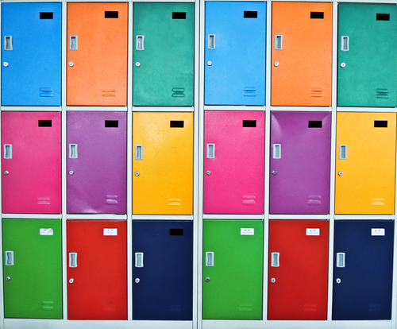
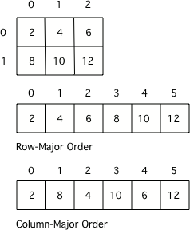
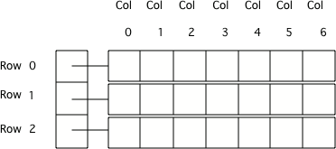

.. include:: ../common.rst

.. qnum::
   :prefix: 8-1-
   :start: 1

|Time45|

2D Arrays 
-----------------

.. index::
    single: 2D Arrays
    single: row
    single: column
    pair: arrays; 2D
    pair: 2D Array; definition
    pair: 2D Array; row
    pair: 2D Array; column

Arrays in Java can store many items of the same type.  You can even store items in **two-dimensional** (2D) arrays which are arrays that have both **rows** and **columns**.  A **row** has horizontal elements.  A **column** has vertical elements.  In the picture below there are 3 rows of lockers and 6 columns.

    Figure 1: Lockers in rows and columns

Two dimensional arrays are especially useful when the data is naturally organized in rows and columns like in a spreadsheet, bingo, battleship, theater seats, classroom seats, or a picture.  In battleship, letters map to the rows (A is the first row, B is the second row, and so on) and the column indices start with 1.

Array Storage
---------------

.. index::
   single: row-major order
   single: column-major order
   single: array of arrays
   pair: 2D Array; row-major order
   pair: 2D Array; column-major order
   pair: 2D Array; array of arrays

Many programming languages actually store two-dimensional array data in a one-dimensional array.  The typical way to do this is to store all the data for the first row followed by all the data for the second row and so on.  This is called **row-major** order.  Some languages store all the data for the first column followed by all the data for the second column and so on.  This called **column-major** order.

    Figure 2: A 2D array stored in row-major order or column-major order as a 1D array.

How Java Stores 2D Arrays
---------------------------

Java actually stores a two-dimensional array as an array of arrays.  Each element of the outer array has a reference to each inner array.  The picture below shows a 2D array that has 3 rows and 7 columns.  Notice that the array indices start at 0 and end at the length - 1.

    Figure 3: Java arrays of arrays

On the exam assume that any 2 dimensional (2D) array is in row-major order.  The outer array can be thought of as the rows and the inner arrays the columns.  On the exam all inner arrays will have the same length even though it is possible in Java to have inner arrays of different lengths (also called **ragged arrays**).

|Exercise| **Check your understanding**

Try to answer the following questions.  Click on the value or values to select them.  Click again to unselect a value.

.. clickablearea:: clicktd1
   :question: Click on all the values in the row at index 2
   :feedback: Rows are horizontal and columns are vertical and both start with index 0.
   :table:
   :correct: 3,1;3,2;3,3;3,4;
   :incorrect: 1,1;1,2;1,3;1,4;2,1;2,2;2,3;2,4;

   +----+----+----+----+
   | 8  | -2 | 3  | -1 |
   +----+----+----+----+
   | 4  |  5 | 0  | -7 |
   +----+----+----+----+
   | 2  | -3 | -4 | -5 |
   +----+----+----+----+

.. clickablearea:: clicktd2
   :question: Click on all the values in the column at index 1
   :feedback: Rows are horizontal and columns are vertical and both start with index 0.
   :table:
   :correct: 1,2;2,2;3,2;
   :incorrect: 1,1;1,3;1,4;2,1;2,3;2,4;3,1;3,3;3,4;

   +----+----+----+----+
   | 8  | -2 | 3  | -1 |
   +----+----+----+----+
   | 4  |  5 | 0  | -7 |
   +----+----+----+----+
   | 2  | -3 | -4 | -5 |
   +----+----+----+----+

.. clickablearea:: clicktd3
   :question: Click on the value at row index 2 and column index 1
   :feedback: Rows are horizontal and columns are vertical and both start with index 0.
   :table:
   :correct: 3,2
   :incorrect: 1,1;1,2;1,3;1,4;2,1;2,2;2,3;2,4;3,1;3,3;3,4;

   +----+----+----+----+
   | 8  | -2 | 3  | -1 |
   +----+----+----+----+
   | 4  |  5 | 0  | -7 |
   +----+----+----+----+
   | 2  | -3 | -4 | -5 |
   +----+----+----+----+

.. clickablearea:: clicktd4
   :question: Click on the value at row index 0 and column index 2
   :feedback: Rows are horizontal and columns are vertical and both start with index 0.
   :table:
   :correct: 1,3
   :incorrect: 1,1;1,2;1,4;2,1;2,2;2,3;2,4;3,1;3,2;3,3;3,4;

   +----+----+----+----+
   | 8  | -2 | 3  | -1 |
   +----+----+----+----+
   | 4  |  5 | 0  | -7 |
   +----+----+----+----+
   | 2  | -3 | -4 | -5 |
   +----+----+----+----+

.. clickablearea:: clicktd5
   :question: Click on the value at row index 1 and column index 1
   :feedback: Rows are horizontal and columns are vertical and both start with index 0.
   :table:
   :correct: 2,2
   :incorrect: 1,1;1,2;1,3;1,4;2,1;2,3;2,4;3,1;3,2;3,3;3,4;

   +----+----+----+----+
   | 8  | -2 | 3  | -1 |
   +----+----+----+----+
   | 4  |  5 | 0  | -7 |
   +----+----+----+----+
   | 2  | -3 | -4 | -5 |
   +----+----+----+----+

Declaring 2D Arrays
-------------------------------

.. index::
   pair: 2D Array; declaration

To declare a 2D array, specify the type of elements that will be stored in the array, then (``[][]``) to show that it is a 2D array of that type, then at least one space, and then a name for the array.  Note that the declarations below just name the variable and say what type of array it will reference.  **The declarations do not create the array**.  Arrays are objects in Java, so any variable that declares an array holds a reference to an object.  If the array hasn't been created yet and you try to print the value of the variable, it will print **null** (meaning it doesn't reference any object yet).

.. code-block:: java

  int[][] ticketInfo;
  String[][] seatingChart;

.. index::
   pair: 2D Array; creation

To create an array use the **new** keyword, followed by a space, then the type, and then the number of rows in square brackets followed by the number of columns in square brackets, like this ``new int[numRows][numCols]``.

The code below creates a 2D array with 2 rows and 3 columns named ``ticketInfo`` and a 2D array with 3 rows and 2 columns named ``seatingChart``.  The number of elements in a 2D  array is the number of rows times the number of columns.

.. code-block:: java

  ticketInfo = new int [2][3];
  seatingChart = new String [3][2];

|Exercise| **Check your understanding**

.. fillintheblank:: 2daNumElfill

   How many elements are in ticketInfo?

   -    :6$: Correct.  2 * 3 = 6
        :.*: Multiply the number of rows and the number of columns

|CodingEx| **Coding Exercise**

.. activecode:: 2DArrayCreate
  :language: java
  :autograde: unittest
  :practice: T

  What will the following code print out? Can you change ticketInfo to be an array of 5 rows and 10 columns? Can you declare another array called studentNames that has 10 rows and 5 columns? The length property of arrays will be explained in the next lesson.
  ~~~~
  public class TicketInfo
  {
      public static void main(String[] args)
      {
          // declare arrays
          int[][] ticketInfo = new int[2][3];
          System.out.println(ticketInfo.length + " rows");
          System.out.println(ticketInfo[0].length + " columns");
      }
  }

  ====
  import static org.junit.Assert.*;

  import org.junit.*;

  import java.io.*;

  public class RunestoneTests extends CodeTestHelper
  {
      public RunestoneTests()
      {
          super("TicketInfo");
      }

      @Test
      public void test1()
      {
          String output = getMethodOutput("main");
          String expected = "5 rows\n10 columns";

          boolean passed = output.contains(expected);
          passed =
                  getResults(expected, output, "Changed ticketInfo to 5 rows and 10 columns", passed);

          assertTrue(passed);
      }

      @Test
      public void test2()
      {
          String expected = "studentNames = new String[10][5]";

          boolean passed = checkCodeContains(expected);
          assertTrue(passed);
      }
  }

Set Value(s) in a 2D Array 
----------------------------------------

.. index::
   pair: 2D Array; initialization
   pair: 2D Array; set value

When arrays are created their contents are automatically initialized to 0 for numeric types, null for object references, and false for type boolean.  To explicitly put a value in an array, you can use assignment statements with the name of the array followed by the row index in square brackets followed by the column index in square brackets and then an ``=`` followed by a value.

.. code-block:: java

  int[][] ticketInfo = new int[2][3];
  ticketInfo[0][0] = 15;

.. |Java visualizer| raw:: html

   <a href= "http://cscircles.cemc.uwaterloo.ca/java_visualize/#code=public+class+Test+%0A++%7B%0A+++++public+static+void+main(String%5B%5D+args)%0A+++++%7B%0A++++++++//+declare+arrays%0A++++++++int%5B%5D%5B%5D+ticketInfo%3B%0A++++++++String%5B%5D%5B%5D+seatingChart%3B%0A++++++++%0A++++++++//+create+arrays%0A++++++++ticketInfo+%3D+new+int+%5B2%5D%5B3%5D%3B%0A++++++++seatingChart+%3D++new+String+%5B3%5D%5B2%5D%3B%0A++++++++%0A++++++++//+initialize+the+array+elements%0A++++++++ticketInfo%5B0%5D%5B0%5D+%3D+15%3B%0A++++++++ticketInfo%5B0%5D%5B1%5D+%3D+10%3B%0A++++++++ticketInfo%5B0%5D%5B2%5D+%3D+15%3B%0A++++++++ticketInfo%5B1%5D%5B0%5D+%3D+25%3B%0A++++++++ticketInfo%5B1%5D%5B1%5D+%3D+20%3B%0A++++++++ticketInfo%5B1%5D%5B2%5D+%3D+25%3B%0A++++++++seatingChart%5B0%5D%5B0%5D+%3D+%22Jamal%22%3B%0A++++++++seatingChart%5B0%5D%5B1%5D+%3D+%22Maria%22%3B%0A++++++++seatingChart%5B1%5D%5B0%5D+%3D+%22Jacob%22%3B%0A++++++++seatingChart%5B1%5D%5B1%5D+%3D+%22Suzy%22%3B%0A++++++++seatingChart%5B2%5D%5B0%5D+%3D+%22Emma%22%3B%0A++++++++seatingChart%5B2%5D%5B1%5D+%3D+%22Luke%22%3B%0A++++++++%0A++++++++//+print+the+contents%0A++++++++System.out.println(ticketInfo)%3B%0A++++++++System.out.println(seatingChart)%3B%0A+++++%7D%0A++%7D&mode=display&curInstr=0" style="text-decoration:underline" target="_blank" >Java Visualizer</a>

|CodingEx| **Coding Exercise**

Try the code below. Did it print what you expected?  When you print a two dimensional array you just get the reference to the object. In the next lesson, we'll learn how to use nested loops to print out the whole 2D Array. Right now, use the |Java visualizer| to see what the values are after this code runs. Edit the code to add in an extra row to the ``seatingChart`` and add your name and a friend's name in the columns of this extra row using assignment statements.

.. activecode:: 2DArraySet
  :language: java
  :autograde: unittest

  Add another row of data to the arrays by changing the size of the arrays and adding in the assignment statements for the cells in those rows.
  ~~~~
  public class TwoDArraySet
  {
      public static void main(String[] args)
      {
          // declare arrays
          int[][] ticketInfo;
          String[][] seatingChart;

          // create arrays
          ticketInfo = new int[2][3];
          seatingChart = new String[3][2];

          // initialize the array elements
          ticketInfo[0][0] = 15;
          ticketInfo[0][1] = 10;
          ticketInfo[0][2] = 15;
          ticketInfo[1][0] = 25;
          ticketInfo[1][1] = 20;
          ticketInfo[1][2] = 25;
          seatingChart[0][0] = "Jamal";
          seatingChart[0][1] = "Maria";
          seatingChart[1][0] = "Jacob";
          seatingChart[1][1] = "Suzy";
          seatingChart[2][0] = "Emma";
          seatingChart[2][1] = "Luke";

          // print the contents
          System.out.println(ticketInfo);
          System.out.println(seatingChart);
      }
  }

  ====
  import static org.junit.Assert.*;

  import org.junit.*;

  import java.io.*;

  public class RunestoneTests extends CodeTestHelper
  {
      public RunestoneTests()
      {
          super("TwoDArraySet");
      }

      @Test
      public void test1()
      {
          String output = getMethodOutput("main");
          String expected = "[[I@", expected2 = "[[Ljava.lang.String;@";

          boolean passed = output.contains(expected) && output.contains(expected2);

          passed = getResults("true", "" + passed, "Prints two 2D arrays");
          assertTrue(passed);
      }

      @Test
      public void test2()
      {
          String code = getCode();
          String expected = "new String[4][2]";

          boolean passed = code.contains(expected);

          passed = getResults("true", "" + passed, "Add another row to seatingChart");
          assertTrue(passed);
      }

      @Test
      public void test3()
      {
          String code = getCode();
          String expected1 = "seatingChart[3][0]";
          String expected2 = "seatingChart[3][1]";

          boolean passed = code.contains(expected1) && code.contains(expected2);

          passed = getResults("true", "" + passed, "Give values to new elements");
          assertTrue(passed);
      }
  }

|Exercise| **Check your understanding**

.. mchoice:: qa2dab_1
   :practice: T
   :answer_a: nums[3][2] = 5;
   :answer_b: nums[1][2] = 5;
   :answer_c: nums[2][1] = 5;
   :answer_d: nums[2][3] = 5;
   :correct: c
   :feedback_a: Remember that the indices start at 0.
   :feedback_b: Remember that the row is first then the column.
   :feedback_c: This will set the value  of the 3rd row and 2nd column.
   :feedback_d: Remember that the row is first and then the column and that the indices start at 0.

   Which of the following sets the value for the 3rd row and 2nd column of a 2D array called ``nums``?

Initializer Lists for 2D Arrays
-------------------------------

You can also initialize (set) the values for the array when you create it.  In this case you don't need to specify the size of the array, it will be determined from the values you give.  The code below creates an array called ``ticketInfo`` with 2 rows and 3 columns.  It also creates an array called ``seatingInfo`` with 3 rows and 2 columns.

.. code-block:: java

  int[][] ticketInfo = { {25,20,25}, {25,20,25} };
  String[][] seatingInfo = { {"Jamal", "Maria"}, {"Jake", "Suzy"}, {"Emma", "Luke"} };

|Exercise| **Check your understanding**

.. fillintheblank:: 2daGetElfill

   What is the value at ``seatingInfo[2][1]`` after the code above executes?

   -    :Luke$: Correct.  The string at row index 2 and column index 1 is Luke.
        :.*: indices start at 0 and the row is first then the column

Get a Value from a 2D Array
------------------------------

.. index::
   pair: 2D Array; access value

To get the value in a 2D array give the name of the array followed by the row and column indices in square brackets. The code below will get the value at row index 1 and column index 0 from ``ticketInfo``.  It will also get the value at row index 0 and column index 1 from ``seatingChart``.

.. code-block:: java

  int[][] ticketInfo = { {25,20,25}, {25,20,25} };
  String[][] seatingInfo = { {"Jamal", "Maria"}, {"Jake", "Suzy"}, {"Emma", "Luke"} };
  int value = ticketInfo[1][0];
  String name = seatingInfo[0][1];

|Exercise| **Check your understanding**

.. mchoice:: qa2dab_2
   :practice: T
   :answer_a: Jamal
   :answer_b: Maria
   :answer_c: Jake
   :answer_d: Suzy
   :answer_e: Emma
   :correct: b
   :feedback_a: This would be true for if <code>name</code> was set to <code>seatingInfo[0][0];</code> instead.
   :feedback_b: Maria is the value of <code>seatingInfo[0][1];</code>.
   :feedback_c: This would be true for if <code>name</code> was set to <code>seatingInfo[1][0];</code> instead.
   :feedback_d: This would be true for if <code>name</code> was set to <code>seatingInfo[1][1];</code> instead.
   :feedback_e: This would be true for if <code>name</code> was set to <code>seatingInfo[2][1];</code> instead.

   What is the value of ``name`` after the code above executes?

|CodingEx| **Coding Exercise**

.. activecode:: 2DArrayInitGet
  :language: java
  :autograde: unittest

  Add another row to seatingInfo initialized to your name and a friend's name. Get these names out of the array using the correct indices and then print them out.
  ~~~~
  public class TwoDArrayInitGet
  {
      public static void main(String[] args)
      {
          String[][] seatingInfo =
          {
              {"Jamal", "Maria"},
              {"Jake", "Suzy"},
              {"Emma", "Luke"}
          };
          String name = seatingInfo[0][0];
          System.out.println(name + " is at [0,0]");
      }
  }

  ====
  import static org.junit.Assert.*;

  import org.junit.*;

  import java.io.*;

  public class RunestoneTests extends CodeTestHelper
  {
      public RunestoneTests()
      {
          super("TwoDArrayInitGet");
      }

      @Test
      public void test1()
      {
          String output = getMethodOutput("main");
          String expected = "Jamal is at [0,0]";

          boolean passed = output.contains(expected);

          passed = getResults("true", "" + passed, "Output contains " + expected);
          assertTrue(passed);
      }

      @Test
      public void test2()
      {
          String output = getMethodOutput("main");
          String[] lines = output.split("\n");

          String expected = "[3,0]";
          String actual = "";

          boolean passed = false;

          for (String l : lines)
          {
              if (l.replaceAll(" ", "").contains(expected))
              {
                  actual = l;
                  passed = true;
              }
          }

          passed =
                  getResults(
                          "Name is at " + expected,
                          actual,
                          "Add one name to new row and print it out",
                          passed);
          assertTrue(passed);
      }

      @Test
      public void test3()
      {
          String output = getMethodOutput("main");
          String[] lines = output.split("\n");

          String expected = "[3,1]";
          String actual = "";

          boolean passed = false;

          for (String l : lines)
          {
              if (l.replaceAll(" ", "").contains(expected))
              {
                  actual = l;
                  passed = true;
              }
          }

          passed =
                  getResults(
                          "Name is at " + expected,
                          actual,
                          "Add second name to new row and print it out",
                          passed);
          assertTrue(passed);
      }
  }

|Groupwork| Programming Challenge : ASCII Art
---------------------------------------------------

.. |ASCII art| raw:: html

   <a href= "https://www.asciiart.eu/" style="text-decoration:underline" target="_blank" >ASCII art</a>

ASCII is a commonly used character encoding standard where each key you press on the keyboard is translated to an ASCII number to be stored in the computer. ASCII has been mostly replaced by UNICODE which includes characters in other languages like Chinese. In the days before good graphics, some people made ASCII art just using the keyboard characters. Take a look at this |ASCII art| collection!

We can represent ASCII art in a 2D array of rows and columns. What do you think the following code will print out? Try to guess before you run it. The loops to print out the 2D array will be explained in the next lesson. Then, do the following:

1. Change the code to use 2 assignment statements with the 2D array ``asciiArt`` to change the "o" characters to "@" characters. You should figure out what the row and column indices should be for the "o" characters and use them with the array name to set that character to "@". After testing this code, comment it out so that your teacher can still see it.

2. Add a new ``asciiArt`` array with a different |ASCII art| from the collection or of your own design. Be careful with the special characters like ``"`` and ``\``. You will need to put another backslash in front of these to print them out like ``\"`` and ``\\``.

.. activecode:: challenge-8-1-ascii-art
  :language: java
  :autograde: unittest

  Part 1: Add 2 assignment statements for the 2D array asciiArt to change the "o" characters to "@" characters. Part 2: Create a new asciiArt array and print it out.
  ~~~~
  public class AsciiArt
  {
      public static void main(String[] args)
      {

          String[][] asciiArt =
          {
              {" ", " ", "_", "_", "_", " ", " "},
              {" ", "(", "o", " ", "o", ")", " "},
              {"(", " ", " ", "V", " ", " ", ")"},
              {" ", "-", "m", "-", "m", "-", " "},
          };

          // Part 1: Add 2 assignment statements to change "o" to "@"

          // print the asciiArt for Part 1
          System.out.println("ASCII Art:");
          for (String[] row : asciiArt)
          {
              for (String column : row) System.out.print(column);
              System.out.println();
          }

          // Part 2: Create your own ASCII art array and print it out!

      }
  }

  ====
  import static org.junit.Assert.*;

  import org.junit.*;

  import java.io.*;

  public class RunestoneTests extends CodeTestHelper
  {
      public RunestoneTests()
      {
          super("AsciiArt");
      }

      @Test
      public void test0()
      {
          String output = getMethodOutput("main");
          String expect = "ASCII Art: \n___  \n (@ @) \n(  V  )\n -m-m-";

          boolean passed = getResults(expect, output, "Running main()", true);
          assertTrue(passed);
      }

      /* removed because doesn't work if their own art has o
      @Test
      public void test1()
      {
          String output = getMethodOutput("main");
          String expect = "ASCII Art: \n___  \n (@ @) \n(  V  )\n -m-m-";

          boolean passed = output.contains("@") && !output.contains("o");
          passed = getResults(expect, output, "changed o to @", passed);
          assertTrue(passed);
      }
      */

      @Test
      public void test2()
      {
          String output = getMethodOutput("main");
          String expect = "___  \n (@ @) \n(  V  )\n -m-m-";

          if (output.contains("-m-m-"))
          {
              int i = output.indexOf("-m-m-") + "-m-m-".length();
              output = output.substring(i);
          }

          String[] lines = output.split("\n");

          boolean passed = output.length() >= 10 && lines.length >= 3;

          passed =
                  getResults(
                          "Your art",
                          output,
                          "added your own ascii art (should be at least 3 x 3)",
                          passed);
          assertTrue(passed);
      }

      @Test
      public void test3()
      {
          String expect = "asciiArt[#][#] = \"@\"";
          String code = getCode();
          int num = countOccurencesRegex(code, expect);

          boolean passed = num >= 2;

          getResults("2", "" + num, "Number of asciiArt[#][#] = \"@\" lines in code", passed);

          assertTrue(passed);
      }
  }

Summary
-------

- A 2D array is stored as an array of arrays. And the way 2D arrays are created and indexed is similar to 1D array objects.

- 2D arrays are declared and created with the following syntax: ``datatype[][] variableName = new datatype[numberRows][numberCols]``;

- 2D array objects that are not rectangular (that are ragged arrays) are outside the scope of the course and AP Exam.

- For the purposes of the exam, when accessing the element at ``arr[first][second]``, the ``first`` index is used for rows, the ``second`` index is used for columns.

- The initializer list used to create and initialize a 2D array consists of initializer lists that represent 1D arrays. For example, ``int[][] ticketInfo = { {25,20,25}, {25,20,25} }``;

- The square brackets ``[row][col]`` are used to access and modify an element in a 2D array.

- "Row-major order" refers to an ordering of 2D array elements where traversal occurs across each row, while "column-major order" traversal occurs down each column.

2D Arrays Game
----------------

.. |game| raw:: html

   <a href="https://csa-games.netlify.app/" target="_blank">game</a>

Try the game below to practice 2D Arrays. Click on **Arrays** and then check on **2D** and click on the elements of the * array that would be printed out by the given code. If you're stuck, check on Labels to see the indices. We encourage you to work in pairs and see how high a score you can get.

.. raw:: html

    <iframe height="700px" width="100%" style="margin-left:10%;max-width:80%" src="https://csa-games.netlify.app/"></iframe>

