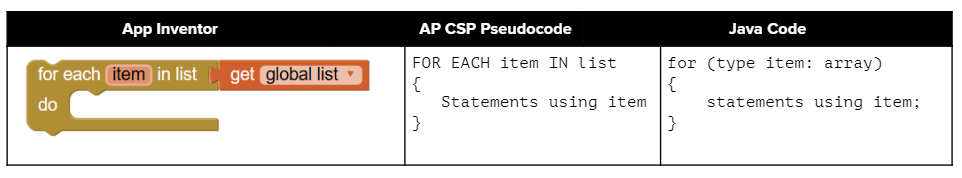

.. include:: ../common.rst

.. qnum::
   :prefix: 4-4-
   :start: 1

|Time90|

Array Traversals
====================

In this lesson, we will learn how to traverse an array using a loop. **Traversing** an array means visiting each element of the array. We can use a loop to visit each element of an array and perform some operation on it. This is a common operation when working with arrays. 

Index Variables
-----------------------

In the last lesson, we mentioned that you can use a variable for the index of an array. You can even do math with that index and have an arithmetic expression inside the [], like below.

.. code-block:: java

  // highScores array declaration
  int[] highScores = { 10, 9, 8, 8};
  // use a variable for the index
  int index = 3;
  // modify array value at index
  highScores[index] = 11;
  // print array value at index
  System.out.println(  highScores[index] );
  System.out.println(  highScores[index - 1] );

.. |visualizer| raw:: html

   <a href="http://www.pythontutor.com/visualize.html#code=public%20class%20ArrayWithIndexVar%20%7B%0A%20%20%20%20public%20static%20void%20main%28String%5B%5D%20args%29%20%7B%0A%20%20%20%20%20%20//%20highScores%20array%20declaration%0A%20%20%20%20%20%20int%5B%5D%20highScores%20%3D%20%7B%2010,%209,%208,%208%7D%3B%0A%20%20%20%20%20%20//%20use%20a%20variable%20for%20the%20index%0A%20%20%20%20%20%20int%20index%20%3D%203%3B%0A%20%20%20%20%20%20//%20modify%20array%20value%20at%20index%0A%20%20%20%20%20%20highScores%5Bindex%5D%20%3D%2011%3B%0A%20%20%20%20%20%20//%20print%20array%20value%20at%20index%0A%20%20%20%20%20%20System.out.println%28%20%20highScores%5Bindex%5D%20%29%3B%0A%20%20%20%20%20%20System.out.println%28%20%20highScores%5Bindex%20-%201%5D%20%29%3B%0A%20%20%20%20%7D%0A%7D&cumulative=false&curInstr=0&heapPrimitives=nevernest&mode=display&origin=opt-frontend.js&py=java&rawInputLstJSON=%5B%5D&textReferences=false" target="_blank"  style="text-decoration:underline">visualizer</a>

What does the code above print out? You can follow the code in this |visualizer| and look at the image depicting the array below.

.. figure:: Figures/arraywithindex.png
    :width: 350
    :align: center
    :figclass: align-center

    Figure 1: Array with index variable

Loops to Traverse Arrays
---------------------------

.. index::
    single: for loop
    pair: loop; array
    single: array traversal

**Traversing an array** or **iteration** is when repetition statements are used to access all or an ordered sequence of elements in an array. We can traverse an array with an indexed ``for`` loop or ``while`` loop, accessing the elements using an index variable.Just start the index at **0** and loop while the index is less than the **length** of the array. Note that the variable **i** (short for index) is often used in loops as the loop counter variable and is used here to access each element of an array with its index. Since this is a simple counter-controlled loop, ``for`` loops are used more often than ``while`` loops for array traversals.

.. figure:: Figures/arrayForLoop.png
    :width: 500
    :align: center
    :figclass: align-center

    Figure 2: For Loop Traversing Array

For example, here is a ``for`` loop and a ``while`` loop that traverse the ``highScores`` array to print every score. Try the code for the ``for`` loop below in the |visualizer3|.

.. |visualizer3| raw:: html

   <a href="http://www.pythontutor.com/visualize.html#code=public%20class%20ArrayLoop%0A%7B%0A%20%20%20%20public%20static%20void%20main%28String%5B%5D%20args%29%20%0A%20%20%20%20%7B%0A%0A%20%20%20%20%20%20%20%20int%5B%5D%20highScores%20%3D%20%7B%2010,%209,%208,%208%7D%3B%0A%20%20%20%20%20%20%20%20for%20%28int%20i%20%3D%200%3B%20i%20%3C%20highScores.length%3B%20i%2B%2B%29%0A%20%20%20%20%20%20%20%20%7B%0A%20%20%20%20%20%20%20%20%20%20%20%20System.out.println%28%20%20highScores%5Bi%5D%20%29%3B%0A%20%20%20%20%20%20%20%20%7D%20%0A%20%20%20%20%7D%0A%7D&cumulative=false&curInstr=0&heapPrimitives=nevernest&mode=display&origin=opt-frontend.js&py=java&rawInputLstJSON=%5B%5D&textReferences=false" target="_blank"  style="text-decoration:underline">visualizer</a>

.. code-block:: java

  int[] highScores = { 10, 9, 8, 11};
  for (int i = 0; i < highScores.length; i++)
  {
      System.out.println(  highScores[i] );
  }
  // Or with a while loop
  int i = 0;
  while (i < highScores.length)
  {
      System.out.println(  highScores[i] );
      i++;
  }

.. note::

    Using a variable as the index is a powerful **data abstraction** feature because it allows us to use loops with arrays where the loop counter variable is the index of the array! This allows our code to generalize to work for the whole array.

|CodingEx| **Coding Exercise**

.. activecode:: arraytrace2
   :language: java
   :autograde: unittest

   What do you think the following code will print out? First trace through it on paper keeping track of the array and the index variable. Then, run it to see if you were right. Try the Code Lens button. Then, try adding your name and a friend's name to the array names and run the code again. Did the code work without changing the loop?
   ~~~~
   public class Test2
   {
       public static void main(String[] args)
       {
           String[] names = {"Jamal", "Emily", "Destiny", "Mateo", "Sofia"};

           for (int i = 0; i < names.length; i++)
           {
               System.out.println(names[i]);
           }
       }
   }
   ====
   import static org.junit.Assert.*;

   import org.junit.*;

   import java.io.*;

   public class RunestoneTests extends CodeTestHelper
   {
       public RunestoneTests()
       {
           super("Test2");
       }

       @Test
       public void test1()
       {
           String output = getMethodOutput("main");
           String expect = "Jamal\nEmily\nDestiny\nMateo\nSofia";

           boolean passed = output.contains(expect);
           passed = getResults(expect, output, "Did you run the code?", passed);
           assertTrue(passed);
       }

       @Test
       public void test2()
       {
           String output = getMethodOutput("main");
           String expect = "Jamal\nEmily\nDestiny\nMateo\nSofia\nYour name\nFriend's name";

           int len = output.split("\n").length;

           boolean passed = len >= 6;

           passed = getResults(expect, output, "Did you add two more names?", passed);
           assertTrue(passed);
       }
   }

Arrays as Objects and Parameters
---------------------------------

The following code demonstrates a loop that changes the values in an array. In this code, the array is passed as an argument to the static methods in the class.  Arrays in Java are objects. The array variables are references to an address in memory. Since arrays can be very large, we do not want to copy them when we pass them into methods. When an array is passed as an argument to a method, the name of the array refers to its address in memory. Therefore, any changes to the array in the method will affect the original array. You can also try the code in the |Java visualizer|.

.. |Java visualizer| raw:: html

   <a href="http://www.pythontutor.com/visualize.html#code=public%20class%20ArrayLoop%0A%20%20%20%7B%0A%0A%20%20%20%20%20//%20What%20does%20this%20method%20do%3F%0A%20%20%20%20%20%20public%20static%20void%20multAll%28int%5B%5D%20values,%20int%20amt%29%0A%20%20%20%20%20%20%7B%0A%20%20%20%20%20%20%20%20for%20%28int%20i%20%3D%200%3B%20i%20%3C%20values.length%3B%20i%2B%2B%29%0A%20%20%20%20%20%20%20%20%7B%0A%20%20%20%20%20%20%20%20%20%20values%5Bi%5D%20%3D%20values%5Bi%5D%20*%20amt%3B%0A%20%20%20%20%20%20%20%20%7D%20%0A%20%20%20%20%20%20%7D%20%0A%20%20%20%20%20%20%0A%20%20%20%20%20%20//%20What%20does%20this%20method%20do%3F%0A%20%20%20%20%20%20public%20static%20void%20printValues%28int%5B%5D%20values%29%0A%20%20%20%20%20%20%7B%0A%20%20%20%20%20%20%20%20for%20%28int%20i%20%3D%200%3B%20i%20%3C%20values.length%3B%20i%2B%2B%29%0A%20%20%20%20%20%20%20%20%7B%0A%20%20%20%20%20%20%20%20%20%20%20System.out.println%28%20%20values%5Bi%5D%20%29%3B%0A%20%20%20%20%20%20%20%20%7D%20%20%20%20%20%20%20%20%20%0A%20%20%20%20%20%20%7D%0A%20%20%20%20%20%20%0A%20%20%20%20%20%20public%20static%20void%20main%28String%5B%5D%20args%29%0A%20%20%20%20%20%20%7B%0A%20%20%20%20%20%20%20%20int%5B%5D%20numArray%20%3D%20%20%7B2,%206,%207,%2012,%205%7D%3B%0A%20%20%20%20%20%20%20%20multAll%28numArray,%202%29%3B%0A%20%20%20%20%20%20%20%20printValues%28numArray%29%3B%0A%20%20%20%20%20%20%7D%0A%20%20%20%7D%0A%20%20%20%20%20%20&cumulative=false&curInstr=0&heapPrimitives=nevernest&mode=display&origin=opt-frontend.js&py=java&rawInputLstJSON=%5B%5D&textReferences=false" target="_blank"  style="text-decoration:underline">Java visualizer</a>

|CodingEx| **Coding Exercise**

.. activecode:: arrayMethodTrace
   :language: java
   :autograde: unittest

   What does the following code print out? Trace through it keeping track of the array values and the output. Then run it to see if you're right. Notice that in this code, the array is passed as an argument to the methods. You can also try the code in the |Java visualizer| with the Code Lens button.
   ~~~~
   public class ArrayLoop
   {

       // What does this method do?
       public static void multAll(int[] values, int amt)
       {
           for (int i = 0; i < values.length; i++)
           {
               values[i] = values[i] * amt;
           }
       }

       // What does this method do?
       public static void printValues(int[] values)
       {
           for (int i = 0; i < values.length; i++)
           {
               System.out.println(values[i]);
           }
       }

       public static void main(String[] args)
       {
           int[] numArray = {2, 6, 7, 12, 5};
           multAll(numArray, 2);
           printValues(numArray);
       }
   }
   ====
   import static org.junit.Assert.*;

   import org.junit.*;

   import java.io.*;

   public class RunestoneTests extends CodeTestHelper
   {
       public RunestoneTests()
       {
           super("ArrayLoop");
       }

       @Test
       public void test1() throws IOException
       {
           String output = getMethodOutput("main");
           String expect = "4 12 14 24 10";

           boolean passed = getResults(expect, output, "Did you run the code?", true);
           assertTrue(passed);
       }
   }

.. note::

   Arrays in Java are objects. When arrays are passed in as arguments to methods, any changes to the array in the method will affect the original array, since the array name is a reference value refering to the address of the array in memory.

|Exercise| **Check Your Understanding**

.. parsonsprob:: patdonsArraySubtract
   :numbered: left
   :practice: T
   :adaptive:
   :noindent:

   The following method has the correct code to subtract amt from all the values in the array values, but the code is mixed up.  Drag the blocks from the left into the correct order on the right. You will be told if any of the blocks are in the wrong order.
   -----
   public void subAll(int[] values, int amt)
   {
   =====
        for (int i = 0;
   =====
           i < values.length;
   =====
           i++)
   =====
        {
   =====
           values[i] = values[i] - amt;
   =====
        } // end for loop
   =====
   } // end method

Looping through Part of an Array
--------------------------------

.. index::
   pair: loop; range

You don't have to loop through all of the elements of an array.  You can loop through just some of the elements of an array using a for loop.  The following code doubles the first five elements in an array.  Notice that it uses a complex conditional (``&&``) on line 14 to make sure that the loop doesn't go beyond the length of the array, because if you had an array that had less than 5 elements, you wouldn't want the code to try to double the 5th element which doesn't exist! Notice that in this code, the array is a private instance variable of the class ArrayWorker. It is created in the constructor and changed or accessed by the methods.

.. activecode:: tripleFirstFour
   :language: java
   :autograde: unittest
   :practice: T

   What will the following code print out? Can you write a similar method called tripleFirstFour() that triples the first 4 elements of the array? Make sure you test it in main.
   ~~~~
   public class ArrayWorker
   {
       private int[] values;

       public ArrayWorker(int[] theValues)
       {
           values = theValues;
       }

       /** Doubles the first 5 elements of the array */
       public void doubleFirstFive()
       {
           // Notice: && i < 5
           for (int i = 0; i < values.length && i < 5; i++)
           {
               values[i] = values[i] * 2;
           }
       }

       /**
        * Write a method called tripleFirstFour() that triples 
        * the first 4 elements of the array *
        */
       public void tripleFirstFour()
       {

       }
       
       /** Prints the array */
       public void printArray()
       {
           for (int i = 0; i < values.length; i++)
           {
               System.out.println(values[i]);
           }
       }

       public static void main(String[] args)
       {
           int[] numArray = {3, 8, -3, 2, 20, 5, 33, 1};
           ArrayWorker worker = new ArrayWorker(numArray);
           worker.doubleFirstFive();
           worker.printArray();
           // uncomment these to test        
           // worker.tripleFirstFour();
           // worker.printArray();
       }
   }
   ====
   import static org.junit.Assert.*;

   import org.junit.*;

   import java.io.*;

   public class RunestoneTests extends CodeTestHelper
   {
       public RunestoneTests()
       {
           super("ArrayWorker");

           int[] numArray = {0, 1, 2, 3, 4, 5};
           setDefaultValues(new Object[] {numArray});
       }

       @Test
       public void test1()
       {
           String output = getMethodOutput("main");
           String expect = "6 16 -6 4 40 5 33 1".replaceAll(" ", "\n");

           boolean passed = output.contains(expect);

           passed = getResults(expect, output, "Did you run the doubleFirstFiveMethod?", passed);
           assertTrue(passed);
       }

       @Test
       public void test2()
       {
           String output = getMethodOutput("tripleFirstFour");
           output = getMethodOutput("printArray");
           String expect = "0 3 6 9 4 5".replaceAll(" ", "\n");

           boolean passed = output.contains(expect);

           passed =
                   getResults(
                           expect,
                           output,
                           "Testing tripleFirstFour() method on array [0, 1, 2, 3, 4, 5]",
                           passed);
           assertTrue(passed);
       }
   }

|Exercise| **Check Your Understanding**

.. mchoice:: mcq_array_doublelast
   :random:
   :practice: T
   :answer_a: {-40, -30, 4, 16, 32, 66}
   :answer_b: {-40, -30, 4, 8, 16, 32}
   :answer_c: {-20, -15, 2, 16, 32, 66}
   :answer_d: {-20, -15, 2, 8, 16, 33}
   :correct: c
   :feedback_a: This would true if it looped through the whole array.  Does it?
   :feedback_b: This would be true if it looped from the beginning to the middle.  Does it?
   :feedback_c: It loops from the middle to the end doubling each value. Since there are 6 elements it will start at index 3.
   :feedback_d: This would be true if array elements didn't change, but they do.

   Given the following values of a and the method doubleLast what will the values of a be after you execute: doubleLast()?

   .. code-block:: java

      private int[ ] a = {-20, -15, 2, 8, 16, 33};

      public void doubleLast()
      {

         for (int i = a.length / 2; i < a.length; i++)
         {
            a[i] = a[i] * 2;
         }
      }

.. mchoice:: mcq_array_mystery
   :random:
   :practice: T
   :answer_a: {-40, -30, 4, 16, 32, 66}
   :answer_b: {-40, -30, 4, 8, 16, 33}
   :answer_c: {-20, -15, 2, 16, 32, 66}
   :answer_d: {-40, -15, 4, 8, 16, 33}
   :answer_e: {-40, -15, 4, 8, 32, 33}
   :correct: d
   :feedback_a: This would true if it looped through the whole array and doubled each.  Does it?
   :feedback_b: This would be true if it looped from the beginning to the middle and doubled each.  Does it?
   :feedback_c: This would be true if it looped from the middle to the end and doubled each.  Does it?
   :feedback_d: This loops from the beginning to the middle and doubles every other element (i+=2 is the same as i = i + 2).
   :feedback_e: This would be true if it looped through the whole array and doubled every other element.  Does it?

   Given the following values of a and the method mystery what will the values of a be after you execute: mystery()?

   .. code-block:: java

      private int[ ] a = {-20, -15, 2, 8, 16, 33};

      public void mystery()
      {

         for (int i = 0; i < a.length/2; i+=2)
         {
            a[i] = a[i] * 2;
         }
      }

Common Errors When Looping Through an Array
-------------------------------------------------

When processing all array elements, be careful to start at the first index which is ``0`` and end at the last index. Usually loops are written so that the index starts at 0 and continues while the index is less than ``arrayName.length`` since (``arrayName.length - 1``) is the index for the last element in the array. Make sure you do not use ``<=`` instead of ``<``! If the index is less than 0 or greater than (``arrayName.length - 1``), an **ArrayIndexOutOfBoundsException** will be  thrown.  **Off by one** errors, where you go off the array by 1 element, are easy to make when traversing an array which result in an **ArrayIndexOutOfBoundsException** being thrown.

|Exercise| **Check Your Understanding**

.. mchoice:: qIndexOutOfBounds
   :random:
   :practice: T

   Which of the following loop headers will cause an ArrayIndexOutOfBounds error while traversing the array scores?

   - for (int i = 0; i < scores.length; i++)

     - This loop will traverse the complete array.

   - for (int i = 1; i < scores.length; i++)

     - This loop will not cause an error even though it will not visit the element at index 0.

   - for (int i = 0; i <= scores.length; i++)

     + The index cannot be equal to scores.length, since (scores.length - 1) is the index of the last element.

   - for (int i = 0; scores.length > i; i++)

     - Although the ending condition looks strange, (scores.length > i) is equivalent to (i < scores.length).

   - for (int i = scores.length - 1; i >= 0; i++)

     + This will cause an error because i++ will continue to increment the index past the end of the array. It should be replaced with i-- to avoid this error.

|CodingEx| **Coding Exercise**

.. activecode:: offbyone
   :language: java
   :autograde: unittest
   :practice: T

   The following code has an ArrayIndexOutOfBoundsException. It has 2 common off-by-one errors in the loop. Can you fix it and make the loop print out all the scores?
   ~~~~
   public class OffByone
   {
       public static void main(String[] args)
       {
           int[] scores = {10, 9, 8, 7};
           // Make this loop print out all the scores!
           for (int i = 1; i <= scores.length; i++)
           {
               System.out.println(scores[i]);
           }
       }
   }
   ====
   import static org.junit.Assert.*;

    import org.junit.*;

    import java.io.*;

    public class RunestoneTests extends CodeTestHelper
    {
        public RunestoneTests()
        {
            super("OffByone");
        }

        @Test
        public void test1()
        {
            String output = getMethodOutput("main");
            String expect = "9\n8\n7".replaceAll(" ", "\n");

            boolean passed = output.contains(expect);
            getResults(expect, output, "Testing right off-by-one error", passed);
            assertTrue(passed);
        }

        @Test
        public void test2()
        {
            String output = getMethodOutput("main");
            String expect = "10\n9\n8".replaceAll(" ", "\n");

            boolean passed = output.contains(expect);
            getResults(expect, output, "Testing left off-by-one error", passed);
            assertTrue(passed);
        }

        @Test
        public void checkCodeContains1()
        {
            boolean passed = checkCodeContains("fixes to for loop", "for (int i = 0; i <");
            assertTrue(passed);
        }
    }

Be careful not to jump out of loop too early when you are looking for a value in an array.  The method below uses **return** statements to stop the execution of the method and return a value to the method that called this method.  However, you must be careful not to stop the loop too soon.

|CodingEx| **Coding Exercise**

.. activecode:: find_loop_early_return_error
   :language: java
   :autograde: unittest
   :practice: T

   What is wrong with the code below?  The first time through the loop it will start with the element at index 0 and check if the item at the array index equals the passed target string.  If they have the same characters in the same order it will return 0, otherwise it will return -1.  But, it has only processed one element of the array.  How would you fix the code to work correctly (process all array elements before returning)?
   ~~~~
   public class StringWorker
   {
       private String[] arr = {"Hello", "Hey", "Good morning!"};

       public int findString(String target)
       {
           String word = null;
           for (int index = 0; index < arr.length; index++)
           {
               word = arr[index];

               if (word.equals(target))
               {
                   return index;
               }
               else
               {
                   return -1;
               }
           }
           return -1;
       }

       public static void main(String[] args)
       {
           StringWorker sWorker = new StringWorker();
           System.out.println(sWorker.findString("Hey"));
       }
   }
   ====
   import static org.junit.Assert.*;

   import org.junit.*;

   import java.io.*;

   public class RunestoneTests extends CodeTestHelper
   {
       public RunestoneTests()
       {
           super("StringWorker");
       }

       @Test
       public void test1()
       {
           String output = getMethodOutput("main");
           String expect = "1".replaceAll(" ", "\n");

           boolean passed = (output.equals(expect));
           getResults(expect, output, "Testing main() output", passed);
           assertTrue(passed);
       }

       @Test
       public void test2()
       {
           StringWorker sWorker = new StringWorker();
           String output = "" + sWorker.findString("Good morning!");
           String expect = "2";

           boolean passed = getResults(expect, output, "Testing findString(\"Good morning!\")");
           assertTrue(passed);
       }

       @Test
       public void test3()
       {
           StringWorker sWorker = new StringWorker();
           String output = "" + sWorker.findString("Hello!");
           String expect = "-1";

           boolean passed = getResults(expect, output, "Testing findString(\"Hello!\")");
           assertTrue(passed);
       }
   }

.. mchoice:: mcq_array_infinite
   :random:
   :practice: T
   :answer_a: The values don't matter this will always cause an infinite loop.
   :answer_b: Whenever <i>a</i> includes a value that is less than or equal to zero.
   :answer_c: Whenever <i>a</i> has values larger then <i>temp</i>.
   :answer_d: When all values in <i>a</i> are larger than <i>temp</i>.
   :answer_e: Whenever <i>a</i> includes a value equal to <i>temp</i>.
   :correct: b
   :feedback_a: An infinite loop will not always occur in this code segment.
   :feedback_b: When <i>a</i> contains a value that is less than or equal to zero then multiplying that value by 2 will never make the result larger than the <i>temp</i> value (which was set to some value > 0), so an infinite loop will occur.
   :feedback_c: Values larger then <i>temp</i> will not cause an infinite loop.
   :feedback_d: Values larger then <i>temp</i> will not cause an infinite loop.
   :feedback_e: Values equal to <i>temp</i> will not cause the infinite loop.

   Given the following code segment, which of the following will cause an infinite loop?  Assume that ``temp`` is an int variable initialized to be greater than zero and that ``a`` is an array of integers.

   .. code-block:: java

      for ( int k = 0; k < a.length; k++ )
      {
         while ( a[ k ] < temp )
         {
            a[ k ] *= 2;
         }
      }

Enhanced For-Loop (For-Each) for Arrays
-----------------------------------------

.. index::
   single: enhanced for loop
   single: for each
   pair: loop; for each

There is a special kind of loop that can be used with arrays that is called an **enhanced for loop** or a **for each loop**. This loop is much easier to write because it does not involve an index variable or the use of the []. It just sets up a variable that is set to each value in the array successively.

To set up a for-each loop, use **for (type variable : arrayname)** where the type is the type for elements in the array, and read it as "for each variable value in arrayname". You may have used a similar loop in AP CSP Pseudocode or App Inventor with lists like below.

    Figure 3: Comparing App Inventor, AP CSP, and Java for each

See the examples below in Java that loop through an int and a String array. Notice the type of the loop variable is the type of the array.

.. code-block:: java

  int[] highScores = { 10, 9, 8, 8};
  String[] names = {"Jamal", "Emily", "Destiny", "Mateo"};
  // for each loop: for each value in highScores
  // for (type variable : arrayname)
  for (int value : highScores)
  {
      // Notice no index or [ ], just the variable value!
      System.out.println( value );
  }
  // for each loop with a String array to print each name
  // the type for variable name is String!
  for (String name : names)
  {
      System.out.println(name);
  }

Use the enhanced for each loop with arrays whenever you can, because it cuts down on errors. You can use it whenever you need to loop through all the elements of an array and don't need to know their index and don't need to change their values.  It starts with the first item in the array (the one at index 0) and continues through in order to the last item in the array. This type of loop can only be used with arrays and some other collections of items like ArrayLists which we will see in the next unit.

|CodingEx| **Coding Exercise**

.. activecode:: foreach1
   :language: java
   :autograde: unittest

   Try the following code. Notice the for each loop with an int array and a String array. Add another high score and another name to the arrays and run again.
   ~~~~
   public class ForEachDemo
   {
       public static void main(String[] args)
       {
           int[] highScores = {10, 9, 8, 8};
           String[] names = {"Jamal", "Emily", "Destiny", "Mateo"};
           // for each loop with an int array
           for (int value : highScores)
           {
               System.out.println(value);
           }
           // for each loop with a String array
           for (String value : names)
           {
               System.out.println(value); // this time it's a name!
           }
       }
   }
    ====
    import static org.junit.Assert.*;

    import org.junit.*;

    import java.io.*;

    public class RunestoneTests extends CodeTestHelper
    {
        public RunestoneTests()
        {
            super("ForEachDemo");
        }

        @Test
        public void test1()
        {
            String output = getMethodOutput("main");
            String expect1 = "10\n9\n8\n8";
            String expect2 = "Jamal\nEmily\nDestiny\nMateo";

            boolean passed = output.contains(expect1) && output.contains(expect2);

            passed = getResults(expect1 + " " + expect2, output, "Original main()", passed);
            assertTrue(passed);
        }

        @Test
        public void test2()
        {
            String output = getMethodOutput("main");
            String expect = "10 9 8 8 Jamal Emily Destiny Mateo".replaceAll(" ", "\n");

            boolean passed = !output.equals(expect) && output.length() > expect.length();

            passed = getResults(expect, output, "Added another high score and name", passed);
            assertTrue(passed);
        }
    }

Code written using an enhanced ``for`` loop to traverse elements in an array can be rewritten using an indexed ``for`` loop or a ``while`` loop and vice versa. They are equivalent in terms of functionality, but the enhanced ``for`` loop is more concise and easier to read.

|CodingEx| **Coding Exercise**

.. activecode:: evenLoop
   :language: java
   :autograde: unittest
   :practice: T

   Rewrite the following for loop which prints out the even numbers in the array as an enhanced for-each loop. Make sure it works!
   ~~~~
   public class EvenLoop
   {
       public static void main(String[] args)
       {
           int[] values = {6, 2, 1, 7, 12, 5};
           // Rewrite this loop as a for each loop and run
           for (int i = 0; i < values.length; i++)
           {
               if (values[i] % 2 == 0)
               {
                   System.out.println(values[i] + " is even!");
               }
           }
       }
   }
   ====
   import static org.junit.Assert.*;

   import org.junit.*;

   import java.io.*;

   public class RunestoneTests extends CodeTestHelper
   {
       public RunestoneTests()
       {
           super("EvenLoop");
       }

       @Test
       public void test1()
       {
           String output = getMethodOutput("main");
           String expect = "6 is even!\n2 is even!\n12 is even!";

           boolean passed = getResults(expect, output, "main()");
           assertTrue(passed);
       }

       @Test
       public void test2()
       {
           boolean passed = checkCodeContains("for each loop", "for(int * : values)");
           assertTrue(passed);
       }
   }

Enhanced For Loop Limitations
-------------------------------

.. |foreachvisualizer| raw:: html

   <a href="http://www.pythontutor.com/visualize.html#code=%20%20%20public%20class%20IncrementLoop%0A%20%20%20%7B%20%20%20%20%20%20%0A%20%20%20%20%20%20public%20static%20void%20main%28String%5B%5D%20args%29%0A%20%20%20%20%20%20%7B%0A%20%20%20%20%20%20%20%20int%5B%20%5D%20values%20%3D%20%7B6,%202,%201,%207,%2012,%205%7D%3B%0A%20%20%20%20%20%20%20%20//%20Can%20this%20loop%20increment%20the%20values%3F%0A%20%20%20%20%20%20%20%20for%20%28int%20val%20%3A%20values%29%0A%20%20%20%20%20%20%20%20%7B%0A%20%20%20%20%20%20%20%20%20%20val%2B%2B%3B%0A%20%20%20%20%20%20%20%20%20%20System.out.println%28%22New%20val%3A%20%22%20%2B%20val%29%3B%0A%20%20%20%20%20%20%20%20%7D%0A%20%20%20%20%20%20%20%20//%20Print%20out%20array%20to%20see%20if%20they%20really%20changed%0A%20%20%20%20%20%20%20%20for%20%28int%20v%20%3A%20values%29%0A%20%20%20%20%20%20%20%20%7B%0A%20%20%20%20%20%20%20%20%20%20System.out.print%28v%20%2B%20%22%20%22%29%3B%0A%20%20%20%20%20%20%20%20%7D%0A%20%20%20%20%20%20%7D%0A%20%20%20%7D%0A%20%20%20&cumulative=false&curInstr=0&heapPrimitives=nevernest&mode=display&origin=opt-frontend.js&py=java&rawInputLstJSON=%5B%5D&textReferences=false&curInstr=0" target="_blank"  style="text-decoration:underline">Java visualizer</a>

What if we had a loop that incremented all the elements in the array. Would that work with an enhanced for-each loop? Unfortunately not! Because only the variable in the loop would change, not the real array values. Assigning a new value to the enhanced ``for`` loop variable does not change the value stored in the array. We would need an indexed loop to modify array elements. Try it in the Active Code below or in the |foreachvisualizer| by clicking the CodeLens button and step through the code to see why it doesn't work.

|CodingEx| **Coding Exercise**

.. activecode:: incrementLoop
   :language: java
   :autograde: unittest
   :practice: T

   The for-each loop below cannot change the values in the array because only the loop variable value will change. Run it with the CodeLens button to see why this is. Then, change the loop to an indexed for loop to make it change the array values.
   ~~~~
   public class IncrementLoop
   {
       public static void main(String[] args)
       {
           int[] values = {6, 2, 1, 7, 12, 5};
           // Can this loop increment the values?
           for (int val : values)
           {
               val++;
               System.out.println("New val: " + val);
           }
           // Print out array to see if they really changed
           System.out.println("Array after the loop: ");
           for (int v : values)
           {
               System.out.print(v + " ");
           }
       }
   }
   ====
   import static org.junit.Assert.*;

   import org.junit.*;

   import java.io.*;

   public class RunestoneTests extends CodeTestHelper
   {
       public RunestoneTests()
       {
           super("IncrementLoop");
       }

       @Test
       public void test1()
       {
           String output = getMethodOutput("main");
           String expect =
                   "New val: 7\n"
                       + "New val: 3\n"
                       + "New val: 2\n"
                       + "New val: 8\n"
                       + "New val: 13\n"
                       + "New val: 6\n"
                       + "Array after the loop:\n"
                       + "7 3 2 8 13 6";

           boolean passed = getResults(expect, output, "main()");
           assertTrue(passed);
       }

       @Test
       public void test2()
       {
           String target = "for (int * = #; * ? *.length; *~)";
           boolean passed = checkCodeContains("for loop", target);
           assertTrue(passed);
       }
   }

.. note::

   Enhanced for each loops cannot be used in all situations. Only use for-each loops when you want to loop through **all** the values in an array without changing their values.

   - Do not use for each loops if you need the index.
   - Do not use for each loops if  you need to change the values in the array.
   - Do not use for each loops if you want to loop through only part of an array or in a different order.

|Exercise| **Check Your Understanding**

.. mchoice:: mcq_for_each1
   :random:
   :practice: T
   :answer_a: Only I.
   :answer_b: I and III only.
   :answer_c: II and III only.
   :answer_d: All of the Above.
   :correct: b
   :feedback_a: This style of loop does access every element of the array, but using a for-each loop also means the user can access elements through the variable name.
   :feedback_b: Correct! For-each loops access all elements and enable users to use a variable name to refer to array elements, but do not allow users to modify elements directly.
   :feedback_c: For-each loops, as well as allowing users to refer to array elements, run through every element. For-each loops also do not allow users to modify elements directly.
   :feedback_d: For-each loops access all of an array's elements and allow users to refer to elements through a variable, but do not allow users to modify elements directly.

   What are some of the reasons you would use an enhanced for-each loop instead of a for loop?

   .. code-block:: java

      I: If you wish to access every element of an array.
      II: If you wish to modify elements of the array.
      III: If you wish to refer to elements through a variable name instead of an array index.

.. mchoice:: mcqfor-each2
   :random:
   :practice: T

   What is the output of the following code segment?

   .. code-block:: java

      int[ ] numbers = {44, 33, 22, 11};
      for (int num : numbers)
      {
          num *= 2;
      }
      for (int num : numbers)
      {
          System.out.print(num + " ");
      }

   - 44 33 22 11

     + The array is unchanged because the foreach loop cannot modify the array elements.

   - 46 35 24 13

     - Remember that the foreach loop cannot modify the array elements, but it also uses multiplication, not addition.

   - 88 66 44 22

     - Remember that the foreach loop cannot modify the array elements. Only the variable num will be doubled, not the original array values.

   - The code will not compile.

     - This code will compile.

Traversing Arrays of Objects
-----------------------------

Both indexed for loops and enhanced for (for each) loops can be used to traverse an array of objects. Here is an example of a Student class and a StudentArray class that searches for a student with a
specific name. In Java, when you are working with multiple classes on your own computer, each
class is usually in its own file that matches the class name. On Runestone, when you are working
with multiple classes, only the class that has the main method should be public, and the other classes should
start with ``class`` instead of ``public class``.

.. activecode:: student-array
  :language: java
  :autograde: unittest
  :practice: T

  Run the StudentArray class below. Note that it uses the class Student below it and creates
  an array of Students. Using the StudentArray print() method as a guide,
  write a StudentArray method called findAndPrint() which takes a String name as an argument,
  and uses an enhanced for-loop to traverse the array to find a Student in the array with the same name.
  If the argument equals the Student object's name (using its getName() method), then print out that student's info.
  Call it from the main method to test it.
  ~~~~
  public class StudentArray
  {
      private Student[] array;
      private int size = 3;

      // Creates an array of the default size
      public StudentArray()
      {
          array = new Student[size];
      }

      // Creates an array of the given size
      public StudentArray(int size)
      {
          array = new Student[size];
      }

      // Adds Student s to the array at index i
      public void add(int i, Student s)
      {
          array[i] = s;
      }

      // prints the array of students
      public void print()
      {
          for (Student s : array)
          {
              // this will call Student's toString() method
              System.out.println(s);
          }
      }

      /* Write a findAndPrint(name) method */

      public static void main(String[] args)
      {
          // Create an object of this class and pass in size 3
          StudentArray roster = new StudentArray(3);
          // Add new Student objects at indices 0-2
          roster.add(0, new Student("Skyler", "skyler@sky.com", 123456));
          roster.add(1, new Student("Ayanna", "ayanna@gmail.com", 789012));
          roster.add(2, new Student("Dakota", "dak@gmail.com", 112233));
          roster.print();
          System.out.println("Finding student Ayanna: ");
          // uncomment to test
          // roster.findAndPrint("Ayanna");
      }
  }

  class Student
  {
      private String name;
      private String email;
      private int id;

      public Student(String initName, String initEmail, int initId)
      {
          name = initName;
          email = initEmail;
          id = initId;
      }

      public String getName()
      {
          return name;
      }

      public String getEmail()
      {
          return email;
      }

      public int getId()
      {
          return id;
      }

      // toString() method
      public String toString()
      {
          return id + ": " + name + ", " + email;
      }
  }
  ====
    import static org.junit.Assert.*;

    import org.junit.*;

    import java.io.*;

    public class RunestoneTests extends CodeTestHelper
    {
        public RunestoneTests()
        {
            super("StudentArray");
        }

        @Test
        public void test1()
        {
            String target = "findAndPrint(String";
            boolean passed =
                    checkCodeContains("findAndPrint method header with String paramenter", target);
            assertTrue(passed);
        }

        @Test
        public void test2()
        {
            String target = "roster.findAndPrint(";
            boolean passed =
                    checkCodeContains(
                            "call to roster.findAndPrint method (uncommented in main)", target);
            assertTrue(passed);
        }

        @Test
        public void testForEach()
        {
            String target = "for(Student";
            String code = getCode().replaceAll("\\s", "");
            int index = code.indexOf("findAndPrint(String");
            boolean passed = false;
            if (index > 0)
            {
                code = code.substring(index, index + 200);
                int num = countOccurences(code, target);
                passed = num == 1;
            }
            getResults(
                    "true",
                    "" + passed,
                    "Checking that findAndPrint() contains an enhanced for loop for Student in array",
                    passed);
            assertTrue(passed);
        }

        @Test
        public void testEquals()
        {
            boolean passed = checkCodeContains("use of equals method", ".equals(");
            assertTrue(passed);
        }

        @Test
        public void testGetName()
        {
            boolean passed = checkCodeContains("use of getName() method", ".getName()");
            assertTrue(passed);
        }
    }

Remember that normally an enhanced for loop cannot be used to modify primitive values in an array because the loop variable does not refer to the real object in the array. However, when an array stores object references, the attributes can be modified by calling methods on the enhanced ``for`` loop variable. The references stored in the array are unchanged, but since loop variable is another reference to the same objects, you can change the attributes of an object in an array using the enhanced for loop using its public mutator methods. 

|Groupwork| Coding Challenge : SpellChecker
--------------------------------------------------

.. image:: Figures/spellcheck.png
    :width: 100
    :align: left
    :alt: Spell Checker

.. |startsWith()| raw:: html

   <a href= "https://www.w3schools.com/java/ref_string_startswith.asp" target="_blank">startsWith()</a>

.. |replit| raw:: html

   <a href= "https://replit.com/@BerylHoffman/SpellChecker1" target="_blank">replit</a>

.. |input files| raw:: html

   <a href="https://runestone.academy/ns/books/published/csawesome/Unit7-ArrayList/topic-input-files.html" target="_blank">input files</a>

In this challenge, you will use an array of English words from a dictionary file to see if a given word is spelled correctly. We encourage you to work in pairs for this challenge. 

This challenge includes a dictionary file of 10,000 English words which is read into the array dictionary for you. You could use this `JuiceMind IDE <https://play.juicemind.com/csawesome2/challenge-spellchecker>`_ or this |replit| code instead that has an even bigger dictionary of English words and lets you do input with your spell checker. We will learn how to read in files using Java later on in this unit. 

1. Write a ``print10`` method that prints out the first 10 words of the dictionary array. Do not print out the whole array of 10,000 words!
2. Write a ``spellcheck`` method that takes a word as a parameter and returns true if it is in the dictionary array. It should return false if it is not found (When can you tell that you have not found a word in the dictionary?). Test your code below by changing the word sent to the spellcheck() method in main. This algorithm is called a **linear search** where we step through the array one element at a time (here the dictionary one word at a time) looking for a certain element.
3. Optional Challenge: Write a method ``printStartsWith(String)`` that prints out the words that start with a ``String`` of letters in the ``dictionary`` array. Your method should take a parameter for the ``firstLetters`` as a ``String``. You could use the Java String |startsWith()| method here if you'd like to, or use ``indexOf`` to see if the ``firstLetters`` is at index 0 of the string. This is not autograded.

.. datafile:: dictionary.txt
   :fromfile: ../../_static/dictionary10K.txt
   :hide:

.. activecode:: challenge-spellchecker
   :language: java
   :datafile: dictionary.txt
   :autograde: unittest

   Write print10 and spellcheck methods using for loops. Spellcheck should take a word as a parameter and return true if it is in the dictionary array. Return false if it is not found.
   ~~~~
   import java.io.*;
   import java.nio.file.*;
   import java.util.*;

   public class SpellChecker
   {
       // This dictionary has 10,000 English words read in from a dictionary file in
       // the constructor
       private String[] dictionary = new String[10000];

       /* 1. Write a print10() method that prints out the first
        * 10 words of the dictionary array. Do not print out the whole array!
        */

       /* 2. Write a spellcheck() method that takes a word as a
        * parameter and returns true if it is in the dictionary array.
        * Return false if it is not found.
        */

       // Do not change "throws IOException" which is needed for reading in the input
       // file
       public static void main(String[] args) throws IOException
       {
           SpellChecker checker = new SpellChecker();
           // Uncomment to test Part 1
           // checker.print10();

           /* // Uncomment to test Part 2
           String word = "catz";

           if (checker.spellcheck(word) == true)
           {
               System.out.println(word + " is spelled correctly!");
           }
           else
           {
               System.out.println(word + " is misspelled!");
           }

           word = "cat";
           System.out.println(word + " is spelled correctly? " + checker.spellcheck(word));
           */

           // 3. optional and not autograded
           // checker.printStartsWith("b");
       }

       // The constructor reads in the dictionary from a file
       public SpellChecker() throws IOException
       {
           // Let's use java.nio method readAllLines and convert to an array!
           List<String> lines = Files.readAllLines(Paths.get("dictionary.txt"));
           dictionary = lines.toArray(dictionary);

           /* The old java.io.* Scan/File method of reading in files, replaced by java.nio above
           // create File object
           File dictionaryFile = new File("dictionary.txt");

           //Create Scanner object to read File
           Scanner scan = new Scanner(dictionaryFile);

           // Reading each line of the file
           // and saving it in the array
           int i = 0;
           while(scan.hasNextLine())
           {
               String line = scan.nextLine();
               dictionary[i] = line;
               i++;
           }
           scan.close();
           */
       }
   }
   ====
   import static org.junit.Assert.*;

   import org.junit.*;

   import java.io.*;

   public class RunestoneTests extends CodeTestHelper
   {
       public RunestoneTests()
       {
           super("SpellChecker");
       }

       @Test
       public void testMain()
       {
           boolean passed =
                   checkCodeContains(
                           "checker.print10() - Did you uncomment the main method?",
                           "checker.print10();");
           assertTrue(passed);
       }

       @Test
       public void test2()
       {
           String output = getMethodOutput("print10");
           String expect =
                   "a aa aaa aaron ab abandoned abc aberdeen abilities ability".replaceAll(" ", "\n");
           boolean passed = getResults(expect, output, "print10()");
           assertTrue(passed);
       }

       @Test
       public void test3()
       {
           Object[] args = {"dogz"};
           String output = getMethodOutput("spellcheck", args);
           String expect = "false";

           boolean passed = getResults(expect, output, "spellcheck(\"dogz\")");
           assertTrue(passed);
       }

       @Test
       public void test4()
       {
           Object[] args = {"dog"};
           String output = getMethodOutput("spellcheck", args);
           String expect = "true";

           boolean passed =
                   getResults(
                           expect,
                           output,
                           "spellcheck(\"dog\") (If false, spellcheck may be returning false too"
                               + " soon!)");
           assertTrue(passed);
       }

       @Test
       public void testEquals()
       {
           boolean passed = checkCodeContains("use of equals method", ".equals(");
           assertTrue(passed);
       }
   }

|Groupwork| Design an Array of Objects for your Community
----------------------------------------------------------

.. |last lesson| raw:: html

   <a href="../Unit4-Data-Collections/topic-4-3-array-basics.html#groupwork-design-an-array-of-objects-for-your-community" target="_blank">last lesson</a>

In the last unit, you came up with a class of your own choice relevant to you or your
community.  In the |last lesson|, you created an array to hold objects of your class.
Copy your array of objects code from the |last lesson|. In this challenge, add a loop to
traverse your array to print out each object.

.. activecode:: community-challenge-array-loop
  :language: java
  :autograde: unittest

  Copy your class from the |last lesson| below.
  It should create an array of 3 objects of your class and initialize
  them to new objects. Instead of calling their print() methods individually, write a ``for`` (indexed or enhanced) loop that
  traverses your array to print out each object using the index i.
  ~~~~
  public class          // Add your class name here!
  {
      // Copy your class from lesson 4.3 below.

      public static void main(String[] args)
      {
         // Create an array of 3 objects of your class.

         // Initialize array elements 0-2 to new objects of your class.

         // Write a for loop that traverses the array and calls
         // the print method of each object in the array 

      }
  }
  ====
  import static org.junit.Assert.*;

  import org.junit.*;

  import java.io.*;

  public class RunestoneTests extends CodeTestHelper
  {
      @Test
      public void testArrayDeclaration() throws IOException
      {
          boolean passed = checkCodeContains("an array declaration of size 3", "[3]");
          assertTrue(passed);
      }

      @Test
      public void testLoop()
      {
          String target = "for";
          boolean passed = checkCodeContains("for loop", target);
          assertTrue(passed);
      }

      @Test
      public void testprint()
      {
          boolean passed =
                  checkCodeContains("call to .print in the loop", ".print");
          assertTrue(passed);
      }

      @Test
      public void testMain() throws IOException
      {
          String output = getMethodOutput("main"); // .split("\n");
          String expect = "3+ line(s) of text";
          String actual = " line(s) of text";
          int len = output.split("\n").length;

          if (output.length() > 0)
          {
              actual = len + actual;
          }
          else
          {
              actual = output.length() + actual;
          }
          boolean passed = len >= 3;

          getResults(expect, actual, "Checking output", passed);
          assertTrue(passed);
      }
  }

Summary
-------

- (AP 4.4.A.1) **Traversing an array** is when repetition statements are used to access all or an ordered sequence of elements in an array.
- (AP 4.4.A.2) Traversing an array with an indexed ``for`` loop or ``while`` loop requires elements to be accessed using their indices.
- In ``for`` and ``while`` loops, make sure the index for an array starts at 0 and end at the number of elements − 1.  **Off by one** errors are easy to make when traversing an array, resulting in an **ArrayIndexOutOfBoundsException** being thrown.

- An **enhanced for loop**, also called a **for each loop**, can be used to loop through an array without using an index variable.

- To set up a for-each loop, use **for (type variable : arrayname)** where the type is the type for elements in the array, and read it as "for each variable value in arrayname".

- (AP 4.4.A.3) An enhanced ``for`` loop header includes a variable, referred to as the enhanced ``for`` loop variable. For each iteration of the enhanced ``for`` loop, the enhanced ``for`` loop variable is assigned a copy of an element without using its index.

- (AP 4.4.A.4) Assigning a new value to the enhanced ``for`` loop variable does not change the value stored in the array. (So, you can't change an array using the enhanced for loop.)
- (AP 4.4.A.5) When an array stores object references, the attributes can be modified by calling methods on the enhanced ``for`` loop variable. This does not change the object references stored in the array. (So, you can change the attributes of an object in an array using the enhanced for loop.)
- (AP 4.4.A.6) Code written using an enhanced ``for`` loop to traverse elements in an array can be rewritten using an indexed ``for`` loop or a ``while`` loop.

Arrays Game
-------------

.. |game| raw:: html

   <a href="https://csa-games.netlify.app/" target="_blank">game</a>

Try the game below to practice loops with arrays. Click on **Arrays** and then check on **Loops** and click on the elements of the * array that would be printed out by the given code. If you're stuck, check on Labels to see the indices. We encourage you to work in pairs and see how high a score you can get.

.. raw:: html

    <iframe height="700px" width="100%" style="margin-left:10%;max-width:80%" src="https://csa-games.netlify.app/"></iframe>
    

