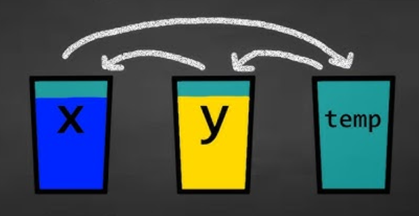

.. include:: ../common.rst

.. qnum::
   :prefix: 4-5-
   :start: 1

|Time90|

Implementing Array Algorithms (FRQs)
======================================

.. index::
    single: array
    single: algorithms
    pair: array; algorithms
    pair: array; FRQ
    single: loop algorithms
    single: accumulator
    single: sum
    single: average
    single: minimum
    single: maximum
    single: search
    single: frequency
    single: property
    single: shift
    single: rotate
    single: reverse
    single: pairs
    single: duplicates

In this lesson, you will study different Free Response Questions and responses that develop algorithms using arrays.

Here are some common algorithms that utilize array traversal that you should be familiar with for the AP CSA exam (AP 4.5.A.1):

- Compute a sum or average of array elements
- Determine the minimum or maximum value in an array
- Search for a particular element in the array
- Determine if at least one element has a particular property
- Determine if all elements have a particular property
- Determine the number of elements having a particular property
- Access all consecutive pairs of elements
- Determine the presence or absence of duplicate elements
- Shift or rotate elements left or right
- Reverse the order of the elements

Accumulator Pattern for Sum/Average
------------------------------------

As we have seen before with loops, the **accumulator pattern** is an algorithm that iterates through a set of values using a loop and updates an accumulator variable with those values, for example to compute a sum or average of a set of values. The accumulator pattern has 4 steps:

1. Initialize the accumulator variable before the loop.
2. Loop through the values.
3. Update the accumulator variable inside the loop.
4. Print or use the accumulated value when the loop is done.

With arrays, the accumulator pattern is used to compute the sum or average of the elements in the array. The sum is the total of all the elements in the array, and the average is the sum divided by the number of elements in the array.

For example, 

.. code-block:: java

  int[] values = {6, 2, 1, 7, 12, 5};
  double sum = 0;
  for (int val : values)
  {
      sum += val;
  }
  double average = sum / values.length;
  System.out.println("Average is " + average);

|CodingEx| **Coding Exercise**

.. parsonsprob:: parsons_array_avg
   :numbered: left
   :practice: T
   :adaptive:

   The following program has the correct code to return the average of the first 3 items in the array a, but the code is mixed up.  Drag the blocks from the left into the correct order on the right. You will be told if any of the blocks are in the wrong order or are indented incorrectly.
   -----
   public static double avg3(int[] a)
   {
   =====
     double total = 0;
   =====
     for (int i = 0; i < a.length && i < 3; i++)
     {
   =====
       total = total + a[i];
   =====
     } // end for
     return total / 3;
   =====
   } // end method

.. |Java visualizer| raw:: html

   <a href="http://www.pythontutor.com/java.html#code=public+class+ArrayWorker%0A%7B%0A+++private+int%5B+%5D+values%3B%0A%0A+++public+ArrayWorker(int%5B%5D+theValues)%0A+++%7B%0A++++++values+%3D+theValues%3B%0A+++%7D%0A%0A+++public+double+getAverage()%0A+++%7B%0A+++++double+total+%3D+0%3B%0A+++++for+(int+val+%3A+values)%0A+++++%7B%0A+++++++total++%3D+total+%2B+val%3B%0A+++++%7D%0A+++++return+total+/+values.length%3B%0A+++%7D%0A%0A+++public+static+void+main(String%5B%5D+args)%0A+++%7B%0A+++++int%5B%5D+numArray+%3D++%7B2,+6,+7,+12,+5%7D%3B%0A+++++ArrayWorker+aWorker+%3D+new+ArrayWorker(numArray)%3B%0A+++++System.out.println(aWorker.getAverage())%3B%0A+++%7D%0A%7D%0A%0A&mode=display&curInstr=0" target="_blank"  style="text-decoration:underline">Java visualizer</a>

Here is an object-oriented example that has the array as a private instance variable in the class and provides public methods sum and average that use enhanced for loops.  You can use the |Java Visualizer| or the Code Lens button to step through this code.

.. activecode:: enhanced-for-loop-avg
   :language: java
   :autograde: unittest
   :practice: T

   Try the code below that computes the average of the elements in the array. Can you add another method to compute the sum of the elements?
   ~~~~
   public class ArrayWorker
   {
       private int[] values;

       public ArrayWorker(int[] theValues)
       {
           values = theValues;
       }

       public double getSum()
       {
            // TODO: Write a loop that computes and returns 
            // the sum of the elements in the array

       }
       public double getAverage()
       {
           double total = 0;
           for (int val : values)
           {
               total = total + val;
           }
           return total / values.length;
       }

       public static void main(String[] args)
       {
           int[] numArray = {2, 6, 7, 12, 5};
           ArrayWorker aWorker = new ArrayWorker(numArray);
           System.out.println(aWorker.getAverage());
           System.out.println(aWorker.getSum());
       }
   }
   ====
   import static org.junit.Assert.*;

   import org.junit.*;

   import java.io.*;

   public class RunestoneTests extends CodeTestHelper
   {
       public RunestoneTests()
       {
           super("ArrayWorker");
       }

       @Test
       public void test1()
       {
           String output = getMethodOutput("main");
           String expect = "6.4\n32.0\n";

           boolean passed = getResults(expect, output, "Output from main");
           assertTrue(passed);
       }
       @Test
       public void testFor() 
        {
             String code = getCode();

             int fors = countOccurences(code, "for");

             boolean passed =
                     getResults(
                             "2 for loops", fors + " for loops", "for loop used in getSum");
             assertTrue(passed);
       }
   }

Min, Max, Search Algorithms
-------------------------------

In the last lesson, you wrote a spell check algorithm which searched for a word in an array of dictionary words. Searching for the minimum or maximum follows a similar pattern of a loop with an if statement inside it. The pattern to follow is an enhanced for loop or an indexed for loop, with an embedded if statement. Remember that enhanced for loops cannot be used to modify primitive values in an array or to return an index.

.. code-block:: java

  for (int value : array)
  {
      if (value ....)
          ...
  }

  for(int i=0; i < array.length; i++)
  {
     if (array[i] ....)
         ...
  }

.. parsonsprob:: parsons_for_each_largest
   :numbered: left
   :practice: T
   :adaptive:

   The following method has the correct code to return the largest value in an integer array called `vals` (an instance variable of the current object), but the code is mixed up.  Drag the blocks from the left into the correct order on the right and indent them correctly as well. You will be told if any of the blocks are in the wrong order or not indented correctly.
   -----
   public int getLargest()
   {
   =====
     int largest = vals[0];
   =====
     for (int item : vals)
     {
   =====
       if (item > largest)
       {
   =====
         largest = item;
   =====
       }  // end if
   =====
     } // end for
     return largest;
   =====
   } // end method

.. |Java visualizer link| raw:: html

   <a href="http://www.pythontutor.com/java.html#code=public+class+ArrayWorker%0A%7B%0A+++private+int%5B+%5D+values%3B%0A%0A+++public+ArrayWorker(int%5B%5D+theValues)%0A+++%7B%0A++++++values+%3D+theValues%3B%0A+++%7D%0A%0A+++public+double+getAverage()%0A+++%7B%0A+++++double+total+%3D+0%3B%0A+++++for+(int+val+%3A+values)%0A+++++%7B%0A+++++++total++%3D+total+%2B+val%3B%0A+++++%7D%0A+++++return+total+/+values.length%3B%0A+++%7D%0A+++%0A+++public+int+getLargest()%0A+++%7B%0A++%0A+++++int+largest+%3D+values%5B0%5D%3B%0A%0A+++++for+(int+item+%3A+values)%0A+++++%7B%0A%0A+++++++if+(item+%3E+largest)%0A+++++++%7B%0A%0A+++++++++largest+%3D+item%3B%0A%0A+++++++%7D++//+end+if+%0A%0A+++++%7D+//+end+for%0A+++++return+largest%3B%0A%0A+++%7D+//+end+method%0A%0A+++public+static+void+main(String%5B%5D+args)%0A+++%7B%0A+++++int%5B%5D+numArray+%3D++%7B2,+6,+7,+12,+5%7D%3B%0A+++++ArrayWorker+aWorker+%3D+new+ArrayWorker(numArray)%3B%0A+++++System.out.println(aWorker.getLargest())%3B%0A+++%7D%0A%7D%0A%0A&mode=display&curInstr=0" target="_blank">Java visualizer link</a>

If you want to step through the correct code to see what it does in the Java Visualizer click on the following |Java visualizer link|.

.. |Java visualizer min| raw:: html

   <a href="http://www.pythontutor.com/visualize.html#code=%20%20public%20class%20MinMax%0A%20%20%20%7B%20%20%20%20%20%20%0A%20%20%20%20%20%20public%20static%20void%20main%28String%5B%5D%20args%29%0A%20%20%20%20%20%20%7B%0A%20%20%20%20%20%20%20%20int%5B%20%5D%20values%20%3D%20%7B6,%202,%201,%207,%2012,%205%7D%3B%0A%20%20%20%20%20%20%20%20int%20min%20%3D%20values%5B0%5D%3B%20//%20initialize%20min%20to%20the%20first%20element%0A%20%20%20%20%20%20%20%20for%20%28int%20val%20%3A%20values%29%0A%20%20%20%20%20%20%20%20%7B%0A%20%20%20%20%20%20%20%20%20%20if%20%28val%20%3C%20min%29%20//%20found%20a%20new%20min!%0A%20%20%20%20%20%20%20%20%20%20%20%20%20%20min%20%3D%20val%3B%0A%20%20%20%20%20%20%20%20%7D%0A%20%20%20%20%20%20%20%20System.out.println%28%22Min%20is%20%22%20%2B%20min%20%29%3B%0A%20%20%20%20%20%20%7D%0A%20%20%20%7D&cumulative=false&curInstr=20&heapPrimitives=nevernest&mode=display&origin=opt-frontend.js&py=java&rawInputLstJSON=%5B%5D&textReferences=false&curInstr=0" target="_blank"  style="text-decoration:underline">Java visualizer</a>

|CodingEx| **Coding Exercise**

.. activecode:: minmax
   :language: java
   :autograde: unittest

   The code below finds the minimum (smallest element) in an array. Try it in the |Java visualizer min| with the CodeLens button. Can you change it to find the maximum element instead? Can you also compute the average of the elements?
   ~~~~
   public class MinMax
   {
       public static void main(String[] args)
       {
           int[] values = {6, 2, 1, 7, 12, 5};
           int min = values[0]; // initialize min to the first element
           for (int val : values)
           {
               if (val < min) // found a new min!
               {
                   min = val;
               }
           }
           System.out.println("Min is " + min);
       }
   }

   ====
   // Test for Lesson MinMax
   import static org.junit.Assert.*;

   import org.junit.*;

   import java.io.*;

   public class RunestoneTests extends CodeTestHelper
   {
       public RunestoneTests()
       {
           super("MinMax");

           int[] numArray = {2, 6, 7, 12, 5};
           setDefaultValues(new Object[] {numArray});
       }

       @Test
       public void test1()
       {
           String output = getMethodOutput("main");
           String expect = "Max is 12";

           boolean passed = output.contains(expect);

           passed = getResults(expect, output, "Max element", passed);
           assertTrue(passed);
       }

       @Test
       public void test2()
       {
           String output = getMethodOutput("main");
           String expect = "Average is 5.5";

           boolean passed = output.contains(expect);

           passed = getResults(expect, output, "Average", passed);
           assertTrue(passed);
       }

       @Test
       public void test3()
       {
           boolean passed = checkCodeContains("if statement using val >", "if (val >");
           assertTrue(passed);
       }
   }

When searching for an element or a minimum or maximum, it is important not to leave the loop early before finding the correct value and not to replace the value with subsequent ones.

|Exercise| **Check Your Understanding**

.. activecode:: early_return_error
   :language: java
   :autograde: unittest
   :practice: T

   Run the following code. Does it find 7 in the array? Click on Code Lens to trace through the code to see why not. Fix the early return error in the following code.
   ~~~~
   public class FindError
   {
       public static boolean find(int[] array, int target)
       {
          for (int val : array)
          {
             if (val == target)
             {
                 return true;
             }
             else
             {
                 return false;
             }
          }
          return false;
      }

       public static void main(String[] args)
       {
           int[] values = {6, 2, 1, 7, 12, 5};
           System.out.println(find(values, 7));
       }
   }
   ====
   import static org.junit.Assert.*;

   import org.junit.*;

   import java.io.*;

   public class RunestoneTests extends CodeTestHelper
   {
       public RunestoneTests()
       {
           super("FindError");
       }

       @Test
       public void test1()
       {
           String output = getMethodOutput("main");
           String expect = "true";

           boolean passed = (output.equals(expect));
           getResults(expect, output, "Testing main() output", passed);
           assertTrue(passed);
       }

       @Test
       public void test2()
       {
           int[] values = {-1, 0, 1};
           String output = "" + FindError.find(values, 0);
           String expect = "true";

           boolean passed = getResults(expect, output, "Testing find({-1, 0, 1}, 0)");
           assertTrue(passed);
       }
   }

.. mchoice:: mcq_array_error1
   :practice: T
   :random:
   :answer_a: Whenever the first element in <i>array</i> is not equal to <i>target</i>.
   :answer_b: Whenever <i>array</i> contains any element which equals <i>target</i>.
   :answer_c: Always 
   :answer_d: Never
   :correct: a
   :feedback_a: Yes, the loop returns as soon as checking the first element, whether it is equal to target or not. It needs to check the whole array before returning false. The else statement should not be included.
   :feedback_b: This would be true if the else statement was not there, but it returns false right away after just checking the first element instead of going through all of the elements to makes sure none of them are equal to target.
   :feedback_c: If the first element is equal to the target, it will return true.
   :feedback_d: It will return false with the else statement if the first element is not equal to the target.

   Given that ``array`` is an array of integers and ``target`` is an integer value, which of the following best describes the conditions under which the following code segment will return false?

   .. code-block:: java

     public boolean find(int[] array, int target)
     {
         for (int val : array)
         {
             if (val == target)
             {
                 return true;
             }
             else
             {
                 return false;
             }
         }
         return false;
     }
    

.. mchoice:: mcq_array_error2
   :practice: T
   :random:
   :answer_a: Whenever the first element in <i>array</i> is equal to <i>target</i>.
   :answer_b: Whenever <i>array</i> contains any element which equals <i>target</i>.
   :answer_c: Whenever the last element in <i>array</i> is equal to <i>target</i>.
   :answer_d: Whenever only 1 element in <i>array</i> is equal to <i>target</i>.
   :correct: c
   :feedback_a: This would be true if the loop started at the end of the array and moved toward the beginning.  But, it will loop from the first element to the last.
   :feedback_b: This would be true if temp was only set to the result of checking if the current element in the array is equal to <i>target</i> when it is <i>false</i>.  But, it is reset each time through the loop.
   :feedback_c: The variable <i>temp</i> is assigned to the result of checking if the current element in the array is equal to <i>target</i>.  The last time through the loop it will check if the last element is equal to <i>val</i>.
   :feedback_d: There is no count of the number of times the array element is equal to <i>target</i>.

   Given that ``array`` is an array of integers and ``target`` is an integer value, which of the following best describes the conditions under which the following code segment will return true?

   .. code-block:: java

     boolean temp = false;
     for (int val : array)
     {
       temp = ( target == val );
     }
     return temp;

Looping From Back to Front
--------------------------

.. index::
   pair: loop; from back to front

You don't have to loop through an array from the front to the back.  You can loop by starting at the back of the array and move toward the front during each time through the loop.  In the example below,  the method ``getIndexOfLastElementSmallerThanTarget`` returns the index of the last element in the array that is smaller than the given argument.  The **return** statement inside the loop stops the execution of the loop and the method and returns the index that is found immediately back to the main method. It returns -1 if there is no number in the array that is smaller than the given number.

.. |visualizerBF| raw:: html

   <a href="http://www.pythontutor.com/java.html#code=%20%20%20public%20class%20ArrayFindSmallest%0A%20%20%20%7B%0A%0A%20%20%20%20%20%20/**%20%40return%20index%20of%20the%20last%20number%20smaller%20than%20target%20*/%20%20%20%20%20%0A%20%20%20%20%20%20public%20static%20int%20getIndexOfLastElementSmallerThanTarget%28int%5B%20%5D%20values,%20int%20target%29%0A%20%20%20%20%20%20%7B%0A%20%20%20%20%20%20%20%20%20for%20%28int%20index%20%3D%20values.length%20-%201%3B%20index%20%3E%3D%200%3B%20index--%29%0A%20%20%20%20%20%20%20%20%20%7B%0A%20%20%20%20%20%20%20%20%20%20%20%20if%20%28values%5Bindex%5D%20%3C%20target%29%0A%20%20%20%20%20%20%20%20%20%20%20%20%20%20%20%20return%20index%3B%0A%20%20%20%20%20%20%20%20%20%7D%0A%20%20%20%20%20%20%20%20%20return%20-1%3B%0A%20%20%20%20%20%20%7D%0A%20%20%20%0A%20%20%20%20%20%20public%20static%20void%20main%20%28String%5B%5D%20args%29%0A%20%20%20%20%20%20%7B%0A%20%20%20%20%20%20%20%20%20int%5B%5D%20theArray%20%3D%20%7B-30,%20-5,%208,%2023,%2046%7D%3B%0A%20%20%20%20%20%20%20%20%20System.out.println%28%22Last%20index%20of%20element%20smaller%20than%2050%3A%20%22%20%2B%20getIndexOfLastElementSmallerThanTarget%28theArray,%2050%29%29%3B%0A%20%20%20%20%20%20%20%20%20System.out.println%28%22Last%20index%20of%20element%20smaller%20than%2030%3A%20%22%20%2B%20getIndexOfLastElementSmallerThanTarget%28theArray,%2030%29%29%3B%0A%20%20%20%20%20%20%20%20%20System.out.println%28%22Last%20index%20of%20element%20smaller%20than%2010%3A%20%22%20%2B%20getIndexOfLastElementSmallerThanTarget%28theArray,%2010%29%29%3B%0A%20%20%20%20%20%20%20%20%20System.out.println%28%22Last%20index%20of%20element%20smaller%20than%200%3A%20%22%20%2BgetIndexOfLastElementSmallerThanTarget%28theArray,0%29%29%3B%0A%20%20%20%20%20%20%20%20%20System.out.println%28%22Last%20index%20of%20element%20smaller%20than%20-20%3A%20%22%20%2BgetIndexOfLastElementSmallerThanTarget%28theArray,-20%29%29%3B%0A%20%20%20%20%20%20%20%20%20System.out.println%28%22Last%20index%20of%20element%20smaller%20than%20-30%3A%20%22%20%2BgetIndexOfLastElementSmallerThanTarget%28theArray,-30%29%29%3B%0A%20%20%20%20%20%20%7D%0A%20%20%20%7D%0A%20%20%20&cumulative=false&curInstr=0&heapPrimitives=nevernest&mode=display&origin=opt-frontend.js&py=java&rawInputLstJSON=%5B%5D&textReferences=false" target="_blank"  style="text-decoration:underline">Java visualizer</a>

|CodingEx| **Coding Exercise**

.. activecode:: arrayFindSmaller
   :language: java
   :autograde: unittest
   :practice: T

   What does the following code print out? Notice that the array and the target are passed in as arguments to the getIndexOfLastElementSmallerThanTarget method. Trace through it keeping track of the array values and the output. Then run it to see if you're right.  You can also try the code in the |visualizerBF| with the Code Lens button. Can you add another method that finds the index of the last element greater than the target instead of smaller than the target and have main print out a test of it? Call this method getIndexOfLastElementGreaterThanTarget and give it 2 arguments and a return value like the method below.
   ~~~~
   public class ArrayFindSmallest
   {

       /**
        * @return index of the last number smaller than target
        */
       public static int getIndexOfLastElementSmallerThanTarget(int[] values, int target)
       {
           for (int index = values.length - 1; index >= 0; index--)
           {
               if (values[index] < target)
               {
                  return index;
               }
           }
           return -1;
       }

       /**
        * Add a method called getIndexOfLastElementGreaterThanTarget
        *
        * @param int array
        * @param int target
        * @return index of the last number greater than target
        */
       public static void main(String[] args)
       {
           int[] theArray = {-30, -5, 8, 23, 46};
           System.out.println(
                   "Last index of element smaller than 50: "
                           + getIndexOfLastElementSmallerThanTarget(theArray, 50));
           System.out.println(
                   "Last index of element smaller than 30: "
                           + getIndexOfLastElementSmallerThanTarget(theArray, 30));
           System.out.println(
                   "Last index of element smaller than 10: "
                           + getIndexOfLastElementSmallerThanTarget(theArray, 10));
           System.out.println(
                   "Last index of element smaller than 0: "
                           + getIndexOfLastElementSmallerThanTarget(theArray, 0));
           System.out.println(
                   "Last index of element smaller than -20: "
                           + getIndexOfLastElementSmallerThanTarget(theArray, -20));
           System.out.println(
                   "Last index of element smaller than -30: "
                           + getIndexOfLastElementSmallerThanTarget(theArray, -30));
       }
   }
   ====
   import static org.junit.Assert.*;

   import org.junit.*;

   import java.io.*;

   public class RunestoneTests extends CodeTestHelper
   {
       public RunestoneTests()
       {
           super("ArrayFindSmallest");
       }

       @Test
       public void test1()
       {
           String output = getMethodOutput("main");
           String expect = "Last index of element smaller than ";

           boolean passed = output.contains(expect);
           output = output.substring(0, output.indexOf("\n"));
           passed =
                   getResults(
                           "Last index of element smaller than 50: 4",
                           output,
                           "Ran getIndexOfLastElementSmallerThanTarget",
                           passed);
           assertTrue(passed);
       }

       @Test
       public void test2()
       {
           int[] nums = {10, 50, 20, 30, 40, 20};
           Object[] args = {nums, 30};

           String output = getMethodOutput("getIndexOfLastElementGreaterThanTarget", args);
           String expect = "4";

           boolean passed =
                   getResults(
                           expect,
                           output,
                           "getIndexOfLastElementGreaterThanTarget({10, 50, 20, 30, 40, 20}, 30)");
           assertTrue(passed);
       }

       @Test
       public void test3()
       {
           int[] nums = {10, 50, 20, 30, 40, 20};
           Object[] args = {nums, 100};

           String output = getMethodOutput("getIndexOfLastElementGreaterThanTarget", args);
           String expect = "-1";

           boolean passed =
                   getResults(
                           expect,
                           output,
                           "getIndexOfLastElementGreaterThanTarget({10, 50, 20, 30, 40, 20}, 100)");
           assertTrue(passed);
       }
   }

|Exercise| **Check Your Understanding**

.. mchoice:: mcq_array_loop1
   :random:
   :practice: T
   :answer_a: -1
   :answer_b: -15
   :answer_c: 1
   :answer_d: You will get an out of bounds error.
   :correct: c
   :feedback_a: The method will only return -1 if no value in the array is less than the passed value.
   :feedback_b: The method returns the index of the first item in the array that is less than the value, not the value.
   :feedback_c: Since the method loops from the back towards the front -15 is the last value in the array that is less than -13 and it is at index 1.
   :feedback_d: No, the method correctly starts the index at values.length - 1 and continues as long as i is greater than or equal to 0.

   Given the following code segment (which is identical to the method above) what will be returned when you execute: ``getIndexOfLastElementSmallerThanTarget(values,-13)``;

   .. code-block:: java

      private int[ ] values = {-20, -15, 2, 8, 16, 33};

      public static int getIndexOfLastElementSmallerThanTarget(int[ ] values, int compare)
      {
         for (int i = values.length - 1; i >=0; i--)
         {
            if (values[i] < compare)
               return i;
         }
         return -1; // to show none found
      }

.. mchoice:: mcq_array_loop2
   :random:
   :practice: T
   :answer_a: -1
   :answer_b: 1
   :answer_c: 2
   :answer_d: You will get an out of bounds error.
   :correct: d
   :feedback_a: The method will only return -1 if no value in the array is less than the passed value.
   :feedback_b: Check the starting index.   Is it correct?
   :feedback_c: Check the starting index.   Is it correct?
   :feedback_d: You can not start the index at the length of the array.  You must start at the length of the array minus one.  This is a common mistake.

   Given the following code segment (which is not quite identical to the method above) what will be returned when you execute: ``getIndexOfLastElementSmallerThanTarget(values, 7)``;

   .. code-block:: java

      int[ ] values = {-20, -15, 2, 8, 16, 33};

      public static int getIndexOfLastElementSmallerThanTarget(int[] values, int compare)
      {
         for (int i = values.length; i >=0; i--)
         {
            if (values[i] < compare)
               return i;
         }
         return -1; // to show none found
      }

Test Property
-------------------

Often we loop through an array to see if elements have a particular property, for example all the elements are even or at least one is negative. On the AP exam, this property is often given as a boolean method to use in the if statement to:

- Determine if at least one element has a particular property
- Determine if all elements have a particular property
- Determine the number of elements having a particular property

Here are some patterns. Note that determining if *all* have a certain property means that we need to check all elements before returning true, so we often have to check for the negation of the property to return false.

.. code-block:: java

      // see if at least one has the property
      for (int val : values)
      {
          if (isProperty(val))
          {
              return true;
          }
      }
      return false;

      // see if all have the property
      for (int val : values)
      {  
          if (!isProperty(val))
          {
              return false;
          }
      }
      return true;
    
      // count the number of elements with the property
      int count = 0;
      for (int val : values)
      {
          if (isProperty(val))
          {
              count++;
          }
      }

.. parsonsprob:: parsons-even-array
   :numbered: left
   :practice: T
   :adaptive:

   The following program segment should count the number of elements in the array that are even using an enhanced for each loop.  But, the blocks have been mixed up.  Drag the blocks from the left and put them in the correct order on the right.  Click the Check button to check your solution.
   -----
   int[] arr = {14, -5, 2, 17, 29, -8, 36};
   int count = 0;
   =====
   for (int value : arr) 
   {
   =====
       if (value % 2 == 0) 
       {
   =====
           count++;
   =====
       } //end conditional
   =====
   } //end for loop

.. activecode::  exAllOdd
              :language: java
              :autograde: unittest
              :practice: T

              Write the method allOdd to return true if all the values in the array are odd. First write the helper function isEven to return true or false for one value, using %.
              ~~~~
              public class Test1
              {
                  public static boolean isEven(int value)
                  {
                      // 1. TODO: return true if value is even, false otherwise
                      return true;
                  }

                  public static boolean allOdd(int[] array)
                  {
                      // 2. TODO: Loop thru the array 
                      // and return false if any value isEven

                      // if all odd, return true
                      return true;
                  }
                  
                  public static void main(String[] args)
                  {
                      int[] a1 = {1, 3, 6};
                      int[] a2 = {1, 3, 5};
                      System.out.println(allOdd(a1));
                      System.out.println(allOdd(a2));
                  }
              }
              ====
              import static org.junit.Assert.*;

              import org.junit.*;

              import java.io.*;

              public class RunestoneTests extends CodeTestHelper
              {
                  @Test
                  public void testMain() throws IOException
                  {
                      String output = getMethodOutput("main");
                      String expect = "false\ntrue\n"; 

                      boolean passed = getResults(expect, output, "Expected output from main");
                      assertTrue(passed);
                  }
                  @Test
                  public void testMethod()
                  {
                      int[] nums = {10, 20, 30, 40};
                      Object[] args = {nums};

                      String output = getMethodOutput("allOdd", args);
                      String expect = "false";

                      boolean passed = getResults(expect, output, "allOdd({10, 20, 30, 40})");
                      assertTrue(passed);
                  }
                  @Test
                  public void testMethod2()
                  {
                      int[] nums = {37,41,55,99};
                      Object[] args = {nums};

                      String output = getMethodOutput("allOdd", args);
                      String expect = "true";

                      boolean passed = getResults(expect, output, "allOdd({37,41,55,99})");
                      assertTrue(passed);
                  }
              }

Pairs and Duplicates in Array
------------------------------

Here is a pattern to check for duplicates in an array by accessing a pair of elements next to each other, ``array[i]`` and ``array[i+1]``. Note that we need to use an indexed for loop to get access to the next element.

.. code-block:: java

      // check for duplicates next to each other
      for (int i = 0; i < values.length - 1; i++)
      {
          if (values[i] == values[i + 1])
          {
              return true;
          }
      }
      return false;

If we want to check for duplicates anywhere in the array, we need to use a nested loop to compare all pairs of elements in the array.

.. code-block:: java

      // check for duplicates anywhere in the array
      for (int i = 0; i < values.length; i++)
      {
          for (int j = i + 1; j < values.length; j++)
          {
              if (values[i] == values[j])
              {
                  return true;
              }
          }
      }
      return false;

.. activecode:: sumPairs
   :language: java
   :autograde: unittest
   :practice: T

   Create a method ``sumPairs10(nums)`` returns ``true`` if there are at least two items in the array ``nums`` that are adjacent (next to each other) that add up to 10, otherwise return ``false``. 
   ~~~~
   public class Pairs
   {
      public static boolean sumPairs10(int[] nums)
      {
          // TODO: if two adjacent numbers in nums add up to 10, return true

          return false;
      }

      public static void main(String[] args)
      {

         int[] nums1 = {1, 2, 8};
         System.out.println(sumPairs10(nums1));

         int[] nums2 = {2, 1, 2};
         System.out.println(sumPairs10(nums2)); 
      }

   }
   ====
   import static org.junit.Assert.*;
   import org.junit.Test;
   import java.io.IOException;

   public class RunestoneTests extends CodeTestHelper {
      public RunestoneTests()
      {
         super("Pairs");
       }

      @Test
      public void testMain() throws IOException {
         String output = getMethodOutput("main");
         String expect = "true\nfalse\n";
         boolean passed = getResults(expect, output, "Expected output from main");
         assertTrue(passed);
      }
      @Test
      public void testMethod2()
      {
            int[] nums = {2, 4, 6, 8};
            Object[] args = {nums};

            String output = getMethodOutput("sumPairs10", args);
            String expect = "true";

            boolean passed = getResults(expect, output, "sumPairs10({2, 4, 6, 8})");
            assertTrue(passed);
        }      
   }

.. activecode:: noDups
   :language: java
   :autograde: unittest
   :practice: T

   Create a method ``noDups(nums)`` returns ``true`` if there are no repeated (duplicate) items in the array ``nums``. It should return false if it does find a repeated element using nested loops.
   ~~~~
   public class Pairs
   {
      public static boolean noDups(int[] nums)
      {
          // TODO: use nested loops to check if any item appears more than once in nums

          return true;
      }

      public static void main(String[] args)
      {

         int[] nums1 = {1, 2, 8};
         System.out.println(noDups(nums1));

         int[] nums2 = {3, 3, 3};
         System.out.println(noDups(nums2)); 
      }
   }
   ====
   import static org.junit.Assert.*;
   import org.junit.Test;
   import java.io.IOException;

   public class RunestoneTests extends CodeTestHelper {
      public RunestoneTests()
      {
         super("Pairs");
      }

      @Test
      public void testMain() throws IOException {
         String output = getMethodOutput("main");
         String expect = "true\nfalse\n";
         boolean passed = getResults(expect, output, "Expected output from main");
         assertTrue(passed);
      }
      @Test
      public void testMethod2()
      {
            int[] nums = {2, 4, 6, 2};
            Object[] args = {nums};

            String output = getMethodOutput("noDups", args);
            String expect = "false";

            boolean passed = getResults(expect, output, "noDups({2, 4, 6, 2})");
            assertTrue(passed);
        }      
   }

Rotating Array Elements
-------------------------

Rotating an array means shifting all the elements in the array to the right or left by one position. For example, if the array is {6, 2, 5, 3}, rotating it to the right would give {3, 6, 2, 5}. To rotate an array, we need to copy the last element to the first position and then copy all the other elements to the next position. We can use a temporary variable to store the last element before overwriting it. If you do not want to change the original array, you can return a new array by copying in the rotated elements.

.. parsonsprob:: rotateRightParsons
   :numbered: left
   :practice: T
   :adaptive:

   The following program segment is a method that should return an integer array that is rotated to the right -- so {6, 2, 5, 3} returns {3, 6, 2, 5} (the parameter). Note that the method return type is int[] which means it will return an int array. But, the blocks have been mixed up and include one extra block that is not needed in a correct solution.  Drag the blocks from the left and put them in the correct order on the right.  Click the Check button to check your solution.
   -----
   public static int[] rotateRight(int[] arr) 
   {
   =====
       int[] result = new int[arr.length];
   =====
       result[0] = arr[arr.length-1];
   =====
       for (int i = 0; i < arr.length - 1; i++) 
       {
   =====
       for (int i = 0; i < arr.length; i++) 
       { #distractor
   =====
           result[i + 1] = arr[i];
   =====
       } //end for loop
   =====
       return result;
   =====
   } //end shiftRight method

.. |visualizer| raw:: html

   <a href="http://www.pythontutor.com/visualize.html#code=public%20class%20Rotate%0A%20%20%20%7B%20%20%20%20%20%20%0A%20%20%20%20%20%20public%20static%20void%20main%28String%5B%5D%20args%29%0A%20%20%20%20%20%20%7B%0A%20%20%20%20%20%20%20%20int%5B%20%5D%20values%20%3D%20%7B6,%202,%201,%207,%2012,%205%7D%3B%0A%20%20%20%20%20%20%20%20int%20first%20%3D%20values%5B0%5D%3B%0A%20%20%20%20%20%20%20%20for%20%28int%20i%3D0%3B%20i%20%3C%20values.length%3B%20i%2B%2B%29%0A%20%20%20%20%20%20%20%20%7B%0A%20%20%20%20%20%20%20%20%20%20%20//%20if%20it's%20not%20the%20last%20element,%20copy%20the%20next%20one%20over%0A%20%20%20%20%20%20%20%20%20%20if%20%28i%20%3C%20values.length%20-%201%29%20%0A%20%20%20%20%20%20%20%20%20%20%20%20%20%20values%5Bi%5D%20%3D%20values%5Bi%2B1%5D%3B%0A%20%20%20%20%20%20%20%20%20%20else%20%7B%0A%20%20%20%20%20%20%20%20%20%20%20%20%20//%20last%20element%20gets%20first%0A%20%20%20%20%20%20%20%20%20%20%20%20%20values%5Bi%5D%20%3D%20first%3B%20%20%20%20%20%20%20%20%0A%20%20%20%20%20%20%20%20%7D%0A%20%20%20%20%20%20%20%20%7D%0A%20%20%20%20%20%20%20%20//%20print%20them%20out%20to%20see%20the%20results%0A%20%20%20%20%20%20%20%20for%20%28int%20val%20%3A%20values%29%0A%20%20%20%20%20%20%20%20%7B%0A%20%20%20%20%20%20%20%20%20%20%20System.out.print%28val%20%2B%20%22%20%22%29%3B%0A%20%20%20%20%20%20%20%20%7D%0A%20%20%20%20%20%20%20%7D%0A%20%20%20%20%20%20%20%20%0A%20%20%20%7D%0A%20%20&cumulative=false&curInstr=47&heapPrimitives=nevernest&mode=display&origin=opt-frontend.js&py=java&rawInputLstJSON=%5B%5D&textReferences=false&curInstr=0" target="_blank"  style="text-decoration:underline">Java visualizer</a>

We can also rotate in place without constructing another array. We can copy the last element to the first position and then copy all the other elements to the next position. We need to use an indexed loop to access the elements at different indices. When you pass an array to a method, you're actually passing a reference to the array's memory location. This means that any changes made to the array within the method will affect the original array.

|CodingEx| **Coding Exercise**

.. activecode:: rotate
   :language: java
   :autograde: unittest

   The code below rotates array elements to the left in place without constructing another array. Try it in the |visualizer| with the CodeLens button. Can you change it to rotate the elements to the right instead? Hint: use a backwards loop.
   ~~~~
   public class Rotate
   {
       public static void main(String[] args)
       {
           int[] values = {6, 2, 1, 7, 12, 5};
           int first = values[0];
           for (int i = 0; i < values.length; i++)
           {
               // if it's not the last element, copy the next one over
               if (i < values.length - 1)
               {
                   values[i] = values[i + 1];
               }
               else
               {
                   // last element gets first
                   values[i] = first;
               }
           }
           // print them out to see the results
           for (int val : values)
           {
               System.out.print(val + " ");
           }
       }
   }
   ====
   import static org.junit.Assert.*;

   import org.junit.*;

   import java.io.*;

   public class RunestoneTests extends CodeTestHelper
   {
       public RunestoneTests()
       {
           super("Rotate");
       }

       @Test
       public void test1()
       {
           String output = getMethodOutput("main");
           String expect = "5 6 2 1 7 12";

           boolean passed = output.contains(expect);

           passed = getResults(expect, output, "Rotate numbers to the right", passed);
           assertTrue(passed);
       }

       @Test
       public void test3()
       {
           boolean passed =
                   checkCodeContains("copying values[i-1] into values[i]", "values[i] = values[i-1]");
           assertTrue(passed);
       }
   }

Reversing an Array
-------------------

Reversing an array is similar to rotating it. We can copy the first element to the last position, the second element to the second-to-last position, and so on. We can use a temporary variable to store the value of the element we are overwriting. We usually need an indexed loop to access the elements at different indices unless we use a temporary array to store the reversed elements. Note that arrays are passed as references to methods, so any changes made to the array within the method will affect the original array.

|CodingEx| **Coding Exercise**

.. parsonsprob:: array-reverse1
   :numbered: left
   :practice: T
   :adaptive:
   :noindent:

   The following program segment is a method that should return string array that is in reverse order -- so {"b", "a", "z"} should return {"z", "a", "b"}.  But, the blocks have been mixed up and include two extra blocks that are not needed in a correct solution.  Drag the blocks from the left and put them in the correct order on the right.  Click the Check button to check your solution.
   -----
   public static String[] reverse(String[] arr) 
   {
   =====
       String[] result = new String[arr.length];
   =====
       int i = arr.length - 1;
   =====
       int i = arr.length; #distractor
   =====
       for (String element: arr) 
       {
   =====
       for (element: arr) 
       { #distractor
   =====
         result[i] = element;
   =====
         i--;
   =====
       } //end for loop
   =====
       return result;
   =====
   } //end reverse method

The following programs show how you can reverse an array in place by swapping elements. The first uses a while loop and the second an indexed for loop. To swap two elements, you need to use a temp variable to store the value of the element you are overwriting. Imagine that you have a glass of milk and a glass of orange juice. How would you swap the contents of the two glasses without making a huge mess? You would need a third glass to hold the contents of one of the glasses while you pour the contents of the other glass into it. Then you can pour the contents of the third glass into the other glass. This is the same idea behind swapping elements in an array.

    Figure 1: Swapping elements in an array

.. code-block:: java

      // Swapping 2 elements at index i and j
      int temp = array[i];  // pour milk into temp cup
      array[i] = array[j];  // pour orange juice into milk glass
      array[j] = temp;      // pour milk from temp into oj glass
            

.. parsonsprob:: array-reverse2
   :numbered: left
   :practice: T
   :adaptive:
   :noindent:

   The following method reverses an array in place by using a temp variable to swap the first and last items.  But, the blocks have been mixed up and include two extra blocks that are not needed in a correct solution.  Drag the blocks from the left and put them in the correct order on the right.  Click the Check button to check your solution.
   -----
   public static void reverse(String[] array) 
   {
   =====
        int start = 0;
        int end = array.length - 1;
        =====
        while (start < end) 
        {
        =====
        for(int i = start; i < end; i++)
        { #distractor
        =====
            // Swap the elements at the start and end indices
            String temp = array[start];
            =====
            array[start] = array[end];
            =====
            array[end] = temp;
            =====
            start++;
            end--;
            =====
            start++; #distractor
            =====       
        }
    }

.. parsonsprob:: parsons_array_reverse
   :numbered: left
   :practice: T
   :adaptive:
   :noindent:

   The following program has the correct code to reverse the elements in an array, a,  but the code is mixed up.  Drag the blocks from the left into the correct order on the right. You will be told if any of the blocks are in the wrong order.
   -----
   public static void reverse(int[] a)
   {
   =====
     int temp = 0;
     int half = a.length / 2;
     int max = a.length - 1;
   =====
     for (int i = 0; i < half; i++)
     {
   =====
        temp = a[i];
   =====
        a[i] = a[max - i];
   =====
        a[max - i] = temp;
   =====
     } // end for
   =====
   } // end method

.. activecode::  reverseArrayCode
        :language: java
        :autograde: unittest
        :practice: T

        Create a method ``reverse`` that reverses an array in place using a temp variable. 
        ~~~~
        import java.util.Arrays;

        public class ReverseTest
        {
            public static void reverse(String[] array)
            {
                // TODO: reverse array in place using a temp variable to swap elements

            }
       
            public static void main(String[] args)
            {
                String[] a1 = {"p","a","w","s"};
                reverse(a1);         
                System.out.println(Arrays.toString(a1));  
            }
        }

        ====
              import static org.junit.Assert.*;

              import org.junit.*;

              import java.io.*;

              public class RunestoneTests extends CodeTestHelper
              {
                  @Test
                  public void testMain() throws IOException
                  {
                      String output = getMethodOutput("main");
                      String expect = "[s, w, a, p]";
                      boolean passed = getResults(expect, output, "Expected output from main");
                      assertTrue(passed);
                  }
                  @Test
                  public void testMethod2()
                  {
                      String[] nums = {"r","a","t","s"};
                      Object[] args = {nums};

                      String output = getMethodOutput("reverse", args);
                      String expect = "[s, t, a, r]";

                      boolean passed = getResults(expect, output, "reverse({r, a, t, s})");
                      assertTrue(passed);
                  }
              }

FRQ Practice
-------------

We encourage you to work in pairs or groups to tackle the following challenging FRQ problems and take them one step at a time. These will get easier with practice!

.. toctree::
   :maxdepth: 3

   horseBarnA.rst
   horseBarnB.rst
   selfDivisorB.rst
   soundA.rst
   soundB.rst
   numberCubeA.rst
   numberCubeB.rst
