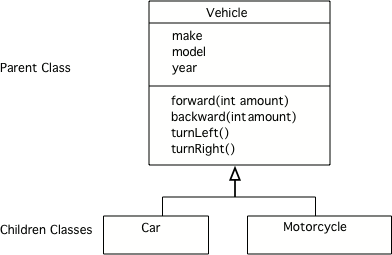
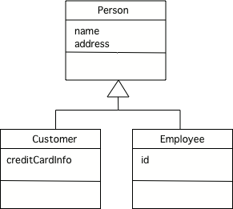
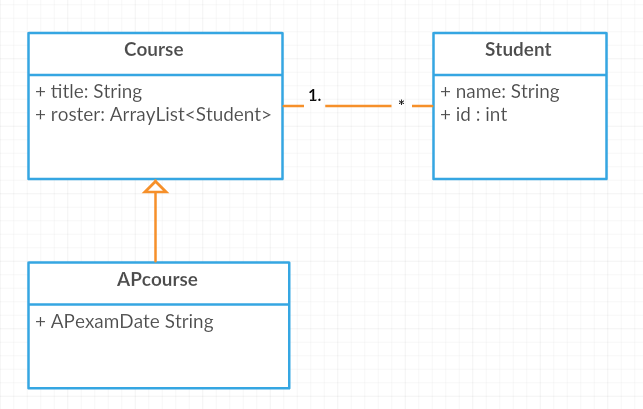

.. include:: ../common.rst

.. qnum::
   :prefix: 5-1-
   :start: 1

|Time90|

Inheritance, Superclass, Subclass
==================================

One of the really useful features of Object-Oriented programming is **inheritance**.  You may have heard of someone coming into an inheritance, which often means they were left something from a relative who died.  Or, you might hear someone say that they have inherited musical ability from a parent.  In Java all classes can **inherit** attributes (instance variables) and behaviors (methods) from another class.  The class being inherited from is called the **parent class** or **superclass**.  The class that is inheriting is called the **child class** or **subclass**.

When one class inherits from another, we can say that it is the *same kind of thing* as the **parent class** (the class it inherits from).  For example, a car is a kind of vehicle.  This is sometimes called the *is-a* relationship, but more accurately it's a *is-a kind of* relationship.  A motorcycle is another kind of vehicle.  All vehicles have a make, model, and year that they were created.  All vehicles can go forward, backward, turn left and turn right.

    Figure 1: A UML Class Diagram Showing Inheritance

A **UML (Unified Modeling Language) class diagram** shows classes and the relationships between the classes as seen in Figure 1.  An open triangle points to the parent class.  The parent class for ``Car`` and ``Motorcycle`` is ``Vehicle``. The ``Vehicle`` class has two child classes or subclasses: ``Car`` and ``Motorcycle``.

Subclass extends Superclass
---------------------------

To make a subclass inherit from a superclass, use the Java keyword **extends** with the superclass name when creating a new subclass as shown below.

.. code-block:: java

  public class Car extends Vehicle
  public class Motorcycle extends Vehicle

.. index::
    single: extends

.. note::

   While a person can have two parents, a Java class can only inherit from one parent class.  If you leave off the **extends** keyword when you declare a class then the class will inherit from the ``Object`` class that is already defined in Java.

.. The ``Person`` class declared below will inherit from the ``Object`` class.

Why Use Inheritance?
---------------------

.. index::
    single: generalization
    single: specialization

Inheritance allows you to reuse data and behavior from the parent class.  If you notice that several classes share the same data and/or behavior,  you can pull that out into a parent class.  This is called **generalization**. For example,  Customers and Employees are both people so it makes sense use the general Person class as seen below.

Inheritance is also useful for **specialization** which is when you want most of the behavior of a parent class, but want to do at least one thing differently and/or add more data.  The example below can also be seen as specialization.  An employee is a person but also has a unique id.  A customer is a person, but also has a credit card.

    Figure 2: A UML Class Diagram Showing Inheritance

|Exercise| **Check your understanding**

.. mchoice:: qoo10-1-1
   :practice: T
   :answer_a: It doesn't have a parent class.
   :answer_b: It inherits from the Object class.
   :answer_c: It inherits from the Default class.
   :answer_d: It inherits from the Parent class.
   :correct: b
   :feedback_a: If no parent class is specified using the extends keyword, the current class will still have a parent class.
   :feedback_b: If no parent class is specified using the extends keyword, the parent class will be Object.
   :feedback_c: There isn't a class named Default.
   :feedback_d: There isn't a class named Parent.

   If you don't specify the parent class in a class declaration which of the following is true?

.. mchoice:: qoo10-1-2
   :practice: T
   :answer_a: Yes
   :answer_b: No
   :correct: a
   :feedback_a: Yes, a child class inherits all the parent class object field and methods.
   :feedback_b: Why would inheritance be useful if you didn't actually get anything from the parent class?

   If the class Vehicle has the instance fields make and model and the class Car inherits from the class Vehicle, will a car object have a make and model?

.. mchoice:: qoo10-1-3
   :practice: T
   :answer_a: Yes
   :answer_b: No
   :correct: b
   :feedback_a: Is a parking garage a kind of vehicle?
   :feedback_b: No, a parking garage is not a kind of vehicle.  Instead it has vehicles in it which implies that the ParkingGarage class would have a field that tracks the vehicles in it.

   If I had a class ParkingGarage should it inherit from the class Vehicle?

.. mchoice:: qoo10-1-4
   :practice: T
   :answer_a: 0
   :answer_b: 1
   :answer_c: 2
   :answer_d: infinite
   :correct: b
   :feedback_a: In Java a class always has at least one parent class.  If none is specified the default is Object.
   :feedback_b: All classes in Java have one and only one parent class.
   :feedback_c: While that is how it works with humans, is that how Java works?
   :feedback_d: This is true for interfaces, but not parent classes.

   In Java how many parents can a class have?

|CodingEx| **Coding Exercise**

The Student class can also inherit from the class Person just like Employee and Customer because a Student is a type of Person.

.. activecode:: StudentInheritance
  :language: java
  :autograde: unittest
  :practice: T

  What do you need to add to the Student class declaration below to make it inherit from type Person? When you fix the code, the **instanceof** operator will return true that Student s is an instance of both the Student and the Person class. What other private instance variables could you add to Person and Student? In which class would you put an address attribute? Where would you put gpa?
  ~~~~
  class Person
  {
      private String name;
  }

  // How can we make the Student class inherit from class Person?
  public class Student
  {
      private int id;

      public static void main(String[] args)
      {
          Student s = new Student();
          System.out.println(s instanceof Student);
          System.out.println(s instanceof Person);
      }
  }

   ====
   import static org.junit.Assert.*;

   import org.junit.*;

   import java.io.*;

   public class RunestoneTests extends CodeTestHelper
   {
       @Test
       public void testMain() throws IOException
       {
           String output = getMethodOutput("main");
           String expect = "true\ntrue";
           boolean passed = getResults(expect, output, "Expected output from main");
           assertTrue(passed);
       }

       @Test
       public void containsExtends()
       {
           boolean passed = checkCodeContains("Student extends Person");
           assertTrue(passed);
       }
   }

is-a vs. has-a Relationships
---------------------------------------

.. index::
    single: has-a
    single: association
    pair: relationships; association

Another type of relationship between classes is the **has-a** relationship or **association** relationship.  Use this when the object of one class contains a reference to one or more of another class.  For example, a course can have many course periods associated with it as shown below.  The ``1`` near the ``Course`` means that ``1`` course object is associated with the number shown near the other class.  In this case it is ``*`` which means 0 to many.  So one course is associated with 0 to many course periods.

    Figure 3: A UML Class Diagram showing Association

In the code, the ``Course`` class **has** an array or ArrayList of ``CoursePeriod`` objects as an attribute inside it.

.. code-block:: java

  public class Course
  {
      private ArrayList<CoursePeriod> periodList;
  }

Alternatively, we could say that a CoursePeriod  has a Course attribute inside it to hold the information about the Course. It is up to the programmer how to design these two classes depending on which type of association would be more useful in the program.

.. code-block:: java

  public class CoursePeriod
  {
      private Course courseInfo;
      private int period;
  }

Here is another example. Consider the classes Student, Course, and  APcourse. An APcourse is a special type of Course. Students are in Courses. What are the relationships between these classes? The UML diagram below shows the inherits (is-a) relationship between Course and APcourse and the associate (has-a) relationship between Course and Students.

    Figure 4: A UML Class Diagram for Student, Course, APcourse

|CodingEx| **Coding Exercise**

We can represent the diagram in Figure 4 in the code below. The Course class has an ArrayList of Student objects in it as the roster attribute. And an APcourse extends Course. What do you think the following code will print out?

.. activecode:: apclass
  :language: java
  :autograde: unittest

  What do you think the following code will print out?
  ~~~~
  import java.util.*;

  class Student
  {
      private String name;
      private int id;
  }

  class Course
  {
      private String title;
      private ArrayList<Student> roster;
  }

  public class APcourse extends Course
  {
      private String APexamDate;

      public static void main(String[] args)
      {
          APcourse csa = new APcourse();
          System.out.print("Is an APcourse a Course? ");
          System.out.println(csa instanceof Course);
      }
  }

    ====
    import static org.junit.Assert.*;

    import org.junit.*;

    import java.io.*;

    public class RunestoneTests extends CodeTestHelper
    {
        @Test
        public void testMain() throws IOException
        {
            String output = getMethodOutput("main");
            String expect = "Is an APcourse a Course? true\n";
            boolean passed = getResults(expect, output, "Expected output from main");
            assertTrue(passed);
        }
    }

is-a Substitution Test
----------------------------------

If you aren't sure if a class should inherit from another class ask yourself if you can substitute the subclass type for the superclass type.  For example, if you have a ``Book`` class and it has a subclass of ``ComicBook`` does that make sense?  Is a comic book a kind of book?  Yes, a comic book is a kind of book so inheritance makes sense.  If it doesn't make sense use *association* or the *has-a* relationship instead.

.. note::

   Only use inheritance when the child class is really a type of the parent class, otherwise use association.

|Exercise| **Check your understanding**

.. mchoice:: qoo_1
   :practice: T
   :answer_a: Create one class PublishedMaterial with the requested attributes.
   :answer_b: Create classes Book and Movie and each class has the requested attributes.
   :answer_c: Create the class PublishedMaterial and have Book and Movie inherit from it all the listed attributes.
   :answer_d: Create one class BookStore with the requested attributes.
   :answer_e: Create classes for PublishedMaterial, Books, Movies, Title, Price, ID, Authors, DatePublished
   :correct: c
   :feedback_a: This will complicate the process of retrieving objects based on their type. Also if we need to add information that is specific to Book or Movie, it would be best if these were subclasses of PublishedMaterial.
   :feedback_b: This involves writing more code than is necessary (usually people copy and paste the shared code) and makes it harder to fix errors. It would be better to put common attributes and methods in the superclass PublishedMaterial and have Book and Movie be subclasses.
   :feedback_c: We will need to get objects based on their type so we should create classes for Book and Movie. They have common attributes so we should put these in a common superclass PublishedMaterial.
   :feedback_d: The class name, BookStore, seems to imply the thing that keeps track of the store. This would be an appropriate class name for an object that handles the items in the Bookstore. However, for the published material, it would be better to use a superclass PublishedMaterial and subclasses for Books and Movies.
   :feedback_e: This is more classes than is necessary. Items such as Title, Price, ID, and DatePublished are simple variables that do not need a class of their own but should be attributes in a PublishedMaterial superclass, with Movies and Books as subclasses.

    An online store is working on an online ordering system for Books and Movies. For each type of Published Material (books and movies) they need to track the id, title, date published, and price. Which of the following would be the best design?

.. mchoice:: qoo_2
   :practice: T
   :answer_a: An is-a relationship. The Author class should be a subclass of the Book class.
   :answer_b: An is-a relationship. The Book class should be a subclass of the Author class.
   :answer_c: A has-a relationship. The Book class has an Author attribute.
   :correct: c
   :feedback_a: Is an Author a type of Book?  Or, does a Book have an Author associated with it?
   :feedback_b: Is a Book a type of Author?  Or, does a Book have an Author associated with it?
   :feedback_c: A Book has an Author associated with it. Note that you could also say that an Author has many Books associated with it.

    An online site shows information about Books and Authors. What kind of relationship do these two classes have?

.. mchoice:: qoo_3
   :practice: T
   :answer_a: superclass
   :answer_b: parent
   :answer_c: extends
   :answer_d: class
   :correct: c
   :feedback_a: The parent class is the superclass, but this is not the Java keyword for declaring the parent class.
   :feedback_b: The class you are inheriting from is called the parent or superclass, but this is not the Java keyword.
   :feedback_c: The extends keyword is used to specify the parent class.
   :feedback_d: The class keyword is used to declare a class, but not the parent class.

   What Java keyword is used to set up an inheritance relationship between a subclass and a superclass?

|Groupwork| Coding Challenge : Online Store
-------------------------------------------------

.. |Creately.com| raw:: html

   <a href="https://creately.com" target="_blank">Creately.com</a>

.. |app diagrams| raw:: html

   <a href="https://app.diagrams.net/" target="_blank">app.diagrams.net</a>

Working in pairs or groups, design an online store with classes for Store, ItemForSale, Book, Movie, and Author.

- First, do some research in an online store like Amazon to see what information they store on books, movies, and authors, and what type of information is the same for all items for sale.

- List at least 2 attributes for each class. Which attributes should be in ItemForSale and which in Book, Movie or Author?

- What is the relationship between ItemForSale and Book? between ItemForSale and Movie? between Book and Author? between Store and ItemForSale? You may want to draw UML Class Diagrams for these classes on paper or using an online drawing tool like |app diagrams| or |Creately.com| (choose UML Class Diagrams, click to connect classes and choose the relationship)

- Use the ActiveCode window below to declare each class and specify their relationship to one another with inheritance or association. (Note that usually, each public class would be in a separate file, but since we only have 1 file in Active Code, we only make 1 class public).  Only put in the instance variables for each class. We will learn how to make constructors and methods in the next lessons.

.. activecode:: challenge-inheritance-online-store
  :language: java
  :autograde: unittest

  Declare at least 2 instance variables for each of the classes below. Create an inheritance or association relationship for some of them.
  ~~~~
  class ItemForSale 
  {
  
  }

  class Movie 
  {
  
  }

  class Book 
  {
  
  }

  class Author 
  {
  
  }

  public class Store
  {
      // instance variable (could be an array or ArrayList of one of the classes
      // above)

      public static void main(String[] args)
      {
          Store s = new Store();
          Book b = new Book();
          System.out.println(b instanceof ItemForSale);
      }
  }

  ====
  import static org.junit.Assert.*;

  import org.junit.*;

  import java.io.*;

  public class RunestoneTests extends CodeTestHelper
  {
      public RunestoneTests()
      {
          super("Store");
      }

      @Test
      public void test1()
      {
          String output = getMethodOutput("main");
          String expect = "true";

          boolean passed = getResults(expect, output, "Running main", true);
          assertTrue(passed);
      }

      @Test
      public void test2()
      {
          String code = getCode();
          String target = "extends ItemForSale";

          int num = countOccurences(code, target);

          boolean passed = num >= 2;
          getResults("2", "" + num, "Testing code for " + target);
          assertTrue(passed);
      }

      @Test
      public void testPrivateVariablesItemForSale()
      {
          String cname = "ItemForSale";
          changeClass(cname);
          String expect = "2+ Private";
          String output = testPrivateInstanceVariables();

          int num = Integer.parseInt(output.substring(0, output.indexOf(" ")));

          boolean passed = num >= 2;

          getResults(expect, output, "Checking Instance Variables - " + cname, passed);
          assertTrue(passed);
      }

      @Test
      public void testPrivateVariablesAuthor()
      {
          String cname = "Author";
          changeClass(cname);
          String expect = "2+ Private";
          String output = testPrivateInstanceVariables();

          int num = Integer.parseInt(output.substring(0, output.indexOf(" ")));

          boolean passed = num >= 2;

          getResults(expect, output, "Checking Instance Variables - " + cname, passed);
          assertTrue(passed);
      }

      @Test
      public void testPrivateVariablesMovie()
      {
          String cname = "Movie";
          changeClass(cname);
          String expect = "2+ Private";
          String output = testPrivateInstanceVariables();

          int num = Integer.parseInt(output.substring(0, output.indexOf(" ")));

          boolean passed = num >= 2;

          getResults(expect, output, "Checking Instance Variables - " + cname, passed);
          assertTrue(passed);
      }

      @Test
      public void testPrivateVariablesBook()
      {
          String cname = "Book";
          changeClass(cname);
          String expect = "2+ Private";
          String output = testPrivateInstanceVariables();

          int num = Integer.parseInt(output.substring(0, output.indexOf(" ")));

          boolean passed = num >= 2;

          getResults(expect, output, "Checking Instance Variables - " + cname, passed);
          assertTrue(passed);
      }
  }

Summary
--------

- A class hierarchy can be developed by putting common attributes and behaviors of related classes into a single class called a **superclass**.

- Classes that extend a superclass, called subclasses, can draw upon the existing attributes and behaviors of the superclass without repeating these in the code.

- The keyword **extends** is used to establish an **inheritance** relationship between a **subclass** and a **superclass**.  A class can extend only one superclass.

- Extending a subclass from a superclass creates an **is-a relationship** from the subclass to the superclass.

